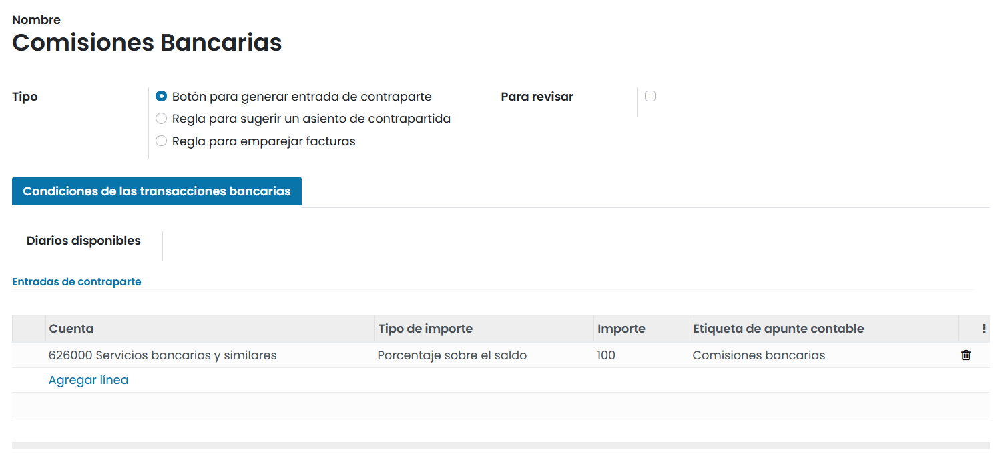

=========================
Modelos de conciliación
=========================
Una vez que los extractos bancarios se han importado sobre tu diario, es esencial **conciliar** los registros adecuadamente
y asegurar que todos los **Apuntes contables** están balanceados y conciliados. Para facilitar y acelerar el proceso de
conciliación, puedes configurar **Modelos de conciliación**, que son muy útiles con entradas recurrentes como comisiones
bancarias.

.. tip::
   Los modelos de conciliación también son útiles para manejar Descuentos por pronto pago.

.. seealso::
   * :doc:`../../../../finanzas/contabilidad/cuentas_cobrar/facturas_clientes/descuentos`

Tipos de modelos de conciliación
====================================

Hay tres tipos de modelos de conciliación:

   - Botón para generar entrada de contraparte
   - Regla para sugerir un asiento de contrapartida
   - Regla para emparejar facturas

Botón para generar entrada de contraparte
----------------------------------------------------------
Cuando estás conciliando una entrada con un Saldo abierto, puedes usar los botones disponibles bajo la pestaña
**Operaciones manuales** para precompletar los valores automáticamente antes de validar la conciliación.
Cada botón es un modelo de conciliación diferente.

Regla para sugerir un asiento de contrapartida
-----------------------------------------------
Este tipo de modelo de conciliación te sugerirá inmediatamente contrapartidas que solo necesitan validarse.
Esta automatización se basa en un conjunto de reglas definidas en el modelo de conciliación.

Regla para emparejar facturas
----------------------------------
Este tipo de modelo de conciliación selecciona la factura de cliente o de proveedor correcta que coincide con el pago.
Solo falta validar el asiento. Esta automatización se basa en un conjunto de reglas definidas en el modelo de conciliación.

Configuración
==============

Para gestionar o crear nuevos Modelos de Conciliación, navega a :menuselection:`Facturación / Contabilidad --> Configuración --> Modelos de conciliación`.

.. tip::
   Si un diario se asocia a diferentes modelos de conciliación, se aplica el que está primero en la secuencia.
   La secuencia es simplemente el orden de los modelos en la vista de lista. Se pueden reordenar arrastrando y soltando
   el control que está junto al nombre.

   La primera opción, llamada **Coincidencia exacta sobre facturas y recibos**, es la responsable de emparejar correctamente
   facturas de venta y de compra. Por lo tanto, se aconseja dejarla al principio de la lista y no borrarla.

También puedes abrir este menú desde :menuselection:`Contabilidad --> Tablero`, y sobre la tarjeta de tu diario
bancario, haz clic sobre el botón **⁝** y selecciona la opción **Modelos de conciliación**.

Formulario
------------

Sobre el formulario del modelo disponemos de los siguientes campos:

   - **Tipo**: *Permite seleccionar entre los siguientes valores*:

      - Botón para generar entrada de contraparte
      - Regla para sugerir un asiento de contrapartida. Amplia la selección de campos del formulario en:

         - **Autovalidar**: Valida la línea de la declaración automáticamente (conciliación basada en su regla).

      - Regla para emparejar facturas. Amplia la selección de campos del formulario en:

         - **Autovalidar**: Valida la línea de la declaración automáticamente (conciliación basada en su regla).
         - **Límite de meses de búsqueda**: Límite de meses de búsqueda de entradas coincidentes al aplicar este modelo.
         - **Orden coincidente**: Método de ordenación (ascendente / descendente) al realizar la búsqueda de coincidencias.

Condiciones de las transacciones bancarias
--------------------------------------------

Sobre la pestaña **Condiciones de las transacciones bancarias** es posible incorporar las condiciones que definen el
modelo. Dispones de los siguientes campos:

   - **Diarios disponibles**: El modelo de conciliación sólo estará disponible en los diarios seleccionados.
   - **Tipo de importe**: El modelo de conciliación solo se aplicará al tipo de transacción seleccionado:

      - **Importe cobrado**: Solo se aplicará cuando se cobre un importe.
      - ** Importe pagado**: Solo se aplicará cuando se pague un importe.
      - *** Importe pagado/cobrado**: Aplicado en ambos casos.

   - **Condición sobre el Importe**: El modelo de conciliación solo se aplicará cuando la cantidad sea menor que, mayor que o entre las cantidades especificadas.
   - **Tolerancia de pago**: Diferencia aceptada en caso de pago insuficiente.
   - **Misma moneda**: Permite filtrar para que las proposiciones tengan la misma moneda que la línea del extracto.
   - **Hacer coincidir factura con**:

      - **Etiqueta**: Busca en la etiqueta del extracto para encontrar la referencia de la factura/pago
      - **Nota**: Busca en la nota del extracto para encontrar la referencia de la factura/pago
      - **Referencia**: Busca en la referencia del extracto para encontrar la referencia de la factura/pago.

   - **Etiqueta**: El modelo de conciliación solo será aplicado con la etiqueta:

      - *Contiene*: La etiqueta debe contener esta cadena (no distingue mayúsculas y minúsculas).
      - *No contiene*: Negación de *Contiene*.
      - *Expresión de coincidencia*: Define tu propia expresión regular.

   - **Nota**: El modelo de conciliación solo será aplicado con la Nota:

      - *Contiene*: La Nota debe contener esta cadena (no distingue mayúsculas y minúsculas).
      - *No contiene*: Negación de *Contiene*.
      - *Expresión de coincidencia*: Define tu propia expresión regular.

   - **Tipo de transacción**: El modelo de conciliación solo será aplicado con el Tipo de transacción:

      - *Contiene*: El Tipo de transacción debe contener esta cadena (no distingue mayúsculas y minúsculas).
      - *No contiene*: Negación de *Contiene*.
      - *Expresión de coincidencia*: Define tu propia expresión regular.

   - **El contacto debe estar informado**: El modelo de conciliación solo se aplicará cuando se establezca un cliente o proveedor.

      - **Solo estos contactos**: El modelo de conciliación solo se aplicará a los clientes/proveedores seleccionados.
      - **Solo estas categorías de contactos**: El modelo de conciliación solo se aplicará a las categorías de cliente proveedor seleccionadas.

Entradas de contraparte
------------------------

**Entradas de contraparte**: Esta sección contiene los valores que se aplican por el modelo de conciliación y está
disponible para los tipos *Botón para generar entrada de contraparte* y *Regla para sugerir un asiento de contrapartida*.

Dispone de los siguientes campos:

   - **Cuenta**
   - **Tipo de importe**: A seleccionar entre (Fijo, porcentaje sobre el saldo, porcentaje de la línea de declaración, de la etiqueta).
   - **Importe**: Valor por el importe de la línea de cancelación

      - **Porcentaje**: Porcentaje del saldo, entre 0 y 100.
      - **Fijo**: El valor fijo de la cancelación. El importe contará como débito si es negativo, como crédito si es positivo.
      - **De la etiqueta**: no es necesario un delimitador de expresiones regulares, solo se necesita la expresión regular.

   .. example::
      Si desea extraer la cantidad de R: 9672938 10/07 AX 9415126318 T: 5L: NA BRT: 3358,07 C

      Podrías entrar BRT: ([\\\\d,] +)

   - **Etiqueta de apunte contable**

.. tip::
   Es posible incorporar sobre el listado los impuestos, cuenta analítica y etiquetas analíticas, mediante el botón **⁝**.

Mapeo de empresas
--------------------

Sobre la pestaña **Mapeo de empresas** es posible realizar busquedas para incorporar contactos. El mapeo usa expresiones regulares.

   - Para hacer coincidir el texto al principio de la línea (en la etiqueta o notas), simplemente completa tu texto.
   - Para hacer coincidir el texto en cualquier lugar (en etiquetas o notas), coloca el texto entre .*

   .. example::
      .\*N°48748 abc123.\*

Dispones de los siguientes campos:

   **Buscar texto en etiqueta**: Texto a buscar en etiquetas
   **Buscar texto en notas**: Texto a buscar en notas
   **Contacto**: Contacto resultante

