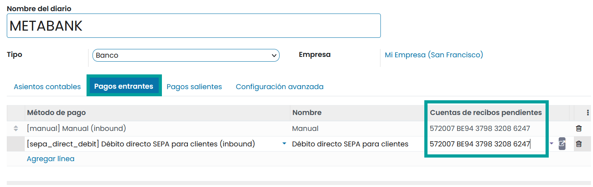

=================================
Proceso de conciliación bancaria
=================================

Información general
======================

Hacer coincidir los apuntes bancarios con los registros contables puede ser una tarea muy laboriosa. Necesitas encontrar
las facturas correspondientes y comparar los detalles de cantidades y clientes con los que hay en el extracto bancario.
Estos pasos pueden llevar mucho tiempo. Afortunadamente, con Daeris puedes hacer coincidir las facturas y cualquier otro
documento de pago fácilmente con los extractos de tu banco.

En Daeris existen dos opciones para el proceso de conciliación.

   - Podemos especificar el pago directamente en la factura y realizar la conciliación más adelante
   - Podemos conciliar facturas abiertas con extractos bancarios

Casos de uso
=============

Caso 1: Registro de pagos
--------------------------

Tenemos la necesidad de establecer una factura como pagada, para poder comenzar a ofrecer los servicios adquiridos.
El cliente nos ha facilitado el comprobante de pago. La conciliación la realizará más adelante el contable.

.. example::
   Creamos una factura que emitimos a Ana González. por 399,30 €. Solicitamos un pago inmediato, ya que el producto vendido es un servicio.

   .. image:: proceso/proceso01.png
      :align: center
      :alt: Registro de pagos

   Nuestro empleado que gestiona la contabilidad (contador) solo gestiona apuntes bancarios al final de la semana, por lo que debemos marcar esta factura como pagada inmediatamente para indicar que podemos empezar a prestar servicios a nuestro cliente.

   Nuestro cliente nos envía un comprobante de pago con lo que podemos registrar un pago y establecer la factura como pagada.

   Para ello, hacemos clic sobre el botón **Registrar pago**.

   .. image:: proceso/proceso02.png
      :align: center
      :alt: Registro de pagos

   Sobre el formulario, informamos el importe y el método de pago (el resto de campos vienen pre informados), y hacemos clic sobre el botón **Crear pago**.

   .. image:: proceso/proceso03.png
      :align: center
      :alt: Registro de pagos

   La factura se ha **pagado** aunque resta pendiente realizar la **conciliación**. Sobre el apartado de importes de la factura, disponemos de información referente al pago, haciendo clic sobre el botón **i**.

   .. image:: proceso/proceso04.png
      :align: center
      :alt: Registro de pagos

   Sobre la tarjeta de nuestro banco, podremos observar como falta un pago/recibo por conciliar.

   .. image:: proceso/proceso05.png
      :align: center
      :alt: Registro de pagos

   Una vez recibido el extracto bancario, deberemos validarlo.

   .. image:: proceso/proceso06.png
      :align: center
      :alt: Registro de pagos

   Al efectuar la conciliación, verifica que ambas casillas coinciden y haz clic en **Validar**.

   .. image:: proceso/proceso07.png
      :align: center
      :alt: Registro de pagos

   El registro de nuestro banco quedará completo y el saldo incorporará el importe de la factura.

   .. image:: proceso/proceso08.png
      :align: center
      :alt: Registro de pagos

Solo en el caso de que **NO USES la gestión contable en Daeris**, es posible evitar el paso de tener que realizar la conciliación bancaria tras registrar el pago.

Para ello, accede al diario relacionado con tu cuenta bancaria y sobre la pestaña **Pagos entrantes** y **Pagos salientes** añade como una cuenta de recibos pendientes y una cuenta de pagos pendientes, la cuenta bancaria principal.

.. seealso::
   * :ref:`finanzas/contabilidad/banco_efectivo/configuracion/cuentas_pendientes_diarios`

Caso 2: Conciliaciones de extractos bancarios
-----------------------------------------------

Disponemos de varias facturas publicadas y a partir del extracto bancario, vamos a proceder a registrarlas
como **pagadas** y efectuar la conciliación bancaría.

.. example::
   Creamos una factura que emitimos a Ana González. por 399,30 €. Confirmamos la factura que queda pendiente de pago.
   Creamos otra factura que emitimos a Alejandro Monel. por 199,65 €. Confirmamos la factura que queda pendiente de pago.

   .. image:: proceso/concilia01.png
      :align: center
      :alt: Conciliaciones de extractos bancarios

   Exportamos de nuestra entidad bancaria el fichero de extracto. Procedemos a importarlo sobre nuestro diario mediante el botón **Importar**.

   .. image:: proceso/concilia02.png
      :align: center
      :alt: Conciliaciones de extractos bancarios

   Seleccionamos el fichero de extracto bancario y hacemos clic sobre el botón **Importar**.

   .. image:: proceso/concilia03.png
      :align: center
      :alt: Conciliaciones de extractos bancarios

   Revisamos sobre el nuevo extracto bancario que el saldo final coincide con el balance final, hacemos clic sobre el botón **Publicar**, y clic de nuevo sobre el botón **Conciliar**.

   .. image:: proceso/concilia04.png
      :align: center
      :alt: Conciliaciones de extractos bancarios

   Si el asistente de conciliación, es capaz de identificar los apuntes a los que pertenece cada registro del extracto, los casará automáticamente, y aparecerá una línea de resultado final.

   .. image:: proceso/concilia05.png
      :align: center
      :alt: Conciliaciones de extractos bancarios

   Verificamos que el saldo del libro mayor está actualizado.

   .. image:: proceso/concilia06.png
      :align: center
      :alt: Conciliaciones de extractos bancarios

   Ambas facturas han quedado pagadas.

   .. image:: proceso/concilia07.png
      :align: center
      :alt: Conciliaciones de extractos bancarios

   Sobre el apartado de importes del formulario de la factura, disponemos de información referente al pago, haciendo clic sobre el botón **i**.

   .. image:: proceso/concilia08.png
      :align: center
      :alt: Conciliaciones de extractos bancarios