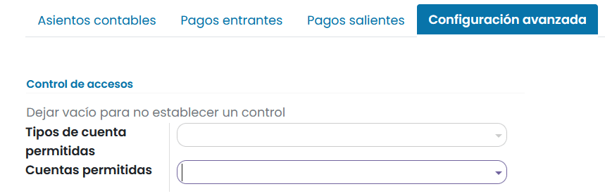

====================
Cuentas bancarias
====================
Daeris permite configurar tantas **cuentas bancarias** como sea requerido, de modo que puedas asegurarte que la
información bancaría este al día y preparada para conciliarla con los asientos contables.

Cada cuenta bancaría se configura sobre un diario desde donde registrar todos los apuntes bajo
una cuenta asociada.

Al crear una cuenta bancaria o diario bancario, se crea y configura automáticamente su cuenta asociada.

Los **diarios bancarios** se muestran por defecto en el tablero contable. Para acceder al tablero, navega a
:menuselection:`Facturación / Contabilidad --> Tablero`. Cada diario dispone de una tarjeta que incluye diversa información
y botones de acción.

.. _finanzas/contabilidad/banco_efectivo/configuracion/cuentas/anadir_cuenta:

Añadir una nueva cuenta bancaria
======================================

Para añadir una nueva cuenta Bancaria, navega a
:menuselection:`Facturación / Contabilidad --> Configuración --> Agregar una cuenta bancaria`
y sobre el formulario, informa los siguientes campos:

   - **Número de cuenta**: Tu número de cuenta bancaria (*IBAN en Europa*).
   - **Banco**: Busca de entre la lista de bancos, tu entidad bancaria. Para agilizar el proceso es recomendable abrir el desplegable y mediante la opción **buscar más** realizar la búsqueda por el código BIC/SWIFT que debe facilitarte tu entidad bancaria.
   - **Código de identificación bancaria**: *también denominado código BIC o SWIFT que debe facilitarte tu entidad bancaria*.

Una vez informados todos los campos, haz clic sobre el botón **Crear**.

Puedes encontrar la cuenta bancaria (diario), accediendo al tablero de contabilidad. Para ello, navega a
:menuselection:`Facturación / Contabilidad --> Tablero`.

Editar una cuenta bancaria
===========================
Para editar una cuenta bancaria, navega a :menuselection:`Facturación / Contabilidad --> Tablero`
y sobre la tarjeta de la cuenta, haz clic sobre el botón **3 puntos** que abre el desplegable de opciones.
Por último, haz clic sobre la opción **Configuración**.

También es posible editar la cuenta bancaria, navegando a :menuselection:`Facturación / Contabilidad --> Configuración --> Diarios contables`.
Sobre el listado, haz clic sobre el diario que se corresponde con tu cuenta bancaria.

Sobre el formulario encontramos los siguientes campos:

   - **Nombre del diario**: Equivale al número de cuenta bancaría incorporado, aunque es posible modificarlo por un nombre más descriptivo.
   - **Tipo**: Banco
   - **Empresa**: Empresa a la que está asociada el diario.

Sobre la pestaña **Asientos contables** encontramos en el apartado **Información contable** los siguientes campos:

   - **Cuenta bancaría**: Número de cuenta asociada al diario.
   - **Cuenta transitoria**: Las transacciones de extractos bancarios se contabilizarán en la cuenta transitoria hasta la conciliación final que permita encontrar la cuenta correcta.
   - **Cuenta de ganancias**: Utilizado para registrar una ganancia cuando el saldo final de un registro de caja difiere de lo que el sistema calcula.
   - **Cuenta de pérdidas**: Utilizado para registrar una perdida cuando el saldo final de un registro de caja difiere de lo que el sistema calcula.
   - **Código corto**: Nombre utilizado en distintas ubicaciones para identificar el diario. Los asientos de este diario también se nombrarán con este prefijo de forma predeterminada.
   - **Moneda**: La moneda utilizada para introducir extractos.

Sobre el apartado  **Información contable** disponemos de los siguientes campos:

   - **Número de cuenta**: Número de cuenta bancaria asociada al diario. Al hacer clic sobre el botón **enlace externo** que se encuentra junto al campo, es posible editar información importante de la cuenta bancaria , como:

      - **Número de cuenta**: Número de cuenta bancaria
      - **Moneda**: A seleccionar de entra las posibles monedas que usa nuestra empresa
      - **Nombre del titular de la cuenta**: Titular de la cuenta
      - **Mandatos de adeudo directo**: Los mandatos bancarios representan una autorización que el propietario de una cuenta bancaria da a una compañía para una operación especifica.

      .. image:: cuentas/banco05.png
         :align: center
         :alt: Editar una cuenta bancaria

   - **Banco** : Entidad bancaria asociada al número de cuenta bancaría
   - **Conexiones Bancarias**: Define como se registrarán los extractos bancarios.

Sobre la pestaña **Pagos entrantes** se muestra un listado con todos los posibles métodos de pago entrante que acepta
la cuenta. Cada registro dispone de la siguiente información:

   - **Nombre**: Nombre descriptivo de uso común para el método de pago.
   - **Método de pago**: Nombre del método usado de entre los siguientes:

      - **Manual**: Recibe el pago por cualquier método fuera de Daeris
      - **Débito directo SEPA para clientes** (Recibe el pago en la zona SEPA gracias a un mandato que tu cliente debe haberte otorgado)
      - **Facilitador de Pagos** como Paypal, Adyen, Stripe, Mercado Pago… Cada uno de ellos debe ser configurado para poder ser usado.

      .. image:: cuentas/banco06.png
         :align: center
         :alt: Editar una cuenta bancaria

Sobre la pestaña **Pagos salientes** se muestra un listado con todos los posibles métodos de pago saliente que acepta la
cuenta. Cada registro dispone de la siguiente información:

   - **Nombre**: Nombre descriptivo de uso común para el método de pago.
   - **Método de pago**: Nombre del método usado de entre los siguientes:

      - **Manual**: Realiza el pago por cualquier método fuera de Daeris
      - **Cheques**: Paga las facturas con cheques e imprímelos desde Daeris.
      - **Transferencia de crédito SEPA para proveedores**: paga en la zona SEPA enviando manualmente un archivo de transferencia de crédito SEPA a tu Banco.

Sobre el apartado **Impresión de cheques** encontramos el campo:

   - **Numeración manual**: Informa este campo si tus cheques preimpresos no estan numerados.

   .. image:: cuentas/banco07.png
      :align: center
      :alt: Editar una cuenta bancaria

Sobre la pestaña **Configuración avanzada** podemos limitar el acceso de las cuentas al diario. Para ello disponemos
de los siguientes campos:

   - **Tipos de cuenta permitidas**: Permite seleccionar una serie de tipos de cuentas contables, las cuales podrán disponer de acceso al diario.
   - **Cuentas permitidas**: Permite seleccionar una serie de cuentas contables, las cuales podrán disponer de acceso al diario.

.. note::
   No es necesario informar estos dos campos si no se requiere realizar un control especifico de las cuentas.

