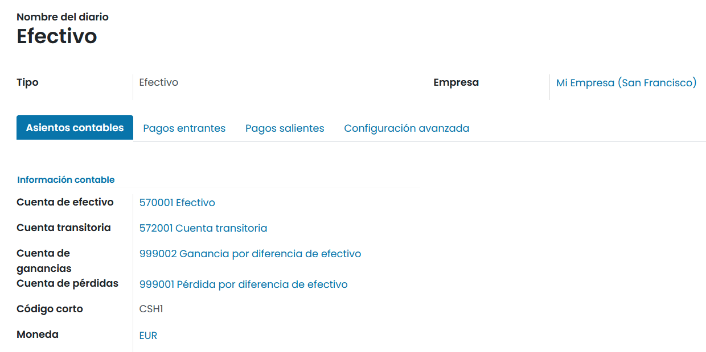
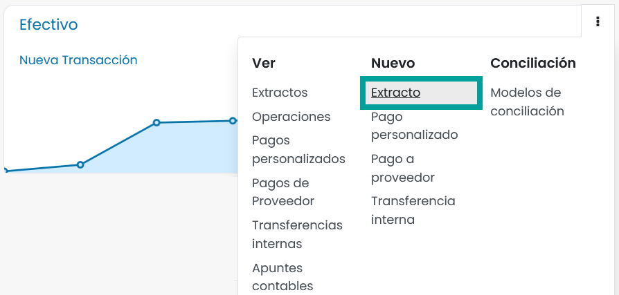
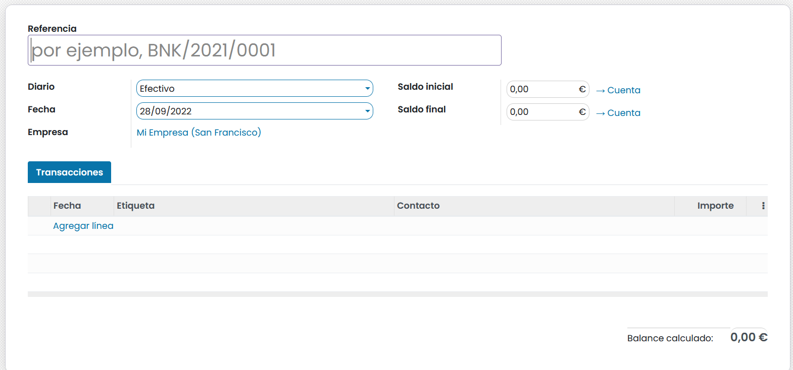
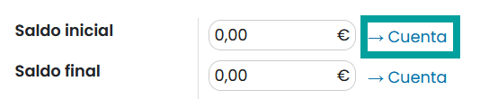
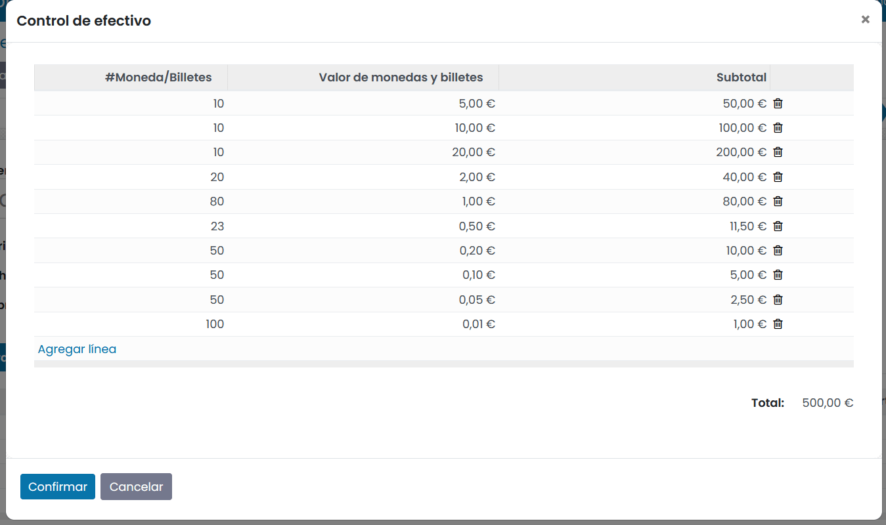
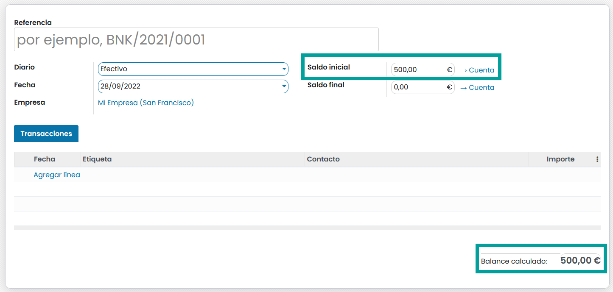
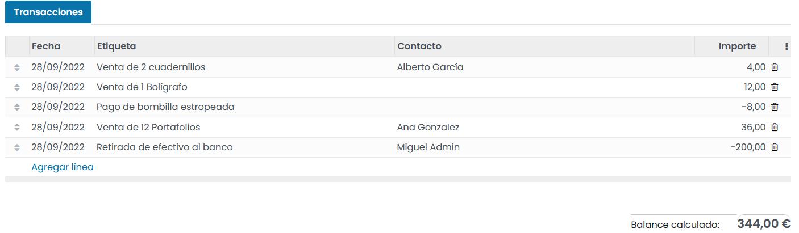
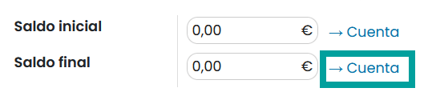
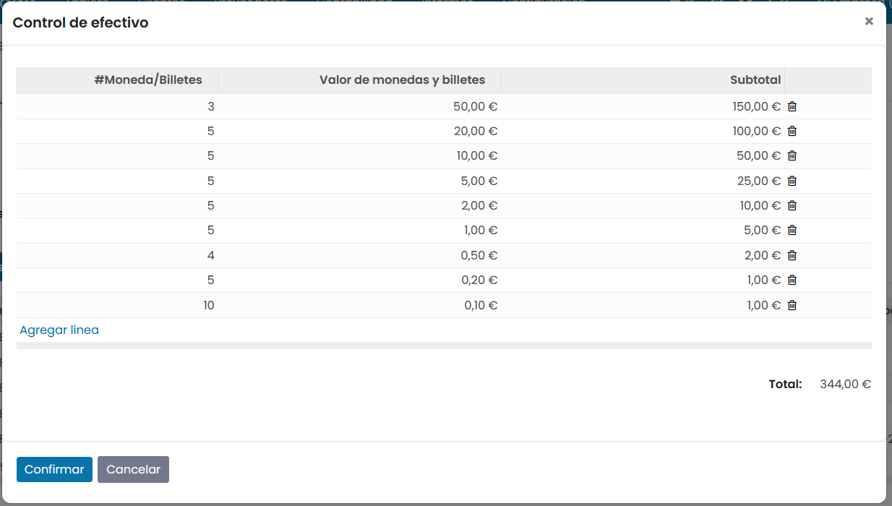
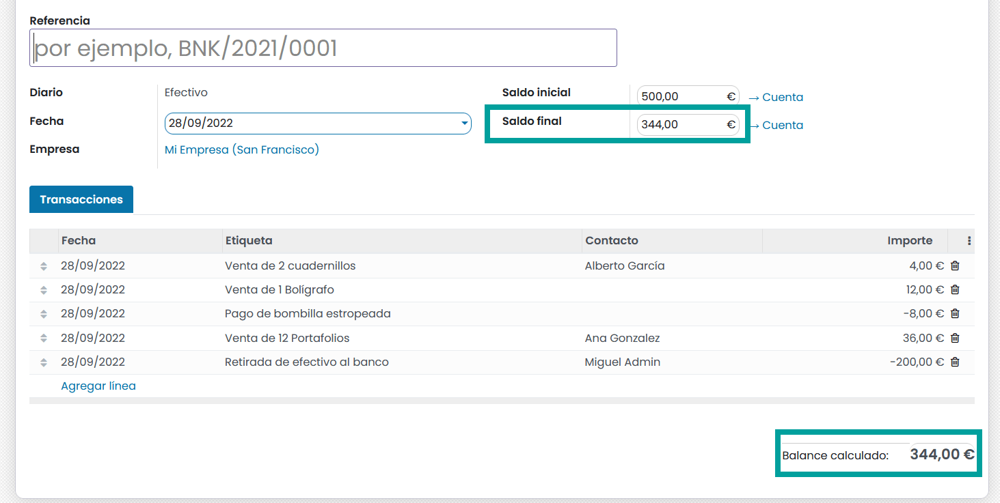

=====================================================
Gestionar un diario de efectivo (caja registradora)
=====================================================

Un diario de efectivo o caja registradora es un diario para registrar entradas y transacciones de pago en efectivo.
Calcula el total de entradas y salidas de efectivo y computa el saldo total.

Configuración
=================
Para configurar el diario de efectivo, navega a
:menuselection:`Facturación / Contabilidad --> Configuración --> Diarios contables` y haz clic sobre el diario
de Efectivo a configurar.

Sobre la pestaña **Asientos contables** encontramos en el apartado **Información contable** los siguientes campos:

   - **Cuenta bancaría**: Número de cuenta asociada al diario.
   - **Cuenta transitoria**: Las transacciones de extractos bancarios se contabilizarán en la cuenta transitoria hasta la conciliación final que permita encontrar la cuenta correcta.
   - **Cuenta de ganancias**: Utilizado para registrar una ganancia cuando el saldo final de un registro de caja difiere de lo que el sistema calcula.
   - **Cuenta de pérdidas**: Utilizado para registrar una perdida cuando el saldo final de un registro de caja difiere de lo que el sistema calcula.
   - **Código corto**: Nombre utilizado en distintas ubicaciones para identificar el diario. Los asientos de este diario también se nombrarán con este prefijo de forma predeterminada.
   - **Moneda**: La moneda utilizada para introducir extractos.

Uso
=======

Para iniciar un registro del diario de efectivo navega a :menuselection:`Facturación / Contabilidad --> Tablero`
y sobre la tarjeta del diario haz clic sobre el apartado **Nuevo / Extracto**

Esta acción abre un nuevo registro y navega al formulario, desde donde es posible indicar el saldo inicial y final
de caja y registrar cada una de las transacciones realizadas.

Apertura de caja
------------------

La apertura de caja se usa para validar el efectivo disponible en caja antes de iniciar tus transacciones.
Para realizar la apertura, haz clic sobre el enlace **cuenta** que aparece junto al campo **Saldo inicial**.

Sobre el formulario, crea un registro por cada tipo de moneda o billete que dispongas en caja.
Sobre el campo **#moneda/billetes** debes indicar el número de monedas/billetes del mismo tipo que dispones en la caja,
y sobre el campo **Valor de monedas y billetes**, el valor de la moneda.

Al finalizar esta acción sobre todos los tipos de monedas y billetes disponibles en caja, podrás obtener el balance
actual. Haz clic sobre el botón **Confirmar** para validar la información.

El saldo de caja inicial, se corresponderá con el balance calculado.

Realizar transacciones de caja
-------------------------------------

Para realizar una transacción, haz clic sobre **Agregar línea** e informa los siguientes campos:

   - **Fecha**: Se informa por defecto con la fecha actual.
   - **Etiqueta**: texto descriptivo de la transacción
   - **Contacto**: Contacto al que se cobra o paga la transacción, siempre que se identifique.
   - **Fecha**: Importe de la transacción.

Debes crear, tantos registros, como transacciones realices. Al finalizar cada transacción, es posible visualizar
el balance calculado o saldo disponible en caja.

Cierre de caja
----------------

El cierre de caja se usa para validar el efectivo disponible en caja después de efectuar las transacciones.
Para realizar el cierre, haz clic sobre el enlace **cuenta** que aparece junto al campo **Saldo final**.

Sobre el formulario, crea un registro por cada tipo de moneda o billete que dispongas en caja.
Sobre el campo **#moneda/billetes** debes indicar el número de monedas/billetes del mismo tipo que dispones en la caja,
y sobre el campo **Valor de monedas y billetes**, el valor de la moneda.

Al finalizar esta acción sobre todos los tipos de monedas y billetes disponibles en caja, podrás obtener el balance
actual. Haz clic sobre el botón **Confirmar** para validar la información.

El saldo de caja final, se corresponderá con el balance calculado.

Por último, **guarda** y **publica** el registro. EL estado del extracto quedará **Pendiente de validación**.