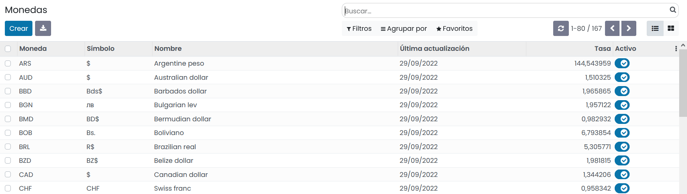
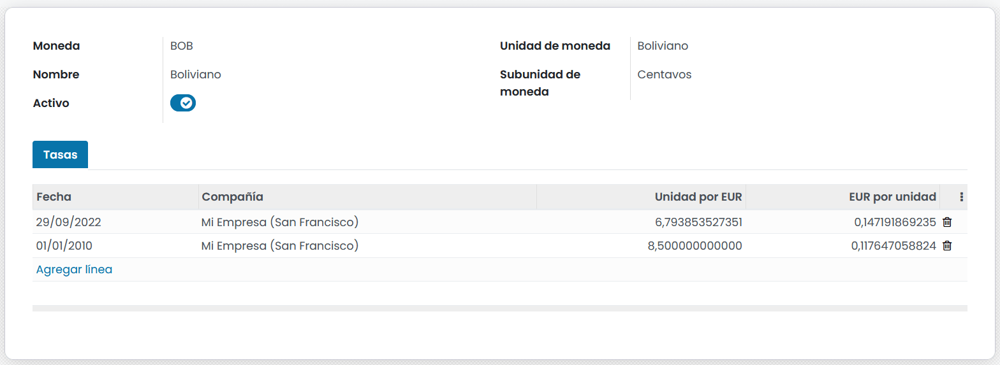
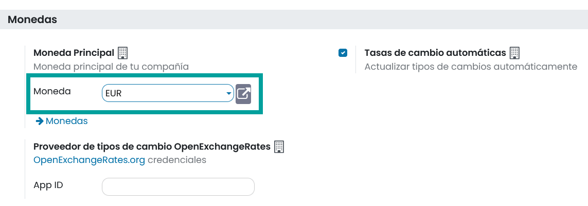
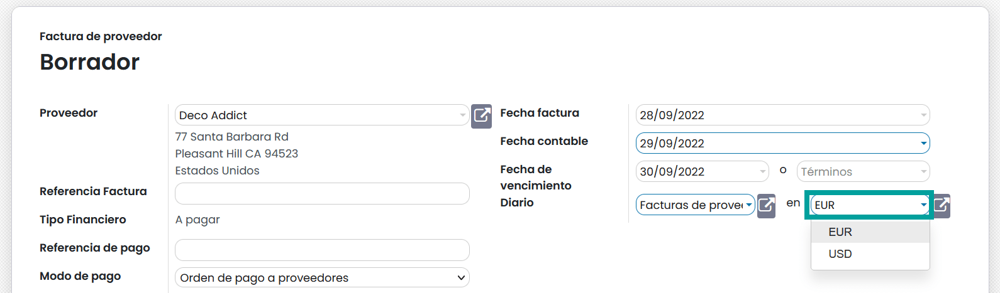
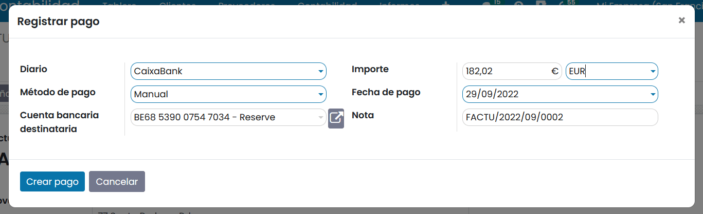
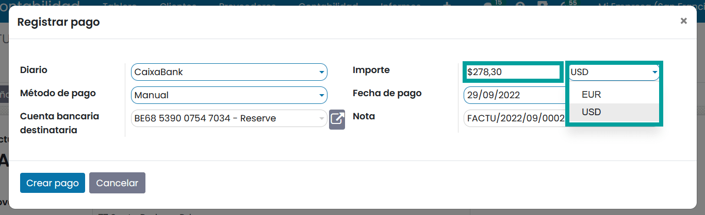

=====================================================
Administrar una cuenta bancaria en moneda extranjera
=====================================================

En Daeris, **cada transacción se registra en la moneda predeterminada de la empresa**, y todos los informes se basan
en esa moneda predeterminada.

Cuando tienes una cuenta bancaria en una moneda extranjera, para cada transacción, Daeris almacena dos valores:

   - El débito/crédito en la moneda de la empresa;
   - El débito/crédito en la moneda de la cuenta bancaria.

Los **tipos de cambio** se actualizan en base al valor de la moneda, que debes establecer en el sistema.

Para establecer el valor de las monedas, es posible utilizar las siguientes opciones:

   - Realizar la actualización de valor de las monedas , a diario , manualmente.
   - Utilizar los servicios web del **Banco Central Europeo**
   - Utilizar los servicios web de un proveedor externo **Requiere registro**.

Configurar monedas
======================

Daeris admite trabajar con múltiples monedas. Estas se crean de forma predeterminada, pero no necesariamente activas.

Para activar las monedas, navega a :menuselection:`Facturación / Contabilidad --> Configuración --> Monedas`.

Sobre el listado de monedas, activa aquellas monedas sobre las que vaya a trabajar tu empresa, haciendo clic sobre el
campo **Activo** de cada registro de moneda a activar.

.. caution::
   Es recomendable **activar únicamente**, aquellas monedas con las que vaya a trabajar el sistema.

Al hacer clic sobre el registro de una moneda, accedes al detalle de información de la moneda, desde donde es
posible visualizar el registro histórico de los cambios que se han producido frente a tu moneda principal.

Al activar la moneda, puedes optar por automatizar la actualización del tipo de cambio respecto a tu moneda principal
o realizar esta acción manualmente.

.. seealso::
   * :doc:`../../../../finanzas/contabilidad/otros/multidivisa`

Seleccionar la moneda principal de la empresa
=================================================

Para seleccionar la moneda principal de tu empresa, navega a :menuselection:`Facturación / Contabilidad --> Configuración --> Ajustes`
y sobre el apartado **Monedas** selecciona la moneda principal de tu empresa.

Por último, haz clic sobre el botón **Guardar**.

Pagar una factura de proveedor en moneda extranjera
=======================================================

Para pagar una factura en una moneda extranjera, accede a la factura y selecciona la **moneda** que se encuentra
junto al campo **Diario**.

.. caution::
   Ten presente, que, si sobre la factura dispones de líneas de factura, todas las líneas cambiarán de moneda sin alterar el importe.

Una vez completada la factura en moneda extranjera, haz clic sobre el botón**Confirmar** y **Registrar Pago**.

Al registrar el pago aparece un formulario de pago con el importe total convertido a la moneda principal de la empresa.

Puedes registrar el pago en tu moneda principal o cambiar el tipo de moneda, acción que actualizará el importe al de
la moneda establecida.

Posteriormente, haz clic sobre el botón, **crear pago**.