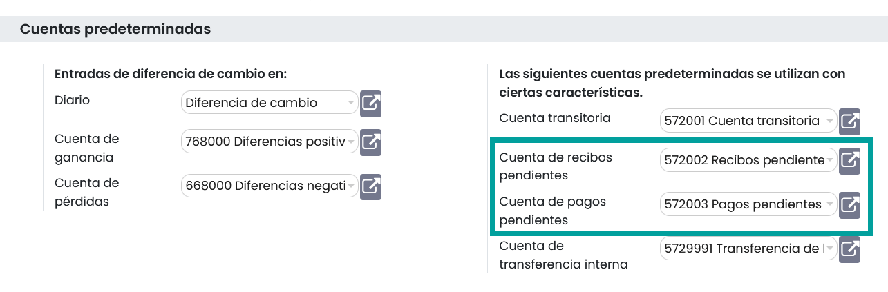
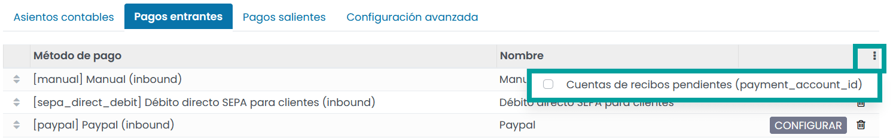
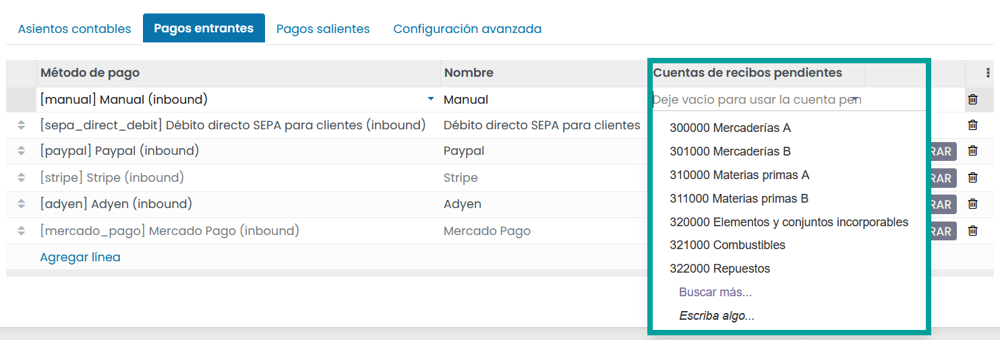

=====================================
Cuentas pendientes predeterminadas
=====================================
En Daeris, de forma predeterminada, los pagos se registran a través de cuentas transitorias denominadas
**cuentas pendientes**, antes de registrarse en su cuenta bancaria.

Una **cuenta de pagos pendiente** es la cuenta donde se registran los pagos salientes hasta que se vinculan con
un retiro (salida) de tu extracto bancario.

Una **cuenta de recibos pendientes** es la cuenta donde se registran los pagos entrantes hasta que se vinculan con un
depósito (entrada) de tu extracto bancario.

Estas cuentas deben ser de tipo **Activo Circulante**.

.. note::
   El movimiento de una cuenta pendiente a una cuenta bancaria se realiza automáticamente cuando concilia la cuenta bancaria con un extracto bancario.

Configuración de cuentas predeterminadas
==========================================

Las cuentas pendientes se definen de forma predeterminada. Si es necesario, puedes actualizarlas.

Para ello, navega a :menuselection:`Facturación / Contabilidad --> Configuración --> Ajustes`, y sobre el apartado
**Cuentas predeterminadas** actualiza el campo **Cuenta de recibos pendientes** y/o el campo **Cuenta de pagos pendientes**.

.. _finanzas/contabilidad/banco_efectivo/configuracion/cuentas_pendientes_diarios:

Configuración de cuentas pendientes sobre diarios bancarios y de efectivo
================================================================================

Es posible establecer cuentas pendientes específicas para cualquier diario de tipo **Banco** o **Efectivo**.

Para ello, navega a :menuselection:`Facturación / Contabilidad --> Tablero` y sobre la tarjeta del diario que deseas configurar,
haz clic sobre el menú de selección **⋮** y haz clic en **Configuración**.

Posiciónate sobre la pestaña **Pagos entrantes** o sobre la pestaña **Pagos salientes**.
Para mostrar la columna de cuentas pendientes, haz clic sobre el menú de selección **⋮** y selecciona el campo
**cuentas de recibos pendientes** o el campo **Cuentas de pagos pendientes**.

Si no especifica una cuenta de pagos pendiente o una cuenta de recibos pendiente para un diario específico,
Daeris utiliza las cuentas pendientes predeterminadas.

En el caso de que desees cambiar la cuenta, informa el valor deseado y haz clic sobre el botón **Guardar**

.. attention::
   Si añades como una cuenta de recibos pendientes o una cuenta de pagos pendientes, la cuenta bancaria principal, cuando se registra un pago, el estado de la factura o recibo se actualiza automáticamente con el valor **Pagado**.
   No se registrarán entradas pendientes a conciliar sobre el diario. Este método solo es adecuado en el caso de que no quieras llevar el control de la contabilidad en Daeris.