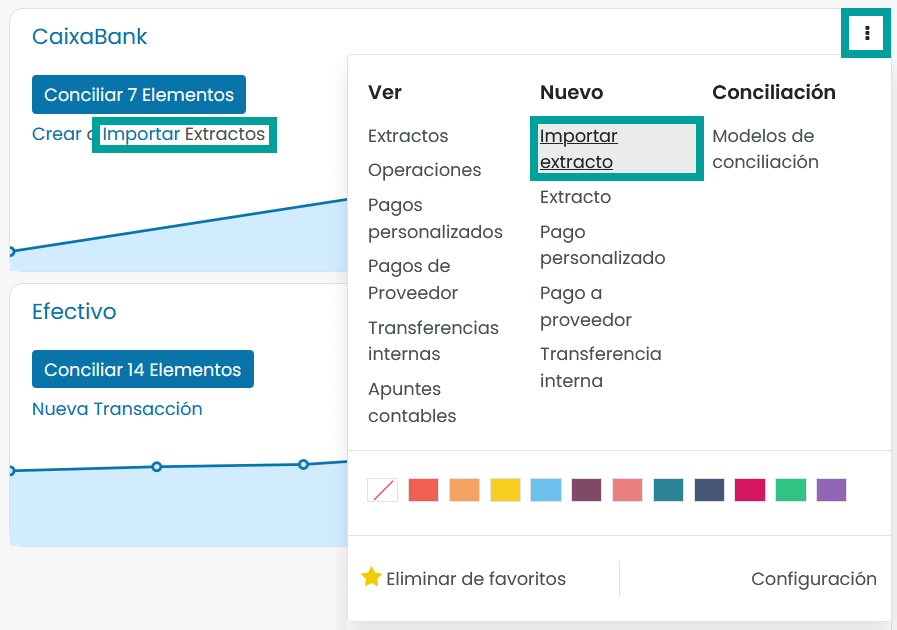
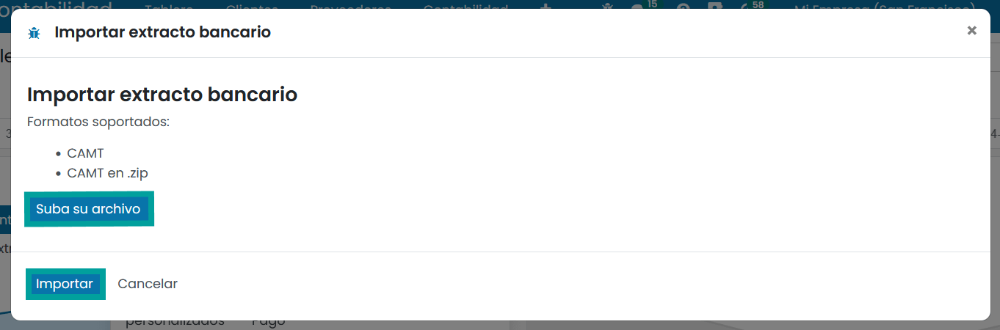
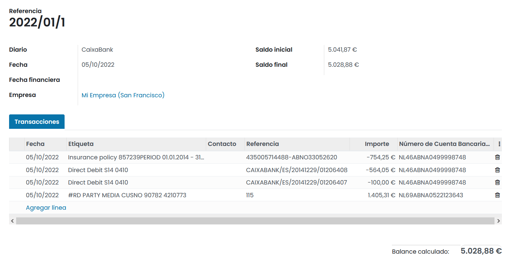
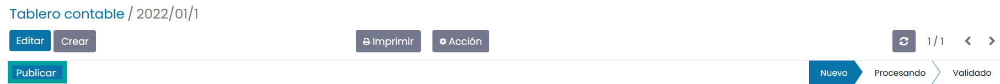
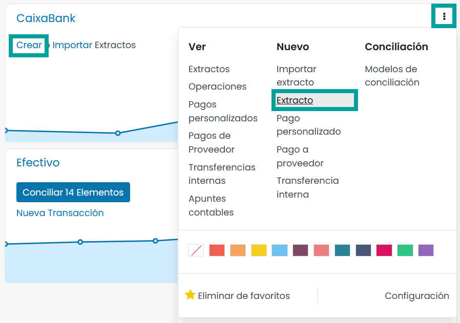
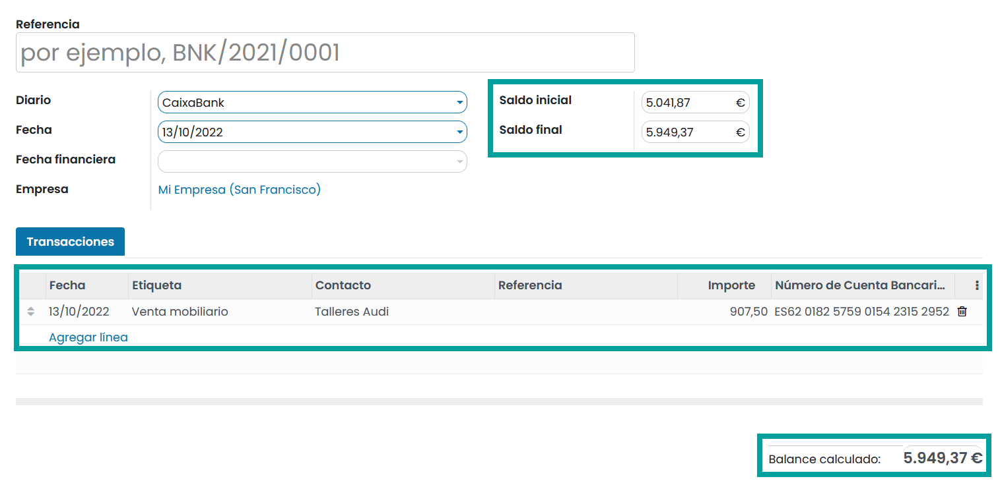

====================
Extractos bancarios
====================

Importar tus extractos bancarios en la aplicación de Contabilidad te permite realizar un seguimiento de los movimientos
financieros que ocurren en tus cuentas bancarias y conciliarlos con las transacciones registradas en tu contabilidad.

Recomendamos la sincronización bancaria automática mediante el proveedor externo Ponto, siempre que sea posible, ya que
agiliza las tareas de recuperar los movimientos de tus entidades bancarias e importarlos sobre tus diarios.

Sin embargo, si no deseas utilizar la sincronización bancaria automática o si tu banco no es una institución compatible,
tienes otras opciones:

   - **Importar** los archivos de extracto bancario que debes exportar de tu entidad bancaria.
   - **Registrar** los extractos bancarios manualmente.

Importar archivos de extractos bancarios
==========================================

Daeris soporta el formato de gestión de efectivo recomendado por SEPA (**CAMT.053 / CAMT.054**).
Además, en función de tu localización, es posible la importación de otros formatos.

Para importar tus ficheros, navega a :menuselection:`Contabilidad --> Tablero`, y sobre la tarjeta de tu diario
bancario, haz clic sobre el botón **Importar extractos**, o haz clic sobre el botón **⁝** y selecciona la opción
**Importar extracto**.

A continuación, haz clic sobre el botón **Suva su archivo** , selecciona el archivo que deseas importar y haz clic sobre el botón **Importar**.

Tras importar el fichero, se muestra la pantalla de detalle del extracto recién importado, que incorpora las líneas de las transacciones realizadas.

Mediante el botón **Publicar** se confirma el extracto, y se puede iniciar el proceso de conciliación.

Registrar los extractos bancarios manualmente
==============================================

Si lo necesitas, puedes registrar tus extractos bancarios manualmente.

Para crearlos, navega a :menuselection:`Contabilidad --> Tablero`, y sobre la tarjeta de tu diario
bancario, haz clic sobre el botón **Crear**, o haz clic sobre el botón **⁝** y selecciona la opción
**Extracto**.

Añade una nueva línea por cada transacción escrita en el extracto bancario original.

Si es posible y para simplificar el proceso de conciliación, informa el campo **Contacto**. También es posible informa
las referencias del pago sobre el campo **Etiqueta**.

El **Saldo final** y el **Balance calculado** deben disponer del mismo importe. Si no es el caso, asegúrate de que no
haya errores en los importes de las transacciones.

Por último, haz clic sobre el botón **Guardar**.

