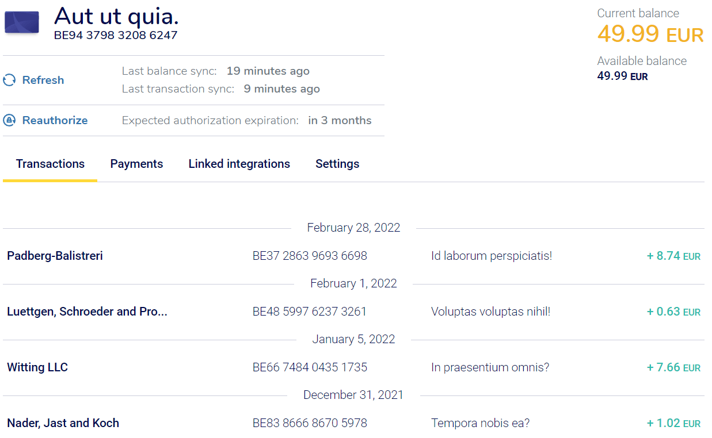

================================================
Ponto como proveedor de sincronización bancaria
================================================

**Ponto** es un servicio que permite que empresas y profesionales incorporen sus cuentas bancarias en un solo lugar
y vean directamente todas sus transacciones dentro de una aplicación.

Esta es una solución de terceros que está expandiendo continuamente la cantidad de `instituciones bancarias <https://myponto.com/en/reach#banks>`_
que se pueden sincronizar.

Ponto es un proveedor externo de pago que puede gestionar la sincronización entre tus cuentas bancarias y Daeris.
`Consulta aquí sus tarifas <https://myponto.com/en#pricing>`_.

Gracias a las integración con **Ponto**, Daeris se puede sincronizar directamente con tu banco para obtener todos los
extractos bancarios importados automáticamente sobre su base de datos.

Configurar una cuenta de Ponto
===============================

Para configurar una cuenta de Ponto sigue los siguientes pasos:

   1 - Accede al `formulario de registro de ponto <https://dashboard.myponto.com/sign-up>`_ y crea una nueva cuenta.

   .. image:: ponto/ponto01.png
      :align: center
      :alt: Configurar una cuenta de Ponto

   2 - Una vez que haya iniciado sesión, crea una organización. Recuerda añadir sobre la pestaña **Billing**, la información de facturación de tu cuenta.

   .. image:: ponto/ponto02.png
      :align: center
      :alt: Configurar una cuenta de Ponto

   3 - A continuación, navega  a :menuselection:`Accounts`, y haz clic en el botón **Add account**.

   .. image:: ponto/ponto03.png
      :align: center
      :alt: Configurar una cuenta de Ponto

   4 - Sobre el asistente, selecciona tu país y tu institución bancaria

   .. image:: ponto/ponto04.png
      :align: center
      :alt: Configurar una cuenta de Ponto

   5 - Informa el número de IBAN de tu cuenta bancaria, otorga tu consentimiento a Ponto y sigue los pasos del asistente en pantalla para terminar de vincular tu cuenta bancaria con tu cuenta de Ponto.

   .. image:: ponto/ponto05.png
      :align: center
      :alt: Configurar una cuenta de Ponto

   6 - Asegúrate de añadir todas las cuentas bancarias que deseas sincronizar con Daeris antes de continuar con los siguientes pasos.

   7 - A continuación, navega  a :menuselection:`Integrations`, y haz clic en el botón **Add integration**.

   .. image:: ponto/ponto06.png
      :align: center
      :alt: Configurar una cuenta de Ponto

   8 - Posteriormente, haz clic en el botón **Create a custom integration**.

   .. image:: ponto/ponto07.png
      :align: center
      :alt: Configurar una cuenta de Ponto

   9 - Añade un nombre a la integración que vas a crear.

   .. image:: ponto/ponto09.png
      :align: center
      :alt: Configurar una cuenta de Ponto

   10 - Añade un nombre a la integración que vas a crear.

   .. image:: ponto/ponto10.png
      :align: center
      :alt: Configurar una cuenta de Ponto

   11 - Sobre la pestaña **Linked Accounts**, asocia la cuenta/s que hayas registrado con anterioridad. Sigue las instrucciones del asistente cuando solicite las cuentas a integrar y sus credenciales.

   .. image:: ponto/ponto11.png
      :align: center
      :alt: Configurar una cuenta de Ponto

   12 - Si todo ha ido bien, el sistema mostrará una ventana de confirmación, donde podremos enlazar la cuenta a la integración mediante el botón **Link to integrations**.

   .. image:: ponto/ponto12.png
      :align: center
      :alt: Configurar una cuenta de Ponto

   13 - Selecciona la integración con la que deseas enlazar la cuenta y pulsa el botón **Continue**:

   .. image:: ponto/ponto13.png
      :align: center
      :alt: Configurar una cuenta de Ponto

Configurar la integración bancaria en Daeris
==============================================

Con el objetivo de configurar la integración bancaria en Daeris, crea una nueva cuenta bancaria con los datos de la cuenta importada en Ponto.
Para ello, navega a :menuselection:`Facturación / Contabilidad --> Configuración --> Agregar una cuenta bancaria` e informa
el número de cuenta, el banco y el código de identificación bancaria.

Posteriormente, navega a :menuselection:`Facturación / Contabilidad --> Tablero` , y sobre la tarjeta del banco
recién creado, haz clic sonbre el botón **⁝** y selecciona la opción **Configuración**.

Sobre el formulario del diario, informa los siguientes campos:

   - **Nombre del diario**: Recuerda que puedes modificar el nombre del diario, si no deseas que su nombre se corresponda con el del número de cuenta.
   - **Moneda**: Selecciona la moneda principal del diario.
   - **Conexiones bancarias**: Selecciona la opción **En línea**.
   - **Proveedor de extractos bancarios en línea**: Selecciona el valor, **MyPonto.com**

Haz clic sobre el botón **Guardar** y verifica que el valor del campo **proveedor** del apartado Extractos bancarios
en línea, se ha convertido en un enlace. Haz clic sobre él.

Sobre el formulario, informa el intervalo de tiempo entre actualizaciones, el login(usuario) y la
clave secreta de Ponto en los campos correspondientes.

Con el objetivo de recuperar los movimientos de la cuenta bancaria en un intervalo de tiempo, vuelve al detalle del diario
y pulsa el botón **Extraer extracto bancario en línea**.

Informa las **fechas desde y hasta**, en las cuáles se basará el sistema para transferir todos los
movimientos de la cuenta bancaria, y pulsa el botón **Extraer**.

.. caution::
   Extrae tan solo, desde la fecha en la que quieras empezar a conciliar extractos bancarios.

   Se paciente, en función de la carga del sistema de Ponto, es posible que debas esperar unos minutos.

Si todo ha ido bien, el sistema mostrará todos los registros traspasados desde la entidad bancaria.

Estas transacciones se corresponden con las del banco, en el rango de fechas especificado.

Preguntas frecuentes
======================

Después de mi sincronización, no aparece ninguna cuenta.
---------------------------------------------------------

Probablemente hayas seleccionado una institución de la lista y no hayas **autorizado** ninguna cuenta de esta institución.

Tengo un error en el que dice que mi autorización ha caducado.
---------------------------------------------------------------

Cada **3 meses** (90 días) debes volver a **autorizar la conexión entre tu cuenta bancaria y Ponto**. Esta acción debes realizarla desde el sitio web de Ponto. Si no lo haces, la sincronización se detendrá para estas cuentas.

Tengo algunos errores con mi institución en estado experimental
-------------------------------------------------------------------
Ponto proporciona instituciones en estado **Experimental** (*fase de pruebas / beta*). Estas instituciones no tienen garantías de un correcto funcionamiento.
Recomendamos ponerse en contacto directamente con Ponto.

.. image:: ponto/error03.png
   :align: center
   :alt: FAQ

La sincronización no está funcionando en tiempo real, ¿es normal?
--------------------------------------------------------------------

La captura de los datos proporcionados por Ponto no se realiza en tiempo real, debido a que Ponto tampoco sincroniza
los datos de las entidades en tiempo real. Ponto actualiza sus datos en intervalos de tiempo determinados por
la entidad bancaría. Algunas entidades solo permiten una actualización al día.

Por defecto, Daeris realiza una sincronización cada hora, pero puedes actualizar el intervalo de tiempo entre
sincronizaciones. Para ello, navega a :menuselection:`Facturación / Contabilidad --> Tablero` , y sobre la tarjeta del banco
, haz clic sonbre el botón **⁝** y selecciona la opción **Configuración**.

Posteriormente , haz clic sobre el enlace del campo **proveedor** del apartado Extractos bancarios en línea.

Sobre el formulario de configurador del proveedor Ponto,  actualiza el campo **Intervalo de actualización programado**.

.. warning::
   No es recomendable incorporar actualizaciones menores a una hora, debido a que pueden saturar el sistema.

No puedo recuperar todas mis transacciones pasadas , ¿por qué?
----------------------------------------------------------------
Para algunas instituciones solo se pueden recuperar las transacciones de los 3 meses anteriores.

¿Cómo puedo actualizar mis credenciales bancarias?
----------------------------------------------------

Para actualizar tus credenciales, navega a :menuselection:`Facturación / Contabilidad --> Proveedores de extractos bancarios en línea`
haz clic sobre el proveedor deseado y actualiza los campos:

   - **Login** (Client Id)
   - **Clave secreta** (Client Secret)

Por último haz clic sobre el botón **Guardar**.

