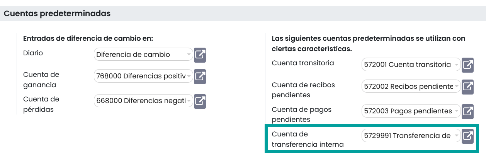
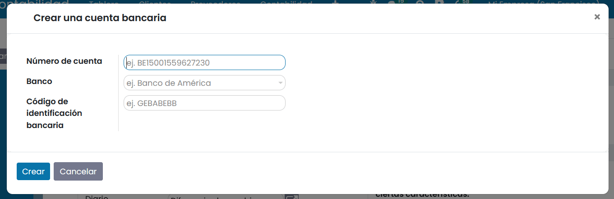

===========================================
Hacer una transferencia de un banco a otro
===========================================

Una empresa puede disponer de varias cuentas bancarias o cajas registradoras. En Daeris es posible gestionar transferencias
internas con tan solo unos clics.

Configuración
==============

Revisa tu cuenta de transferencia automática.
------------------------------------------------
Daeris incorpora de forma predeterminada, una cuenta contable para gestionar las transferencias internas, en base a la
legislación de tu país. Si lo necesitas, puedes modificarla. Para ello navega a
:menuselection:`Facturación / Contabilidad --> Configuración --> Ajustes`, y sobre el apartado **Cuentas predeterminadas**,
informa el campo **Cuenta de transferencia interna**.

Crear una segunda cuenta de banco/diario
-----------------------------------------

Antes de poder registrar una transferencia interna, necesitamos disponer de una segunda cuenta de diario (cuenta bancaria),
configurada sobre el tablero de Contabilidad.

Si aún no dispones de ella, navega a
:menuselection:`Facturación / Contabilidad --> Configuración --> Agregar una cuenta bancaria` e informa los detalles de
la cuenta.

.. seealso::
   * :doc:`../../../../finanzas/contabilidad/banco_efectivo/configuracion/cuentas`

Registrar una transferencia interna de un banco a otro.
=========================================================

.. example::
   A continuación, ilustraremos el proceso con el siguiente ejemplo:

   Mi empresa dispone de dos cuentas bancarias y deseo transferir 1.000,000 euros de una de nuestras cuentas a la otra.

   .. image:: transferencia/transferencia00.png
      :align: center
      :alt: Registrar una transferencia interna de un banco a otro.

Iniciar una transferencia interna
----------------------------------
El primer paso es registrar el pago interno. Para ello, navega a :menuselection:`Contabilidad --> Tablero`, y sobre la
tarjeta de tu diario bancario, haz clic sobre el botón **⁝** y selecciona la opción **Transferencia interna**.

.. example::
   Seleccionamos la opción **transferencia interna** de la cuenta sobre la que vamos a realizar la transferencia

   .. image:: transferencia/transferencia01.png
      :align: center
      :alt: Registrar una transferencia interna de un banco a otro.

El tipo de pago se configurará automáticamente como trasferencia interna. Informa el **Banco** (diario destino) al que
quieres transferir, especifica el **Importe** y añade una Nota si lo deseas. Es importante incorporar una nota si
realizas la conciliación, ya que permite agilizar el proceso.

.. example::
   Informamos el importe de 1000.00 euros, asi como la cuenta destino y la nota.

   .. image:: transferencia/transferencia02.png
      :align: center
      :alt: Registrar una transferencia interna de un banco a otro.

Haz clic sobre el botón **Guardar** y **Confirmar** para completar la operación.

.. example::
   Al nivel de contabilidad, este dinero ahora está contabilizado en la cuenta de trasferencia. Los diarios aún no muestran los cambios en su saldo.

   .. image:: transferencia/transferencia02b.png
      :align: center
      :alt: Registrar una transferencia interna de un banco a otro.

Creación de extractos de cuenta y conciliaciones
---------------------------------------------------
Ten en cuenta que el saldo del banco calculado en Daeris ahora es distinto del saldo del último extracto bancario de
tu banco. Esto es debido a que no se ha importado/creado el extracto bancario que confirma el envío y la recepción del
dinero. Por lo tanto, es necesario importar/crear el extracto bancario y conciliar el pago con la línea correcta
del extracto.

Para crear un nuevo extracto sobre el banco en el que iniciaste la transferencia,
navega a :menuselection:`Contabilidad --> Tablero`, y sobre la tarjeta de tu diario
bancario, haz clic sobre el botón **Crear**, o haz clic sobre el botón **⁝** y selecciona la opción
**Extracto**.

.. example::
   Crea un nuevo extracto

   .. image:: transferencia/transferencia02c.png
      :align: center
      :alt: Registrar una transferencia interna de un banco a otro.

Incorpora las **líneas de transacciones**. Una vez hecho, Daeris mostrará el **Balance calculado**.
Este balance calculado es el balance final teórico de tu cuenta bancaria. Si corresponde al extracto bancario,
significa que no hay errores. Informa el **Saldo final** y haz clic sobre el botón **Guardar**.

.. example::
   Importante incorporar sobre este extracto el importe negativo, ya que se reduce de la cuenta bancaria -1000 euros.

   .. image:: transferencia/transferencia03.png
      :align: center
      :alt: Registrar una transferencia interna de un banco a otro.

Posteriormente haz clic sobre el botón **Conciliar**.

.. example::

   .. image:: transferencia/transferencia03b.png
      :align: center
      :alt: Registrar una transferencia interna de un banco a otro.

Es necesario escoger contrapartidas para el pago. Selecciona la línea de extracto bancario correcta correspondiente al pago y haga clic en el botón **Validar**.

.. example::

   .. image:: transferencia/transferencia03c.png
      :align: center
      :alt: Registrar una transferencia interna de un banco a otro.

A continuación, se mostrará la pantalla de confirmación de las acciones realizadas.

.. example::

   .. image:: transferencia/transferencia03d.png
      :align: center
      :alt: Registrar una transferencia interna de un banco a otro.

Sobre los diarios, es posible visualizar que uno de los bancos ya dispone del saldo, y el otro continua con pagos/recibos pendientes.

.. example::

   .. image:: transferencia/transferencia03e.png
      :align: center
      :alt: Registrar una transferencia interna de un banco a otro.

Para crear un nuevo extracto sobre el banco que ha recibido la transferencia,
navega a :menuselection:`Contabilidad --> Tablero`, y sobre la tarjeta de tu diario
bancario, haz clic sobre el botón **Crear**, o haz clic sobre el botón **⁝** y selecciona la opción
**Extracto**.

.. example::

   .. image:: transferencia/transferencia03f.png
      :align: center
      :alt: Registrar una transferencia interna de un banco a otro.

Incorpora las **líneas de transacciones**. Una vez hecho, Daeris mostrará el **Balance calculado**.
Este balance calculado es el balance final teórico de tu cuenta bancaria. Si corresponde al extracto bancario,
significa que no hay errores. Informa el **Saldo final** y haz clic sobre el botón **Guardar**.

.. example::
   Importante incorporar sobre este extracto el importe positivo, ya que se añade sobre la cuenta bancaria +1000 euros.

   .. image:: transferencia/transferencia04.png
      :align: center
      :alt: Registrar una transferencia interna de un banco a otro.

Posteriormente haz clic sobre el botón **Conciliar** validando el registro.

.. example::

   .. image:: transferencia/transferencia04b.png
      :align: center
      :alt: Registrar una transferencia interna de un banco a otro.

Por último, verifica en ambos diarios que las cantidades que se han transferido aparecen reflejadas sobre los saldos correspondientes.

.. example::

   .. image:: transferencia/transferencia05.png
      :align: center
      :alt: Registrar una transferencia interna de un banco a otro.

