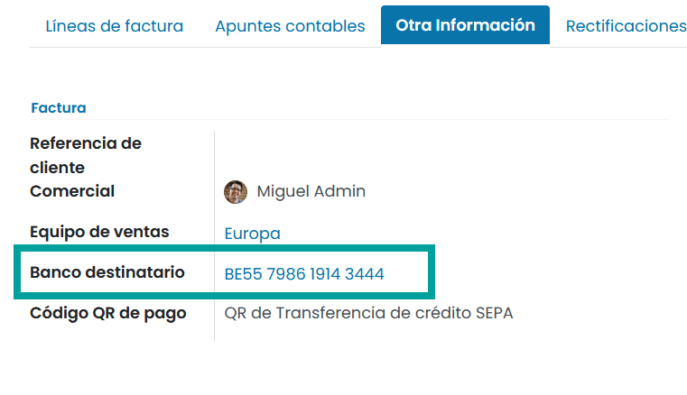

===============
Códigos EPC QR
===============

El Código de Respuesta Rápida del Consejo Europeo de Pagos, o Código QR EPC, son códigos de barras bidimensionales que
los clientes pueden escanear con sus aplicaciones de banca móvil para iniciar una transferencia de crédito SEPA (SCT)
y pagar sus facturas al instante.

Además de brindar facilidad de uso y velocidad, reduce en gran medida los errores de escritura que potencialmente
causarían problemas de pago.

.. attention::
   Esta función solo está disponible para emitir facturas a varios países europeos como Austria, Bélgica, Finlandia, Alemania y los Países Bajos.

.. _finanzas/contabilidad/cuentas_cobrar/facturas_clientes/codigos_qr/configuracion:

Configuración
=================

Para activar la funcionalidad de añadir un código QR Sepa sobre las facturas, navega a
:menuselection:`Contabilidad / Facturación --> Configuración --> Ajustes` , y sobre el apartado **Pagos de cliente**,
informa la opción **Códigos QR**.

Configurar el diario de tu cuenta bancaria
----------------------------------------------
Asegúrate de que tu cuenta bancaria está configurada correctamente con el **IBAN** y **BIC**.

Para hacerlo, navega  a :menuselection:`Contabilidad / Facturación --> Configuración --> Diarios contables`,
haz clic sobre tu diario bancario e informa el **número de cuenta bancaria** y el **Banco**.

Los códigos QR EPC se añaden automáticamente a tus facturas, siempre y cuando las emitas a cuentas bancarias
cuyo **IBAN** sea de un país que disponga de esta función disponible.

Para realizar una prueba, crea una nueva factura desde :menuselection:`Contabilidad / Facturación --> Clientes --> Facturas`
e informa, sobre la pestaña **Otra información**, en **número de cuenta bancaria** con un IBAN de un número de cuenta
de un País que permita los códigos QR.

Asegúrate de que la cuenta indicada es la que deseas utilizar para recibir el pago de tu cliente, ya que Daeris utiliza
este campo para generar el código QR EPC.

Para realizar una impresión de factura, haz clic sobre el botón **Imprimir Facturas***

.. tip::
   Si deseas emitir una factura sin un código QR EPC, elimina el IBAN indicado en el campo Cuenta bancaria

