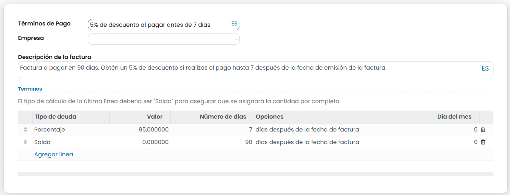

===========================
Descuentos por pronto pago
===========================
Es posible **incentivar a los clientes a realizar el pago de sus facturas** durante un periodo de tiempo determinado,
ofreciéndoles un descuento. Mediante esta técnica es posible reducir la media de tiempo de cobro de tus facturas.

Por ejemplo, es posible crear un descuento por pronto pago ofreciendo al cliente un descuento del 5% sobre su factura
si realiza el pago hasta 7 días después de la fecha de emisión de la factura.

Si el cliente no se acoge a la oferta, es posible realizar el pago en 90 días.

Para crear un descuento por pronto pago , navega a la pantalla :menuselection:`Contabilidad / Facturación --> Configuración --> Términos de pago`
y haz clic sobre el botón **Crear**.

Sobre el formulario informa los siguientes campos:

   - **Términos de pago**: 5% de descuento al pagar antes de 7 días
   - **Descripción de la factura**: Factura a pagar en 90 días. Obtén un 5% de descuento si realizas el pago hasta 7 después de la fecha de emisión de la factura.
   - **Términos**: Sobre los términos se deben informar las reglas que determinarán el pronto pago.

Para el caso del ejemplo, incorpora una línea del porcentaje total a pagar si se aplica el descuento (95% para aplicar un descuento de un 5%) y añade el número de días de validez (7).

Sobre la línea de saldo, incorpora el número de días máximo (90) para pagar la factura total.

.. list-table:: Condiciones aplicadas
   :widths: 20 15 15 35 15
   :header-rows: 1

   * - Tipo de deuda
     - Valor
     - Nº días
     - Opciones
     - Día del mes
   * - Porcentaje
     - 95%
     - 7
     - días después de la fecha de factura
     - 0
   * - Saldo
     - 0
     - 90
     - días después de la fecha de factura
     - 0

Al crear una factura e incorporar como **fecha de vencimiento** el término de pago, se incorporarán dos apuntes contables.

El primer apunte dispondrá de una fecha de vencimiento 7 días después de la fecha de emisión de la factura con un importe del 95%.

El segundo apunte dispondrá de una fecha de vencimiento de 90 días después de la fecha de emisión de la factura con un importe del 5%.

   .. image:: descuentos/terminos14.png
      :align: center
      :alt: Uso de términos de pago

En el caso de que el **cliente realice el pago dentro del plazo**, se beneficiará del descuento por pronto pago y solo abonará el 95% del importe de la factura.
Al procesar la cuenta bancaria, se debe **conciliar** el pago efectuado con el asiento del importe al 95%. Posteriormente, selecciona la línea con el descuento por pronto pago y haz clic sobre **Crear Cancelación** para realizar la conciliación.

En el caso de que el **cliente no realice el pago dentro del plazo**, no se benefiará del descuento por pronto pago y abonará el 100% del importe de la factura.
Al procesar la cuenta bancaria, se debe **conciliar** el pago efectuado con el asiento del importe al 95% y el asiento del importe al 5%.