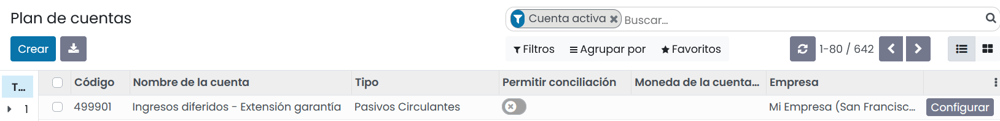
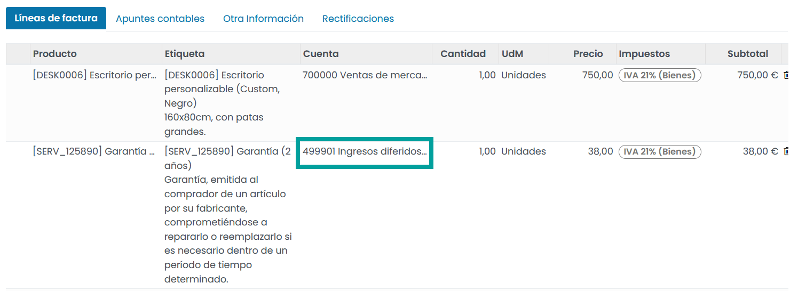
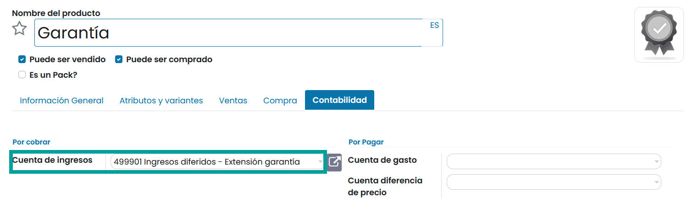
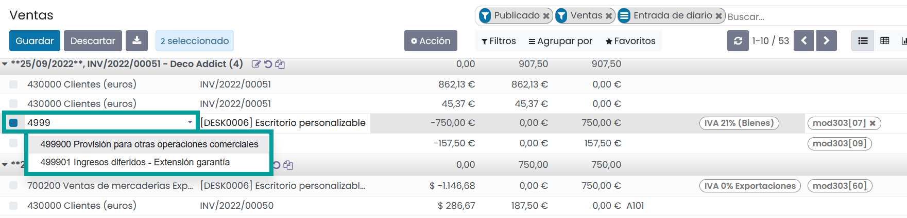

===================
Ingresos diferidos
===================

https://apps.odoo.com/apps/modules/15.0/oi_deferred_revenue/

ACTUALMENTE ES UN MODULO DE LA ENTERPRISE.EXISTE UN MODULO DE PAGO PARA ESTA VERSION

Los **ingresos diferidos**, o **ingresos no devengados**, son pagos realizados por adelantado por los clientes por
productos que aún no se han entregado o servicios que aún no se han prestado.

Dichos pagos son un **pasivo** para la empresa que los recibe ya que aún debe a sus clientes estos productos o servicios.
La empresa no puede reportarlos en la cuenta de **Pérdidas y Ganancias** actual, o *Estado de Resultados*, ya que los
pagos se ganarán realmente en el futuro.

Estos ingresos futuros deben aplazarse en el balance de la empresa hasta el momento en que puedan ser **reconocidos**,
en una fecha determinada o durante un período definido, en la cuenta de pérdidas y ganancias.

.. example::
   Supongamos que vendemos una garantía extendida por 5 años por 500€. Ya hemos recibido el dinero, pero aún no lo
   hemos ganado. Por lo tanto, publicamos estos nuevos ingresos sobre una cuenta de ingresos diferidos y decidimos
   reconocerlo anualmente. Cada año y durante los próximos 5 años, 100€ se reconocerán como ingresos.

Daeris gestiona los ingresos diferidos, distribuyéndolos en varias entradas que se crean automáticamente
en *modo borrador* y se van publicando periódicamente.

.. attention::
   Una tarea programada cada 24 horas revisa si existen entradas en borrador que deban ser publicadas, con lo que
   pueden pasar hasta 24 horas para ver las actualizaciones en el sistema.

Prerrequisitos
===============

Las transacciones sobre ingresos diferíos deben contabilizarse en una **cuenta de ingresos diferidos**
en lugar de en la cuenta de ingresos por defecto.

Configurar una cuenta de ingresos diferidos
-----------------------------------------------

Para configurar una cuenta sobre el Plan de Cuentas, navega a
:menuselection:`Contabilidad / Facturación --> Configuración --> Plan de Cuentas`, y haz clic sobre el botón **Crear**.

Sobre el listado, informa los siguientes campos:

   - **Código**: Un código único relacionado con los pasivos circulantes de tu país.
   - **Nombre**: Ingresos diferidos - Extensión garantía
   - **Tipo**: Pasivos circulantes

Contabiliza un ingreso en la cuenta correcta
----------------------------------------------

Selecciona la cuenta en un borrador de factura
~~~~~~~~~~~~~~~~~~~~~~~~~~~~~~~~~~~~~~~~~~~~~~~~~~

Sobre un borrador de factura, incorpora la cuenta de productos diferidos sobre las líneas que dispongan
de productos cuyos ingresos deben diferirse.

Elije una  cuenta de ingresos diferidos para productos específicos
~~~~~~~~~~~~~~~~~~~~~~~~~~~~~~~~~~~~~~~~~~~~~~~~~~~~~~~~~~~~~~~~~~~~~

Para configurar una cuenta sobre un producto, navega a
:menuselection:`Contabilidad / Facturación --> Clientes --> Productos`, y haz clic sobre el producto a configurar.

Sobre la pestaña **Contabilidad**, informa el campo **Cuenta de ingresos** con el valor de la cuenta de ingresos diferidos
y haz clic sobre el botón **Guardar**.

Cambiar la cuenta de un  elemento de  diario publicado
~~~~~~~~~~~~~~~~~~~~~~~~~~~~~~~~~~~~~~~~~~~~~~~~~~~~~~~~~

Es posible Cambiar la cuenta de un  elemento de  diario ya publicado. Para ello, abre el diario de ventas navegando
a :menuselection:`Contabilidad / Facturación --> Contabilidad --> Ventas`,
selecciona el elemento del  diario que deseas modificar, haz clic en la cuenta e informa la cuenta correcta.

Entradas de ingresos diferidos
================================

A PARTIR DE AQUI INCORPORO LA DOC DE ODOO PERO NO LA TRABAJO- NO TIENE SENTIDO SIN LA ENTERPRISE.

Crear una nueva entrada
------------------------

Una  entrada de  ingresos diferidos genera automáticamente todas las entradas del diario en modo borrador.
Luego se  publican uno por uno en el momento  adecuado hasta que se reconoce el monto total  de los ingresos.
Para crear una nueva entrada, vaya a Contabilidad ‣ Contabilidad ‣  Ingresos diferidos, haga clic en Crear y
complete  el formulario.
Haga clic en seleccionar compras relacionadas para vincular un elemento de diario existente a esta nueva entrada.
Algunos campos se  rellenan automáticamente y el elemento del diario ahora se muestra en la pestaña  Ventas relacionadas.

Una vez hecho esto,  puede hacer clic en Compute Revenue (junto al botón Confirmar) para generar todos los valores
de la Junta de  Ingresos.  Este tablero le muestra todas las entradas que daeris publicará para reconocer sus
ingresos y en qué fecha.

¿Qué significa  "Prorata Temporis"?
~~~~~~~~~~~~~~~~~~~~~~~~~~~~~~~~~~~~~~~~

La  función Prorata Temporis es útil para reconocer sus ingresos con  la mayor precisión posible.

Con esta característica, la primera entrada en la Junta de Ingresos se calcula en función del tiempo restante entre
la Fecha de Prorrata y la Fecha de Primer Reconocimiento en lugar de la predeterminada cantidad de tiempo entre
reconocimientos.

Por ejemplo, la Junta de Ingresos anterior tiene sus primeros ingresos con una cantidad de $ 4.22 en lugar de
$ 70.00.  En consecuencia, la última entrada también es menor y tiene un monto de $ 65.78.

Entrada diferida del diario de ventas
---------------------------------------

Puede crear una  entrada diferida a partir de un  elemento de  diario específico de su diario de ventas.

Para ello, abra su Diario de ventas  yendo  a Contabilidad ‣ Contabilidad ‣ Ventas y seleccione el elemento del
diario que desea aplazar.    Asegúrese de que esté  publicado en la cuenta correcta (consulte: Cambiar la cuenta
de un  elemento de diario publicado).

Luego, haga clic en Acción, seleccione Crear entrada diferida y complete  el formulario de la misma manera que
lo haría para crear una nueva entrada.

Modelos de ingresos diferidos
==============================

Puede crear modelos de ingresos diferidos  para crear sus entradas de  ingresos diferidos más rápido.

Para crear un modelo, vaya a Contabilidad ‣ Configuración ‣   Modelos de  ingresos diferidos, haga clic en Crear
y complete el formulario de la misma manera que lo haría para crear un nuevo  entrada.

También puede  convertir una  entrada confirmada de  Ingresos Diferidos en un modelo  abriéndola  desde
Contabilidad ‣ Contabilidad ‣  Ingresos Diferidos y luego,  haciendo clic en el botón Guardar  Modelo.

Aplicar un modelo de ingresos diferidos a una nueva entrada
---------------------------------------------------------------

Cuando  cree una nueva  entrada de  Ingresos Diferidos, complete  la Cuenta de  Ingresos Diferidos con la cuenta
de reconocimiento correcta.

Los nuevos botones con todos los modelos vinculados a  esa cuenta  aparecen en la parte superior del  formulario.
Al hacer clic en un  botón de modelo, se completa el formulario de acuerdo con  ese modelo.

Automatiza los ingresos diferidos
===================================

Al crear o editar una cuenta   cuyo tipo es Pasivos corrientes o Pasivos no corrientes,  puede configurarla
para diferir los ingresos que se acreditan  en  automáticamente.

Tiene tres opciones para el campo Automatizar ingresos diferidos:

   1 - No: este es el valor predeterminado.  No pasa nada.
   2 - Crear en borrador: cada vez que se contabiliza una transacción en la cuenta,  se crea una  entrada de  ingresos diferidos de borrador, pero no se valida.  Primero debe  completar  el formulario en Contabilidad ‣ Contabilidad ‣  Ingresos diferidos.
   3 - Crear y validar:  también debe seleccionar un  Modelo de  Ingresos Diferidos (ver:  Modelos de  Ingresos Diferidos).  Cada vez que se registra una transacción en la cuenta,  se crea una  entrada de  Ingresos Diferidos y  se valida inmediatamente.

Puede, por ejemplo, seleccionar esta cuenta como la cuenta de ingresos predeterminada  de  un producto para automatizar completamente su venta