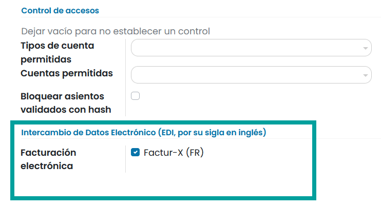

=================================
Facturación electrónica (EDI)
=================================

EDI, o intercambio electrónico de datos, es la comunicación entre empresas de documentos comerciales, como pedidos de
compra y facturas, en un formato estándar. El envío de documentos de acuerdo con un estándar EDI garantiza que
la máquina que recibe el mensaje pueda interpretar la información correctamente.

Existen varios formatos de archivo EDI y están disponibles dependiendo del país de tu empresa.

La función EDI permite automatizar la administración entre empresas y también puede ser requerida por algunos
gobiernos para el control fiscal o para facilitar la administración.

La facturación electrónica de tus documentos, como facturas de clientes, facturas rectificativas o facturas de proveedores,
es una de las aplicaciones de EDI.

Daeris soporta, entre otros, los siguientes formatos:

.. list-table:: Formatos EDI Soportados por funcionalidad
   :widths: 25 50
   :header-rows: 1

   * - Formato
     - Funcionalidad
   * - Factur-X (CII)
     - Formato predeterminado
   * - Peppol BIS Facturación 3.0 (UBL)
     - Para empresas cuyos países forman parte de la lista EAS
   * - CFDI (4.0)
     - Para empresas mejicanas
   * - UBL BIS Billing 3.0
     - Para empresas peruanas
   * - SII IVA Llevanza de libros registro (ES)
     - Para empresas españolas
   * - UBL BIS Billing 3.0
     - Para empresas colombianas

Configuración
==============

Los formatos de facturación electrónica se habilitan sobre los diarios de facturas. Para ello, navega a
:menuselection:`Contabilidad / Facturación --> Configuración --> Diarios contables`
y sobre el diario **Facturas de clientes**, accede a la pestaña **Configuración avanzada**.

Sobre el apartado **Intercambio de datos electrónico** puedes activar los formatos que deseeshabilitar en el diario.
Ten en cuenta que solo aparecerán los formatos adecuados al país de tu empresa.

Una vez habilitado un formato de facturación electrónica, se generan documentos XML al hacer clic sobre el botón
**Confirmar** de documentos como facturas, facturas rectificativas, etc.

Estos documentos son visibles en la sección de datos adjuntos o están incrustados sobre el fichero PDF.

Revisa la documentación adecuada a tu localización fiscal para obtener mas información sobre la factura electrónica.

.. important::
   De forma predeterminada, la opción **Factur-X** está habilitada. Significa que un archivo XML se incluye automáticamente en el documento PDF que se envía.

   Los formatos disponibles dependen del país sobre el que hayas registrado tu cuenta de Daeris.

   Daeris es compatible con el formato **Peppol BIS Billing 3.0** que se puede utilizar a través de los puntos de acceso existentes.
