========================
Facturas rectificativas
========================

Una **factura rectificativa**, **nota de crédito** o **reembolso**, es un documento emitido a un cliente que le notifica
que se le ha acreditado una cierta cantidad.

Hay varias razones que pueden conducir a una factura rectificativa, tales como:

   - Un error en la factura
   - Una devolución de los bienes, o un rechazo de los servicios
   - Las mercancías entregadas están dañadas

.. note::
   Emitir una factura rectificativa es la única forma legal de cancelar, reembolsar o modificar una factura validada.
   No olvides *registrar el pago* posteriormente si necesitas enviar dinero a tu cliente.

Emitir una factura rectificativa
======================================

Puedes crear una factura rectificativa desde cero. Para ello, navega a
a :menuselection:`Contabilidad / Facturación --> Clientes --> Facturas rectificativas`, y haz clic sobre el botón **Crear**.

Informar el formulario de la factura rectificativa funciona del mismo modo que el formulario de la Factura.

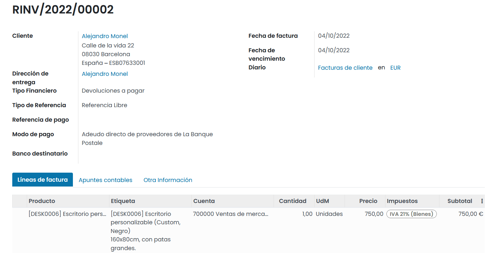

Sin embargo, la mayoría de las veces, las facturas rectificativas se generan directamente a partir de las facturas
con las que están relacionadas.

.. attention::
   La numeración de las facturas rectificativas comienza con "R" y va seguido del número de factura con el que está relacionado (por ejemplo, RINV/2019/0004).

Para crear una factura rectificativa relacionada con una factura, accede a la *Factura del cliente* y haz clic
sobre el botón **Añadir factura rectificativa**.

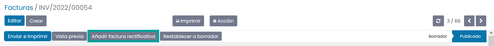

Al generar una factura rectificativa es posible seleccionar entre varias opciones:

   - Reembolso parcial
   - Reembolso completo
   - Reembolso completo y nuevo borrador de factura

Reembolso parcial
-----------------

Daeris crea un borrador de factura rectificativa pre informada con toda la información necesaria de la factura original.

Esta es la opción a seleccionar, si deseas hacer un reembolso parcial, o si deseas modificar cualquier detalle en
la factura rectificativa.

.. attention::
   Esta es la única opción disponible para las facturas que ya están marcadas como Pagadas.

Para generar un reembolso parcial, debes hacer clic sobre el botón **Añadir factura rectificativa**.

Sobre el asistente, debes informar:

   - **Método de crédito**: Reembolso parcial
   - **Motivo**: El motivo para efectuar el reembolso
   - **Fecha de reversión**: A escoger entre una fecha especifica o la fecha de asiento del diario.
   - **Usar diario especifico**: Si está vacío, utiliza el diario del asiento a ser revertido.

   .. image:: rectificativa/rectificativa02.png
      :align: center
      :alt: Reembolso completo

Por último, haz clic sobre el botón **Revertir**.

Daeris crea un borrador de factura rectificativa.

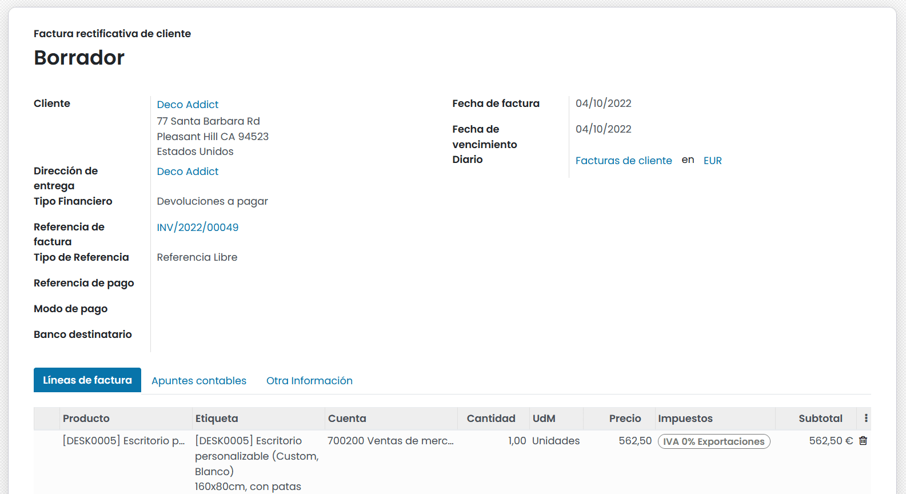

Sobre la pestaña **Otra información** queda registrada la nomenclatura de la factura original y el motivo de la
generación de la factura rectificativa, bajo el campo **Referencia del cliente**.

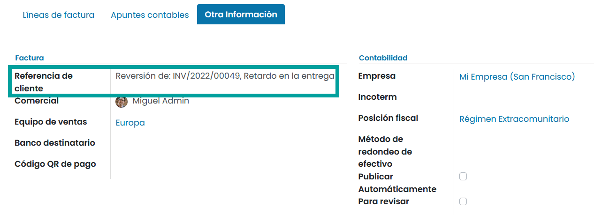

Reembolso completo
-------------------

Daeris crea una factura rectificativa, la valida automáticamente y concilia la factura original con ella.

Esta es la opción a seleccionar, si deseas realizar un reembolso completo o cancelar una factura validada.

Para generar un reembolso completo, debes hacer clic sobre el botón **Añadir factura rectificativa**.

Sobre el asistente, debes informar:

   - **Método de crédito**: Reembolso completo
   - **Motivo**: El motivo para efectuar el reembolso
   - **Fecha de reversión**: A escoger entre una fecha especifica o la fecha de asiento del diario.
   - **Usar diario especifico**: Si está vacío, utiliza el diario del asiento a ser revertido.

   .. image:: rectificativa/rectificativa04.png
      :align: center
      :alt: Reembolso completo

Por último, haz clic sobre el botón **Revertir**.

Daeris crea una factura rectificativa y la valida automáticamente.

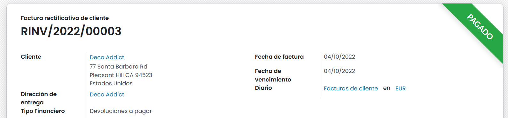

La factura rectificativa se concilia con la factura original.

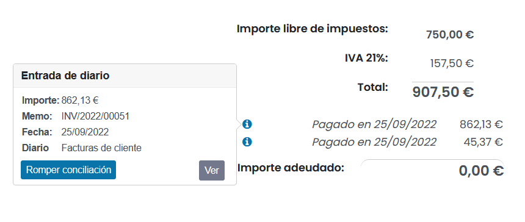

Se generan los correspondientes apuntes contables, disponibles sobre la pestaña **Apuntes contables**.

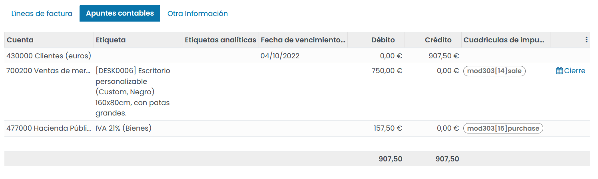

Sobre la pestaña **Otra información** queda registrada la nomenclatura de la factura original y el motivo de la
generación de la factura rectificativa, bajo el campo **Referencia del cliente**.

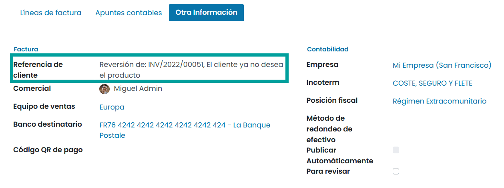

Reembolso completo y nuevo borrador de factura
-----------------------------------------------

Daeris crea una factura rectificativa, la valida automáticamente, concilia la factura original con ella y abre un
nuevo borrador de factura pre informando los mismos detalles de la factura original.

Esta es la opción a seleccionar para modificar el contenido de una factura validada.

Para generar un reembolso completo y nuevo borrador de factura, debes hacer clic sobre el botón **Añadir factura rectificativa**.

Sobre el asistente, debes informar:

   - **Método de crédito**: Reembolso completo y nuevo borrador de factura
   - **Motivo**: El motivo para efectuar el reembolso
   - **Fecha de reversión**: A escoger entre una fecha especifica o la fecha de asiento del diario.
   - **Usar diario especifico**: Si está vacío, utiliza el diario del asiento a ser revertido.

   .. image:: rectificativa/rectificativa05.png
      :align: center
      :alt: Reembolso completo

Por último, haz clic sobre el botón **Revertir**.

Esta acción, realiza exactamente los mismos pasos que el punto anterior *Reembolso completo*, y genera
un nuevo borrador de factura.

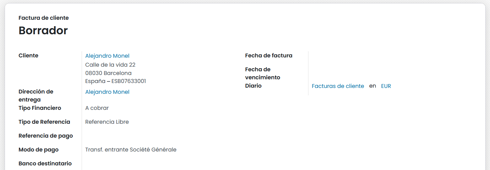

Emitir una factura rectificativa del proveedor
===============================================

Los **reembolsos de proveedores** se registran de la misma manera que lo haces con las facturas rectificativas de las
facturas.

Puedes crear una factura rectificativa desde cero. Para ello, navega a
a :menuselection:`Contabilidad / Facturación --> Proveedores --> Facturas rectificativas`, y haz clic sobre el botón **Crear**.

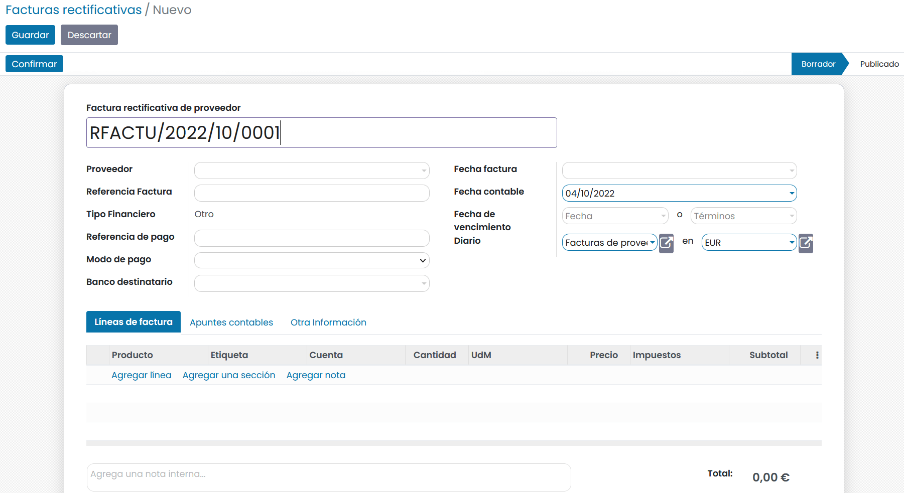

También es posible generar un reembolso del proveedor, al acceder a la Factura de proveedor validada y hacer clic sobre
el botón **Agregar nota de crédito**.

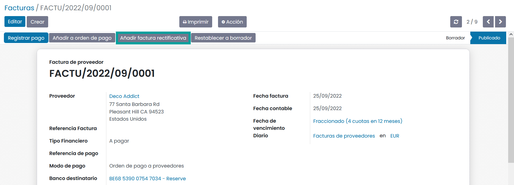

Al igual que las facturas rectificativas de clientes, sobre una factura rectificativa de proveedor es posible seleccionar
entre varias opciones:

   - Reembolso parcial
   - Reembolso completo
   - Reembolso completo y nuevo borrador de factura

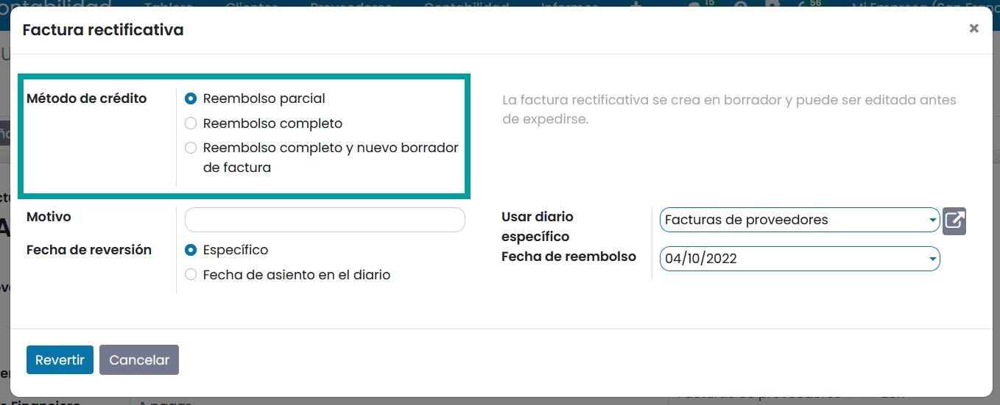

Entradas del diario
====================

La emisión de una factura rectificativa a partir de una factura, crea una **entrada inversa** que pone a cero los elementos del diario generados por la factura original.

.. example::
   En el siguiente ejemplo se muestra la entrada del diario de una factura:

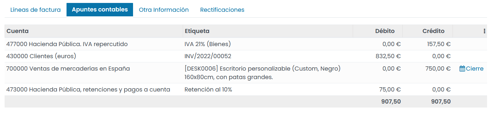

.. example::
   En el siguiente ejemplo se muestra la entrada del diario de la factura rectificativa generada para revertir la factura original anterior.

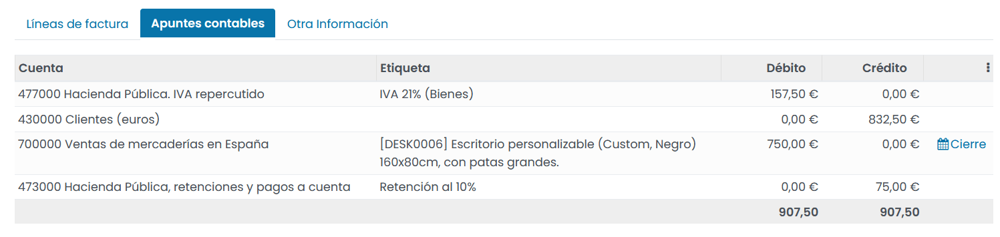