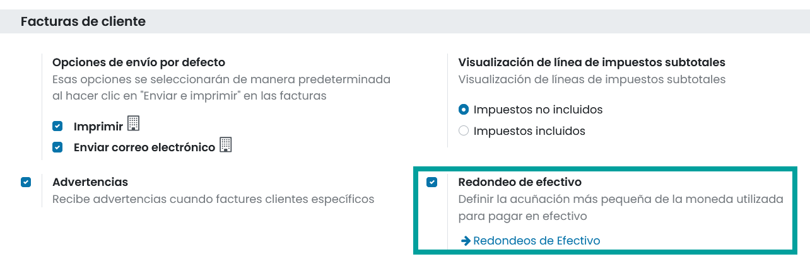
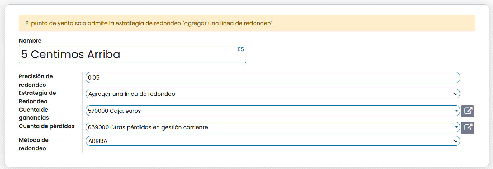
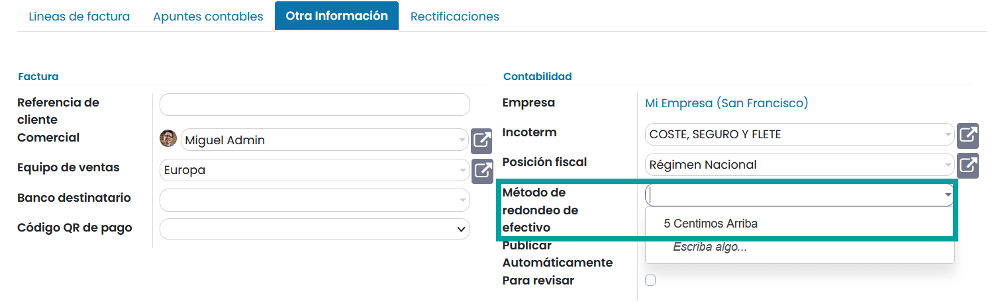
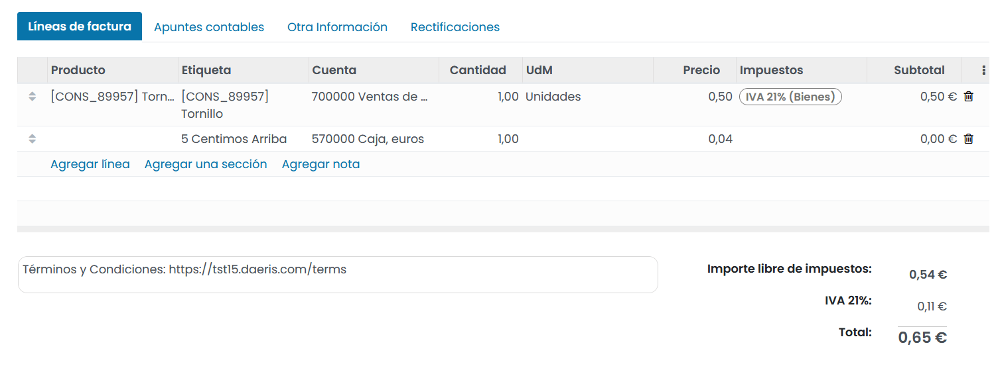
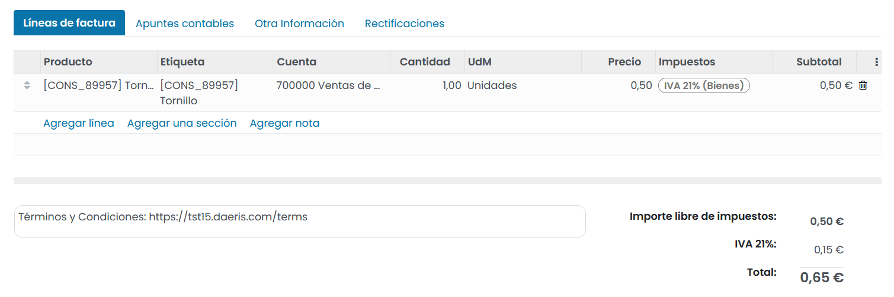
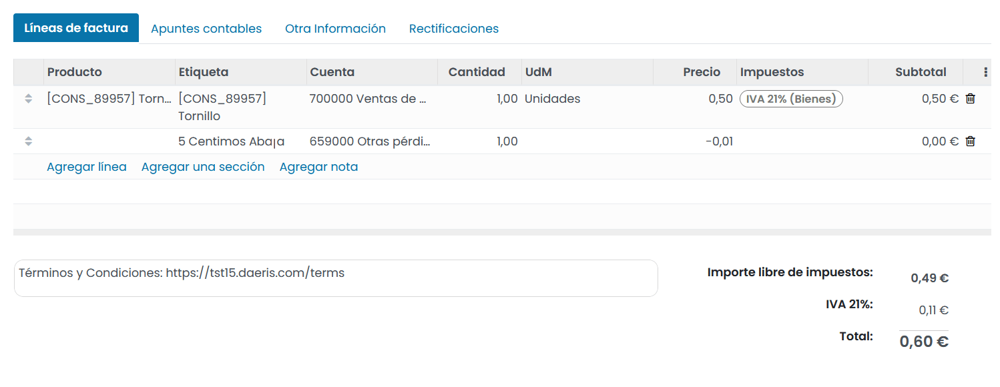

======================
Redondeo de efectivo
======================

El **redondeo de efectivo** se requiere cuando la denominación física más baja de la moneda, o la moneda más pequeña,
es más alta que la unidad mínima de cuenta.

.. example::
   Algunos países exigen a sus empresas que redondeen al alza o a la baja el importe total de una factura a los cinco céntimos más cercanos, cuando el pago se realiza en efectivo.

Configuración
===============

Para activar el uso de redondeo en efectivo, navega a la pantalla :menuselection:`Contabilidad / Facturación --> Configuración --> Ajustes`
y sobre el apartado **Facturas** de cliente, informa el campo **Redondeo de efectivo** y haz clic sobre el botón **Guadar**.

Posteriormente, haz clic sobre el enlace **Redondeos de fectivo** o navega a la pantalla
:menuselection:`Contabilidad / Facturación --> Configuración --> Redondeos de efectivo`.

Sobre el listado de redondeos, haz clic sobre el redondeo a gestionar o sobre el botón **crear**,
en el caso de querer definir un nuevo redondeo.

Sobre el formulario, puedes informar los siguientes campos:

   - **Nombre**: Nombre descriptivo del redondeo de efectivo.
   - **Precisión de redondeo**: Cantidad sobre la que realizar el redondeo.Por ejemplo:

      - 0,05 (cinco céntimos /centavos...)
      - 1,00 (un euro/ dolar /peso...)

   - **Estrategia de redondeo**: Modo que se utilizará para redondear el importe de la factura a la precisión de redondeo:

      - **Agregar una línea de redondeo**: Añade una línea a la factura por el importe del redondeo cuya descripción es el nombre del tipo de redondeo.

         - **Cuenta de ganacias**: Cuenta asociada al cálculo de redondeo cuando es favorable.
         - **Cuenta de perdidas**: Cuenta asociada al cálculo de redondeo cuando NO es favorable.

      - **Modificar el importe del impuesto**: Incorpora el redondeo sobre el impuesto.

   - **Método de redondeo**: Regla utilizada para las operaciones de redondeo de decimales:

      - **MITAD – ARRIBA**: Si el cálculo del redondeo está más cercano al valor superior, usará el valor más alto. De otro modo usará el valor más bajo.
      - **ABAJO**: Realizará el cálculo del redondeo usando el valor más bajo.
      - **ARRIBA**: Realizará el cálculo del redondeo usando el valor más alto.

.. attention::
   El punto de venta solo admite la estrategia de redondeo **agregar una línea de redondeo**.

Una vez informados los campos necesarios, pulsa el botón **Guardar**.

Aplicar redondeos
==================

Para utilizar el redondeo de efectivo, crea una factura desde la pantalla :menuselection:`Contabilidad / Facturación --> Clientes --> Facturas`,
y sobre la pestaña **Otra información**, informa el campo **Método de redondeo de efectivo**.

Los siguientes ejemplos tratan un caso cuando, se factura un producto cuyo importe es igual a **0,50€** mas
un 21% de impuestos (**0,105€**).

El importe total de la factura sin aplicar redondeos sería de **0,605€**.

.. example::
   **Precisión de redondeo** : 0,05

   **Estrategía de redondeo**: Agregar una línea de redondeo

   **Método de redondeo**: ARRIBA

   **RESULTADO**
   El sistema crea una nueva línea por un importe de +0,04€ asociado a la cuenta 570000 para que el importe total de la factura ascienda a 0,65€, ya que la precisión de redondeo especificada es de 0,05€.

.. example::
   **Precisión de redondeo** : 0,05

   **Estrategía de redondeo**: Modifica importe del impuesto

   **Método de redondeo**: ARRIBA

   **RESULTADO**
   El sistema actualiza el importe del impuesto en +0,04€ para que el importe total de la factura ascienda a 0,65€, ya que la precisión de redondeo especificada es de 0,05€.

.. example::
   **Precisión de redondeo** : 0,05

   **Estrategía de redondeo**: Agregar una línea de redondeo

   **Método de redondeo**: ABAJO

   **RESULTADO**
   El sistema crea una nueva línea por un importe de -0,01€ asociado a la cuenta 659000 para que el importe total de la factura ascienda a 0,60€, ya que la precisión de redondeo especificada es de 0,05€.

