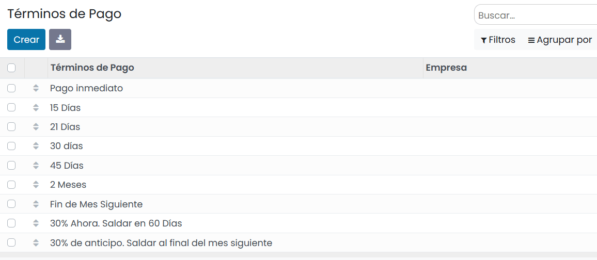
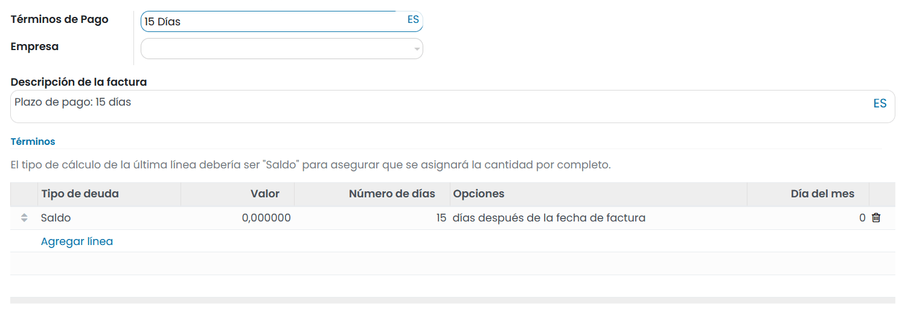
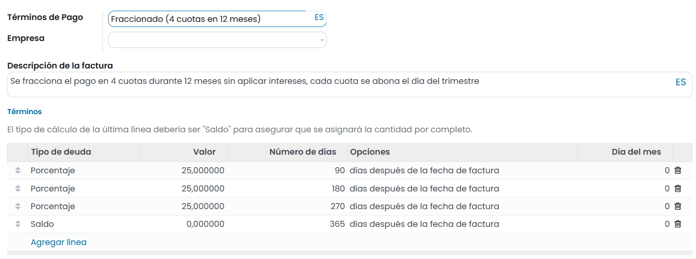

==================
Términos de pago
==================

Los **términos de pago** se utilizan para definir las **condiciones del pago** de una venta y pueden asociarse a:

   - Pedidos de venta
   - Facturas de clientes
   - Facturas de proveedores
   - Contactos

Los términos de pago pueden disponer de una o varias condiciones de pago. Estas condiciones **obligan al pago** de una
parte de la factura por un **importe** especifico al llegar a una **fecha** límite.

Mediante las condiciones, es posible implementar un plan de cuotas de una factura. Estas cuotas se deben abonar
por los importes y fechas definidas en cada una de las condiciones.

.. important::
   Los términos de pago aplican a una única factura. Si se necesita emitir varias facturas, no estaremos hablando de términos de pago si no de políticas de facturación.

Es posible definir términos de pago muy variados como, por ejemplo:

   - **Pago inmediato**: Se requiere el pago total de la factura el día de su emisión.
   - **Pago a 30 días**: Se requiere el pago total de la factura 30 días después de su emisión.
   - **Pago el último día del mes siguiente**: Se requiere el pago total de la factura el último día del mes siguiente a su emisión.
   - **Pago del 50% inicial y el resto a final de mes**: Se requiere el pago del 50% el día de la emisión de la factura y el resto el último día del mes.

.. _finanzas/contabilidad/cuentas_cobrar/facturas_clientes/terminos/configuracion:

Configuración
==================

Para configurar los **términos de pago**, navega a la pantalla :menuselection:`Contabilidad / Facturación --> Configuración --> Términos de pago`.

Por defecto, vienen configurados los siguientes términos de pago:

   - Pago inmediato
   - 15 días
   - 21 días
   - 30 días
   - 45 días
   - 2 meses
   - Fin del siguiente mes
   - 30% Ahora. Saldar en 60 Días
   - 30% de anticipo. Saldar al final del mes siguiente

Al crear o editar un término de pago, el sistema navega a la pantalla de detalle, donde se pueden informar los siguientes
campos:

   - **Términos de pago**: Nombre descriptivo del término de pago.
   - **Empresa**: En el caso de que el termino de pago aplique únicamente a una de las empresas que dispones
   - **Descripción de la factura**: Texto descriptivo que aparecerá en la factura.
   - **Términos**: Bajo este apartado se pueden crear las reglas de pago necesarias para cumplir con los términos. Cada
     regla se puede configurar en base a unidades temporales indicando la forma de calcular el volumen a pagar.
     De este modo, un término de pago se puede componer de una o varias reglas de pago, siendo buena práctica la de
     incorporar como última regla de pago, una regla de tipo “Saldo”.
     Cada regla dispone de los siguientes campos:

      - **Tipo de deuda**: Permite indicar el importe a facturar. Es posible indicar el valor de un **porcentaje** sobre el importe total de la factura, un **importe** determinado o el **saldo** pendiente de cobro.
      - **Valor**: Se debe indicar el valor del **porcentaje** o el del **importe fijo**.
      - **Nº días (vencido a)**: Permite indicar el número de días transcurridos desde la emisión de la factura en el cual, el termino llegará a su vencimiento y deberá abonarse. Es posible realizar el cálculo en base a los criterios del campo **Opciones**,
      - **Opciones**: Permite seleccionar la forma de calcular el vencimiento del término, pudiendo escoger entre:

         - días después de la fecha de factura.
         - días después del final de mes de la factura.
         - del mes siguiente.
         - del mes actual.

      - **Día del mes**: Disponible al seleccionar la opción **días después de la fecha de factura**. Día del mes en que la factura debe llegar a su término. Si es cero o negativo, este valor se ignorará y no se establecerá un día específico. Si es mayor que el último día de un mes, este número seleccionará el último día de este mes.

Por ejemplo, para crear un término de pago a 12 meses, donde cada trimestre se efectúe el pago de una cuarta parte del
importe, se deberán crear el siguiente término:

   - **Término de pago**: Fraccionado (4 cuotas en 12 meses)
   - **Descripción de la factura**: Se fracciona el pago en 4 cuotas durante 12 meses sin aplicar intereses, cada cuota se abona el día del trimestre
   - **Términos**:

.. list-table:: Condiciones aplicadas
   :widths: 20 15 15 35 15
   :header-rows: 1

   * - Tipo de deuda
     - Valor
     - Nº días
     - Opciones
     - Día del mes
   * - Porcentaje
     - 25%
     - 90
     - días después de la fecha de factura
     - 0
   * - Porcentaje
     - 25%
     - 180
     - días después de la fecha de factura
     - 0
   * - Porcentaje
     - 25%
     - 270
     - días después de la fecha de factura
     - 0
   * - Saldo
     -
     - 365
     - días después de la fecha de factura
     - 0

Uso de términos de pago
=========================

Los términos de pago pueden usarse en las siguientes entidades:

   - **Presupuestos de clientes**:  Es posible informar el término de pago sobre el formulario de detalle del **presupuesto**.

   .. image:: terminos/terminos04.png
      :align: center
      :alt: Uso de términos de pago

   Al informar un término de pago se incorpora un apartado sobre el **presupuesto** del cliente.

   .. image:: terminos/terminos05.png
      :align: center
      :alt: Uso de términos de pago

   .. note::
      Todas las **facturas** generadas a partir de un presupuesto, heredan los términos de pago del presupuesto.

   - **Facturas de cliente**:  Es posible informar el término de pago sobre el campo **Fecha de vencimiento** del formulario de detalle de la **factura**.

   .. tip::
      Es posible incorporar una fecha límite en lugar de un término de pago. Para ello, vacía el campo. Esta acción te permitirá introducir la fecha.

   .. image:: terminos/terminos06.png
      :align: center
      :alt: Uso de términos de pago

   Al informar un término de pago se incorpora un apartado sobre la **factura** del cliente.

   .. image:: terminos/terminos07.png
      :align: center
      :alt: Uso de términos de pago

   - **Presupuestos de proveedor**:  Es posible informar el término de pago sobre el campo **Fecha de vencimiento** de la pestaña **otra información** del formulario de detalle del **presupuesto**. Esta opción se usa exclusivamente en el caso de que desees que apliquen términos de pago específicos. De otro modo, informa la fecha límite.

   .. image:: terminos/terminos08.png
      :align: center
      :alt: Uso de términos de pago

   - **Facturas de proveedor**:  Es posible informar el término de pago sobre el campo **Fecha de vencimiento** del formulario de detalle de la **factura**.

   .. image:: terminos/terminos10.png
      :align: center
      :alt: Uso de términos de pago

   Al informar un término de pago se incorpora un apartado sobre la **factura** del proveedor.

   .. image:: terminos/terminos09.png
      :align: center
      :alt: Uso de términos de pago

   - **Contactos**: Es posible informar los términos de pago para un cliente en exclusiva, desde la pestaña **Venta y compra** del formulario de contacto. Cada vez que se generé un presupuesto o factura, se informarán por defecto los términos establecidos al contacto.

   .. image:: terminos/terminos11.png
      :align: center
      :alt: Uso de términos de pago

Asientos contables
===================

Las facturas que disponen de términos de pago, disponen un **apunte contable** por cada una de las fechas en las que se
debe realizar un cobro.

Mediante los apuntes contables, es posible realizar el seguimiento y la reconciliación, además de disponer de un informe
de cuentas por cobrar.

Para visualizar los apuntes contables de las facturas, navega a la pestaña **Apuntes contables** del detalle de la factura.

Puedes incorporar la **fecha de vencimiento** al listado, seleccionando el campo al hacer clic sobre los **tres puntos**
de la cabecera derecha (incorporar más campos).

   .. image:: terminos/terminos12.png
      :align: center
      :alt: Uso de términos de pago