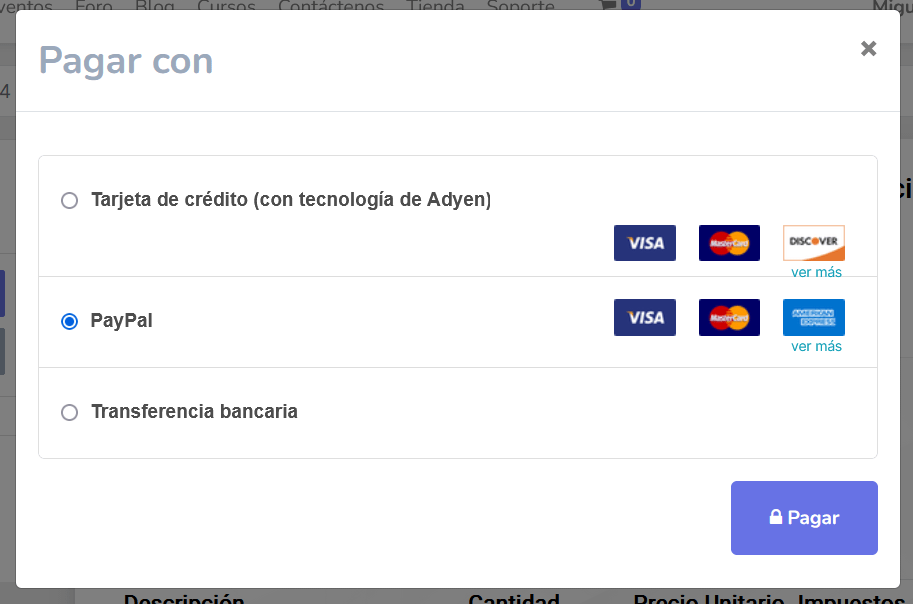
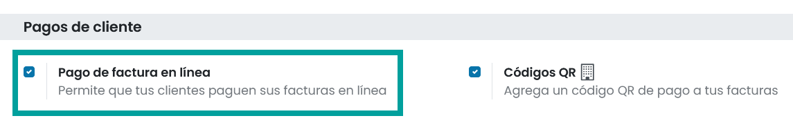
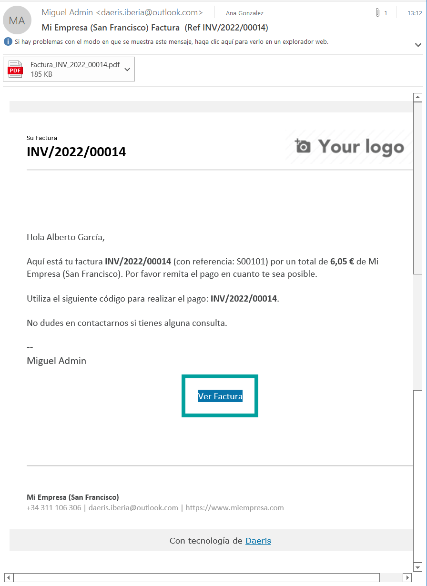
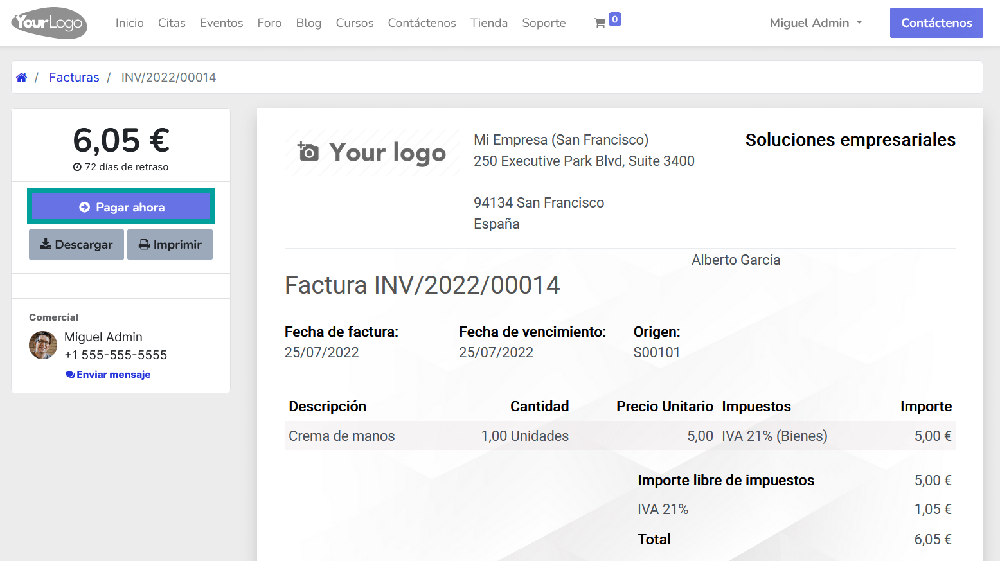

============================
Pago de facturas en línea
============================

Para ayudar a tus clientes a pagar las facturas que emites, puedes activar la funcionalidad de **Pago en línea de facturas**,
que añade un botón **Pagar ahora** sobre el **Portal del cliente**.

Esta funcionalidad permite a tus clientes ver sus facturas en línea y pagar directamente con su método de pago favorito,
lo que facilita mucho el proceso de pago.

Configuración
===============

.. note::
   De forma predeterminada, "Transferencia bancaria" es el único método de pago activo, pero aún así, debes completar los detalles de pago.

Para activar el Pago en línea de facturas, navega a :menuselection:`Contabilidad / Facturación --> Configuración --> Ajustes`
y sobre el apartado **Pagos de clientes**, informa el campo **Pago de factura en línea** y haz clic sobre el botón **Guardar**.

.. important::
   Asegúrate de que sus métodos de pago están configurados correctamente.

Portal del cliente
===================

Después de emitir la factura, haz clic en **Enviar e imprimir** y envía la factura por correo electrónico al cliente.
Este, recibirá un correo electrónico con un enlace que le redirige a la factura en su **Portal del Cliente**.

Sobre el portal del cliente, es posible elegir qué método de pago usar, haciendo clic en **Pagar ahora**.

