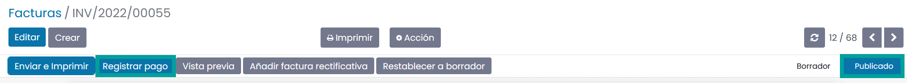
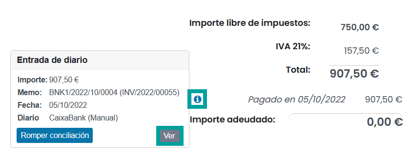
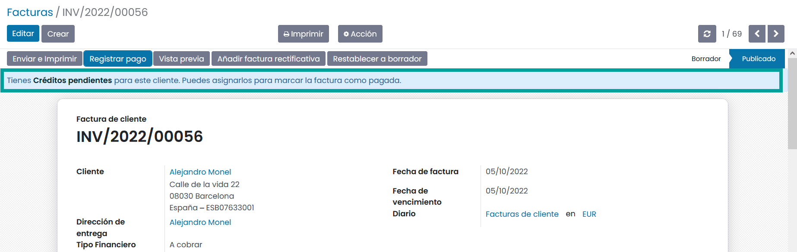
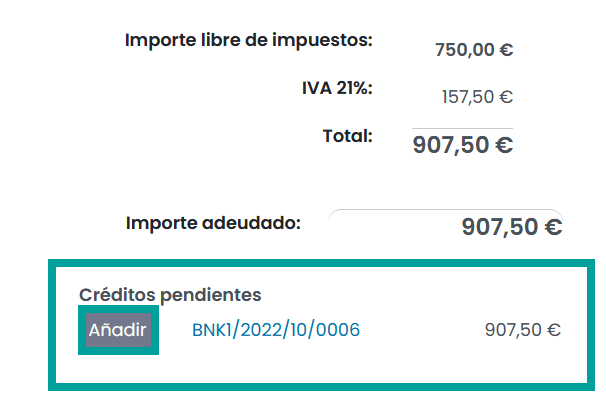
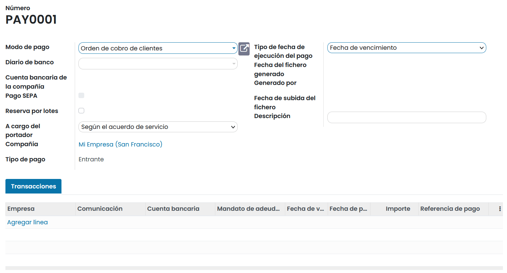
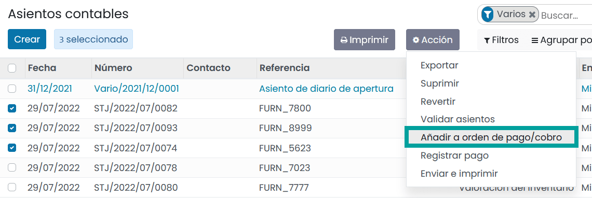

===============================
Procesos de registro de un pago
===============================

En Daeris, los pagos se pueden vincular automáticamente a una factura o recibo o ser registros independientes para
su uso en una fecha posterior.

Si un pago está **vinculado a una factura o recibo**, reduce el importe adeudado de la factura. Puedes tener varios pagos
relacionados con la misma factura.

Si un pago **no está vinculado a una factura o recibo**, el cliente tiene un crédito pendiente con tu empresa, o
tu empresa tiene un débito pendiente con un proveedor. Puedes utilizar esos importes pendientes para reducir las
facturas o recibos impagados.

Registrar el pago de una factura o recibo
==========================================
Al hacer clic sobre el botón **Registrar pago** sobre una factura de cliente o una factura de proveedor,
se genera una nueva entrada de diario y cambia el importe adeudado de acuerdo con el importe del pago.

La contraparte se refleja en una cuenta de recibos o pagos pendientes. En este punto, la factura del cliente o
la factura del proveedor se marca como **En pago**. Posteriormente, cuando la cuenta pendiente se concilia con una línea
de extracto bancario, la factura o la factura del proveedor cambia al estado **Pagado**.

El icono de información, cerca de la línea de pago muestra más información sobre el pago. Puedes acceder a
información adicional, como el diario relacionado, haciendo clic sobre el botón **Ver**.

.. tip::
   - La factura del cliente o la factura del proveedor deben de estar en el estado **Publicado** para registrar el pago.

   - Al hacer clic en **Registrar pago**, puedes seleccionar la cantidad a pagar y realizar un pago parcial o total.

   - Si tu cuenta bancaria principal está configurada como **cuenta pendiente** y el pago se realiza en Daeris (no relacionado con un extracto bancario), las facturas y recibos se registran directamente en el estado Pagado.

   - Si no has conciliado un pago, seguirá apareciendo en tus libros, pero ya no estará vinculado a la factura.

   - Si (des)concilias un pago en una moneda diferente, se crea automáticamente una entrada de diario para contabilizar el importe de las ganancias/pérdidas (reversión) del cambio de divisas.

   - Si (des)concilias un pago y una factura tiene impuestos en efectivo, se crea automáticamente una entrada de diario para contabilizar el importe del impuesto de base en efectivo (reversión).

Registrar pagos no vinculados a una factura o recibo
======================================================

Cuando se registra un nuevo pago a través del menú :menuselection:`Contabilidad / Facturación --> Clientes --> Pagos` o
el menú :menuselection:`Contabilidad / Facturación --> Proveedores --> Pagos`, el pago no se vincula directamente
a una factura o recibo.

En su lugar, la cuenta por cobrar o la cuenta por pagar se empareja con la cuenta pendiente hasta que se empareja
manualmente con su factura o factura relacionada.

Hacer coincidir facturas y recibos con pagos
----------------------------------------------

Sobre la factura o recibo validado y pendiente de pago, puede aparecer un aviso con fondo azul indicando:

.. tip::
   **Tienes Créditos pendientes para este cliente. Puedes asignarlos para marcar la factura como pagada**

Esta situación se da, cuando se ha registrado un pago del cliente o proveedor y no se ha asociado a la factura.

En el caso de que el pago deba relacionarse con la factura o recibo, debes hacer clic sobre el botón **Añadir**
que aparece bajo el apartado **Créditos pendientes** o **Débitos pendientes**, situado tras los importes de
la factura o recibo.

Al **añadir el crédito**, la factura o recibo queda marcada como **En pago** hasta que se concilia con el extracto bancario.

Pago por lotes
--------------------------

Los pagos por lotes te permiten agrupar diferentes pagos para facilitar la conciliación. También son útiles cuando
depositas cheques en el banco o para pagos SEPA.

Para realizar pagos por lotes, navega a a :menuselection:`Contabilidad / Facturación --> Clientes --> Pagos por lotes`
o a :menuselection:`Contabilidad / Facturación --> Proveedores --> Pagos por lotes`.
Al crear una orden de pago, es posible añadir los detalles de la orden sobre el formulario de la orden.

También es posible realizar pagos por lotes, seleccionando los asientos contables a asociar. Para ello, navega a
:menuselection:`Contabilidad / Facturación --> Contabilidad --> Asientos contables`
y selecciona todos los asientos que desees asociar al lote.

Posteriormente, haz clic sobre el botón **Acción** y selecciona la opción **Añadir a orden de  pago / cobro**.

Correspondencia de pagos
--------------------------

ENTERPRISE

Coincidencia de pagos por lotes
----------------------------------

ENTERPRISE

Conciliación de pagos con extractos bancarios
================================================

Una vez que se ha registrado un pago, el estado de la factura o factura es **En pago**.
El siguiente paso es conciliarlo con la línea de extracto bancario relacionada para finalizar la transacción
y marcar la factura o factura como **Pagada**.
