==========================
Seguimiento de facturas
==========================

Daeris permite emitir una comunicación a los clientes que disponen de facturas vencidas. De este modo es posible
identificar los pagos atrasados, permitiéndote enviar recordatorios apropiados a través de diferentes medios como el
correo electrónico, correo postal, o registrar una actividad de llamada.

Configuración
================

Parámetros predeterminados de las acciones de seguimiento
-----------------------------------------------------------
Para configurar los parámetros predeterminados de las acciones de seguimiento, navega a
:menuselection:`Contabilidad / Facturación --> Configuración --> Ajustes`.
Sobre el apartado **Recordatorios de facturas vencidas** puedes informar los siguientes campos:

   - **Adjuntar facturas a correos electrónicos de recordatorio vencidos**: Permite incluir la factura vencida sobre el correo electrónico que se emitirá al cliente.
   - **Contacto al que enviar el recordatorio**: Destinatario al que emitir la comunicación, pudiendo seleccionar entre:

      - **Último recordatorio** Se emite al mismo contacto al que se le emitió el último recordatorio.
      - **Última factura**: Se emite al contacto de la última factura del mismo cliente.

   - **Contacto de factura**: Se emite al contacto asociado a la factura.
   - **Interfaz predeterminada del asistente**: Permite indicarle al asistente si queremos que nos presente los recordatorios a enviar, uno a uno, o presentarlos de forma masiva.
   - **Días de retraso antes de enviar el recordatorio**: Permite indicar el número de días en que la factura ha estado vencida, antes de enviar el recordatorio.
   - **Intervalo mínimo de días entre recordatorios**: Permite indicar el número de días que han de pasar tras enviar un recordatorio, para que el asistente vuelva a presentar la opción de volver a enviar un recordatorio.

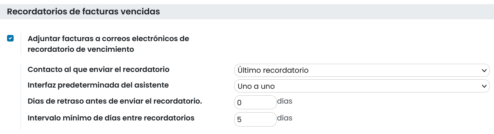

Desactivar el recordatorio de facturas vencidas para un cliente
-------------------------------------------------------------------
Daeris permite Desactivar el recordatorio de facturas vencidas para un cliente en concreto.
Para ello, navega al detalle de un contacto y sobre la pestaña **Facturación / Contabilidad** informa la opción
**Desactivar el recordatorio de facturas vencidas**.

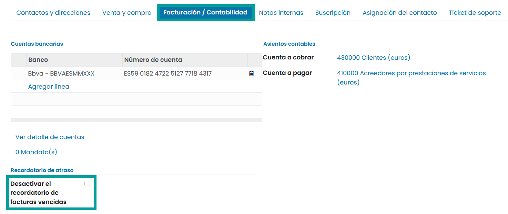

Asistente de seguimiento
===========================

Iniciar el aistente de recordatorios de facturas vencidas
------------------------------------------------------------

Para iniciar el aistente de recordatorios de facturas vencidas
haz clic sobre :menuselection:`Contabilidad / Facturación --> Clientes --> Recordatorios de facturas vencidas`.

Sobre el formulario disponemos de las siguientes apartados:

   - **Filtros**: Permite indicar la manera de aplicar los filtros de búsqueda de facturas. Dispone de los siguientes campos:

      - **Clientes**: permite filtrar por todas aquellas facturas vencidas de los clientes aquí informados. Si no se informa ningún cliente se busca por todos los clientes.
      - **Vendedores**: permite filtrar por todas aquellas facturas vencidas de los empleados aquí informados. Si no se informa ningún empleado se busca por todos los empleados.

   - **Opciones**: Permite incorporar opciones de búsqueda. De forma predeterminada disponen de los valores informados en los ajustes. Dispone de los siguientes campos:

      - **Contacto al que enviar el recordatorio**: Destinatario al que emitir la comunicación, pudiendo seleccionar entre:

         - **Último recordatorio** Se emite al mismo contacto al que se le emitió el último recordatorio.
         - **Última factura**: Se emite al contacto de la última factura del mismo cliente.

      - **Interfaz del asistente**: Permite indicarle al asistente si queremos que nos presente los recordatorios a enviar, uno a uno, o presentarlos de forma masiva sobre un listado.
      - **Días de retraso antes de enviar el recordatorio**: Permite indicar el número de días en que la factura ha estado vencida, antes de enviar el recordatorio.
      - **Intervalo mínimo de días entre recordatorios**: Permite indicar el número de días que han de pasar tras enviar un recordatorio, para que el asistente vuelva a presentar la opción de volver a enviar un recordatorio.

   - **¿Pagos al día?**: Mediante este apartado es posible visualizar bajo un listado, los diarios de tu empresa y la fecha de creación del último asiento. Con esta información, puedes identificar si se han importado o creado, extractos de tus bancos recientemente.

Mediante el campo **Considero que los pagos están al día** validamos que hemos revisado las fechas de los extractos bancarios y podemos iniciar el asistente. Si no informas este campo e intentar **Iniciar** el asistente, se mostrará un mensaje por pantalla, indicando que debes informarlo.

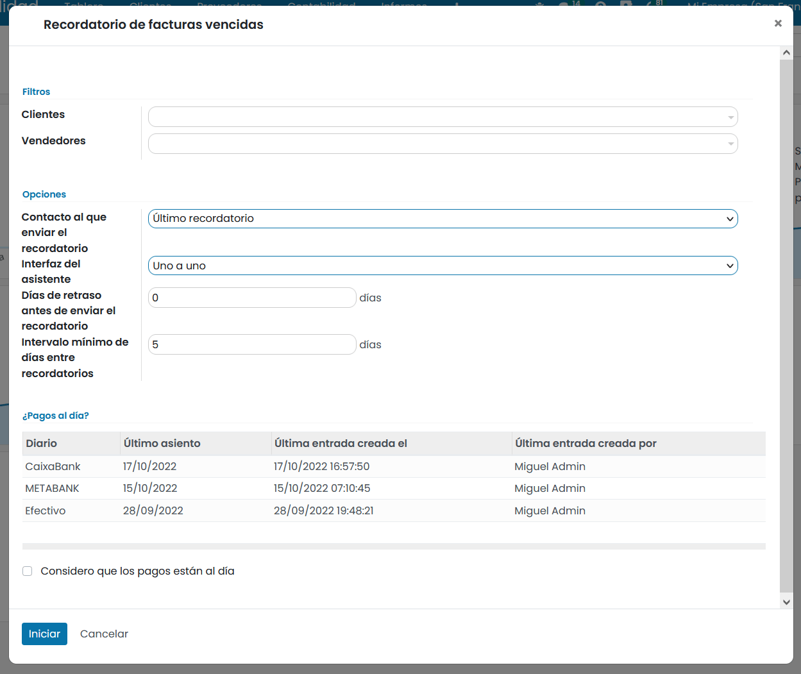

Una vez informados los parámetros del asistente haz clic sobre el botón **Iniciar**.

Sobre el apartado superior del asistente, encontramos los detalles del cliente , los pagos/reembolsos no conciliados
(si los tiene) y la/s factura/s vencidas.

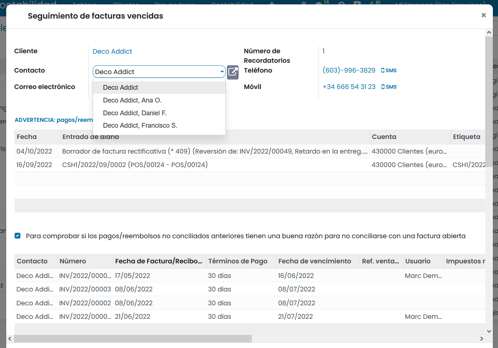

Sobre el apartado inferior del asistente, encontramos el tipo de comunicación que vamos a emitir.

Si seleccionas como tipo de recordatorio el valor **Correo electrónico**, el asistente muestra el asunto y el cuerpo del correo a emitir. Mediante el
botón **Validar** emitimos la comunicación y en el caso de mostrar los recordatorios **Uno a uno**, pasamos al siguiente registro.

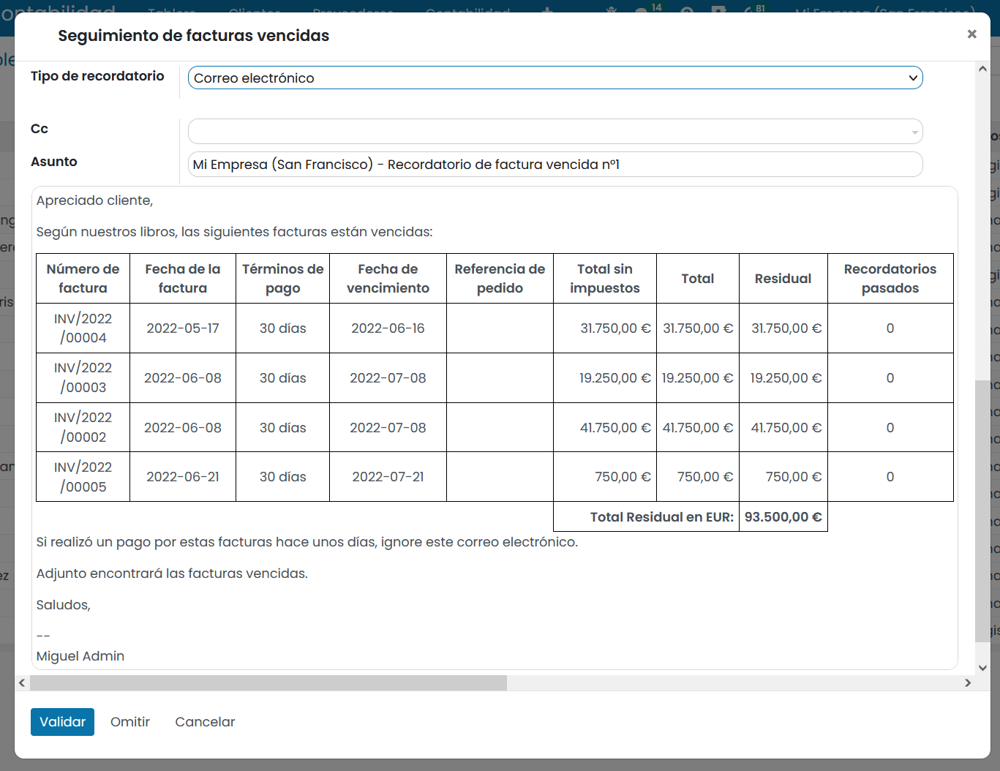

Si seleccionas como tipo de recordatorio el valor **Teléfono**, debes efectuar una llamada telefónica al cliente
solicitando el pago de las facturas. El asistente nos muestra un desplegable donde informar el **resultado de la llamada**.

Puedes configurar los posibles resultados desde la pantalla  :menuselection:`Contabilidad / Facturación --> Configuración --> Resultados del recordatorio de facturas`.

Además, es posible incorporar notas adicionales del resultado de la llamada, sobre el campo **notas**.
En el caso de que desees programar una actividad , informa el campo **Crear actividad** y completa sus
detalles seleccionando el tipo, fecha de vencimiento, asunto y descripción y empleado asignado.

Mediante el botón **validar**, guardamos el registro y en el caso de mostrar los recordatorios **Uno a uno**, pasamos al siguiente registro.

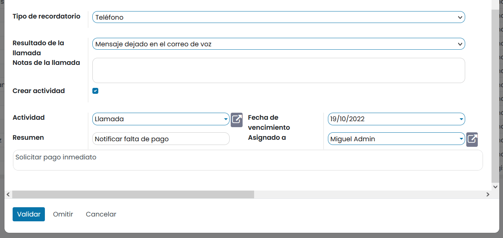

Si seleccionamos como tipo de recordatorio el valor **Carta** aparecen los botones **Imprimir carta** e
**Imprimir facturas vencidas** sobre el formulario.

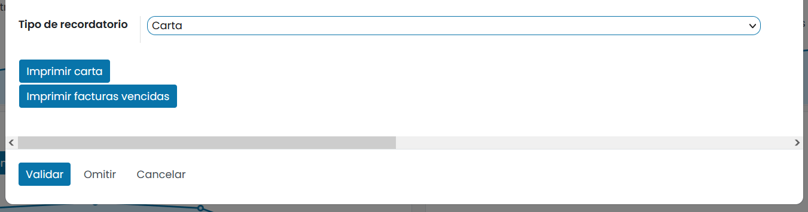

Mediante el botón **Imprimir carta** se muestra sobre una nueva ventana un redactado en formato PDF, solicitando al
cliente el pago de las facturas. Realiza la impresión del fichero para enviar a tu cliente por correo postal.

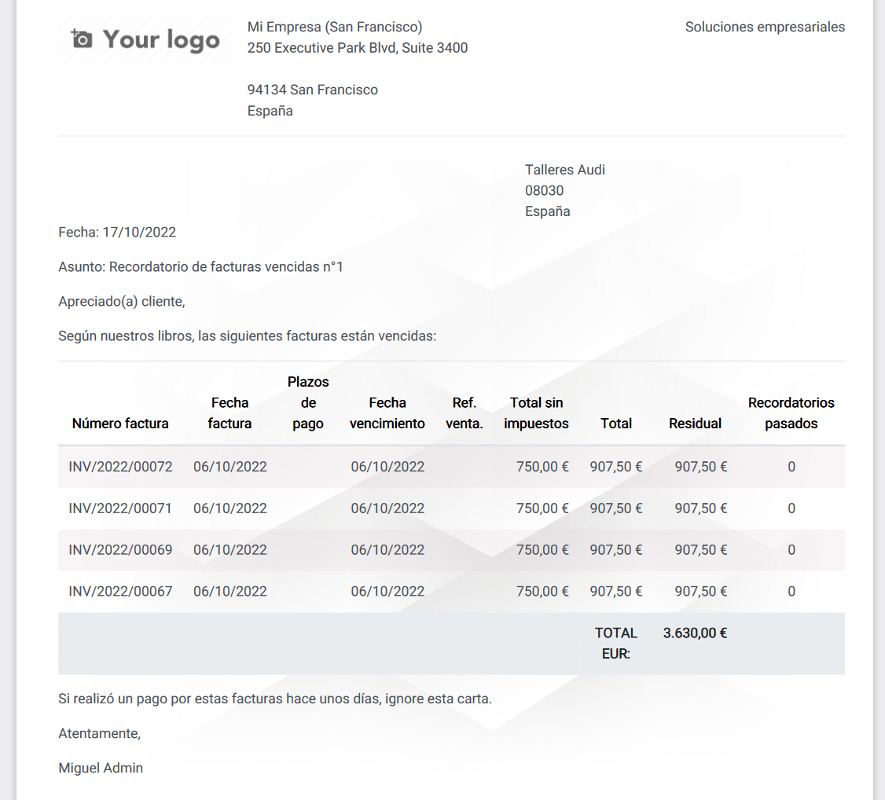

Mediante el botón **Imprimir facturas vencidas**, se muestran las facturas vencidas para que puedas imprimirlas y
enviarlas a tu cliente por correo postal.

Mediante el botón **validar**, guardamos el registro y en el caso de mostrar los recordatorios **Uno a uno**, pasamos al siguiente registro.

En el caso de mostrar los recordatorios **Uno a uno**, es posible realizar las siguientes acciones:

   - **Validar**: Confirma la acción sobre el recordatorio mostrado por pantalla y pasa al siguiente registro.
   - **Omitir**: Ignora un recordatorio y no se realiza acciones.
   - **Cancelar**: Cierra el asistente sin realizar acciones.

Iniciar el asistente sobre una factura vencida
------------------------------------------------
Para iniciar el asistente de seguimiento de facturas vencidas sobre una factura vencida, navega al detalle de la
factura y haz clic sobre el apartado sombreado **Enviar un recordatorio de retraso en el pago**.

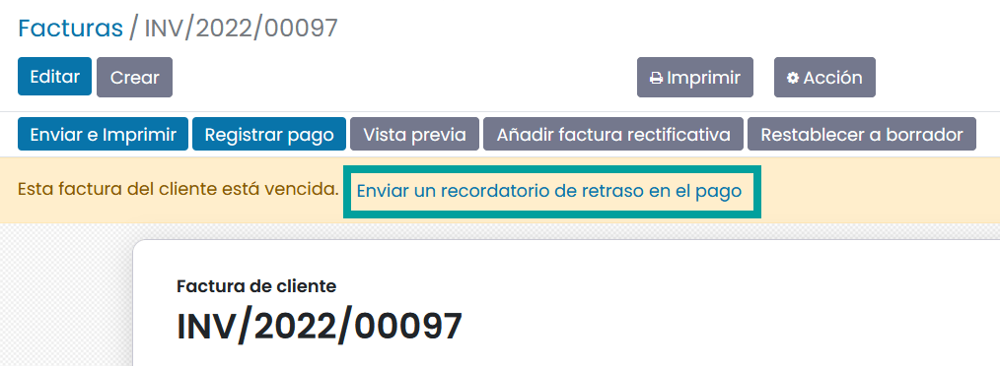

Mediante esta acción se abre el asistente de seguimiento, filtrando por el cliente asociado a la factura.

Analizar los recordatorios de facturas vencidas
----------------------------------------------------------
Daeris permite analizar los recordatorios de facturas vencidas. Para ello, navega a
:menuselection:`Contabilidad / Facturación --> Informes --> Recordatorios de facturas vencidas`.

Sobre la pantalla, puedes filtrar y agrupar por diversos campos, asi como mostrar los resultados en modo grafico.

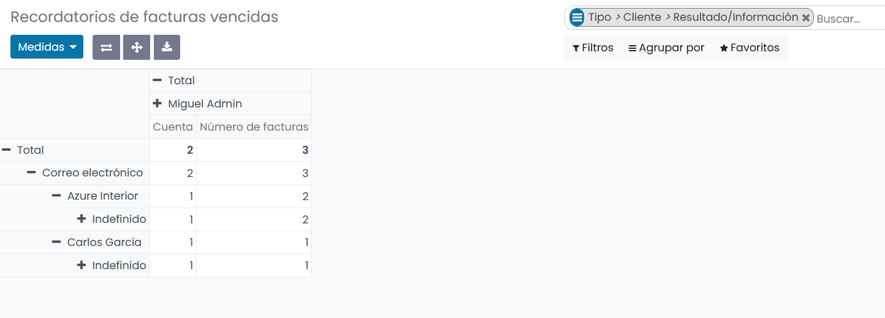

Programar actividades
======================

Para realizar un seguimiento del proceso de pago de las facturas de los clientes, puedes programar una actividad que
puedes configurar sobre el diario de Facturas de cliente.

Para ello, navega a :menuselection:`Contabilidad / Facturación --> Configuración --> Diarios contables` y haz clic
sobre el diario contable **Facturas de cliente**.

Accede a la pestaña **Configuración avanzada** y sobre el apartado **Seguir los pasos del cliente**,
informa los siguientes campos:

   - **Planificar actividad**: Tipo de actividad que se planificara en la fecha de vencimiento del pago de la factura.
   - **Actividad Usuario**:  Usuario de Daeris al que se asignará la actividad. Si se deja vacío se asignará al comercial asociado a la factura.
   - **Resumen actividad**:  Texto que aparecerá sobre la actividad.

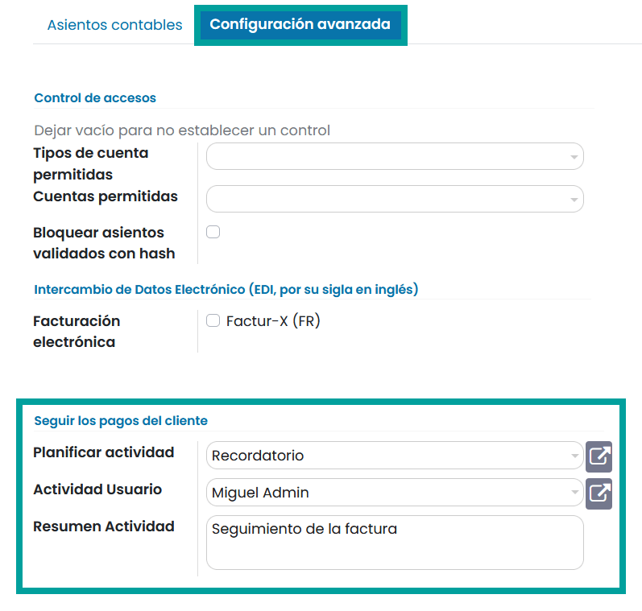

Cuando se llegue a la fecha de vencimiento, se notificará sobre el panel de actividades, de la actividad sobre la **entrada de diario** a realizar.

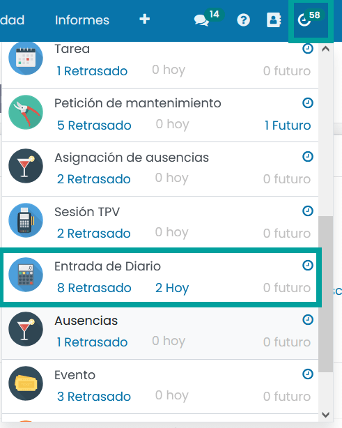

Al hacer clic sobre la actividad, accedes al formulario de detalle de la factura. Sobre el apartado de actividades,
puedes gestionar la actividad planificada.

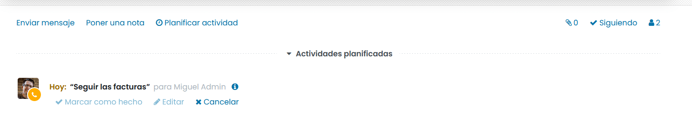
