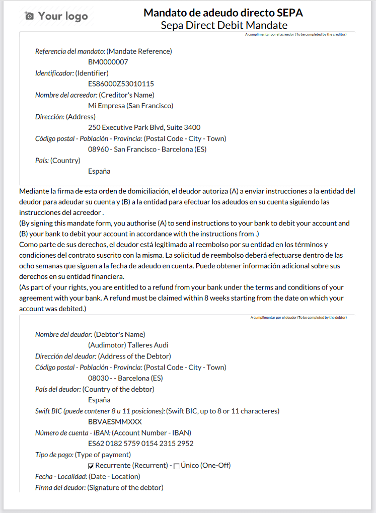

==========================================
Pagos por lotes: SEPA Direct Debit (SDD)
==========================================

SEPA, la Zona Única de Pagos en euros, es una iniciativa de integración de pagos de la Unión Europea para simplificar
las transferencias bancarias en EUROS. Con **sepa Direct Debit**, tus clientes pueden firmar un **mandato** que te autoriza
a cobrar pagos futuros de sus cuentas bancarias, siendo muy útil para pagos recurrentes basados en una suscripción.

Puedes registrar mandatos de clientes en Daeris y generar archivos XML que contengan pagos pendientes realizados con
un mandato SDD.

.. note::
   SDD es compatible con  todos los países SEPA, que incluyen los 27  estados miembros de la Unión Europea, así como  países adicionales.

   `Lista de todos los países SEPA. <https://www.europeanpaymentscouncil.eu/document-library/other/epc-list-sepa-scheme-countries>`_

.. _finanzas/contabilidad/cuentas_cobrar/pagos_clientes/sepa/configuracion:

Configuración
==============

Para activar el pago por SEPA navega a :menuselection:`Contabilidad / Facturación --> Configuración --> Ajustes`
y sobre el apartado **SEPA / PAIN** , informa los siguientes campos:

   - **Identificador del iniciador de la transacción**: Este campo se usará como identificador del iniciador de la transacción en los archivos PAIN generados en daeris. En caso de duda, puedes consultar a tu entidad bancaría.
   - **Emisor de la transacción**: Este campo se usará como emisor de la transacción en los archivos PAIN generados en daeris. En caso de duda, puedes consultar a tu entidad bancaría.
   - **Identificadores múltiples**: Si tu mandato requiere de múltiples identificadores (ocurre en algunos países como España), informa el campo.
   - **Identificador de acreedor SEPA**: Introduce el identificador de acreedor atribuido a tu compañía para realizar adeudos directos SEPA. Se trata de una referencia única de tu empresa cuando realizas cobros por domiciliación bancaria. El identificador del acreedor se debe incluir en cada mandato SEPA y en cada proceso de cobro (es decir, en el fichero que envías al banco). Para conseguir el identificador de acreedor SEPA puedes consultar a tu banco.

Recuerda hacer clic sobre el botón **Guardar** para que tus cambios queden registrados.

Posteriormente, navega a :menuselection:`Contabilidad / Facturación --> Configuración --> (Administración) Metodos de pago` y
haz clic sobre el método **Débito directo SEPA para clientes**.

Verifica que bajo el campo **Versión PAIN**, estás usando el valor que necesitas.

.. tip::
   Si en tu empresa vais a usar varias opciones PAIN , haz clic sobre el botón **Acción** , selecciona la opción **Duplicar**, y genera un nuevo modo de pago duplicado, incorporando la **Versión PAIN**.

Por último, navega a :menuselection:`Contabilidad / Facturación --> Configuración --> (Administración) Modos de pago` y
haz clic sobre el botón **Crear**.

Selecciona el método de pago **Débito directo SEPA para clientes**, *Si dispones de varios métodos de pago con distintas versiones de PAIN, selecciona el que se adecue a este modo de pago*.
Informa el Identificador del iniciador de la transacción el Emisor de la transacción y el Identificador de acreedor SEPA.
Por último haz clic sobre el botón **Guardar**.

.. image:: sepa/sepa02.png
   :align: center
   :alt: SEPA Direct Debit

Mandatos de débito directo SEPA
================================

Crear un mandato
-----------------

El mandato u orden de domiciliación es el medio por el que el deudor autoriza y consiente al acreedor a:

   - **Iniciar los cobros** mediante el cargo en la cuenta indicada por el deudor.
   - **Autorizar a la entidad** del deudor a cargar en su cuenta los adeudos presentados al cobro por la entidad bancaria del acreedor.

El mandato debe estar suscrito por el deudor como titular de la cuenta de cargo o persona en disposición de poder
otorgado por éste, antes de iniciar el cobro de los adeudos. El mandato firmado debe quedar almacenado en poder del
acreedor mientras esté en vigor, durante el periodo de reembolso, así como durante los plazos que establezca la Ley para
la conservación de documentos, una vez cancelado.

.. seealso::
   `Mandatos SEPA <https://www.sepaesp.es/sepa/es/faqs/elmandato/>`_ .

Para consultar los mandatos asociados a un cliente, navega al detalle de un cliente desde la pantalla
:menuselection:`Contabilidad / Facturación --> Clientes --> Clientes`, y desde la pestaña de **Facturación / Contabilidad**,
pulsa el enlace de **mandatos**.

También es posible consultar todos los mandatos. Para ello, navega a :menuselection:`Contabilidad / Facturación --> Clientes --> Mandatos bancarios`.

Para crear un nuevo mandato, haz clic sobre el botón **Crear** y completa el formulario, informando los siguientes campos:

   - **Compañía**: Permite seleccionar la compañía (de una de tus compañías) sobre la que hace referencia el mandato.
   - **Formato**: Identifica el deudor:

      - **Mandato básico**: En el caso de que el deudor sea tu empresa.
      - **Mandato SEPA**: En el caso de que el deudor sea el cliente/proveedor.

   - **Tipo**:Dispones de las siguientes opciones:

      - **Genérico**: En el caso de que se realice un mandato genérico.
      - **Único**: En el caso de que se vaya a hacer una única transacción.
      - **Recurrente**: En el caso de que se vayan a realizar varias transacciones de forma recurrente

   - **Cuenta bancaria**: Cuenta asociada al cliente/proveedor.

   .. attention::
      Es necesario asociar una cuenta bancaria para que el mandato quede asociado al cliente o proveedor de esa cuenta bancaria. Si no se informa este campo, al imprimir el mandato, no se puede recuperar el idioma del contacto asociado al mandato, por lo que el mandato aparecerá impreso en inglés.

   - **Empresa**: Cliente o proveedor asociado al mandato. Se informa automáticamente en función de la cuenta bancaria seleccionada.
   - **Esquema**:Dispones de las siguientes opciones:

      - **Básico** (CORE)
      - **Empresa** (B2B)

   - **Tipo de secuencia para el próximo cobro**: Dispones de las siguientes opciones:

      - **Inicial**: De un solo uso.
      - **Periódico**: En el caso de que vayas a realizar cobros/pagos de forma recurrente.
      - **Final**: De un solo uso.

   - **Fecha de la firma del mandato**: Permite seleccionar la fecha de firma del mandato.
   - **Escaneado del mandato**: Permite subir un archivo escaneado con el mandato firmado.
   - **Fecha del último cobro**: Fecha en la que se usó por última vez el mandato para realizar un cobro.

Una vez dispongas de los campos necesarios informados, pulsa el botón **Guardar**.

A continuación, deberás **imprimir** una copia del mandato y enviárselo al cliente/proveedor para que lo firme
incluyendo la fecha de la firma. Esta copia la puedes obtener pulsando el botón **Imprimir**, que generará un fichero
en formato PDF.

El mandato generado dispone de la información necesaria para autorizar la realización de cobros y pagos.

Una vez recibido el mandato firmado, lo puedes adjuntar sobre el campo **Escaneado del mandato**.
Incorpora también, la **fecha de la firma del mandato**.

Por último, valida el mandato mediante el botón **Validar**. Si todo ha ido bien, el mandato quedará marcado como *Válido*.

Cancelar o expirar un mandato
-------------------------------

Los mandatos **validos** expiran automáticamente 36 meses después de la fecha de la firma y/o 36 meses después
de la fecha de último uso (lo que ocurra primero).

.. attention::
   Una vez que un mandato ha expirado,  no puede ser reactivado.

Daeris, se encarga a diario de realizar esta comprobación y expirar los mandatos caducados.

Igualmente, es posible cancelar un mandato de forma manual. Para ello, navega a
:menuselection:`Contabilidad / Facturación --> Clientes --> Mandatos bancarios`,
y haz clic sobre el mandato que deseas cancelar.

Sobre el formulario, haz clic sobre el botón **Cancelar**.El estado del mandato cambiará automáticamente a **Cancelado**.

.. important::
   Al cancelar o expirar un mandato este queda deshabilitado inmediatamente. Ya no se puede registrar ningún pago , independientemente de la fecha  de la factura.

Recibir pagos por lotes: SEPA Direct Debit
===========================================

Facturas
------------

Puedes registrar pagos SEPA sobre facturas emitidas a clientes que tienen un mandato SDD activo.

Para ello, informa sobre tu factura el metodo de pago **Adeudo directo SEPA de clientes**, añade el banco destinatario y el mandato.
Sobre el campo **Tipo de referencia**: Incorpora el valor **Referencia libre**.
Una vez completados los detalle de tu factura, haz clic sobre el botón **Confirmar**. La factura quedará en estado Publicado.

Posteriormente haz clic sobre el botón **Registrar pago** y sobre el formulario informa como método de
pago **Debito directo SEPA para clientes**.

Por último haz clic sobre el botón **Crear Pago**. La factura quedará es estado **Pagado**.

Generar  archivos XML  de débito directo SEPA para enviar pagos
------------------------------------------------------------------

Los archivos XML con todas las instrucciones de pago SEPA Débito Directo, se pueden cargar en tu banco
en línea para procesar todos los pagos a la vez.

.. important::
   Por defecto, los archivos generados por Daeris siguen las especificaciones **SEPA Direct Debit PAIN.008.001.02**,
   según lo requerido por las Directrices de Implementación sepa de cliente a banco, que garantizan la compatibilidad
   con los bancos.

Para generar tu archivo XML sobre los pagos SDD pendientes, navega a
:menuselection:`Contabilidad / Facturación --> Clientes --> Órdenes de pago`,
y haz clic sobre el botón **Crear**.

Sobre el formulario, informa los siguientes campos y haz clic sobre el botón **Guardar**:

   - **Modo de pago**: Adeudo directo SEPA de clientes
   - **Diario del banco**: Seleciona el diario de tu banco.

Posteriormente, haz clic sobre el botón **Importar apuntes contables** y sobre el formulario informa los siguientes campos:

   - **Filtro de tipo de fecha**: Fecha de vencimiento
   - **Fecha de vencimiento**: La fecha hasta la que deseas buscar facturas vencidas
   - **Filtro de diarios**: El diario sobre el que buscar.

.. note::
   Este es un ejemplo de patrón de busqueda, pero puedes adaptarlo a tus necesidades.

Una vez informados los campos haz clic sobre el botón **Añadir todos los apuntes contables**. Mediante esta
acción, se informarán sobre el listado inferior, todos los apuntes coincidentes.

Una vez dispongas de los apuntes contables, haz clic sobre el botón **Crear transacciones**.

Una vez dispones de las transacciones sobre tu orden de pago, haz clic sobre el botón **Confirmar pagos**.

Tras confirmar los pagos, debes hacer clic sobre el botón **Generar archivo de pago**.

Por último, descarga el archivo XML SDD e impórtalo sobre la interfaz de tu banca en línea para procesar los pagos.

