========================================
Activos no circulantes y activos fijos
========================================

Los **activos no corrientes**, también conocidos como **activos a largo plazo**, son inversiones que se esperan realizar
durante más de un año. Se capitalizan en lugar de gastarse y aparecen en el balance de la empresa. Dependiendo de su
naturaleza, pueden sufrir una **depreciación**.

Los **activos fijos** son un tipo de activos no corrientes e incluyen las propiedades adquiridas por sus aspectos
productivos, tales como edificios, vehículos, equipamiento, terrenos y software.

Por ejemplo, supongamos que compramos un coche por 27,000 euros. Planeamos amortizarlo a lo largo de cinco años,
y después lo venderemos por 7,000 euros. Utilizando el método de depreciación lineal, se cargan 5,000 euros cada año
como **gastos de depreciación**. Después de cinco años, el importe de la **depreciación acumulada** que figura en el
balance es de 20,000 euros, lo que nos deja un total de 7,000 euros de **valor de rescate**, o valor residual.

Daeris gestiona la depreciación creando todas las entradas de depreciación automáticamente en modo de borrador y se
contabilizan periódicamente.

Daeris admite los siguientes **métodos de depreciación**:

   - Lineal
   - Lineal hasta el valor de rescate
   - Decreciente
   - Decreciente lineal
   - Regresivo hasta el valor de rescate

.. note::
   El servidor comprueba una vez al día si se debe publicar un asiento. Pueden pasar hasta 24 horas antes de que se refleje el cambio de borrador a publicado.

Pre-requisitos
===============

Crear categorías de activos
----------------------------

Una **Categoría de activos** sirve para definir una serie de cuentas que tienen en común varios activos. La categoría
del activo se debe informar sobre la factura del activo, cuando se realiza su compra.

Para crear una categoría de activos navega a :menuselection:`Contabilidad / Facturación --> Configuración --> Categoría del activo`
, haz clic en el botón **Crear** y sobre el formulario, informa los siguientes campos:

   - **Grupos del activo**: Grupos sobre los que es posible extraer información de los activos a través de informes.
   - **Crear un activo por artículo de producto**: Por defecto, durante la validación de una factura se crea un activo por línea de factura así como un apunte por línea de factura. Con esta configuración se creará un apunte contable por artículo del producto. Por lo tanto, habrá un activo por producto.
   - **Compañía**: Empresa relacionada con la categoría.
   - **Diario**
   - **Cuenta de activo**
   - **Cuenta de depreciación**
   - **Cuenta de gastos de depreciación**
   - **Cuenta para ganancia de valor**
   - **Cuenta para perdida de valor**
   - **Cuenta de valor residual**
   - **Autorizar deshacer asientos contables**: Si se marca, cuando se presione el botón Borrar/Retroceder Movimiento en una línea de depreciación ya publicada, se lanzará la opción de modificar el asiento en lugar de borrarlo.

Sobre el apartado **Fechas de depreciación** encontramos los siguientes campos:

   - **Método de tiempo**: Selecciona el método para calcular las fechas y el número de líneas de depreciación.

      - **Número de años**: Indica el número de años de la depreciación.
      - **Número de depreciaciones**: Informa el número de líneas de depreciación y el tiempo entre 2 depreciaciones.

   - **Longitud del periodo**: Longitud del periodo para los asientos de depreciación
   - **Calcular por días**: Usar número de días para calcular el importe de la depreciación
   - **Usar años bisiestos**:

      - Si no se marca, el sistema distribuirá de manera uniforme el importe a depreciar a lo largo de los años, en función de la cantidad de años. Por lo tanto, la cantidad por año será la base de depreciación / número de años.
      - Si se marca, el sistema considerará si el año actual es bisiesto. El importe a depreciar por año se calculará como base de depreciación / (fecha final de la depreciación - fecha inicial + 1) * días en el año actual.

Sobre el apartado **Método de depreciación** encontramos los siguientes campos:

   - **Método de cálculo**: Selecciona el método para calcular las líneas de depreciación:

      - **Lineal**: Calculado en base a: Base Depreciable / Número de depreciaciones. Base Depreciable = Valor de Compra - Valor Residual.
      - **Lineal hasta valor de rescate**: Lineal hasta el Valor de rescate. Base Depreciable = Valor de Compra.
      - **Decreciente**: Calculado en base a: Valor Residual * Coeficiente de depreciación.
      - **Decreciente Lineal** (solo para Periodo de Tiempo = Año): Decreciente se convierte en lineal cuando la depreciación lineal anual supera la depreciación decreciente anual.
      - **Decreciente hasta valor de rescate**: Decreciente hasta el Valor de rescate. La Base depreciable es igual al valor del activo.

   - **Factor decreciente**:
   - **Tiempo prorateado**: Indica que el primer asiento de depreciación para este activo tiene que ser realizado desde la fecha de inicio de la depreciación en lugar del primer día del ejercicio fiscal
   - **Omitir estado borrador**:Marca esta opción si deseas confirmar automáticamente los activos de esta categoría cuando se crean desde las facturas.

También es posible informar una cuenta analítica, etiquetas analíticas y una nota descriptiva.

Recuerda hacer clic sobre el botón **Guardar** para que los datos queden registrados.

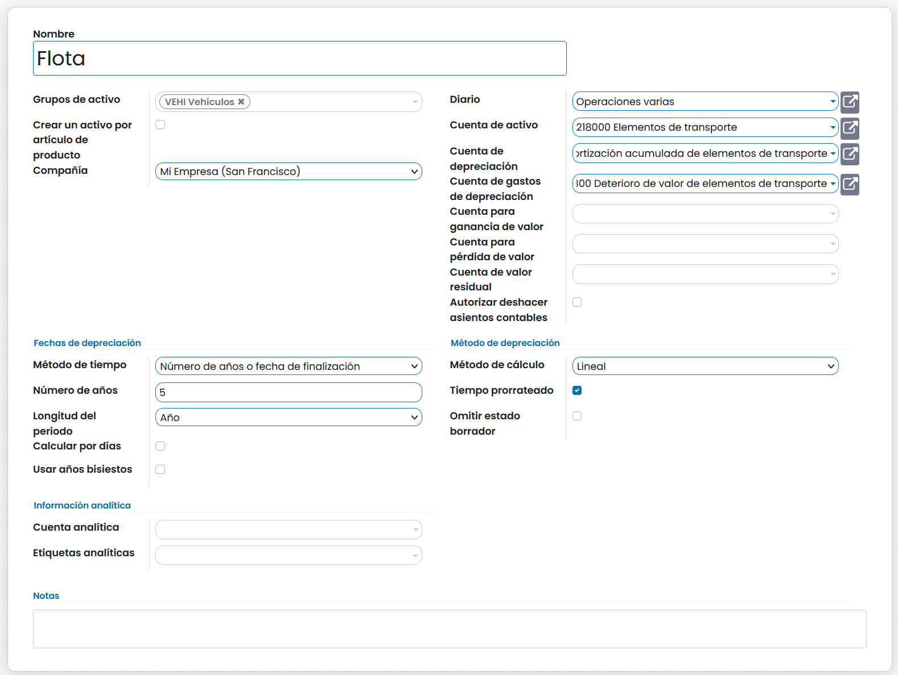

Crear productos (activos)
-------------------------
Para registrar la compra de tus activos sobre una factura, debes crearlos previamente como productos a adquirir.
Para ello, navega a :menuselection:`Contabilidad / Facturación --> Proveedores --> Productos`
y haz clic sobre el botón **Crear**.

Sobre el formulario, informa los detalles del producto.

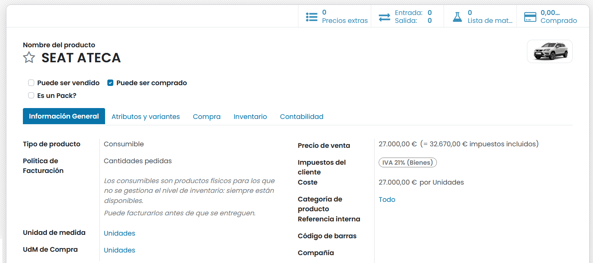

Asientos contables de activos
=============================

Crear factura de compra de un nuevo activo
-------------------------------------------
Para registrar la adquisición de un activo y definir sus asientos, debes generar la factura de compra correspondiente.
Para ello, navega a :menuselection:`Contabilidad / Facturación --> Proveedores --> Facturas`
y haz clic sobre el botón **Crear**.

Sobre el formulario, define los detalles de la factura. Es muy importante, informar sobre la línea de compra del producto,
la **Categoría del activo**.

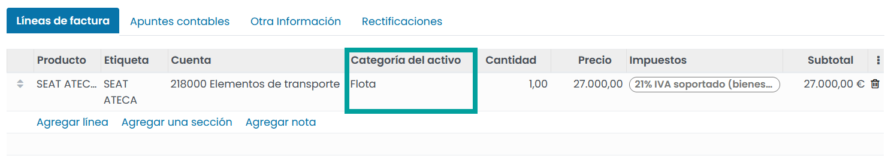

Una vez completados los detalles de la factura, haz clic sobre el botón **Confirmar**.

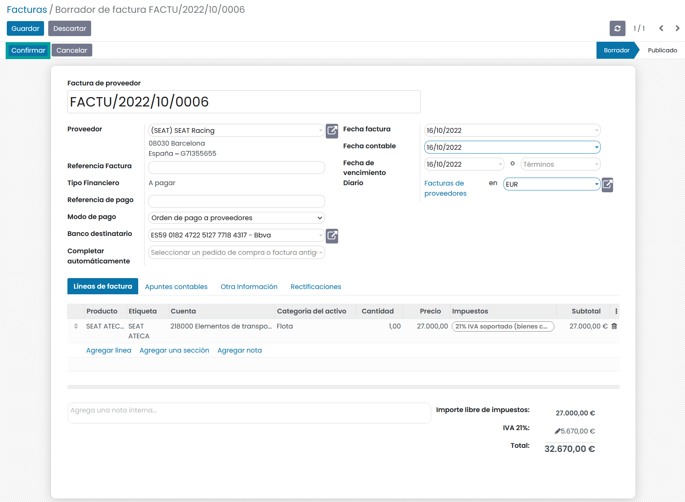

Al confirmar la factura, se añaden los **apuntes contables** sobre la cuenta definida en la categoría del activo y
se generan los **activos** relacionados con los productos adquiridos.

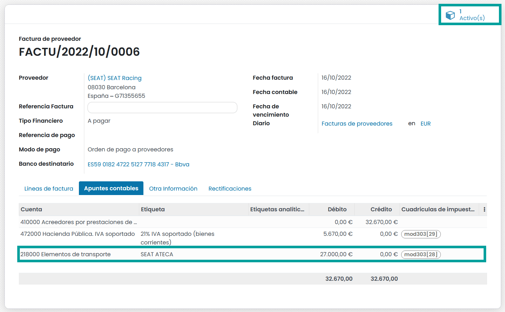

Gestión de activos
--------------------

Es posible acceder a los activos a través del botón inteligente que indica en **número de activos** que dispone la factura.

También es posible acceder a los activos desde la pantalla , navega a :menuselection:`Contabilidad / Facturación --> Contabilidad --> Activos`.

Un activo generado a través de la compra de productos, dispone de estado borrador, lo que permite configurarlo.
Sobre el formulario del activo es posible informar los siguientes campos:

   - **Nombre de activo**: Se corresponde con el nombre del producto.
   - **Referencia**: Código de la factura de compra..
   - **Base depreciación**: Importe calculado. Este importe representa la base de depreciación del activo (Valor de compra - Valor de rescate).
   - **Valor residual**: Importe calculado. Valor residual del activo.
   - **Compañía**: Empresa asociada al activo.
   - **Valor depreciado**: Importe calculado. Valor depreciado del activo.

Sobre la pestaña general encontramos los siguientes campos:

   - **Valor de compra**: Esta cantidad representa el valor inicial del activo. El valor del activo se calcula de la siguiente forma: Valor de compra - valor de rescate.
   - **Valor de rescate**: El valor estimado que un activo tendrá hasta su venta al final de su vida útil. Este valor se usará para determinar los importes de depreciación.
   - **Fecha de inicio del activo**: Debes añadir manualmente las líneas de depreciación con las depreciaciones de ejercicios fiscales anteriores si la fecha de inicio de depreciación es diferente de la fecha para la cual se deben generar asientos contables.
   - **Fecha de eliminación del activo**: Fecha de eliminación.

Sobre el apartado **Otra información** encontramos los siguientes campos:

   - **Categoría del activo**: Categoría asociada al activo
   - **Grupos de activo**: Grupo asociado al activo.
   - **Empresa**: COntacto asociado al activo.
   - **Cuenta analítica**: Cuenta analítica asociada al activo.
   - **Etiquetas analíticas**: Etiquetas analíticas asociada al activo.

Sobre el apartado **Fechas de depreciación** encontramos los siguientes campos:

   - **Método de tiempo**: Selecciona el método para calcular las fechas y el número de líneas de depreciación.

      - **Número de años**: Indica el número de años de la depreciación.
      - **Número de depreciaciones**: Informa el número de líneas de depreciación y el tiempo entre 2 depreciaciones.

   - **Longitud del periodo**: Longitud del periodo para los asientos de depreciación
   - **Fecha de finalización**:
   - **Calcular por días**: Usar número de días para calcular el importe de la depreciación
   - **Usar años bisiestos**:

      - Si no se marca, el sistema distribuirá de manera uniforme el importe a depreciar a lo largo de los años, en función de la cantidad de años. Por lo tanto, la cantidad por año será la base de depreciación / número de años.
      - Si se marca, el sistema considerará si el año actual es bisiesto. El importe a depreciar por año se calculará como base de depreciación / (fecha final de la depreciación - fecha inicial + 1) * días en el año actual.

Sobre el apartado **Método de depreciación** encontramos los siguientes campos:

   - **Método de cálculo**: Selecciona el método para calcular las líneas de depreciación:

      - **Lineal**: Calculado en base a: Base Depreciable / Número de depreciaciones. Base Depreciable = Valor de Compra - Valor Residual.
      - **Lineal hasta valor de rescate**: Lineal hasta el Valor de rescate. Base Depreciable = Valor de Compra.
      - **Decreciente**: Calculado en base a: Valor Residual * Coeficiente de depreciación.
      - **Decreciente Lineal** (solo para Periodo de Tiempo = Año): Decreciente se convierte en lineal cuando la depreciación lineal anual supera la depreciación decreciente anual.
      - **Decreciente hasta valor de rescate**: Decreciente hasta el Valor de rescate. La Base depreciable es igual al valor del activo.

   - **Factor decreciente**:
   - **Tiempo prorateado**: Indica que el primer asiento de depreciación para este activo tiene que ser realizado desde la fecha de inicio de la depreciación en lugar del primer día del ejercicio fiscal
   - **Acumular depreciaciones pendientes**: Si se crea un activo en un periodo fiscal ya cerrado, la cantidad de depreciación acumulada que no se haya podido registrar será llevada a la primera línea de depreciación del periodo actualmente abierto.

.. image:: activos/activos01.png
   :align: center
   :alt: Gestión de activos

Calcular la depreciación
-------------------------
Para calcular las entradas de depreciación de un activo, navega a la pestaña **Tabla de depreciación** y haz
clic sobre el botón **Calcular**.

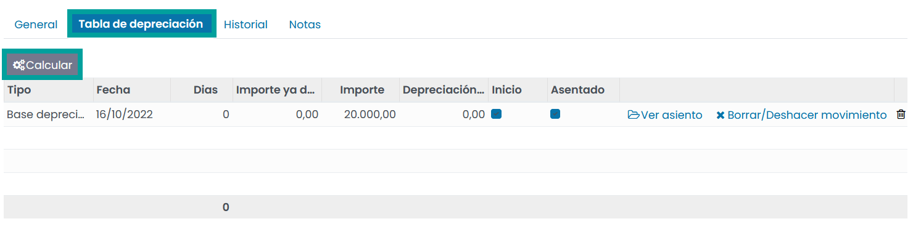

Al calcular la depreciación se generan todas las entradas de depreciación con sus correspondientes fechas e
importes de depreciación.

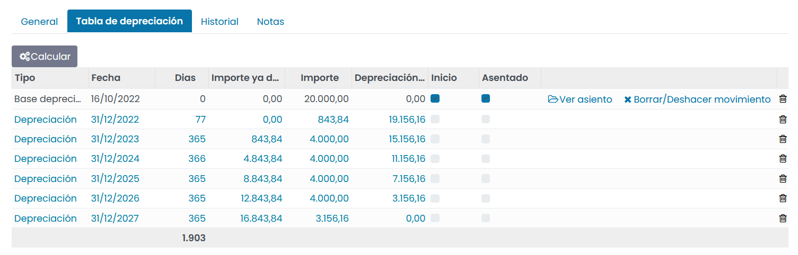

Una vez dispongas de tu activo correctamente informado, debes confirmarlo. Para ello, haz clic sobre el botón
**Confirmar activo**.

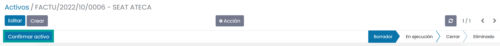

Crear asientos de activos
--------------------------

Al confirmar el activo se generan los registros que permitirán generar los asientos cuando se alcance la fecha de
depreciación.
Esta acción se genera automáticamente mediante una tarea programada en el sistema, que revisa si el registro ha
alcanzado la fecha de depreciación.

Es posible ejecutar la acción manualmente. Para ello haz clic sobre el menú
:menuselection:`Contabilidad / Facturación --> Contabilidad --> calcular depreciaciones`.

También es posible generar manualmente el asiento, haciendo clic sobre el botón **Generar asiento**.

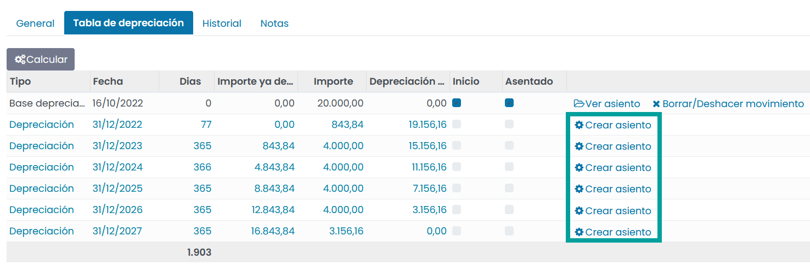

Una vez generado el asiento, es posible visualizarlo mediante el botón **Ver asiento**.

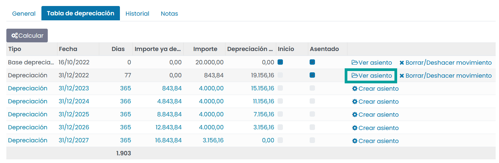

El asiento dispone de las líneas sobre las cuentas definidas en la categoría del activo.

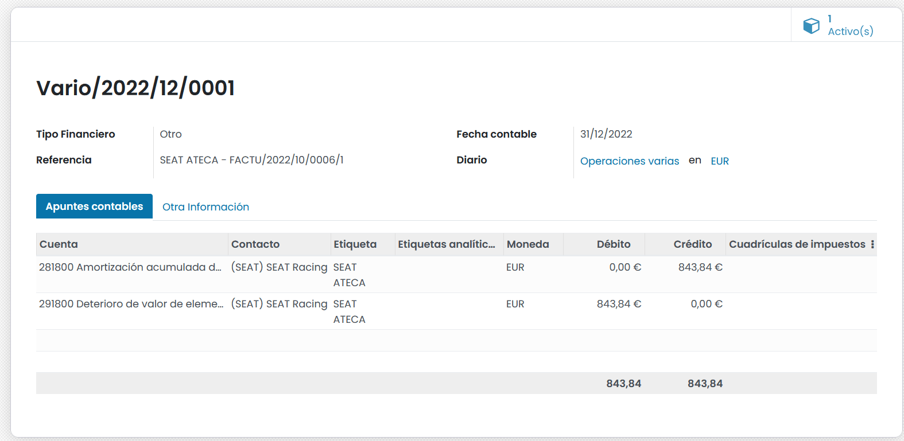

Eliminar asientos de activos
-----------------------------
Es posible eliminar un asiento, haciendo clic sobre el botón **Borrar / Deshacer movimiento**.

Eliminar activos fijos
========================
**Vender** un activo o **deshacerse** de él implica que debe ser retirado del balance.

Registrar la venta de un activo
----------------------------------
Para registrar la venta de un activo, primero registra la factura de cliente relacionada con la venta para poder
vincularla con la venta del activo.

Sobre la línea del producto a vender, incorpora como activo la factura de compra.

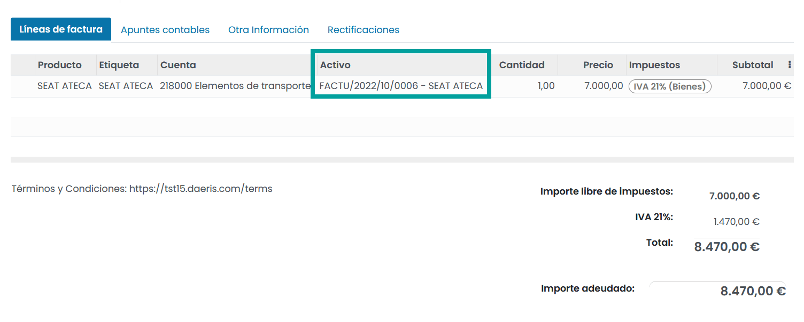

Una vez realizada la factura de venta, sobre la pestaña **Historial** del activo, aparecerá la venta relacionada.

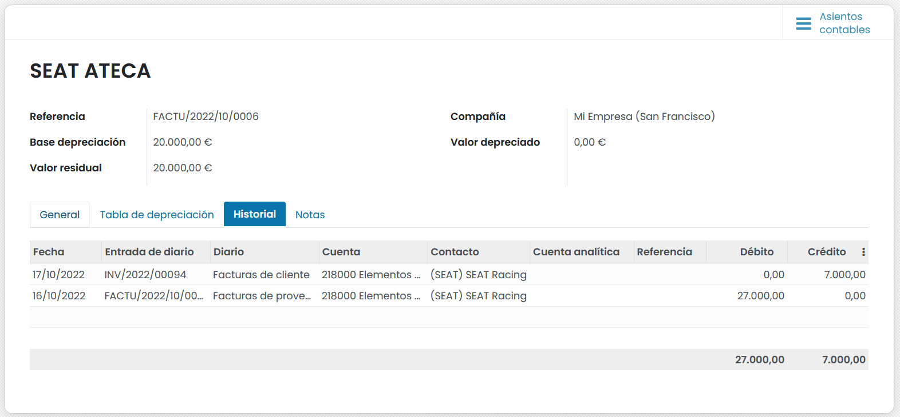

Eliminar un activo
----------------------
Para registrar la baja de un activo, haz clic sobre el botón **Eliminar** del formulario de detalle del activo.

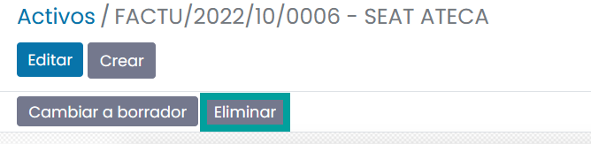

Completa el asistente con la información requerida y haz clic sobre el botón **Generar asientos de eliminación**.

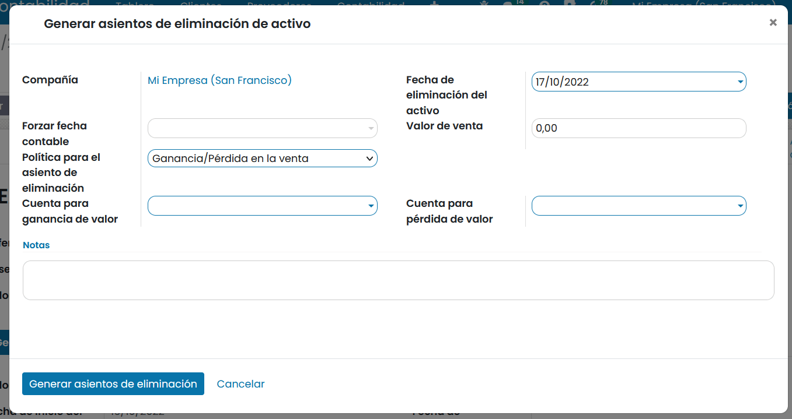

Daeris generará todos los asientos necesarios para deshacerse del activo, incluyendo la ganancia o pérdida en la venta,
que se basa en la diferencia entre el valor contable del activo en el momento de la venta y el importe en el que se vende.

Generar informes de activos financieros
========================================

Daeris permite extraer informes de activos financieros. Para ello, navega a
:menuselection:`Contabilidad / Facturación --> Informes --> Informes de activos financieros`.

Sobre el asistente informa el grupos de activos, fecha de inicio y fin, permitir borradores y empresa y haz clic
sobre el botón **Generar informe**.

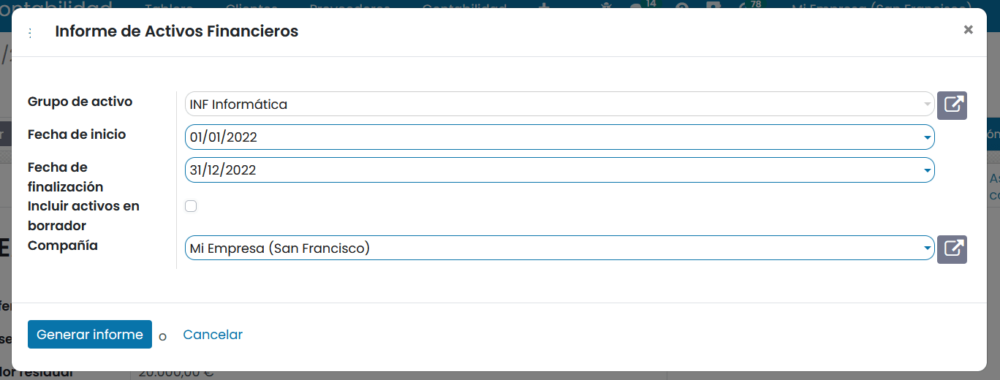

