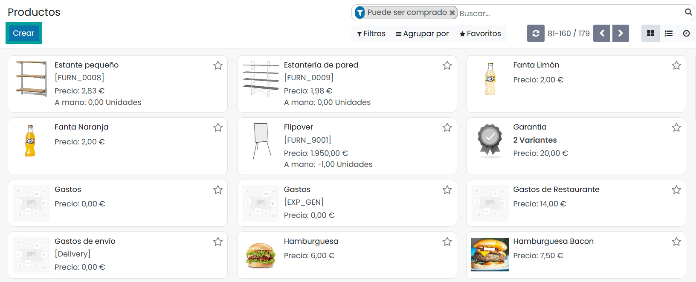
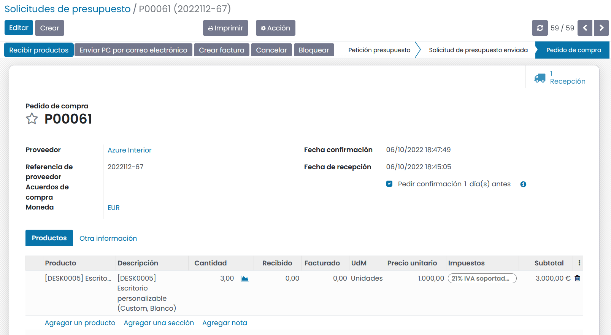
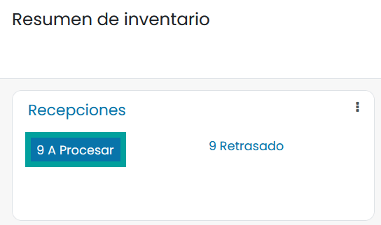
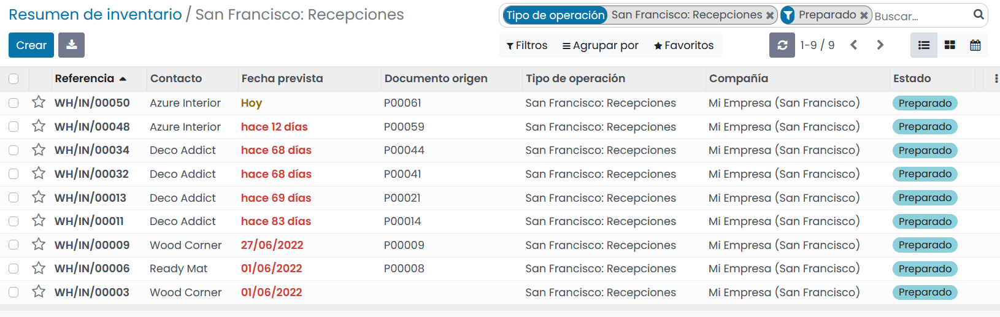
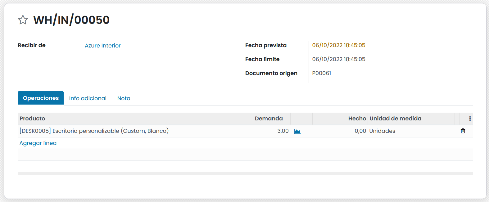
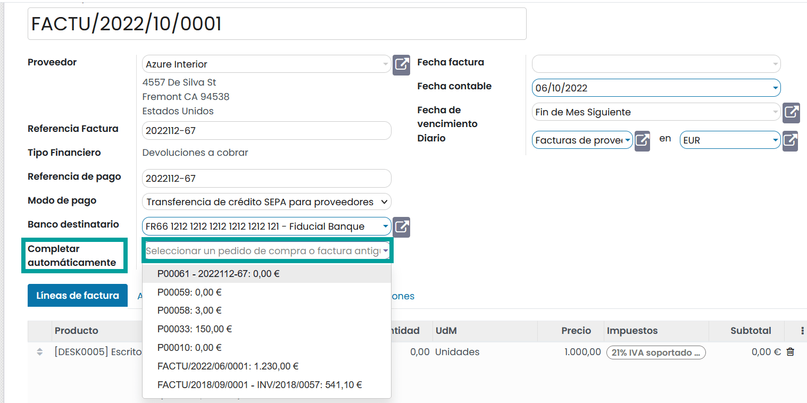
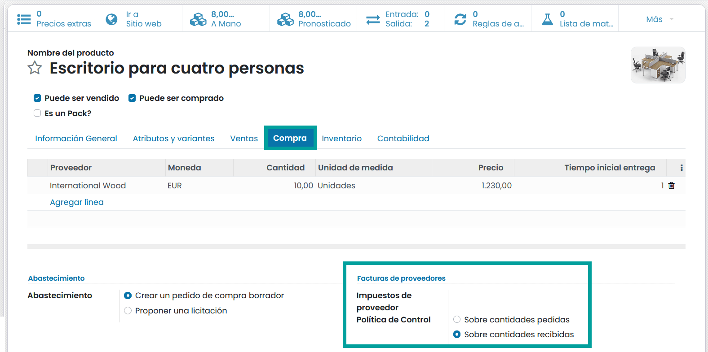
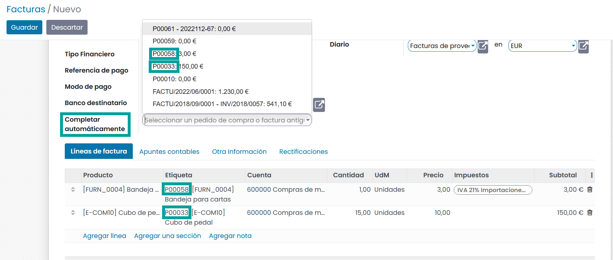

======================================
Gestionar facturas de proveedores
======================================

La aplicación Compras, te permite administrar tus pedidos de compra, productos a adquirir y facturas de proveedores
desde un único punto.

Si deseas configurar un proceso de control de facturas de proveedores, lo primero que debes hacer, es disponer de los
datos de tus compras en Daeris. Saber lo que se ha comprado y recibido es el primer paso para comprender tus procesos
de gestión de compras.

A continuación, se muestra el flujo de trabajo estándar:

   - Crea una **Solicitud de presupuesto** para enviar a tu(s) proveedor(es).
   - Una vez el proveedor ha aceptado el presupuesto, confírmalo convirtiéndolo en un **Pedido de Compra**.
   - La confirmación del pedido de compra **genera un envío entrante** si has comprado algún producto almacenable.
   - Al recibir una **factura de proveedor** de tu proveedor, valida la factura con los productos recibidos en el paso anterior para garantizar la exactitud de los datos en el sistema.

Este proceso puede ser realizado por varias personas diferentes dentro de la empresa, o solo una.

Configuración
===============

Creación de productos
--------------------------
Crear productos en Daeris es esencial para una compra rápida y eficiente dentro del sistema. Para crear productos, navega a
:menuselection:`Compras --> Productos --> Productos` y haz clic sobre el botón **crear**.

Al crear el producto, presta atención al campo **Tipo de producto**, ya que es importante por los siguientes motivos:

   - Los productos que se establecen como **almacenables** o **consumibles** te permitirán realizar un seguimiento de sus niveles de inventario. Estas opciones implican la gestión de stock y te permitirán recibir este tipo de productos.
   - Por el contrario, los productos que se configuran como **Servicio** o **Producto Digital** no implicarán gestión de stock, simplemente por el hecho de que no hay inventario que gestionar. No podrás recibir productos de estas tipologías.

.. tip::
   Se recomienda crear un producto **varios** para todas las compras que se realicen con poca frecuencia y que no
   requieran valoración o gestión de inventario. Si crea un producto de este tipo, se recomienda establecer el tipo
   de producto con el valor **Servicio**.

Administración de tus facturas de proveedores
==============================================

Compra de productos o servicios
--------------------------------

Desde la aplicación de compras, puedes crear un pedido de compra con tantos productos como necesites. Si el proveedor
te envía una confirmación o presupuesto para un pedido, puedes registrar el número de referencia del pedido en el
campo **Referencia del proveedor**. Esto te permitirá más adelante, hacer coincidir fácilmente el pedido de compra
con la factura del proveedor (ya que la factura del proveedor probablemente incluirá la referencia del proveedor).

Valida el pedido de compra y recibe los productos desde la aplicación Inventario.

Recepción de productos
-----------------------

Si compras algún producto almacenable del que administras el inventario, debes recibir los productos de la aplicación
Inventario (después de confirmar el pedido de compra). Desde el **panel de control de Inventario**, verás un botón
que lo vincula directamente con la transferencia de productos.

Al hacer clic sobre el botón **A Procesar** navegamos a la pantalla de pedidos en espera de recepción.

Si dispones de muchos pedidos en espera, aplica un filtro, utilizando la barra de búsqueda en la parte superior derecha.
Con esta barra de búsqueda, puedes filtrar por proveedor, el producto o el documento de origen (referencia de tu pedido
de compra). Al hacer clic sobre un registro del listado, se visualizan los productos pendientes de recepción.

.. attention::
   La compra de productos de servicio no activa una orden de entrega.

Gestión de facturas de proveedores
------------------------------------

Cuando recibes una factura de proveedor por una compra anterior, asegúrate de registrarla en la aplicación.
Debes crear una nueva factura de proveedor incluso si ya has registrado un pedido de compra.

Para crear una factura de proveedor navega a :menuselection:`Contabilidad / Facturación --> Proveedores --> Facturas`
y haz clic sobre el botón **Crear**.

Lo primero que debes hacer al crear una factura de proveedor es seleccionar el proveedor apropiado, ya que, al hacerlo,
también obtienes cualquier información de contabilidad o lista de precios asociada.

Posteriormente, puedes elegir especificar uno o varios pedidos de compra bajo el campo **Completar automáticamente**.
Cuando selecciones un Pedido de compra de la lista, Daeris extraerá cualquier producto asociado a ese
Pedido de compra y lo añadirá como líneas de la factura.

Si te es complicado encontrar la factura de proveedor, puedes buscar en la lista por el número de referencia del
proveedor o el número de pedido de compra interna.

Mientras la factura está en estado borrador, puedes realizar las modificaciones que necesites (es decir, eliminar o
agregar líneas de productos, modificar cantidades y cambiar precios).

.. attention::
   Un proveedor puede enviarte varias facturas asociadas al mismo pedido de compra si:

      - El proveedor está enviándote facturas a medida que te envían los productos.
      - El proveedor te está enviando una factura parcial o te está solicitando un depósito (pago adelantado).

Cada vez que registres una nueva factura de proveedor, Daeris rellenará automáticamente las cantidades de productos
en función de lo que se haya recibido del proveedor. Si este valor muestra un cero, significa que aún no has recibido
este producto y simplemente sirve como un recordatorio de que no has recibido el producto y es posible que debas
averiguar el motivo. Puedes cambiar esta cantidad antes de validar la factura del proveedor.

Coincidencia de facturas de proveedores
=========================================

Qué hacer si tu factura de proveedor no coincide con lo que has recibido
---------------------------------------------------------------------------

Si la factura que recibes del proveedor tiene cantidades que no coinciden con las cantidades rellenadas automáticamente
por Daeris, puede deberse a varias razones:

   - El proveedor te está cobrando incorrectamente por productos y/o servicios que no has pedido.
   - El proveedor te está facturando por productos que es posible que aún no hayas recibido, ya que el control de facturación puede basarse en cantidades pedidas o recibidas.
   - El proveedor no te facturó por productos comprados anteriormente.

En estos casos, se recomienda que verifiques que la factura, y cualquier pedido de compra asociado al proveedor, sean
precisos y que comprendas lo que has pedido y lo que ya has recibido.

Si no puedes encontrar un pedido de compra relacionado con una factura de proveedor, podría deberse a una de las
siguientes razones:

   - El proveedor ya te ha facturado este pedido de compra por lo que, no va a aparecer en ninguna parte de la selección.
   - Alguien en la compañía olvidó registrar un pedido de compra para este proveedor.
   - El proveedor te está cobrando por algo que no solicitaste.

Cómo se gestionan las cantidades de productos
----------------------------------------------

De forma predeterminada, los **servicios** se gestionan en función de las **cantidades solicitadas**, mientras que los
productos **almacenables y consumibles** se gestionan en función de las **cantidades recibidas**.

Si necesitas administrar productos en función de las cantidades solicitadas o sobre las cantidades recibidas, accede a
la pestaña **Compra** del formulario de detalle de un producto.

A continuación, puedes cambiar la **política de control** predeterminada para que el producto seleccionado se base
en **Cantidades pedidas** o **Cantidades recibidas**.

Facturación por lotes
------------------------

Al crear una **factura de proveedor** y seleccionar el pedido de compra sobre el campo **Completar automáticamente**,
puedes seguir seleccionando pedidos de compra adicionales.

Daeris incorpora los artículos de línea adicionales de los pedidos de compra que selecciones.

Si no has eliminado los artículos de línea anteriores del primer pedido de compra, la factura se vinculará a todos
los pedidos de compra seleccionados.
