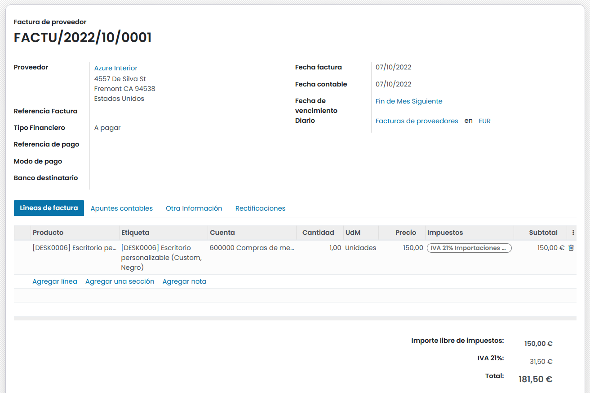
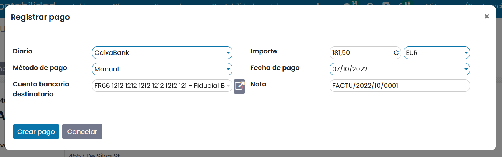
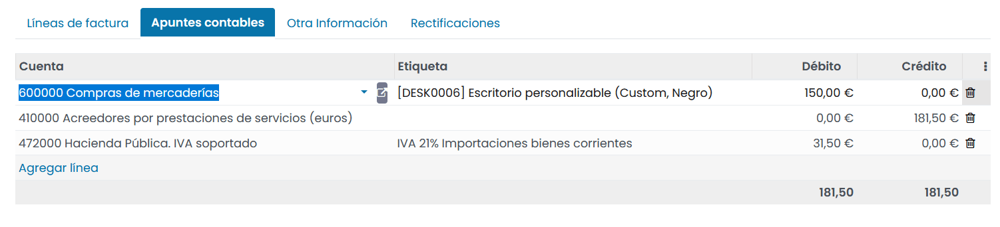

===================
Recibos de compra
===================
Los **recibos de compra** no son facturas, sino confirmaciones de pagos recibidos, como un tique, boleto o recibo.
Esta funcionalidad tiene como objetivo realizar un registro cuando pagas directamente con el dinero de tu empresa por un gasto.

Por otra parte, **Las facturas del proveedor** se registran cuando se te emite una factura y el importe se acredita
primero en una cuenta de deuda antes de realizar la conciliación del pago posterior.

.. note::
   Los gastos pagados por los empleados se pueden gestionar mediante la aplicación de **Gastos**, una aplicación dedicada
   a la aprobación de gastos y la gestión de sus pagos.

Registrar un recibo
======================
Para registrar un nuevo recibo, navega a :menuselection:`Contabilidad / Facturación --> Proveedores --> Facturas`
, y haz clic sobre el botón **Crear**.

Informa los detalles sobre el formulario de la factura, y haz clic en **Confirmar**.

Puedes registrar el pago haciendo clic sobre el botón **Registrar pago**, acción que muestra un formulario desde donde
introducir los detalles del pago. Valida el pago haciendo clic sobre el botón **Crear pago**.

Editar la entrada del diario antes de publicarla
==================================================

Una vez que has completado el registro de los productos adquiridos sobre la pestaña **Líneas de factura**,
puedes modificar la entrada del **diario** antes de confirmar la factura.

Para ello, haz clic en la pestaña Elementos del diario, cambia las cuentas y los valores de acuerdo con tus necesidades
y haz clic sobre el botón **Confirmar**.

