====================================
Pagar varias facturas a la vez
====================================
Daeris proporciona una forma simple y efectiva de gestionar varias facturas a la vez, con opciones simples o complejas.
Con un solo proceso, cualquiera puede gestionar facturas y pagos con tan solo unos pocos clics.

Pagar múltiples facturas con un pago
======================================

Crear una factura de proveedor
---------------------------------
En el siguiente ejemplo, vamos a generar varias facturas. Puedes controlar todo el proceso desde el tablero
de contabilidad.

Para crear una factura, accede a la tarjeta **Facturas de proveedores** , haz clic sobre el botón **⁝** y sobre
el apartado **Nuevo** haz clic sobre la opción **Factura**.

También puedes crear una nueva factura desde el menú :menuselection:`Contabilidad / Facturación --> Proveedores --> Facturas` y
haz clic sobre el botón **Crear**.

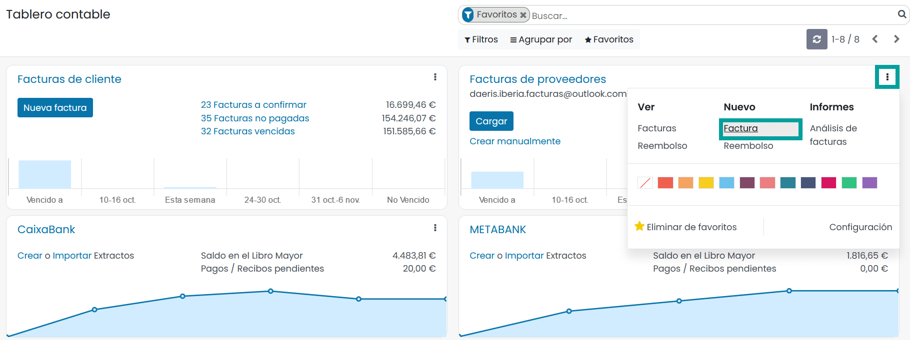

Sobre el formulario, informa los siguientes campos:

   - **Proveedor**: Selecciona el proveedor al que realizar el pago.
   - **Referencia Factura**: Número de factura que te ha facilitado tu proveedor, si dispones de el.
   - **Referencia de pago**: Referencia de pago a incluir en los apuntes del diario.
   - **Modo de pago**: Modo de pago para realizar el pago de la factura.
   - **Banco destinatario**: Número de cuenta del proveedor.
   - **Completar automáticamente**: A informar si la factura proviene de un pedido de compra previo, o quieres *copiar* los datos de una factura anterior.
   - **Fecha factura**: Fecha en la que se emite la factura.
   - **Fecha contable**: Fecha establecida en la contabilidad.
   - **Fecha de vencimiento / Términos de pago**: Fecha en la que vence el pago de la factura. Al borrar el contenido de esta fecha, puedes incorporar los términos de pago.

Sobre la pestaña **Líneas de factura**, incorpora los productos que contiene la factura, así como sus correspondientes importes
e impuestos.

Sobre el apartado de ficheros adjuntos, incorpora la factura que te debe haber facilitado tu proveedor.

Por último, haz clic sobre el botón **Confirmar** para que la factura quede publicada.

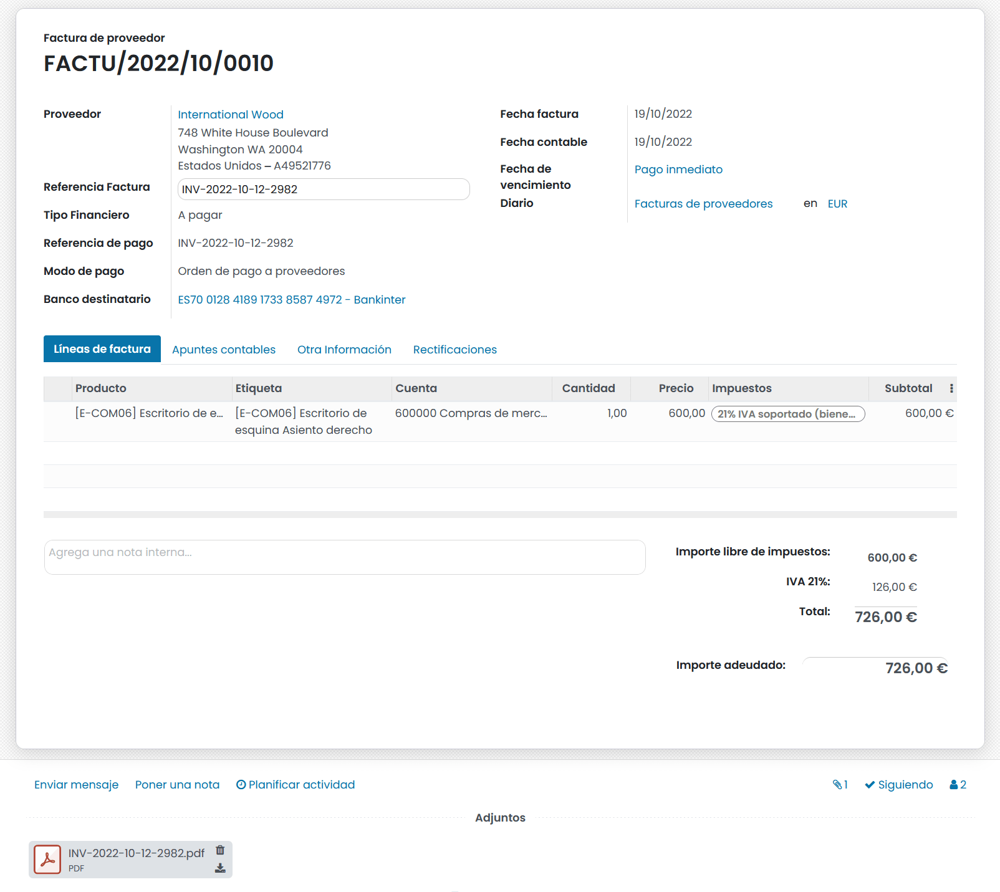

Pagar una factura de proveedor
--------------------------------

Para realizar el pago de la factura, haz clic sobre el botón **Registrar pago** e informa los siguientes campos sobre el formulario:

   - **Diario**: Cuenta sobre la que se asociará el pago de la factura.
   - **Método de pago**: Método de pago, de los posibles métodos disponibles sobre el diario.
   - **Cuenta bancaria**: Número de cuenta bancaría del proveedor.
   - **Agrupar pagos**: Permite agrupar todas las facturas del mismo proveedor en un solo pago.
   - **Importe**: Importe total de la factura.
   - **Fecha de pago**: fecha en la que se realiza el pago.
   - **Nota**: Se suele usar para incorporar el número de factura del proveedor.

Por último, haz clic sobre el botón **Crear pago**.

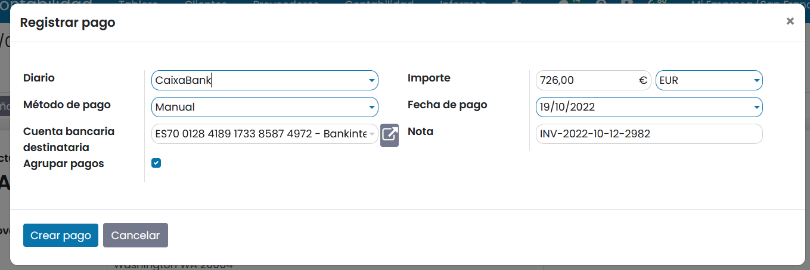

La factura cambia de estado a **Pagada** y se genera un movimiento desde la cuenta de pago conciliado con la transacción del gasto.

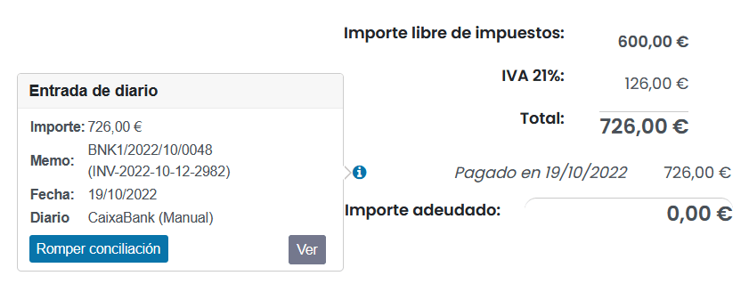

Sobre la tarjeta del diario del tablero, aparecerá un nuevo pago pendiente de conciliar con el extracto bancario.

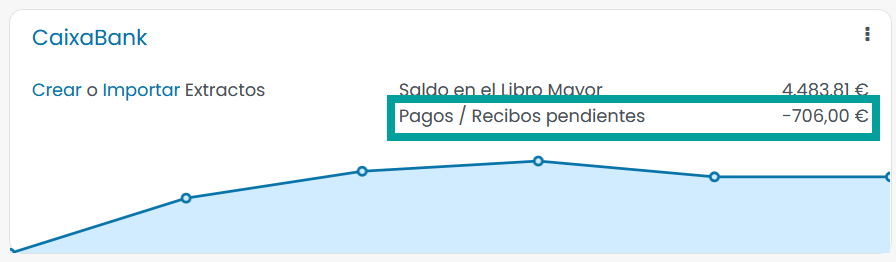

.. seealso::
   * :doc:`../../../../finanzas/contabilidad/banco_efectivo/conciliacion/proceso`

Pagar varias facturas de proveedor de forma agrupada
------------------------------------------------------

Para realizar el siguiente ejemplo, crea y **confirma** por lo menos 2 facturas siguiendo los pasos del ejemplo anterior.
**Asegúrate de que todas las facturas pertenecen al mismo proveedor**.

A continuación, navega a :menuselection:`Contabilidad / Facturación --> Proveedores --> Facturas`
y **selecciona** las facturas recién creadas. Posteriormente, haz clic sobre el botón **Registrar pago**.

Informa inicialmente la opción **Agrupar pagos**, para que el formulario muestre todos los campos disponibles,
y acaba de completar la información sobre el pago.

Como puedes comprobar, el sistema calcula automáticamente el importe total de todas las facturas.

Por último, haz clic sobre el botón **Crear pago**.

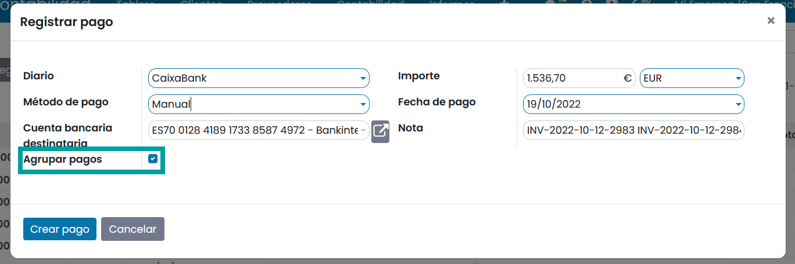

El sistema, crea y publica un pago a proveedor con los datos indicados en el formulario. La aplicación navega
automáticamente al formulario de detalle del pago recién creado.

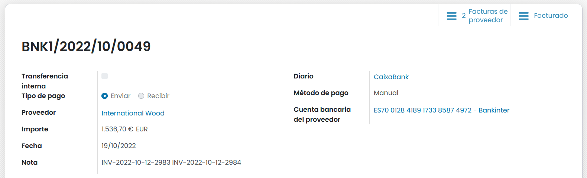

Las facturas cambian de estado a **Pagada** y se genera un movimiento desde la cuenta de pago conciliado con la transacción del gasto.

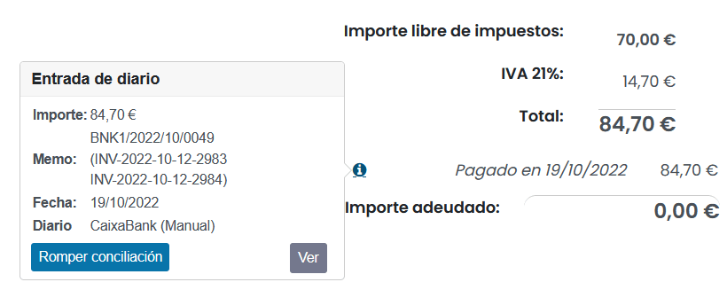

Sobre la tarjeta del diario del tablero, aparecerán nuevos pagos pendientes de conciliar con el extracto bancario.

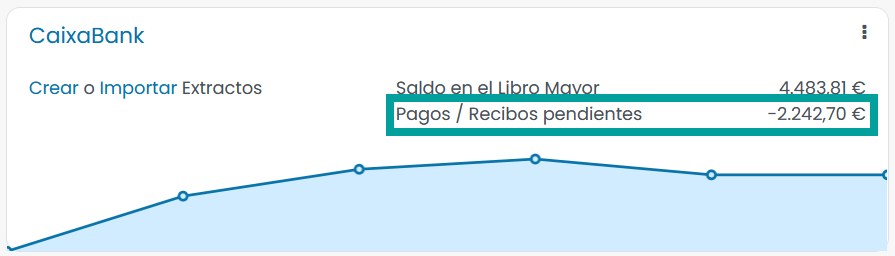

.. seealso::
   * :doc:`../../../../finanzas/contabilidad/banco_efectivo/conciliacion/proceso`

Pagos parciales de varias facturas de proveedor
=================================================

¿Cómo pagar varias facturas de proveedor a la vez teniendo descuentos por pronto pago?
------------------------------------------------------------------------------------------

A continuación, realizaremos un ejemplo donde haremos pagos con importes menores a los que se
indican las facturas, debido a que incluyen descuentos por pronto pago.

En el ejemplo, las facturas dispondrán de un termino de pago que permite reducir el importe a pagar
en un 5% si pagamos antes de 7 días.

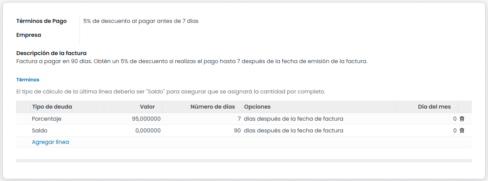

Como el objetivo final es conciliar un extracto bancario con las facturas con pronto pago, creamos un modelo de
extracto para descuentos por pronto pago.

Para ello, navegamos a :menuselection:`Contabilidad / Facturación --> Configuración --> Modelos de conciliación`
y hacemos clic sobre el botón **Crear**.

Sobre el formulario informamos los siguientes campos:

   - **Nombre**: Descuento 5% Pronto pago
   - **Tipo**: Botón para generar entrada de contraparte

Sobre la pestaña **Condiciones de las transacciones bancarias** informamos:

   - **Diarios disponibles**: Nuestro diario bancario

Sobre la pestaña **Entradas de contraparte** creamos un registro e informamos:

   - **Cuenta**: La que corresponda.
   - **Tipo de importe**: Porcentaje sobre el saldo
   - **Importe**: 100
   - **Etiqueta de apunte contable**: Descuentos por pronto pago

Hacemos clic sobre el botón **Guardar**.

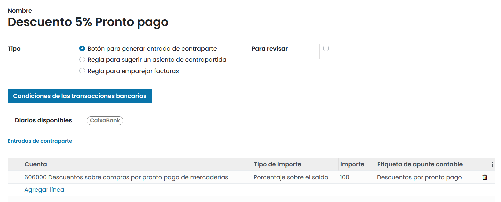

Posteriormente, creamos y confirmamos varias facturas, incorporándoles el termino de pago indicado.

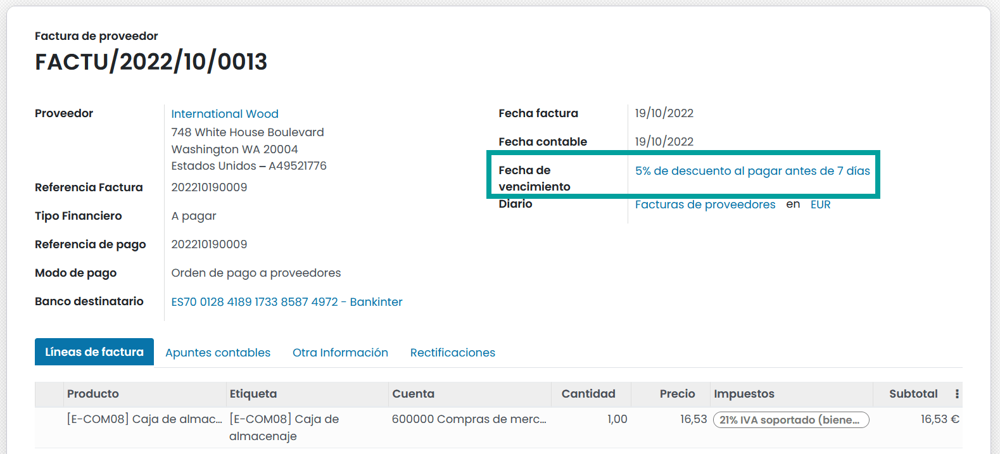

Las 3 facturas están confirmadas y pendientes de pago.

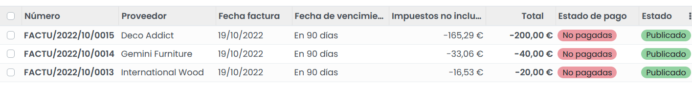

Sobre la pestaña **Apuntes contables** cada factura, dispone de dos apuntes de crédito. Uno con el importe total
a pagar con el descuento por pronto pago y con fecha de vencimiento, la calculada por el pronto pago y otro con el
importe restante.

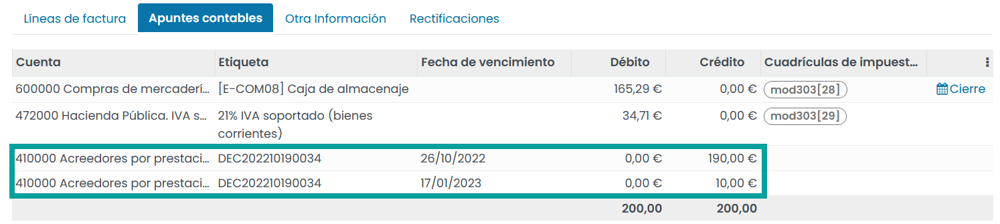

Para pagar las facturas, calculamos el descuento por pronto pago del 5% de cada una de ellas y hacemos la transacción
correspondiente desde nuestra cuenta bancaría en línea.

.. list-table:: Importes por pronto pago
   :widths: 50 35 15
   :header-rows: 1

   * - Factura
     - Calculo
     - Importe
   * - FACTU/2022/10/0013
     - 20€ - 1€ (5% de 20€)
     - **19€**
   * - FACTU/2022/10/0014
     - 40€ - 3€ (5% de 20€)
     - **38€**
   * - FACTU/2022/10/0015
     - 200€ - 10€ (5% de 200€)
     - **190€**
   * -
     - *TOTAL*
     - **247€**

Una vez realizada la transacción, importamos o creamos manualmente el extracto bancario y lo publicamos.

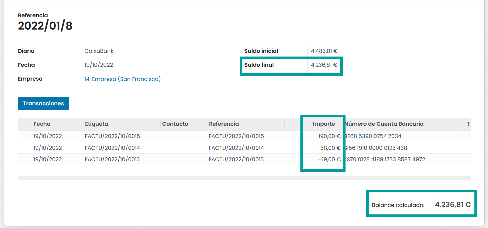

Hacemos clic sobre el botón **Conciliar** para iniciar el asistente de conciliación y sobre la primera entrada
buscamos por cliente, referencia de factura..

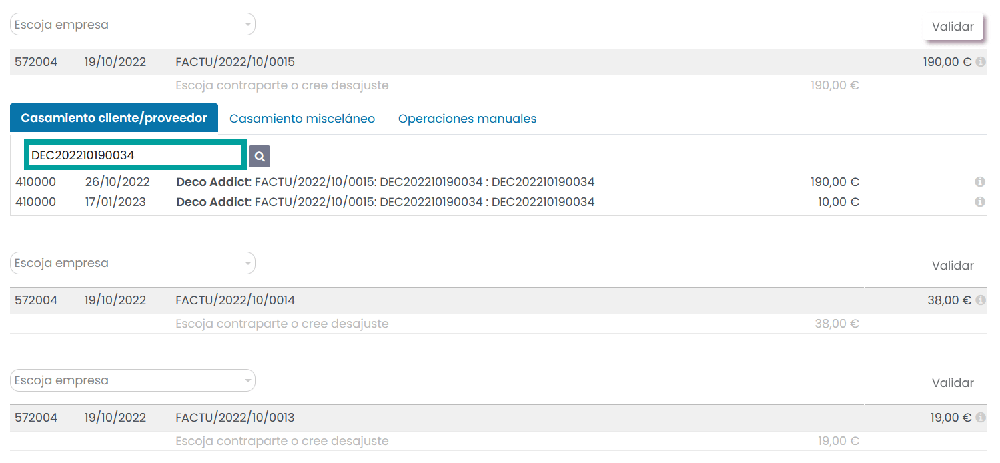

Hacemos clic sobre las dos líneas que se corresponden con el 95% del importe de la factura y el 5% de la factura.

Para cuadrar el desajuste, hacemos clic sobre la pestaña **Operaciones manuales** y volvemos a hacer clic sobre
el botón **%Descuento 5% por pronto pago**.

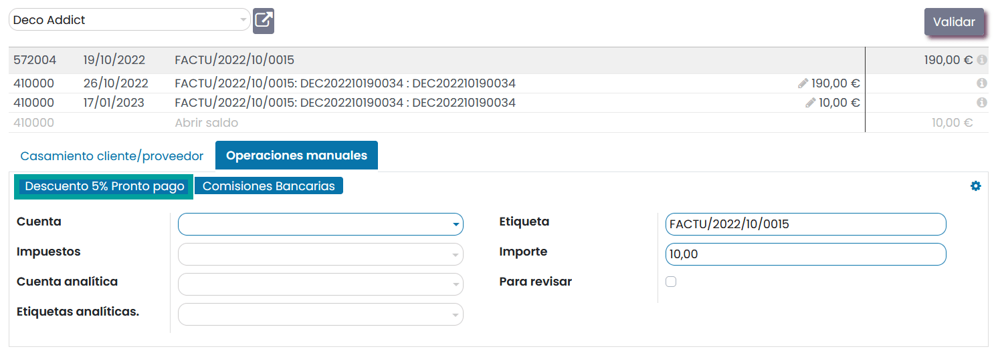

Una vez realizados los ajustes hacemos clic sobre el botón **Validar**

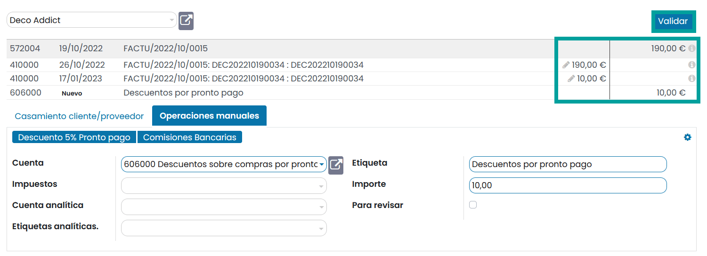

Repetimos el procedimiento para el resto de líneas a conciliar hasta completar la conciliación.

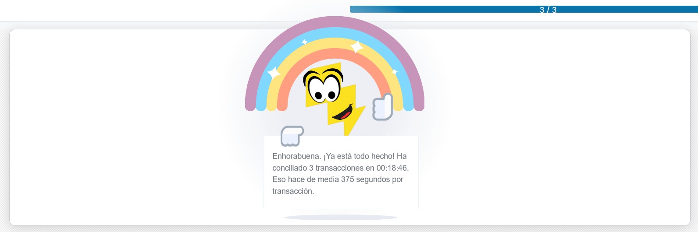

Cada factura queda pagada, y dispone de dos apuntes asociados.

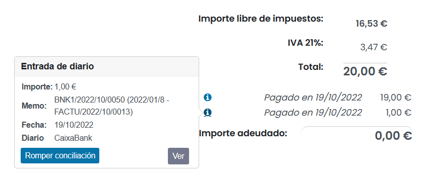

Cada apunte esta asociada a la cuenta contable que le corresponde.

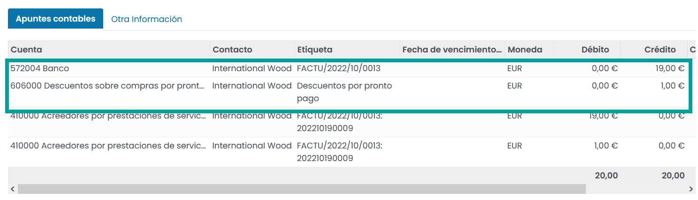