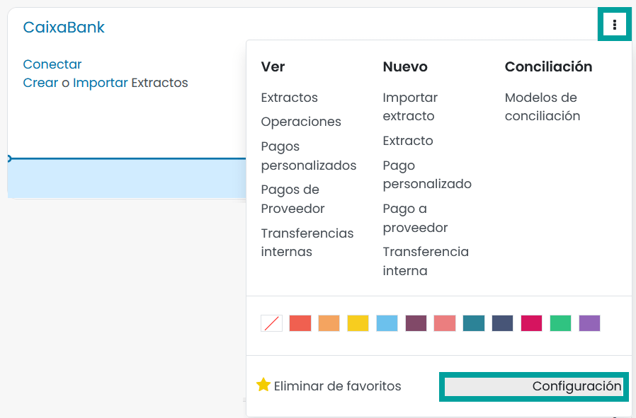
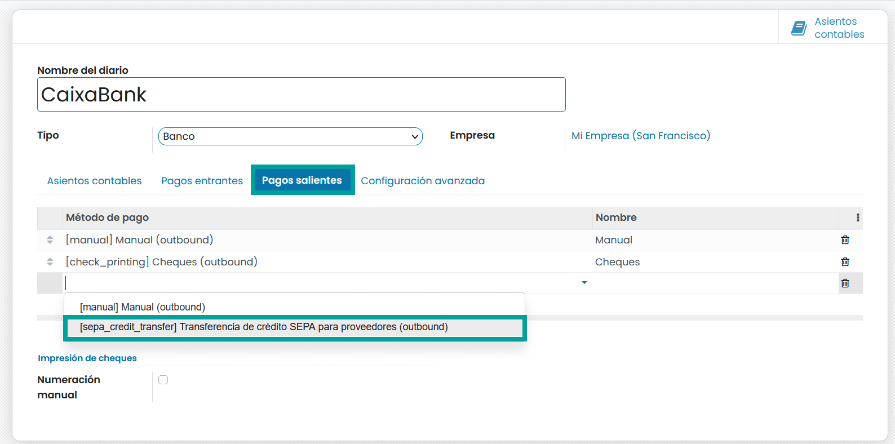
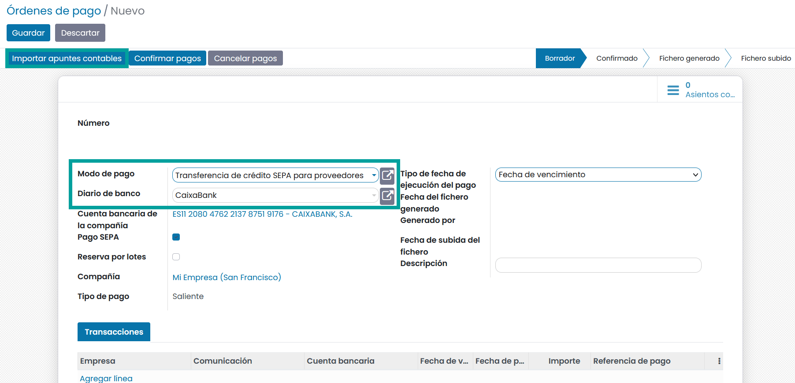
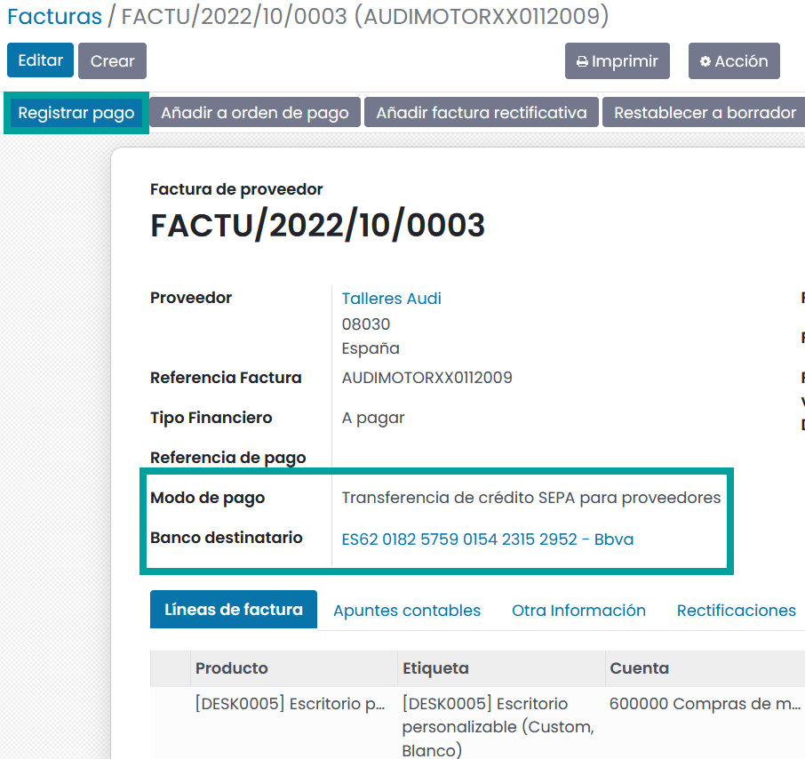
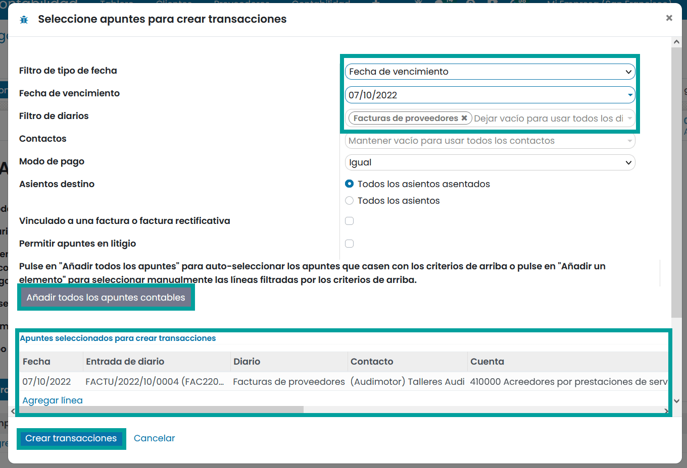
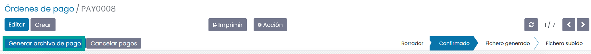
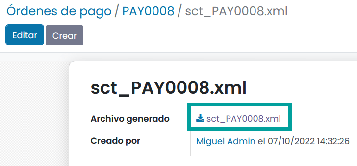

================
Pagar con SEPA
================

SEPA, la Zona Única de Pagos en euros, es una iniciativa de integración de pagos de la Unión Europea para la
simplificación de las transferencias bancarias en EUROS. SEPA te permite enviar órdenes de pago a tu banco para
automatizar la transferencia bancaria.

Sepa cuenta con el apoyo de los bancos de los 28 estados miembros de la UE, así como de Islandia, Noruega, Suiza,
Andorra, Mónaco y San Marino.

En Daeris, una vez que decidas pagar a un proveedor, puedes seleccionar pagar la factura con SEPA. Al final del día,
un empleado responsable puede generar el archivo SEPA que contiene todas las transferencias bancarias y enviarlas al banco.

De forma predeterminada, el archivo sigue las especificaciones de transferencia de crédito SEPA **pain.001.001.03**.
Este es un estándar bien definido que genera mayor consenso entre los bancos.

Según el país establecido en tu empresa, se puede utilizar otro formato: 'pain.001.001.03.ch.02' para Suiza y 'pain.001.003.03' para Alemania.

.. note::
   Una vez que tu banco procesa los pagos, puedes importar directamente el extracto de tu cuenta en Daeris. El proceso de conciliación bancaria coincidirá perfectamente con las órdenes SEPA que has enviado a tu banco con los extractos bancarios reales.

Configuración
==============

.. _finanzas/contabilidad/cuentas_pagar/pagos_proveedores/sepa/activar_sepa:

Activar métodos de pago SEPA sobre los diarios bancarios
----------------------------------------------------------

Para permitir pagos por SEPA, debes activar el método de pago en los diarios bancarios relacionados.

Para ello, navega a :menuselection:`Contabilidad / Facturación --> Tablero`, haz clic sobre el botón **⁝** de la tarjeta de
tu cuenta bancaria y selecciona la opción **Configuración**.

Posteriormente, haz clic sobre la pestaña **Pagos salientes** y agrega una nueva línea, seleccionando como método de
pago **Transferencia de crédito SEPA para proveedores**.
Recuerda, hacer clic sobre el botón **Guardar**, para que tus cambios queden registrados.

.. caution::
   Asegúrate de especificar sobre el diario bancario el **número de cuenta** con el número de cuenta IBAN (el número de cuenta nacional no funciona con SEPA) y el BIC (código de identificación bancaria).

   .. image:: sepa/sepa03.png
      :align: center
      :alt: Activar métodos de pago SEPA sobre los diarios bancarios

.. note::
   De forma predeterminada, los pagos que envíes utilizando SEPA, usarán el nombre de tu compañía como nombre de la
   parte iniciadora. Esto es lo que aparece en el extracto bancario del destinatario en el campo pago desde.

   Recuerda, que puedes ajustar los detalles de los datos de tu empresa. Para ello navega a :menuselection:`Ajustes --> Usuarios y compañías --> Compañías`.

   .. image:: sepa/sepa04.png
      :align: center
      :alt: Activar métodos de pago SEPA sobre los diarios bancarios

.. _finanzas/contabilidad/cuentas_pagar/pagos_proveedores/sepa/pagar_sepa:

Pagar con SEPA
===============

Configuración
----------------------

Si aún no has configurado el modo de pago **Transferencia de crédito SEPA para proveedores**,
navega a :menuselection:`Contabilidad / Facturación --> Configuración --> (Administración) Modos de pago` y
haz clic sobre el botón **Crear**.

Selecciona el método de pago **Transferencia de crédito SEPA para proveedores**, *Si dispones de varios métodos de pago
con distintas versiones de PAIN, selecciona el que se adecue a este modo de pago*.

Informa el Identificador del iniciador de la transacción el Emisor de la transacción y el Identificador de acreedor
SEPA,asi como el diario de tu banco.
Por último haz clic sobre el botón **Guardar**.

Registra tus facturas de proveedor
------------------------------------

Para pareparar el pago de tus facturas por SEPA , estas han de disponer como **modo de pago** el valor **Transferencia
de crédito SEPA para proveedores**, así como el IBAN de la **cuenta bancaria** sobre la que realizar el pago,
y el BIC. Daeris verifica de forma automática el formato IBAN.

Confirma la factura, mediante el botón **Confirmar**.

Generar archivos SEPA
----------------------

Los archivos XML con todas las instrucciones de pago SEPA , se pueden cargar en tu banco
en línea para procesar todos los pagos a la vez.

.. important::
   Por defecto, los archivos generados por Daeris siguen las especificaciones **SEPA pain.001.001.03**.

Para generar tu archivo XML sobre las transferencias de créditos pendientes, navega a
:menuselection:`Contabilidad / Facturación --> Proveedores --> Órdenes de pago`,
y haz clic sobre el botón **Crear**.

Sobre el formulario, informa los siguientes campos y haz clic sobre el botón **Guardar**:

   - **Modo de pago**: Transferencia de crédito SEPA para proveedores
   - **Diario del banco**: Seleciona el diario de tu banco.

Posteriormente, haz clic sobre el botón **Importar apuntes contables** y sobre el formulario informa los siguientes campos:

   - **Filtro de tipo de fecha**: Fecha de vencimiento
   - **Fecha de vencimiento**: La fecha hasta la que deseas buscar facturas vencidas
   - **Filtro de diarios**: El diario sobre el que buscar.

.. note::
   Este es un ejemplo de patrón de busqueda, pero puedes adaptarlo a tus necesidades.

Una vez informados los campos haz clic sobre el botón **Añadir todos los apuntes contables**. Mediante esta
acción, se informarán sobre el listado inferior, todos los apuntes coincidentes.

Una vez dispongas de los apuntes contables, haz clic sobre el botón **Crear transacciones**.

Una vez dispones de las transacciones sobre tu orden de pago, haz clic sobre el botón **Confirmar pagos**.

Tras confirmar los pagos, debes hacer clic sobre el botón **Generar archivo de pago**.

Por último, descarga el archivo XML e impórtalo sobre la interfaz de tu banca en línea para procesar los pagos.

Solución de problemas
=======================

El banco rechaza mi archivo SEPA
-----------------------------------

Si tu entidad bancaria rechaza tu archivo sepa, consúltale si es compatible con la **especificación de transferencia
de crédito SEPA** (la versión sepa pain depende del país establecido en su empresa).

Error: No hay ningún código de identificación bancaria registrado para la cuenta bancaria...
------------------------------------------------------------------------------------------------

Para enviar un pago SEPA, el destinatario debe estar identificado por un **IBAN** y **BIC** válidos.
Si te aparece el mensaje;

*No hay ningún código de identificación bancaria registrado para la cuenta bancaria*

probablemente no has registrado una cuenta IBAN para el proveedor al que estás pagando, o has olvidado completar el
campo BIC.

.. note::
   Recuerda, que, sobre el formulario de detalle de la factura de proveedor, debes informar el **Banco destinatario**.
   Mediante el botón desplegable puedes consultar el **IBAN** (Número de cuenta) y **BIC** (banco).

   .. image:: sepa/sepa09.png
      :align: center
      :alt:  No hay ningún código de identificación bancaria registrado para la cuenta bancaria

