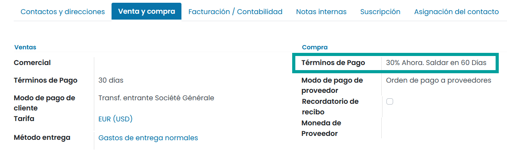
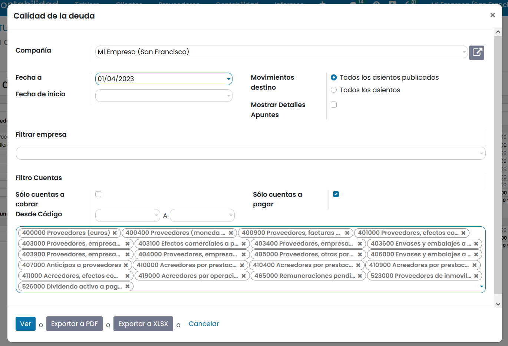
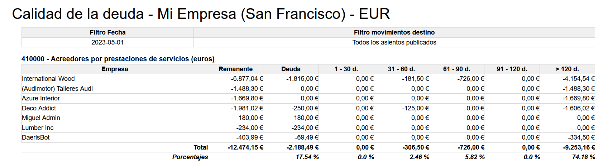
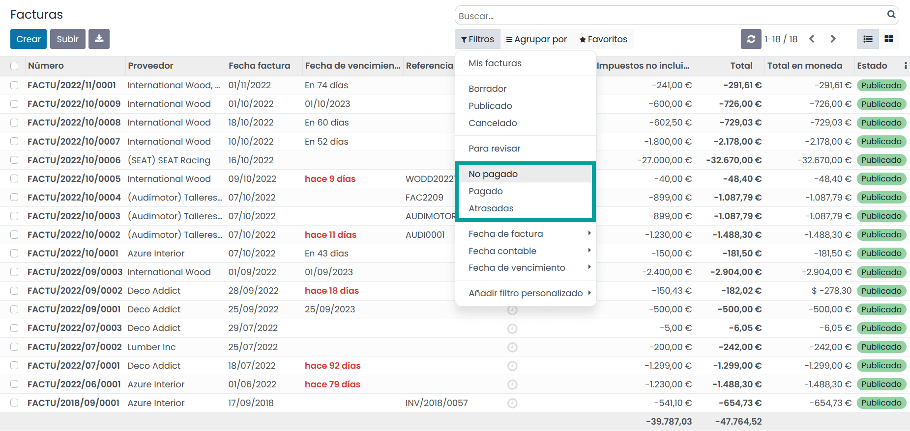
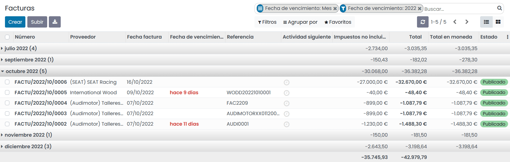

=============================================
Pronóstico de las futuras facturas por pagar
=============================================

Cuando tienes cientos de facturas de proveedor al mes y cada una tiene términos de pago distintos, puede ser
difícil entender lo que tienes que pagar y cuándo. Pagar a tus proveedores muy pronto puede reducir tu disponibilidad de
efectivo y pagarles muy tarde puede incurrir en cargos adicionales.

Por suerte, Daeris te ofrece las herramientas adecuadas para gestionar de forma eficiente las órdenes de pago a los
proveedores.

Configuración: términos de pago
================================

Con el fin de realizar un seguimiento de las condiciones del proveedor, utilizamos los términos de pago.
Estos, permiten llevar un seguimiento de las condiciones para calcular la fecha de vencimiento de una factura.

Como ejemplo, un término de pago puede ser:

   - 50% dentro de 30 días
   - 50% dentro de 45 días

Para crear los términos de pago más frecuentes, navega a :menuselection:`Contabilidad / Facturación --> Configuración --> Términos de pago`.

.. example::
   El siguiente ejemplo muestra un término de pago del 30% inicial y el importe restante después de 60 días.

   .. image:: pronostico/terminos01.png
      :align: center
      :alt: Término de pagos

Una vez definidos los términos de pago, puedes asignarlos a tu proveedor de forma predeterminada.
Para ello, informa el campo **Términos de pago** del apartado **Compra** de la pestaña **Venta y compra** del formulario
de detalle de proveedor.

De esta forma, cada vez que realices una compra este proveedor, Daeris incorporará automáticamente el término de pago
establecido.

.. tip::
   Aunque no establezcas un término de pago específico para un proveedor, es posible informarlo sobre la factura del proveedor.

Pronóstico de las facturas por pagar mediante el informe de calidad de la deuda
====================================================================================

Utiliza el informe de calidad de la deuda para llevar el seguimiento de los importes por pagar a los proveedores.
Puede obtenerlo haciendo clic sobre :menuselection:`Contabilidad / Facturación --> Informes --> Calidad de la deuda`.

Mediante la configuración del informe puedes extraer los importes pendientes de pago informando el campo
*Sólo cuentas a pagar*.
Además, puedes seleccionar una fecha límite para recuperar información mediante el campo *Fecha a*.

Este informe te proporciona un resumen de los importes por pagar ordenado por proveedor, los compara con su fecha
de vencimiento (la fecha se calcula en cada factura mediante el término de pago).

Gracias a este informe puedes ver la cantidad que tendrás que pagar en los siguientes meses.

Seleccionar facturas por pagar
================================
Puedes obtener la lista de facturas de proveedores haciendo clic sobre :menuselection:`Contabilidad / Facturación --> Proveedores --> Facturas`.

Desde el listado puedes filtrar por todas las facturas pendientes de pago, atrasadas (te has retrasado en el pago) y pagadas.

Desde esta pantalla, también puedes agrupar por **Fecha de vencimiento**. De este modo, obtendrás el importe total a pagar
por mes.

