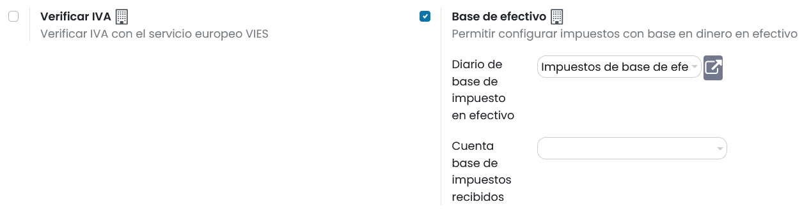
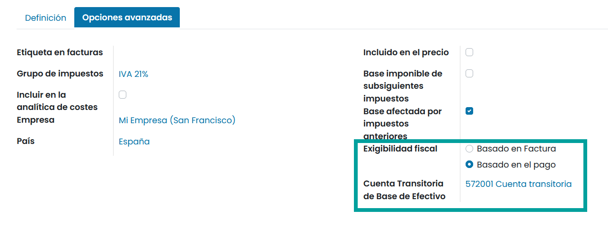

==============================================================
Gestionar impuestos de base de efectivo (criterio de caja)
==============================================================

Los impuestos de base de efectivo o  criterio de caja ,se diferencian de los impuestos corrientes en que se pagan cuando se ha realizado
el pago de la factura y no en la validación de la misma.

Declarar tus ingresos y gastos a la administración usando el método de base de efectivo es legal en algunos países
y bajo ciertas circunstancias.

Por ejemplo:
Vendes un producto el segundo trimestre de tu año fiscal, y recibes el pago el tercer trimestre. Si seguimos el método
de base de efectivo, el impuesto que tienes que pagar a la administración, es el que corresponde al tercer trimestre.

Configuración
=================

Para configurar los impuestos de base de efectivo navega a Contabilidad ‣ Configuración ‣ Ajustes
y sobre e apartado **Impuestos** informa el campo **Base de efectivo**.

Al realizar esta acción se solicita informar el **Diario de impuestos de base de efectivo**, proponiéndote por defecto
el uso del diario **Impuestos de base de efectivo**.

Además, es posible informar el campo **Cuenta base de impuestos recibidos**. Si se informa, dicha cuenta se
establecerá en las lineas de asisentos contables en el diario con base en efectivo y que se utilizará para llevar
un seguimiento del importe del impuesto base imponible.

Por último haz clic sobre el botón **Guardar**.

Posteriormente, debes configurar tus impuestos. Para ello, navega a Contabilidad ‣ Configuración ‣ Impuestos, y haz
clic sobre el impuesto que desees configurar.

Sobre la pestaña **Opciones avanzadas**, debes informar el campo **Exigibilidad fiscal** a **Basado en el pago**.

Posteriormente, debes informar el campo **Cuenta Transitoria de Base de Efectivo**.

Aplicación de los impuestos de base de efectivo en el sistema contable
=====================================================================================

*Por ejemplo:* realizas una venta de 100€ con un 15% de impuesto sobre la base de transacciones en efectivo. Al validar la factura del cliente, se crea la siguiente entrada en la contabilidad:

.. list-table:: *Diario de facturas del cliente*
   :widths: 50 50
   :header-rows: 1

   * - Debe
     - Haber
   * - Cuentas por cobrar 115€
     -
   * -
     - Cuenta fiscal temporal 15€
   * -
     - Cuenta de ingresos 100€

Unos días después, recibes el pago:

.. list-table:: *Diario del banco*
   :widths: 50 50
   :header-rows: 1

   * - Debe
     - Haber
   * - Banco 115€
     -
   * -
     - Cuentas por cobrar 115€

Al reconciliar la factura y el pago, se genera la siguiente entrada:

.. list-table:: *Diario de base de impuesto en efectivo*
   :widths: 50 50
   :header-rows: 1

   * - Debe
     - Haber
   * - Cuenta fiscal temporal 15€
     -
   * -
     - Cuenta de impuestos recibidos 15€
   * - Cuenta de ingresos 100€
     -
   * -
     - Cuenta de ingresos 100€

.. tip::
   Los últimos dos apuntes de diario son neutrales, pero son necesarios para asegurar que los informes de impuestos estén correctos en Daeris con las cantidades exactas de impuestos base. Aconsejamos utilizar una cuenta de ingresos predeterminada. El balance de esta cuenta siempre será cero.
