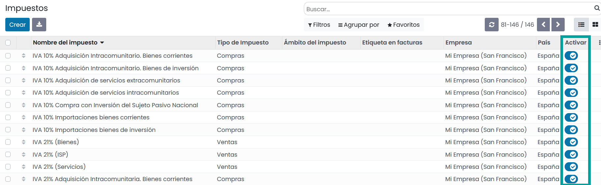
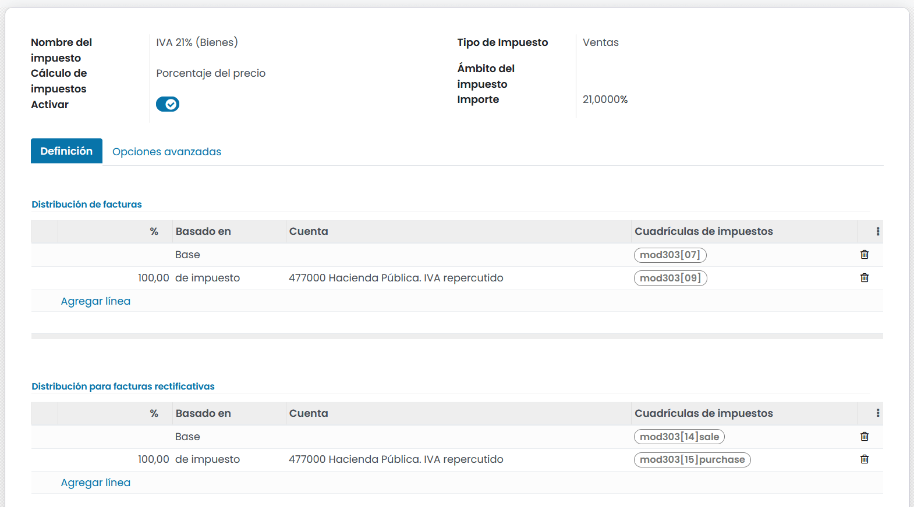

===========
Impuestos
===========

Existen varios tipos de impuestos y en función de la localización de tu empresa es requerido el uso de unos u otros.
Daeris permite diferentes formas de usar y calcular los impuestos para adecuarse a las necesidades de cada empresa.

Activar impuestos
==================

Daeris dispone de varios impuestos preconfigurados, pero no todos pueden estar activos de forma predeterminada. En función de tu
modelo de negocio, debes activar los impuestos que vayas a utilizar.

Para **activar los impuestos**, navega a :menuselection:`Contabilidad --> Configuración --> Impuestos`
y mediante el botón **Activar**, habilita o deshabilita el uso del impuesto.

Desde esta misma pantalla, es posible crear impuestos de varios tipos, como, por ejemplo:

   - Impuestos sobre el Valor añadido (IVA)
   - Impuestos ecológicos
   - Impuestos estatales
   - Impuestos municipales
   - Retenciones fiscales

Gestionar impuestos
====================

Para crear o editar impuestos, navega a :menuselection:`Contabilidad --> Configuración --> Impuestos` y haz clic sobre
el botón **crear** en el caso de que desees crear un nuevo impuesto, o haz clic sobre el impuesto que desees editar.

Al crear o editar un impuesto, el sistema navega al formulario de detalle, donde puedes encontrar los siguientes campos:

   - **Nombre del impuesto**: Nombre descriptivo del impuesto que visualizarán los usuarios de Daeris mientras gestionan pedidos de venta, facturas, productos, ect...
   - **Tipo de impuesto**: Identifica la aplicación del impuesto y limita su visualización. Dispone de las siguientes opciones:
      - **Ventas**: Facturas de clientes, impuestos de productos de clientes, etc.
      - **Compra**: Facturas de proveedores, impuestos de proveedores de productos, etc.
      - **Ninguno**

      .. tip::
         Es posible utlizar el valor **Ninguno** sobre aquellos inpuestos que desees incluir en un Grupo de Impuestos pero que no desees incluir en la lista junto con otros impuestos de Ventas o Compras.

   - **Cálculo de impuestos**: Permite seleccionar entre las siguientes opciones:

      - **Grupo de impuestos**: Permite seleccionar varios impuestos ya definidos que se aplicarán como un único impuesto. Asegúrate de que la secuencia de impuestos es correcta, ya que el orden establecido puede afectar al cálculo de los importes de los impuestos, si uno de los impuestos afecta a la base de los siguientes.
      - **Fijo**: Permite incorporar un valor único en la moneda predeterminada. El valor del importe siempre es el mismo, independientemente del precio de la venta.
      - **Porcentaje sobre el precio**: Se incorpora un valor numérico que equivale al porcentaje sobre el precio del producto sin aplicar impuestos.
      - **Porcentaje sobre el precio impuestos incluidos**: Se incorpora un valor numérico que equivale al porcentaje sobre el precio del producto aplicando impuestos.

   - **Ámbito del impuesto**: Permite restringir los impuestos a un determinado tipo de producto. Dispone de las siguientes opciones:
      - Bienes
      - Servicios

   - **Activar**: Informado, permite incorporar el impuesto a los pedidos, facturas... No es posible eliminar los impuestos que ya se han utilizado pero puedes desactivarlos para evitar su uso.
   - **Importe**: Valor numérico que equivale a la cantidad o porcentaje.

Sobre la pestaña **definición** es posible asignar el importe de la base imponible o los porcentajes del impuesto calculado a múltiples cuentas y yablas de impuestos.

Se pueden crear líneas sobre facturas y facturas rectificativas. Cada línea dispone de la siguiente información:

   - **Basado en**:

      - **Base**: el precio en la línea de factura
      - **% de impuesto**: un porcentaje del impuesto calculado.

   - **Cuenta**: Si está definida, se registra un apunte adicional.
   - **Tablas de impuestos**: se utilizan para generar Reportes de impuestos automáticamente, de acuerdo con las reglas de su país.

Sobre la pestaña de **Opciones avanzadas**, es posible informar los siguientes campos:

   .. image:: impuestos/gestion02.png
      :align: center
      :alt: Gestionar impuestos.

   - **Etiqueta en facturas**: Texto corto que será impreso sobre la línea de factura en la columna Impuestos, además de ser visible sobre el portal del cliente y en la exportación de facturas.
   - **Grupo de impuestos**: Indica el grupo al que se asocia dentro de la factura, ya que sobre el pie de página de la factura se informan los impuestos agrupados.
   - **Incluir en la analítica de costes**: Si se informa, el importe calculado por este impuesto se asignará a la misma cuenta analítica de la línea de factura (si la hay).
   - **Empresa**: Empresa asociada al impuesto.
   - **País**; País al que aplica el impuesto.
   - **Incluir en el precio**:  Con esta opción activada, el total (con impuestos incluidos) es igual al Precio de venta.

   .. note::
      **Total = Precio de venta = Precio calculado sin impuestos incluidos + Impuesto.**

      Por ejemplo, un producto tiene un precio de venta de 1000€, y aplicamos un impuesto del 10% del precio, que está incluido en el precio. Entonces tenemos:

      .. list-table:: Incluir en el precio
         :widths: 25 25 25 25
         :header-rows: 1

         * - Precio de venta del producto
           - Precio sin impuestos
           - Impuesto
           - Total
         * - 1,000
           - 900.10
           - 90.9
           - 1,000.00

   - **Base imponible de subsiguientes impuestos**: Si se informa, los impuestos con una secuencia más alta que esta se verán afectados por ella, siempre que la acepten.
   - **Base afectada por impuestos anteriores**: Si se informa, los impuestos con una secuencia más baja podrían afectar a este, siempre que intenten hacerlo.

   .. warning::
      El orden en el que se añaden los impuestos en una línea de producto no tiene ningún efecto sobre el cálculo de los importes. Si añade los impuestos directamente en una línea de producto, solo la secuencia de impuestos determina el orden en que se aplican. Para reorganizar la secuencia, navega a :menuselection:`Contabilidad --> Configuración --> Impuestos`, y arrastra y suelta las líneas junto a los nombres de los impuestos.

Una vez informados los campos necesarios, pulsa el botón **Guardar**.