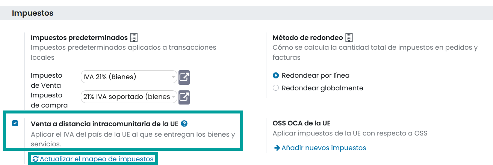
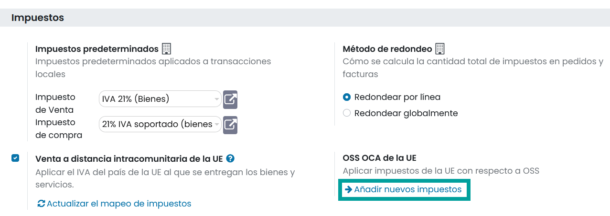
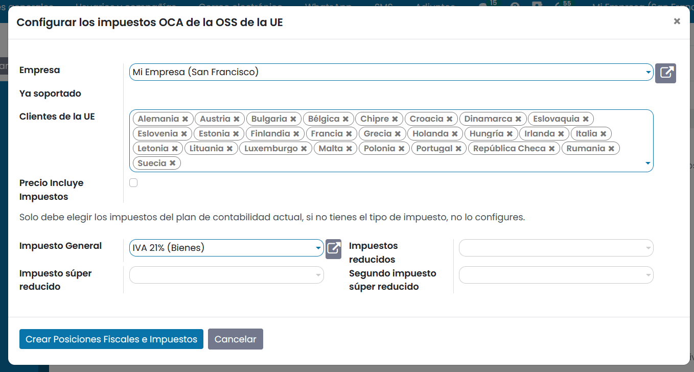
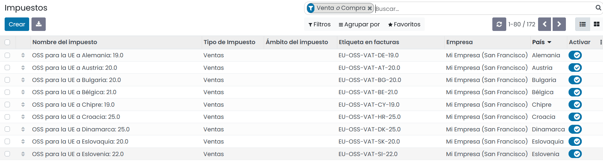
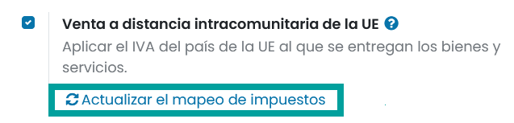
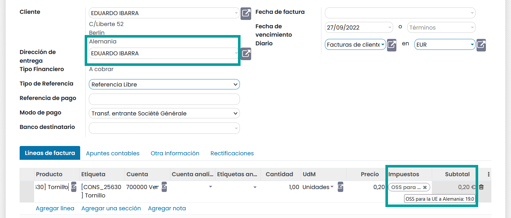

===============================================
Venta a distancia intracomunitaria (Europa)
===============================================

La **política de venta a distancia de la Unión Europea** indica que si se realizan ventas de bienes y servicios a
clientes **particulares** (B2C) en un Estado miembro de la UE, y el vendedor no se reúne cara a cara con el cliente
(ventas online, ventas por correo ,televenta…), el **IVA** de las ventas a distancia se paga al **Estado miembro en el
que se entregan los bienes o servicios** siempre que se supera un **umbral** determinado.

Se establece un umbral para empresarios establecidos en un único Estado miembro.

Si el importe de estas ventas, junto con el de los servicios prestados por vía electrónica, de telecomunicaciones y de radiodifusión y televisión realizados en la Comunidad Europea, supera los 10.000 euros en el año precedente o en curso.

**Por Ejemplo**:
   Si en 2022 tu empresa localizada en Colombia o España o EEUU ..., ha realizado ventas a distancia a consumidores finales de Portugal por 3.000 euros y de Francia por 8.000 euros, deberás repercutir el IVA del país de destino en todas tus ventas a distancia en la UE (dado que la suma de ambas cifras de ventas supera los 10.000 euros).

.. attention::
   Esta ley aplica a cualquier empresa, incluso aquellas que están ubicadas fuera de la Unión Europea.

En el caso de que debas declarar los impuestos a los países de la Unión Europea en los que has realizado las ventas,
dispones de dos alternativas:

   - *No recomendada*: Darte de alta en la administración tributaria de cada uno de los países a los que has vendido.
   - *Recomendada*: Darte de alta en el portal en línea de Ventanilla única (OSS) y declarar tus ventas intracomunitarias a distancia. Cada uno de los estados miembros de la UE cuenta con su portal de ventanilla única en línea.

.. seealso::
   `VAT One stop shop <https://vat-one-stop-shop.ec.europa.eu/index_en>`_

   `IVA Comercio electrónico <https://sede.agenciatributaria.gob.es/Sede/iva/iva-comercio-electronico/cuestiones-generales.html>`_

Daeris, dispone de la funcionalidad de **Venta intracomunitaria a distancia**, la cual ayuda a tu empresa a cumplir con esta
normativa, creando y configurando las **posiciones fiscales** e **impuestos**, en función del país de tu empresa.

Activación
============

Para activar la **venta intracomunitaria a distancia navega a :menuselection:`Contabilidad --> Ajustes --> Impuestos`.
Y sobre el apartado **Impuestos** marca el campo **Venta intracomunitaria a distancia de la UE** y haz clic sobre el botón **Guardar**.

Por último, haz clic sobre el enlace **Actualizar el mapeo de impuestos**.

Mediante esta acción, se crean automáticamente todos los impuestos y posiciones fiscales necesarios para cada estado
miembro de la Unión Europea, según el país de tu empresa.

.. caution::
   Es aconsejable revisar que el mapeo propuesto es el adecuado para los productos y servicios que vendes antes de utilizarlo.

Añadir impuestos de la Unión Europea - OSS
==============================================

Para incorporar nuevos impuestos que apliquen a países de la Unión Europea, navega a
:menuselection:`Contabilidad --> Ajustes --> Impuestos` y sobre el apartado **Impuestos** haz clic sobre el
enlace **Añadir nuevos impuestos**.

Sobre el formulario, informa los siguientes campos:

   - **Empresa**: La empresa (seleccionar una de tus empresas) sobre la que quieres que apliquen los impuestos.
   - **Clientes de la Unión Europea**: Selecciona todos los países de la Unión Europea sobre los que vayas a vender tus productos y/o servicios.
   - **Precio incluye impuestos**: Selecciona esta opción si deseas que estos impuestos estén configurados como **incluidos en el precio**.
   - **Impuesto general**, **Impuesto reducido**, **Impuesto superreducido**, **Segundo Impuesto superreducido**: Selecciónalos en base a tu plan contable.

.. warning::
   No configures aquellos impuestos que no existan en tu plan contable.

Una vez informado el formulario, haz clic sobre el botón **Crear posiciones fiscales e impuestos**.

Tus nuevos impuestos y posiciones fiscales se habrán creado en base a los parámetros establecidos.

Actualizar el mapeo de impuestos
=====================================

Cada vez que incorpores o modifiques **impuestos**, es recomendable **actualizar** tus posiciones fiscales.

Para ello navega a :menuselection:`Contabilidad --> Ajustes --> Impuestos` y  haz clic sobre el enlace **Actualizar el mapeo de impuestos**.

Aplicar impuestos de la Unión Europea - OSS
==============================================

Para aplicar los impuestos de un país de la UE de forma directa, el contacto debe disponer del campo
**Tipo de posición** igual a **Cliente final (B2C)** y su país, se debe corresponder con uno de los países de
la Unión Europea sobre los que has configurado los impuestos.

.. image:: intracomunitaria/venta_ue3.png
   :align: center
   :alt: Aplicar impuestos de la Unión Europea - OSS

Sobre el formulario de contacto, haz clic sobre el botón inteligente **Facturas**, y sobre el listado de facturas
del cliente, haz clic sobre el botón **Crear**.

Al incorporar un producto sobre las líneas de la factura, se aplicarán los impuestos que corresponden al país de
origen del cliente.

