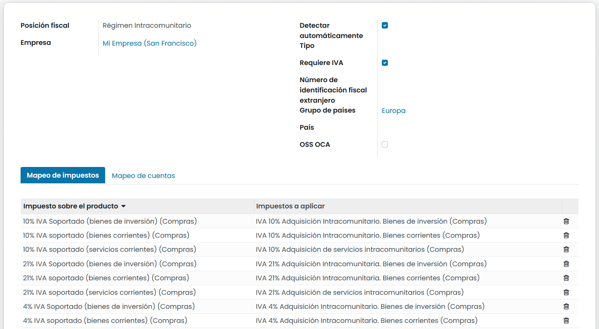

======================================================
Posiciones fiscales (mapeo de impuestos y cuentas)
======================================================

Los **impuestos** y **cuentas predeterminadas** se incorporan sobre los productos y los clientes para que sean asociados
a las transacciones automáticamente. Aún así, puede darse el caso de tener que utilizar impuestos diferentes y registrar
las transacciones en cuentas distintas, en función de las ubicaciones y tipos de negocio que tengan tus clientes y
proveedores.

Las **posiciones fiscales** permiten crear una serie de **reglas** que adaptan automáticamente los impuestos y las
cuentas utilizadas para realizar una transacción.

Las posiciones fiscales pueden aplicarse de las siguientes formas:

   - **Automáticamente** a partir de reglas
   - **Asignado a un contacto** de tipo empresa, sobre el formulario de contacto.
   - **Manualmente** sobre una transacción

.. note::
   En función de tu localización es posible que ya dispongas de varias posiciones fiscales preconfiguradas

Configuración
==============

Mapeo de impuestos y cuentas
------------------------------

Para crear o editar una **Posición Fiscal**, navega a :menuselection:`Contabilidad --> Configuración --> Posiciones Fiscales`,
y haz clic sobre el botón **Crear** en el caso de que desees crear una nueva posición, o haz clic sobre el registro que desees editar.

El mapeo de impuestos y cuentas se basa en los impuestos y cuentas predeterminados definidos en los formularios de los
productos.

   - Para mapear otro impuesto o cuenta, complete la columna de la derecha (**Impuesto a aplicar/Cuenta alterna**).
   - Para eliminar un impuesto, en lugar de sustituirlo por otro, deje vacío el campo I**mpuesto a aplicar**.
   - Para sustituir un impuesto por otro, añada varias líneas con el mismo **Impuesto sobre el producto**.

.. note::
   El mapeo solo funciona con impuestos activos con lo que asegurate de que estén activos yendo a  :menuselection:`Contabilidad --> Configuración --> Impuestos`.

Aplicación automática
----------------------

Puedes configurar tus posiciones fiscales para que se apliquen automáticamente, bajo una serie de condiciones.

Para ello, accede al detalle de la Posición fiscal que desea modificar e informa el campo **Detectar automáticamente**.
Esta acción permite configurar los siguientes campos:

   - **Tipo**: Permite indicar si se trata de un cliente final (B2C) o otra empresa (B2B)
   - **Requiere identificación fiscal**: Se debe indicar el número de identificación fiscal en el formulario de contacto del cliente.
   - **Grupo de países/País**: Países en los que se aplica la posición fiscal.

.. note::
   Los impuestos de los pedidos de **comercio electrónico** se actualizan automáticamente una vez que el visitante se conecte o complete sus datos de facturación.

.. important::
   La secuencia de las **Posiciones fiscales** (el orden en que están ordenadas) define qué posición fiscal se aplicará si las condiciones coinciden con varias posiciones fiscales.

   Por ejemplo, si la primera posición fiscal está dirigida al país A, y la segunda posición fiscal está dirigida a un grupo de países que también incluye al país A, solo se aplicará la primera posición fiscal a los clientes del país A.

Asignar una posición fiscal a un contacto
===========================================

Para informar la posición fiscal predeterminada de un contacto, navega a :menuselection:`Contactos --> Contactos`,
accede al detalle del contacto y sobre la pestaña **Ventas y Compras**, informa el campo **Posición fiscal**
y haz clic sobre el botón **Guardar**.

Seleccionar manualmente las posiciones fiscales en pedidos de venta y facturas.
================================================================================
Para seleccionar manualmente la posición fiscal que se utilizará en un pedido de venta o factura,
posicionate sobre la pestaña **Más información** y selecciona la posición fiscal correcta
**antes de añadir las líneas de producto**.

