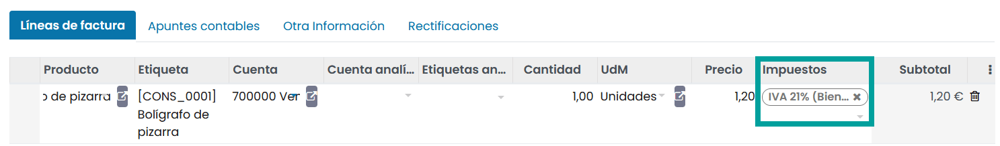
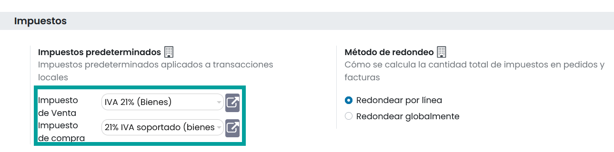

=============================
Impuestos predeterminados
=============================

Los Impuestos predeterminados se aplican automáticamente cuando no se define otro impuesto el cual aplicar. Por ejemplo,
en Daeris se informa el campo **impuestos** con los impuestos predeterminados cuando se crear un producto o se añade una
nueva línea a la factura.

.. important::
   Las **posiciones fiscales** son tomadas en cuenta para aplicar el impuesto predeterminado. Si se aplica una posición fiscal a una factura, Daeris aplica el impuesto relacionado con la posición fiscal en lugar del impuesto predeterminado.

.. _finanzas/contabilidad/impuestos/impuestos/predeterminados/configurar_impuestos:

Configuración
===============

Los Impuestos predeterminados se configuran automáticamente a partir del país seleccionado al contratar Daeris y
configurarla localización fiscal de tu empresa.

Para cambiar los Impuestos predeterminados, navega a
:menuselection:`Contabilidad --> Configuración --> Ajustes`, e informa sobre el apartado **Impuestos**
subapartado **Impuestos predeterminados**, los impuestos deseados sobre el campo **Impuesto de venta**
y el campo **Impuesto de compra**, y haz clic sobre el botón **Guardar**.

.. important::
   Entornos multiempresa: los valores de los Impuestos predeterminados son específicos para cada empresa.