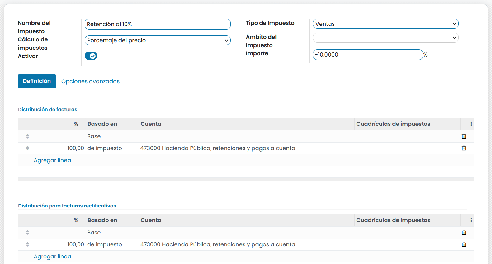
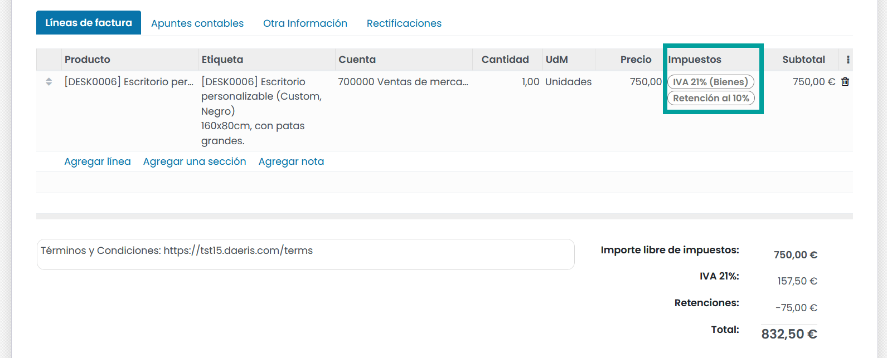
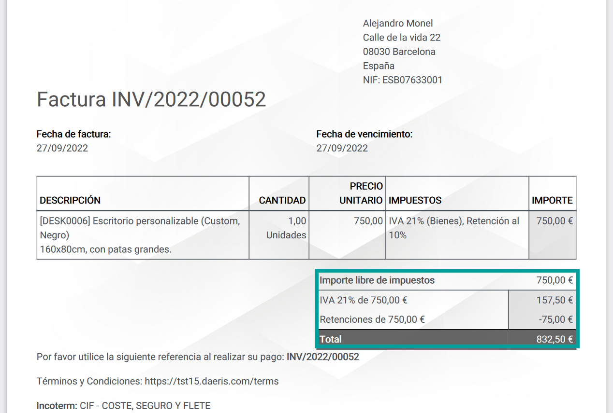

================================
Gestionar la retención fiscal
================================

La retención fiscal o impuesto de retención, es un requisito gubernamental para que el pagador de una factura
de un cliente retenga o deduzca impuestos del pago, y pague ese impuesto al gobierno. En la mayoría de las
jurisdicciones, esta retención se aplica a los ingresos laborales.

Los impuestos habituales se añaden al subtotal para obtener el total a pagar. En cambio, las retenciones se deducen
del importe a pagar, ya que el cliente pagará el impuesto.

Configuración
==============

En Daeris, las retenciones fiscales se definen generando impuestos negativos.

Para crear una retención fiscal navega a :menuselection:`Contabilidad --> Configuración --> Impuestos` y haz clic sobre
el botón **Crear**.

Sobre el formulario, informa los siguientes campos:

   - **Nombre del impuesto**: Nombre descriptivo de la retención que visualizarán los usuarios de Daeris mientras gestionan pedidos de venta, facturas, productos, ect...
   - **Tipo de impuesto**: Ventas o Compras
   - **Cálculo de impuestos**: Habitualmente,Porcentaje sobre el precio aunque varía en función de las necesidades de la retención.
   - **Ámbito del impuesto**: En función de las necesidades de la retención.
   - **Activar**: Informado
   - **Importe**: Valor numérico **- NEGATIVO** que equivale a la cantidad o porcentaje.

Sobre la pestaña **definición** crea dos líneas sobre facturas y facturas rectificativas:

.. list-table::Distribución de facturas
   :widths: 20 20 40 20
   :header-rows: 1
   * - Porcentaje
     - Basado en
     - Cuenta
     - Cuadridulas de impuestos
   * -
     - Base
     -
     -
   * - 100
     - de impuesto
     - **Ej** 473000 Hacienda Pública, retenciones y pagos a cuenta
     -

.. list-table::Distribución de facturas rectificativas
   :widths: 20 20 40 20
   :header-rows: 1
   * - Porcentaje
     - Basado en
     - Cuenta
     - Cuadridulas de impuestos
   * -
     - Base
     -
     -
   * - 100
     - de impuesto
     - **Ej** 473000 Hacienda Pública, retenciones y pagos a cuenta
     -

Sobre la pestaña de **Opciones avanzadas**, informa los siguientes campos:

   - **Etiqueta en facturas**: Texto corto que será impreso sobre la línea de factura en la columna Impuestos, además de ser visible sobre el portal del cliente y en la exportación de facturas.
   - **Grupo de impuestos**: **Retenciones**. Si no existe este grupo, Créalo.
   - **Empresa**: Empresa asociada al impuesto.
   - **País**; País al que aplica el impuesto.

   .. image:: retenciones/retencion03.png
      :align: center
      :alt: Gestionar la retención fiscal

   .. note::
      Si la retención es un porcentaje de un impuesto normal, crea un Impuesto con un **Cálculo de impuestos** como **Grupo de impuestos** y establece los dos impuestos en este grupo (impuesto normal y de retención).

Una vez informados los campos necesarios, pulsa el botón **Guardar**.

Aplicación de las retenciones fiscales sobre facturas
=========================================================

Una vez creada la retención fiscal como impuesto, es posible asociarlo a los contactos, a los pedidos de venta y a las
facturas.

Sobre cada línea de una factura, es posible incorporar varios impuestos.

Estos impuestos se visualizan sobre la factura.

Al imprimir y/o enviar la factura, se muestran los importes de los impuestos de cada grupo fiscal.

