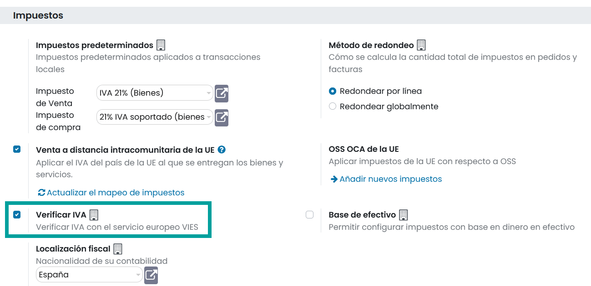
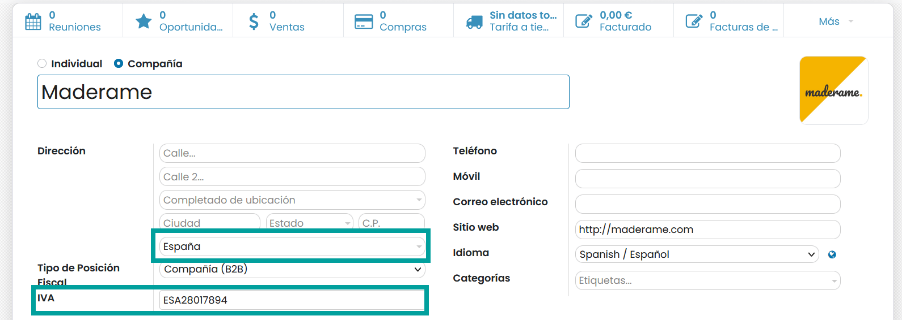
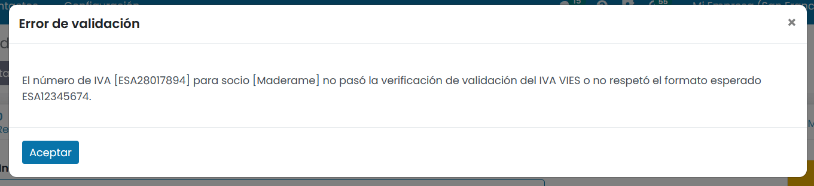

=====================================
Validación de números de IVA en VIES
=====================================

El **VIES** (Sistema de Intercambio de Información Sobre el IVA) es una herramienta facilitada por la Unión Europea
que permite comprobar la validez de los números de IVA de las empresas registradas en la Unión Europea.

Daeris dispone de una función para Verificar números de IVA o NIF intracomunitario, cada vez que se guarda un contacto. Mediante esta
funcionalidad, puedes asegurarte de que sus contactos te proporcionan un número de IVA válido.

.. error::
   Es aconsejable el uso de esta opción, **solo si se va a establecer relaciones con empresas registradas en el VIES en exclusiva**. Ten en cuenta que todos tus contactos deberán disponer de un número de IVA de la unión europea valido.

Para activar esta funcionalidad, navega a :menuselection:`Contabilidad --> Configuración --> Ajustes` y sobre
el apartado **Impuestos**, informa la opción **Verificar IVA** y haz clic sobre el botón **Guardar**.

Cada vez que crees o modifiques un contacto, asegúrate de completar los campos **País** e **IVA**.

Al hacer clic en el botón **Guardar**, se ejecuta una validación del número de IVA por VIES, y muestra un
mensaje de error si el número de IVA no es válido.

.. warning::
   Esta herramienta verifica la validez del número de IVA pero no comprueba la validez de los demás campos.

.. seealso::
   `VAT Validation <https://ec.europa.eu/taxation_customs/vies/#/vat-validation>`_
