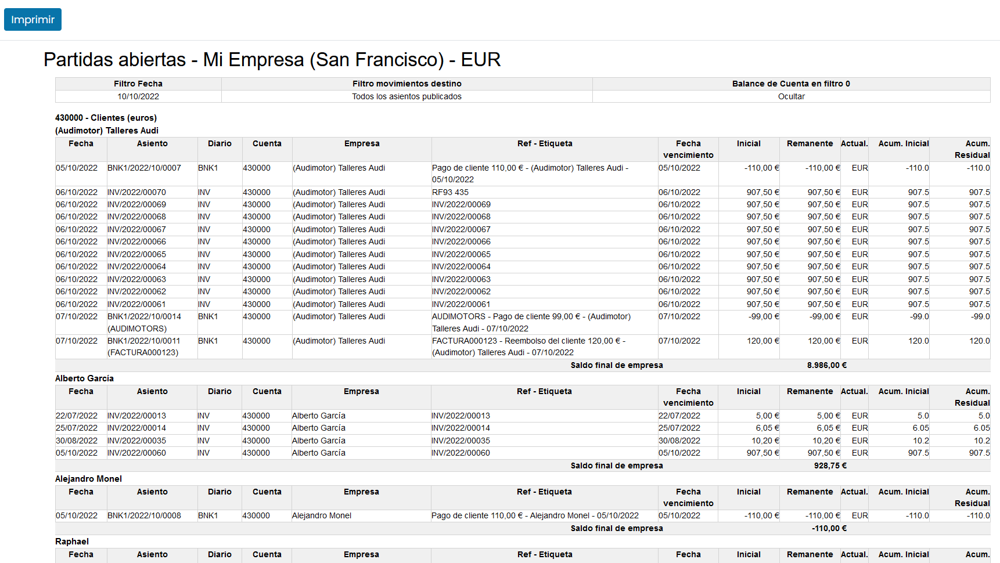

=====================
Informes principales
=====================

Daeris dispone de una serie de informes adaptados a la legislación de tu país. Estos informes se incorporan al
seleccionar la localización por primera vez.

Además de estos informes, existen otros **genéricos** de gran utilidad para la contabilidad de cualquier país.

**Informes de contabilidad**

   - Libro Mayor
   - Libro diario (Libro de cuentas)
   - Balance de Sumas y saldos
   - Partidas abiertas (Cuentas por cobrar / pagar)
   - Calidad de la deuda
   - Informe de impuestos

**Informes de administración**

   - Análisis de facturas
   - Márgenes por producto

**Tabla de impuestos**

   - Tabla de impuestos

**Activos financieros**

   - Informe de activos financieros

Informes de contabilidad
==========================

Libro Mayor
------------
El libro mayor es el libro contable que muestra las operaciones del libro diario agrupadas por cuentas, consiguiendo
obtener de forma detallada:

   - Las cuentas de ingresos y gastos utilizadas.
   - Los movimientos de la empresa.
   - Las cuentas del balance (activos y pasivos).

El registro de operaciones muestra sobre las cuentas el **DEBE** a la izquierda y el **HABER** a la derecha (*sistema de partida doble*).

Este informe resulta de gran utilidad a la hora de revisar cada una de las transacciones ocurridas durante un periodo de tiempo determinado.

Para acceder al asistente de generación de informe del libro mayor, navega a :menuselection:`Facturación / Contabilidad --> Informes --> Libro Mayor`.

Sobre el formulario de configuración del informe, puedes informar:

   - **Compañía**: Selecciona la empresa, de una de tus empresas, sobre la que quieres realizar el informe.
   - **Periodo**: Intervalo de tiempo desde /hasta que se contabiliza el informe.
   - **Fecha de inicio**: Fecha desde la que se empieza a contabilizar datos en el informe.
   - **Fecha final**: Fecha hasta la que se empieza a contabilizar datos en el informe.
   - **Movimientos destino**: Permite seleccionar entre todos los asientos o únicamente aquellos que han sido publicados.
   - **Activar centralización**: Si está marcado, no se mostrarán detalles en el informe del libro mayor, solo importes centralizados por período.
   - **Mostrar detalles de empresa**: Si está marcado, agrupa los resultados por empresa
   - **Ocultar saldos finales con valor a 0**: Usa este filtro para ocultar las cuentas o empresas con saldo final 0. Si las empresas se filtran, los debe y haber totales no coincidirán con el balance de sumas y saldos
   - **Mostrar Moneda Extranjera**: Mostrar moneda extranjera para líneas de movimiento contable, a menos que la moneda de la cuenta no esté configurada a través del plan de cuentas mostrará el saldo inicial y final en esa moneda.
   - **Mostrar etiquetas analíticas**: Muestra las etiquetas analíticas sobre las líneas contables.
   - **Mostrar centros de costes**: Muestra los centros de costes sobre las líneas contables.

Mediante las diferentes pestañas de filtrado, es posible incorporar restricciones para evitar mostrar datos. El informe dispone de los siguientes filtros:

   - Cuentas contables
   - Contactos
   - Cuentas analíticas
   - Etiquetas analíticas

Es posible mostrar los resultados por pantalla, así como exportarlo a pdf o a XLSX (Excel).

Libro diario (Libro de cuentas)
--------------------------------

El **libro diario** es el libro contable donde se registran las operaciones relativas a la actividad de la empresa y dispone de todos los **asientos contables**.

Para acceder al asistente de generación de informe del libro diario, navega a :menuselection:`Facturación / Contabilidad --> Informes --> Libro diario`.

Sobre el formulario de configuración del informe, puedes informar:

   - **Periodo**: Intervalo de tiempo desde /hasta que se contabiliza el informe.
   - **Fecha de inicio**: Fecha desde la que se empieza a contabilizar datos en el informe.
   - **Fecha final**: Fecha hasta la que se empieza a contabilizar datos en el informe.
   - **Asiento Objetivo**: Permite recuperar los asientos publicados, los no publicados o todos los asientos.
   - **Ordenar asientos por**: Permite ordenar por número de asiento o por fecha.
   - **Agrupar por**: Permite agrupar por diario o no agrupar.
   - **Moneda Extranjera**: Incorpora una columna con el nombre de la moneda usado.
   - **Cuenta con Nombre**: Añade el nombre al código de cuenta.
   - **Mostrar secuencia automática**: Muestra la secuencia de registro.

Sobre el apartado **Diario**, es posible incorporar los diarios sobre los que se quiere mostrar información. Si no se informa ningún diario se mostrará información de todos los diarios.

Es posible mostrar los resultados por pantalla, así como exportarlo a pdf o a XLSX (Excel).

Balance de Sumas y saldos
-----------------------------

El balance de sumas y saldos (*balance de comprobación*) es un documento que muestra la suma del **Debe** y el **Haber**
de las diferentes cuentas, y su saldo correspondiente.

Es importante realizarlo mensual o trimestralmente, con el objetivo de validar el estado de la contabilidad y detectar
errores, mostrándonos los saldos resultantes de cada una de las cuentas.

Para acceder al asistente de generación de informe del balance de sumas y saldos, navega a :menuselection:`Facturación / Contabilidad --> Informes --> Balance de sumas y saldos`.

Sobre el formulario de configuración del informe, puedes informar:

   - **Compañía**: Selecciona la empresa, de una de tus empresas, sobre la que quieres realizar el informe.
   - **Periodo**: Intervalo de tiempo desde /hasta que se contabiliza el informe.
   - **Fecha de inicio**: Fecha desde la que se empieza a contabilizar datos en el informe.
   - **Fecha final**: Fecha hasta la que se empieza a contabilizar datos en el informe.
   - **Movimientos destino**: Permite seleccionar entre todos los asientos o únicamente aquellos que han sido publicados.
   - **Ocultar cuentas a 0**: Usa este filtro para ocultar las cuentas o empresas con saldo final 0.
   - **Mostrar detalles de empresa**: Si está marcado, agrupa los resultados por empresa y es posible filtrar por ella.
   - **Jerarquía en**: es posible seleccionar uno de los posibles siguientes valores:

      - **Cuentas Calculadas**:  Usar cuando el grupo de cuentas tiene códigos que representan prefijos de las cuentas reales.
      - **Cuentas Hijas**: Usar cuando los grupos de cuentas son jerárquicos.
      - **Sin jerarquía**: Usar para mostrar sólo las cuentas, sin ninguna agrupación.

   - **Mostrar Moneda Extranjera**: Mostrar moneda extranjera para líneas de movimiento contable, a menos que la moneda de la cuenta no esté configurada a través del plan de cuentas mostrará el saldo inicial y final en esa moneda.
   - **Diario**: Permite seleccionar el diario sobre el que filtrar el informe. Si no se selecciona ninguno, no se filtra por diario.
   - **Filtro Cuentas**: Es posible seleccionar una o varias cuentas sobre la que filtrar el informe.
   - **Sólo cuentas a cobrar**: Al informar esta opción se añaden sobre el filtro todas las cuentas a cobrar.
   - **Sólo cuentas a pagar**: Al informar esta opción se añaden sobre el filtro todas las cuentas a pagar.
   - **Desde código / Hasta código**: permite seleccionar un intervalo de códigos.

Es posible mostrar los resultados por pantalla, así como exportarlo a pdf o a XLSX (Excel).

Partidas abiertas (Cuentas por cobrar / pagar)
-----------------------------------------------

Los informes de cuentas por cobrar y cuentas por pagar se utilizan para analizar las facturas pendientes de pagar
por tus clientes y los pagos pendientes de realizar a tus proveedores.

Para acceder al asistente de generación de informe de partidas abiertas, navega a :menuselection:`Facturación / Contabilidad --> Informes --> Partidas abiertas`.

Sobre el formulario de configuración del informe, puedes informar:

   - **Compañía**: Selecciona la empresa, de una de tus empresas, sobre la que quieres realizar el informe.
   - **Fecha a**: Fecha en la que se interpreta que se ejecuta el informe.
   - **Fecha de inicio**: Fecha desde la que se empieza a contabilizar datos en el informe.
   - **Movimientos destino**: Permite seleccionar entre todos los asientos o únicamente aquellos que han sido publicados.
   - **Mostrar detalles de empresa**: Muestra información relacionada con el contacto.
   - **Ocultar saldos finales con valor a 0**: Usa este filtro para ocultar las cuentas o empresas con saldo final 0.
   - **Mostrar Moneda Extranjera**: Mostrar moneda extranjera para líneas de movimiento contable, a menos que la moneda de la cuenta no esté configurada a través del plan de cuentas mostrará el saldo inicial y final en esa moneda.
   - **Filtrar empresa**: permite filtrar por diferentes contactos.
   - **Filtro Cuentas**: Es posible seleccionar una o varias cuentas sobre la que filtrar el informe.
   - **Sólo cuentas a cobrar**: Al informar esta opción se añaden sobre el filtro todas las cuentas a cobrar.
   - **Sólo cuentas a pagar**: Al informar esta opción se añaden sobre el filtro todas las cuentas a pagar.
   - **Desde código / Hasta código**: permite seleccionar un intervalo de códigos.

Es posible mostrar los resultados por pantalla, así como exportarlo a pdf o a XLSX (Excel).

Calidad de la deuda
----------------------

Mediante el informe de calidad de la deuda es posible visualizar por meses las cuentas pendientes de cobrar y pagar.

Para acceder al asistente de generación de informe de Calidad de la deuda, navega a :menuselection:`Facturación / Contabilidad --> Informes --> Calidad de la deuda`.

Sobre el formulario de configuración del informe, puedes informar:

   - **Compañía**: Selecciona la empresa, de una de tus empresas, sobre la que quieres realizar el informe.
   - **Fecha a**: Fecha en la que se interpreta que se ejecuta el informe.
   - **Fecha de inicio**: Fecha desde la que se empieza a contabilizar datos en el informe.
   - **Movimientos destino**: Permite seleccionar entre todos los asientos o únicamente aquellos que han sido publicados.
   - **Mostrar Detalles Apuntes**: Muestra información relacionada con los asientos.
   - **Filtrar empresa**: permite filtrar por diferentes contactos.
   - **Filtro Cuentas**: Es posible seleccionar una o varias cuentas sobre la que filtrar el informe.
   - **Sólo cuentas a cobrar**: Al informar esta opción se añaden sobre el filtro todas las cuentas a cobrar.
   - **Sólo cuentas a pagar**: Al informar esta opción se añaden sobre el filtro todas las cuentas a pagar.
   - **Desde código / Hasta código**: permite seleccionar un intervalo de códigos.

Es posible mostrar los resultados por pantalla, así como exportarlo a pdf o a XLSX (Excel).

Informe de impuestos
------------------------

Muestra el importe de los impuestos generados agrupados por grupo de impuestos para un periodo determinado.

Para acceder al asistente de generación de informe de Calidad de la deuda, navega a :menuselection:`Facturación / Contabilidad --> Informes --> Informe de impuestos`.

Sobre el formulario de configuración del informe, puedes informar:

   - **Compañía**: Selecciona la empresa, de una de tus empresas, sobre la que quieres realizar el informe.
   - **Periodo**: Intervalo de tiempo desde /hasta que se contabiliza el informe.
   - **Fecha de inicio**: Fecha desde la que se empieza a contabilizar datos en el informe.
   - **Fecha final**: Fecha hasta la que se empieza a contabilizar datos en el informe.
   - **Movimientos destino**: Permite seleccionar entre todos los asientos o únicamente aquellos que han sido publicados.
   - **Basados en**: Permite agrupar entre etiquetas de impuestos o grupos de impuestos.
   - **Detalles de impuestos**: Muestra información complementaria de los impuestos.

Es posible mostrar los resultados por pantalla, así como exportarlo a pdf o a XLSX (Excel).

Informes de administración
============================

Análisis de facturas
-----------------------

Para acceder a la pantalla de Análisis de facturas, navega a :menuselection:`Facturación / Contabilidad --> Informes --> Análisis de facturas`.

Sobre esta pantalla, es posible visualizar en formato gráfico, el importe de las facturas de
clientes ya facturadas, agrupadas por mes de facturación.

Desde esta pantalla, es posible eliminar el filtro de clientes, para visualizar las facturas de clientes y proveedores
o visualizar en exclusiva las facturas de proveedores.

También es posible eliminar el filtro de facturas ya facturadas o incorporar el filtro de facturas pendientes de facturar.

Al hacer clic sobre el botón **Pivote** es posible visualizar el informe en formato parrilla, y agrupar la información
por diversos campos.

Márgenes por producto
----------------------

Mediante el informe de márgenes por producto es posible visualizar el margen de beneficio obtenido por cada uno de los productos.

Para acceder al asistente de generación de márgenes por producto, navega a :menuselection:`Facturación / Contabilidad --> Informes --> Márgenes por producto`.

Sobre el formulario de configuración del informe, puedes incorporar:

   - **Fecha desde**: Fecha desde la que se empieza a contabilizar datos en el informe.
   - **Fecha hasta**: Fecha hasta la que se empieza a contabilizar datos en el informe.
   - **Estado factura**: Permite filtrar por el estado de la factura pudiendo seleccionar entre:

      - ** Pagado
      - ** Abierto y pagado.
      - ** Borrador, abierto y pagado.

Al hacer clic sobre el botón **Abrir márgenes** es posible mostrar los resultados por pantalla en modo lista.

También es posible visualizar los datos en modo gráfico, haciendo clic sobre el botón **Gráfico**.

Tabla de impuestos
===================

Tabla de impuestos
----------------------

Mediante el informe de tabla de impuestos es posible visualizar los impuestos generados en un rango de tiempo determinado agrupado por tipo de impuesto.

Para acceder al asistente de generación de Tabla de impuestos, navega a :menuselection:`Facturación / Contabilidad --> Informes --> Tabla de impuestos`.

Sobre el formulario de configuración del informe, puedes incorporar:

   - **Compañía**: Selecciona la empresa, de una de tus empresas, sobre la que quieres realizar el informe.
   - **Fecha desde**: Fecha desde la que se empieza a contabilizar datos en el informe.
   - **Fecha hasta**: Fecha hasta la que se empieza a contabilizar datos en el informe.
   - **Movimientos destino**: Permite seleccionar entre todos los asientos o únicamente aquellos que han sido publicados.

Al hacer clic sobre el botón **Ver impuestos** es posible mostrar los resultados por pantalla en modo lista.

Sobre cada resultado y mediante el botón **lupa**, es posible acceder al detalle de todos los apuntes contables
relacionados con el resultado.

Activos financieros
===================

Informe de activos financieros
-------------------------------

Para acceder al asistente de generación del informe de activos financieros, navega a :menuselection:`Facturación / Contabilidad --> Informes --> Informe de activos financieros`.

Sobre el formulario de configuración del informe, puedes incorporar:

   - **Grupo de activo**: Selecciona el grupo de activos financieros.
   - **Fecha de inicio**: Fecha desde la que se empieza a contabilizar datos en el informe.
   - **Fecha de finalización**: Fecha hasta la que se empieza a contabilizar datos en el informe.
   - **Incluir activos en borrador**: Muestra activos cuyo estado es borrador.
   - **Compañia**: Permite seleccionar entre todas las compañias.

Al hacer clic sobre el botón **Generar informe** se crea el informe en formato XLSX.

