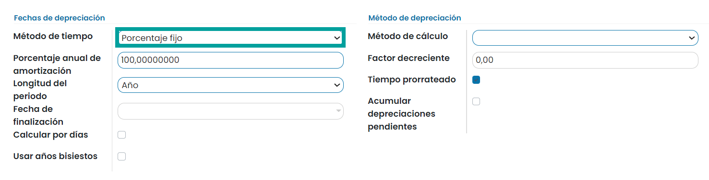

=====================================
Gestión de activos fijos
=====================================

Adaptación a la regulación española
====================================

Daeris adapta la gestión de activos fijos estándar acomodándola a la regulación española.

Se amplia la funcionalidad sobre la pantalla :menuselection:`Contabilidad / Facturación --> Configuración --> Categoría del activo`.

Desde el formulario de la categoria y sobre el apartado **Fechas de depreciación** se incorpora sobre el campo
**Método de tiempo** la opción **Porcentaje fijo**, que permite realizar el cálculo para porcentaje fijo por periodo.

.. seealso::
   * :doc:`../../../../contabilidad/cuentas_pagar/facturas_proveedores/activos`

