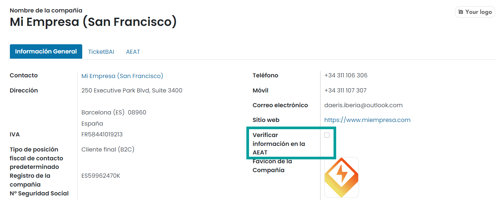
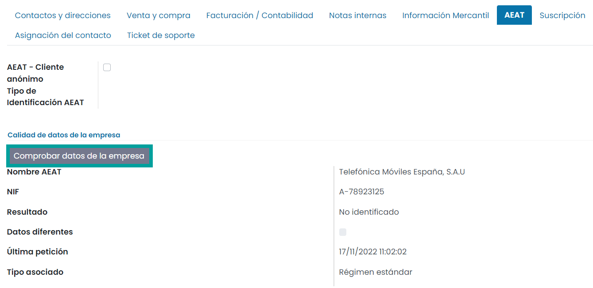

====================================================================
Adaptación de contactos y entidades bancarias
====================================================================

Nombre comercial
=================

Desde la pantalla :menuselection:`Contactos --> Contactos`, y bajo el formulario de un contacto
de tipo **Compañía**, se incorpora el campo **Nombre comercial** el cual permite informar
el nombre comercial de una compañía.

Si se informa el nombre comercial, el nombre de la compañía se muestra como el (nombre comercial)
seguido del nombre de la empresa.

Comprobación de Calidad de datos identificativos
==================================================

Daeris permite comprobar los datos de la empresa en el censo de la AEAT y en el recargo de equivalencia.

.. seealso::
   `Calidad de datos identificativos <https://www.agenciatributaria.es/static_files/AEAT/Contenidos_Comunes/La_Agencia_Tributaria/Modelos_y_formularios/Declaraciones/Modelos_01_al_99/030_036_037/WS_Masivo/Manual_Tecnico_WS_Masivo_Calidad_Datos_Identificativos.pdf>`_ .

Es posible configurar la aplicación, para que al crear o editar un contacto de tipo **Empresa** se
verifique la información en la AEAT de forma automática.

Para ello, navega a :menuselection:`Ajustes --> Usuarios y compañías --> Compañías` y sobre el detalle de una compañía
informa el campo**Verificar Información de la Empresa AEAT**.

También es posible verificar la información de forma manual. Para ello navega al detalle de un contacto de tipo
**Empresa** y sobre la pestaña **AEAT**, haz clic sobre el botón **Comprobar datos de la Empresa**.

Información mercantil
=======================

Desde la pantalla :menuselection:`Contactos --> Contactos`, y bajo el formulario de un contacto
de tipo **Compañía**, se incorpora una nueva pestaña **Información mercantil**, que permite registrar
la información mercantil. Es posible informar los siguientes campos:

   - **Libro**
   - **Registro Mercantil**
   - **Hoja**
   - **Folio**
   - **Sección**
   - **Tomo**

Entidades bancarias
====================

Se añaden los datos de los bancos españoles extraídos del registro oficial del Banco de España.

Desde la pantalla :menuselection:`Contactos --> Configuración --> Bancos`, y bajo el formulario
de una entidad bancaría, se incorporan los campos:

   - Nombre completo
   - NIF
   - Web

.. image:: contactos/bancos01.png
   :align: center
   :alt: Entidades bancarias

