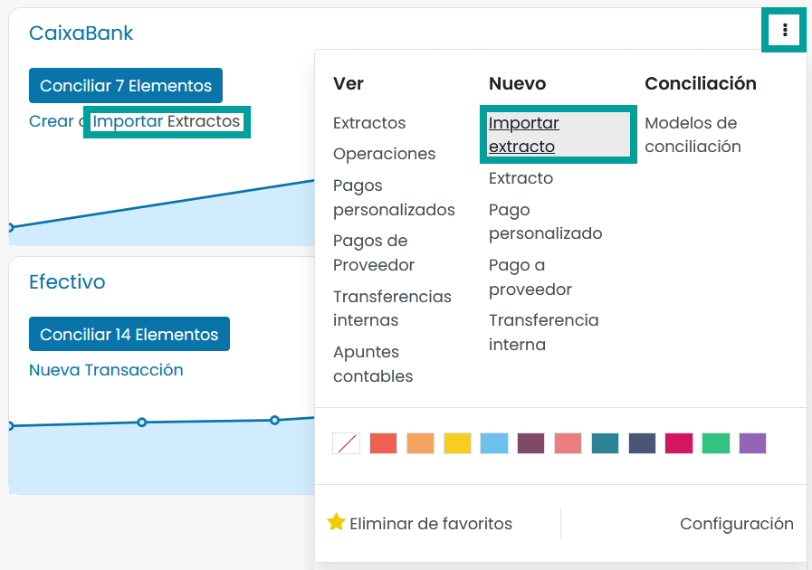
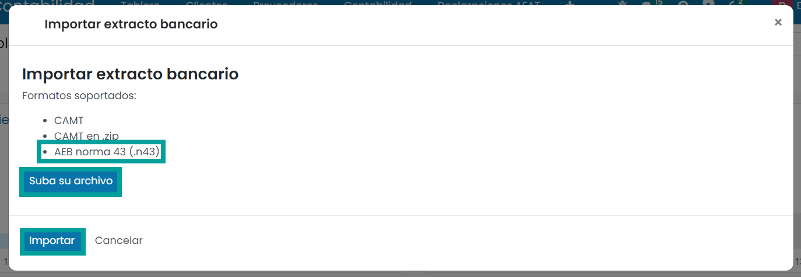
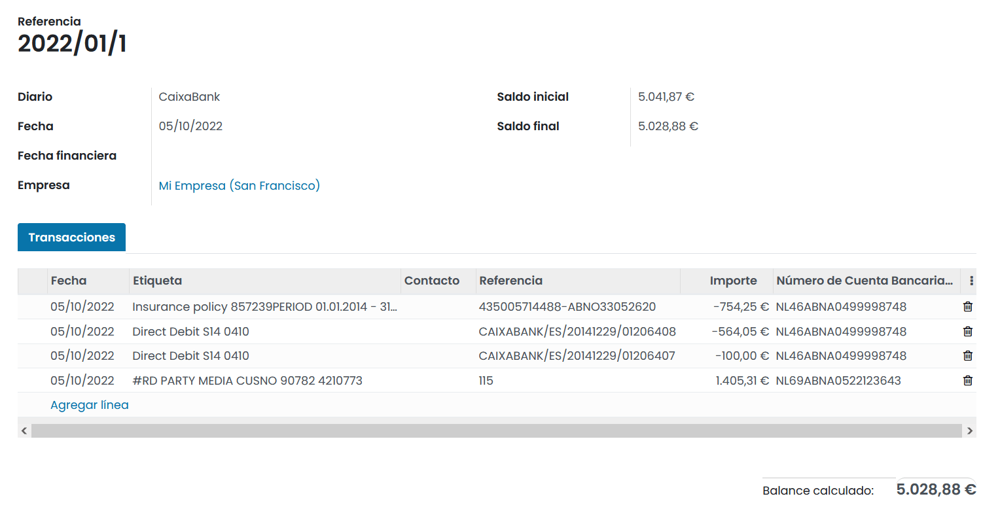
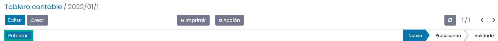

==================================
Extractos Bancarios N43
==================================

Daeris permite la importación y tratamiento de los extractos bancarios españoles que siguen la norma/cuaderno 43 de la
**Asociación Española de la Banca**.

Importar archivos en formato N43
==========================================

Daeris soporta el formato de gestión de efectivo N43.

Para importar tus ficheros, navega a :menuselection:`Contabilidad --> Tablero`, y sobre la tarjeta de tu diario
bancario, haz clic sobre el botón **Importar extractos**, o haz clic sobre el botón **⁝** y selecciona la opción
**Importar extracto**.

A continuación, haz clic sobre el botón **Suba su archivo** , selecciona el archivo que deseas importar y haz clic sobre el botón **Importar**.

Tras importar el fichero, se muestra la pantalla de detalle del extracto recién importado, que incorpora las líneas de las transacciones realizadas.

Mediante el botón **Publicar** se confirma el extracto, y se puede iniciar el proceso de conciliación.

.. seealso::
   * :doc:`../../../../contabilidad/banco_efectivo/integracion/extractos`

Consideraciones
================

   - La moneda se extrae del diario con el cual se va a importar o, en su defecto, de la compañia, no del extracto norma 43 que se importa.
   - Los códigos de operación N43 no se utilizan para asociar una cuenta contable genérica.