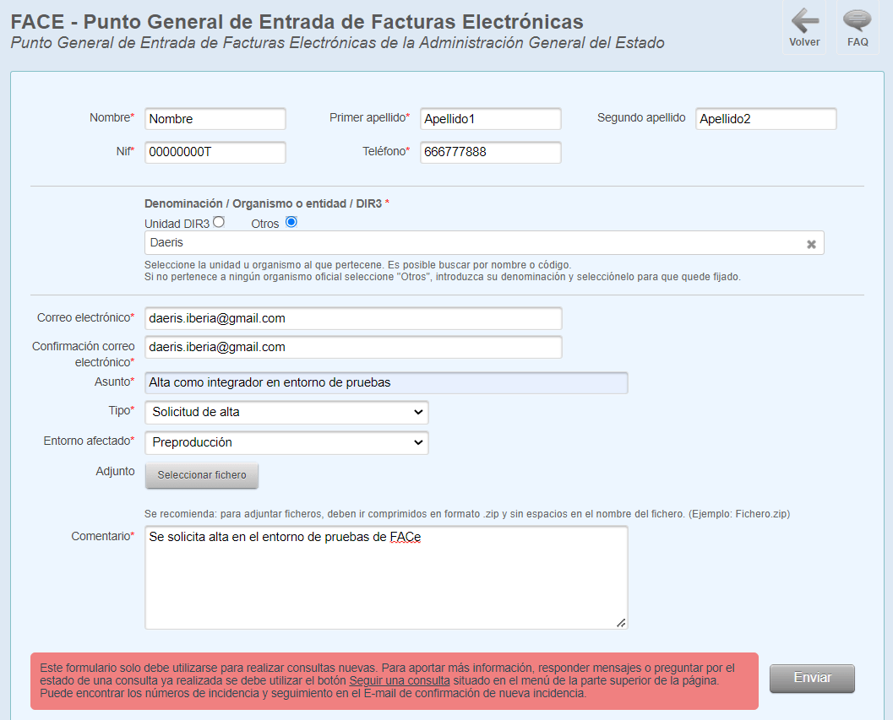
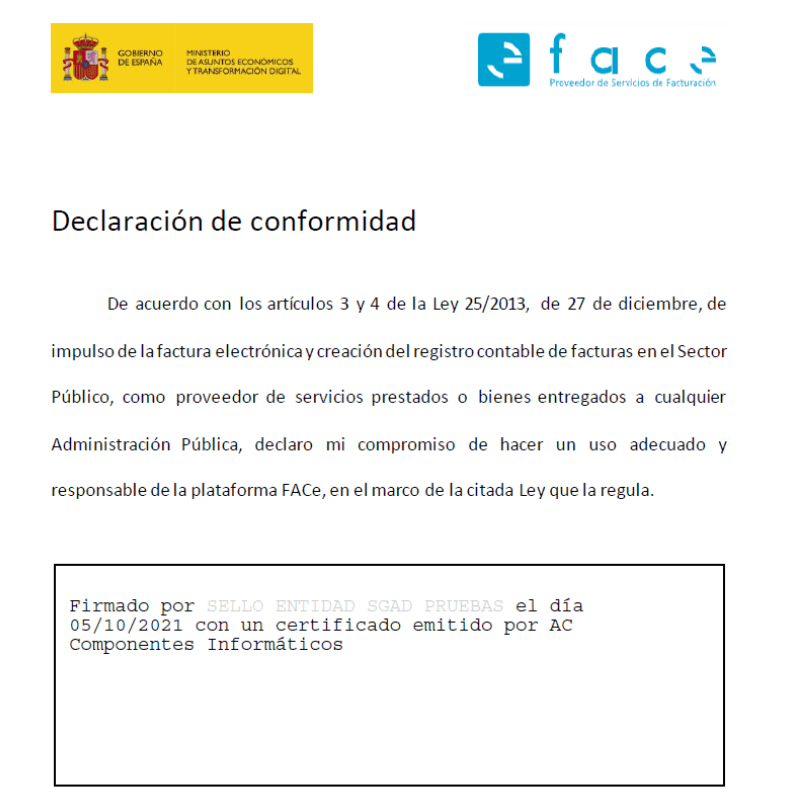

==================================
Face
==================================

Solicitar el alta como integrador en el entorno de pruebas de FACe
===================================================================
(solo es necesario para cuando activemos el envío automático de facturas a FACe)

Para FACe, los integradores son los proveedores que utilizan servicios web automatizados o el aplicativo FACTURAE
para comunicarse con el sistema para la remisión de facturas o su consulta.

Dichos integradores se comunican con FACe a través de servicios web SOAP que requieren la firma de las peticiones.
Para que FACe pueda reconocer qué proveedor está intentando comunicarse con él se requiere el alta previa donde
informen de la parte pública del certificado con el que firmarán dichas peticiones.

Conocer previamente dicho certificado posibilita a FACe el reconocimiento previo del sistema que está haciendo la
petición y comprobar si tiene o no los permisos necesarios para ello.

Para darse de alta como integrador en FACe deberá abrir una incidencia al
`Soporte técnico de FACe <https://ssweb.seap.minhap.es/ayuda/consulta/FACE/>`_ indicando que quieren darse de
alta como integradores e indicar la siguiente información:

En el campo de **ficheros adjuntos** se deberán adjuntar, por un lado, el **PEM** del certificado que utilizarán
para firmar las llamadas a los servicios web de FACe.

.. seealso::
   `Guía sobre cómo obtener el PEM de un certificado <https://imasonline.blog/2017/04/21/face-como-obtener-el-pem-de-un-certificado/>`_ .

Por otro lado, se deberá adjuntar una declaración de conformidad firmada, como la siguiente:

El documento se encuentra en el `Área de Descargas para Integradores de FACe <http://administracionelectronica.gob.es/PAe/FACE/declaracionconformidad/>`_ .

Esta declaración de conformidad debe ser firmada electrónicamente tal y como se detalla
`aquí <https://www.sede.fnmt.gob.es/documents/10445900/10528353/Firmar_documento_PDF_Adobe_Acrobat_Reader_DC.pdf/>`

