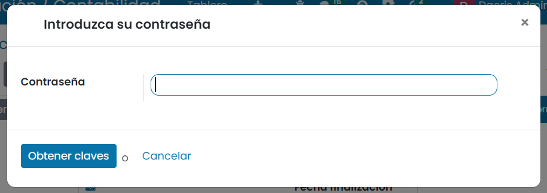
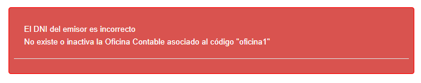

==================================
Facturae
==================================

Introducción
=============
En virtud de la Ley 25/2013, de 27 de diciembre, de impulso de la factura electrónica y creación del registro contable
de facturas en el Sector Público, desde el día 15 de enero de 2015 todas las facturas remitidas a las administraciones
públicas tienen que ser electrónicas.

Téngase en cuenta, no obstante, que muchas Administraciones Públicas, y entre ellas la Administración General del
Estado, han hecho uso de la potestad de exonerar de esta obligación a las facturas de hasta 5.000 euros.

Estas facturas electrónicas se enviarán a través de los puntos generales de entrada de facturas electrónicas de
la administración correspondiente. Estos puntos generales le permitirán consultar electrónicamente el estado de
tramitación de su factura, una vez remitida.

El de la Administración General del Estado se denomina `FACe <http://www.face.gob.es/>`_.

En estas facturas electrónicas habrá que indicar la oficina contable, el órgano gestor y la unidad tramitadora,
para que llegue correctamente a su destino. La administración le proporcionará estos datos.

.. seealso::
   `Información sobre el formato: <https://www.facturae.gob.es/formato/Versiones/Esquema_castellano_v3_2_x_06_06_2017_unificado.pdf>`_ .

Crear un archivo de Factura-e
==================================

Registro de información de la compañía
---------------------------------------

En primer lugar, navega a la pantalla
:menuselection:`Ajustes --> Usuarios y compañías --> Compañías`
, y accede al detalle de tu compañía. Asegúrate de tener informados los siguientes campos, ya que son requeridos para
la generación del fichero de Factura-e:

   - Dirección de la compañía
   - IVA/NIF
   - Correo electrónico
   - Sitio web

Por otro lado, desde la pestaña **Factura-E**, selecciona la versión con la que quieres que se genere el fichero XML:

   - Versión 3.2
   - Versión 3.2.1
   - Versión 3.2.2

.. tip::
   Se admiten tres versiones de Facturae (3.2, 3.2.1 y 3.2.2). Las diferencias entre estas versiones consisten básicamente en cambios en los formatos de algunos campos numéricos y en la inclusión de campos nuevos en las versiones más recientes. Se recomienda utilizar la última versión 3.2.2, ya que contiene los últimos cambios en el formato de definición del fichero.

.. image:: facturae/compania02.png
   :align: center
   :alt: Registro de información de la compañía

Configuración de cuentas bancarías
----------------------------------
Para usar la factura electrónica, debes disponer de una cuenta bancaría registrada en el sistema y debe disponer de
su correspondiente IBAN, nombre de banco asociado y código BIC.

Si aún no dispones de una cuenta bancaría asociada al sistema, puedes crearla accediendo a la pantalla
:menuselection:`Facturación / Contabilidad --> Configuración --> Agregar una cuenta bancaria`.

Asegúrate de crear al menos una cuenta bancaria asociada a la compañía. La cuenta bancaria debe tener un IBAN,
nombre de banco asociado y código BIC.

Modos de pago
--------------
Para usar la factura electrónica, debes disponer de un modo de pago adaptado a facturae.
Para ello, navega a :menuselection:`Facturación / Contabilidad --> Configuración --> Modos de pago`
y crea y/o selecciona un modo de pago (si ya dispones de él).

Asegúrate de el modo de pago dispone de un método de pago, un código Factura-e y una cuenta bancaria.

Impuestos
-----------
Para usar la factura electrónica, los **impuestos** que dispones en el sistema deben disponer del **código de impuesto
Facturae** correcto.

Para ello, navega a :menuselection:`Facturación / Contabilidad --> Configuración --> Impuestos` y sobre la pestaña
**Opciones avanzadas** del detalle del impuesto, informa el campo **Código facturae**.

.. attention::
   Por defecto, los impuestos se informan con el código **IVA: impuesto sobre el valor añadido**, pero es posible que debas adaptar ciertos impuestos a los códigos de Facturae.

Los códigos facturae disponibles son:

   - **IVA**: Impuesto sobre el valor añadido
   - **IPSI**: Impuesto sobre la producción, los servicios y la importación
   - **IGIC**: Impuesto general indirecto de Canarias
   - **IRPF**: Impuesto sobre la Renta de las personas físicas
   - **Otro**
   - **ITPAJD**: Impuesto sobre transmisiones patrimoniales y actos jurídicos documentados
   - **IE**: Impuestos especiales
   - **Ra**: Renta aduanas
   - **IGTECM**: Impuesto general sobre el tráfico de empresas que se aplica en Ceuta y Melilla
   - **IECDPCAC**: Impuesto especial sobre los combustibles derivados del petróleo en la Comunidad Autonoma Canaria
   - **IIIMAB**: Impuesto sobre las instalaciones que inciden sobre el medio ambiente en la Baleares
   - **ICIO**: Impuesto sobre las construcciones, instalaciones y obras
   - **IMVDN**: Impuesto municipal sobre las viviendas desocupadas en Navarra
   - **IMSN**: Impuesto municipal sobre solares en Navarra
   - **IMGSN**: Impuesto municipal sobre gastos suntuarios en Navarra
   - **IMPN**: Impuesto municipal sobre publicidad en Navarra
   - **REIVA**: Régimen especial de IVA para agencias de viajes
   - **REIGIC**: Régimen especial de IGIC: para agencias de viajes
   - **REIPSI**: Régimen especial de IPSI para agencias de viajes

Certificados
-------------
Para poder usar la factura electrónica es imprescindible disponer de un certificado valido.

Puedes consultar la documentación relacionada con la factura electrónica `aquí <https://www.facturae.gob.es/Paginas/Index.aspx/>`_ .

Una vez dispongas del certificado, es necesario configurarlo desde la pantalla
:menuselection:`Facturación / Contabilidad --> Configuración --> Certificados AEAT`.

Crea un nuevo registro mediante el botón **Crear** y sobre el formulario de detalle, informa los siguientes campos:

   - **Nombre**: Nombre del certificado.
   - **Archivo**: Selecciona tu certificado de una entidad certificadora válida.
   - **Nombre de la carpeta**: Especifica un nombre para la carpeta en donde se alojará el certificado en el sistema.

Una vez dado de alta el certificado, pulsa el botón **Obtener claves**. El sistema mostrará una ventana desde donde
introducir la **contraseña** del certificado.

Si todo ha ido bien, se generarán las claves, y se podrá activar el certificado mediante el botón **Para activar**.

.. important::
   El NIF del certificado debe ser el mismo que el NIF de tu compañía, ya que las facturas se envían con la
   compañía como remitente.

   Si eres una persona física, asegúrate de que el contacto asociado a tu compañía tenga
   la marca de contacto **Individual**, y que disponga del **nombre** y **primer apellido** informado.

   Si, por el contrario, eres una persona jurídica, el contacto asociado a tu compañía debe tener la marca de
   contacto **Compañía**. Esto lo puedes comprobar desde la pantalla :menuselection:`Contactos --> Contactos`, accediendo
   al detalle del contacto asociado a tu compañía.

   También puedes acceder al contacto asociado a tu compañía, desde la pantalla :menuselection:`Ajustes --> Usuarios y compañías --> Compañías`,
   posicionándote sobre tu compañía y haciendo clic sobre el enlace que dispone el campo **Contacto**.

Configurar clientes asociados a la administración pública
-----------------------------------------------------------

Aquellos clientes asociados a la administración pública a los que quieres facturar mediante facturae, deben de esta configurados previamente en el sistema.

Para ello, navega a la pantalla :menuselection:`Contactos --> Contactos` y accede al formulario de detalle del
cliente asociado a la administración pública a la que quieres facturar.

Sobre la pestaña **Contabilidad**, Informa el campo **Factura electrónica** así como los campos **órgano gestor**,
**unidad tramitadora** y **oficina contable**.

Asegúrate también de tener informada la **dirección** completa del contacto, así como su **número de identificación (VAT/NIF)**.

.. tip::
   El Directorio Común de Unidades Orgánicas y Oficinas (DIR3) es el lugar donde se pueden consultar las
   codificaciones de la Oficina Contable, Órgano Gestor y Unidad Tramitadora a la que se remite la factura.
   Este directorio se puede consultar en el `directorio de administraciones <https://face.gob.es/es/directorio/administraciones/>`_ .

Gestión de facturas electrónicas
----------------------------------
Para crear una factura electónica accede a la pantalla :menuselection:`Facturación / Contabilidad --> Clientes --> Facturas`
 y haz clic sobre el botón **Crear**.

Selecciona un cliente configurado para recibir para facturas electrónicas,un **modo de pago** con el código de
Factura-e establecido y un **banco destinatario** con IBAN y número de BIC asociado a la compañía.

Recuerda que el impuesto asociado a cada uno de los productos de las líneas de factura debe disponer de
**código factura-e** correctamente informado.

Exportar fichero Factura-e
----------------------------
Una vez confirmada la factura mediante el botón **Confirmar**, es posible generar el fichero de Factura-e.
Para ello haz clic sobre el menú **acción**, y selecciona la opción **Crear archivo de Factura-e**.

Mantén informada la opción **firma digital** y pulsa el botón **Exportar**

Si no se detectan errores, se mostrará una ventana desde donde es posible **descargar** el fichero XML de
Factura electrónica generado en formato **xsig**.

Gestionar facturas en FACe
===========================

Validar y visualizar una factura en FACe
-----------------------------------------
Es posible validar y visualizar una factura generada desde Daeris en FACe. Para ello accede
`herramienta de validación y visualización de facturas de FACe <https://face.gob.es/es/facturas/validar-visualizar-facturas/>`_.

El usuario tiene aquí una herramienta que le permite comprobar si su factura cumple todos los requisitos antes de
remitirla a la Administración:

Pulsando el botón **Suba y Valide su Factura** se abre una ventana del ordenador para seleccionar la factura que
se quiere validar. El sistema propone varias opciones de validación. Se pueden elegir cuantas se deseen, pero como
mínimo una. Las opciones son:

   - Formato Facturae
   - Firma de la factura
   - Centros administrativos
   - Comprobar si la factura ha sido ya presentada en FACe

Para demostrar al sistema que no eres un robot de búsqueda automática deberás activar el campo **No soy un robot**.

Pulsando el botón **Validar factura** el sistema realizará las comprobaciones oportunas con las opciones seleccionadas
y devolverá un mensaje con el resultado de la validación.

Si la factura tuviera errores, el sistema devolverá un **mensaje de error** especificando cuál/cuales son.

Si la validación de la factura es correcta aparecerán en la pantalla dos botones:

   - **Descargar factura**: Pulsando este botón el sistema procederá automáticamente a la descarga de la factura validada en formato .pdf.
   - **Visualizar factura**: Pulsando este botón se abrirá la factura validada en una nueva pestaña del navegador.

Remitir una factura a FACe
----------------------------
El sistema FACe permite la presentación de facturas electrónicas dirigidas a cualquier Administración Pública
adherida y a todas aquellas que no tengan ningún punto de entrada. Para ello navega al
`Acceso a facturas  de FACe <https://face.gob.es/es/facturas/acceder-factura/>`_.

Para poder iniciar el proceso podrás identificarte a través de **Cl@ve**, de **Firma electrónica** o del **certificado electrónico**.

Una vez identificado, se muestra el formulario que se ha de completar para poder remitir la factura. Para ello
es necesario informar los siguientes campos:

   - **Correo Electrónico**: Se debe cumplimentar con una dirección de correo electrónico válida, pues será la vía de comunicación en el proceso de facturación.
   - **Factura**: Se abre una nueva ventana donde se seleccionará la factura a remitir. La extensión del archivo de la factura ha de ser del tipo .xsig, de otra manera la aplicación devolverá un error al subir el archivo. Además, la estructura tiene que ser la de FACTURAe 3.2, 3.2.1 o 3.2.2.
   - **Anexos**: Se pueden seleccionar archivos complementarios a la factura a remitir. Estos archivos pueden ser únicamente del tipo .html o .pdf. También se pueden incluir anexos dentro del XML de la factura, admitiéndose únicamente formato .pdf por restricción propia del formato FACTURAe.

.. tip::
   Es recomendable que antes de comenzar el proceso se compruebe la validez de la factura en el menú **Factura – Validar y visualizar facturas**.

Una vez completados los campos obligatorios se activarán los siguientes botones:

   - **Remitir Factura**: Pulsando este botón, si todos los parámetros obligatorios han sido correctamente introducidos, se abrirá una nueva pantalla con un resumen de los datos de la factura para su revisión y posterior envío, que se detallará a continuación. Si por el contrario la validación fuera incorrecta el sistema marcará en rojo los campos incorrectos para que sean modificados.

   - **Eliminar**: Una vez subidos los ficheros se mostrarán en la parte derecha de la pantalla para su comprobación. Esta acción se puede deshacer fácilmente pulsando este botón Eliminar.

Al remitir la factura, se muestra un resumen de los datos más relevantes de la factura que el usuario quiere remitir
a la Administración Pública para su revisión y posterior firma. Dependiendo de si la factura se remita a una
Administración adherida a FACe o no, el procedimiento cambia.

A continuación, se muestra la pantalla para las facturas remitidas a Administraciones adheridas a FACe.

Los campos que se muestran son:
   - **NIF/CIF**: Número y letra del NIF del emisor de la factura.
   - **Nombre**: Nombre del vendedor que desea presentar la factura.
   - **NIF/CIF del destinatario**: NIF/CIF de la Administración Pública a la que se remite la factura.
   - **Fecha de Expedición**: Fecha de expedición de la factura en formato aaaa-mm-dd.
   - **Oficina Contable**: Codificación alfanumérica de DIR3 correspondiente a la Oficina Contable a la que se remite la factura.
   - **Órgano Gestor**: Codificación alfanumérica de DIR3 correspondiente al Órgano Gestor al que se remite la factura.
   - **Unidad Tramitadora**: Codificación alfanumérica de DIR3 correspondiente a la Unidad Tramitadora a la que se remite la factura.
   - **Serie**: Serie de factura.
   - **Número**: Número de factura.
   - **Importe**: Importe total de la factura.
   - **Firmante**: NIF/CIF del que firma la factura.
   - **Email**: Dirección de email con la que se ha registrado la factura.
   - **Factura original formato europeo**: Los formatos de factura europeo admitidos en FACe son dos:

      - **UBL**
      - **CII**
   - **Factura original fichero**: Nombre del fichero.
   - **Anexos**: Relación de anexos si los hubiera.

Las acciones que se pueden realizar son:
   - **Volver al Formulario**: Si los datos visualizados no son los correctos, es decir, no se ha adjuntado la factura deseada, este botón permite volver a la pantalla anterior para volver a iniciar el proceso.
   - **Confirmar**: Si los datos visualizados son los correctos, con este último paso de Confirmación se termina el proceso.

Las facturas remitidas a Administraciones no adheridas a FACe han de ir firmadas. La pantalla es la siguiente.

Los campos que se muestran son los mismos que en la pantalla anterior, por lo que no se repetirán. Las acciones
que se pueden realizar son:

   - **Volver al Formulario**: Si los datos visualizados no son los correctos, es decir, no se ha adjuntado la factura deseada, este botón permite volver a la pantalla anterior para volver a iniciar el proceso.
   - **Firmar**: Si los datos visualizados son los correctos, pulsando este botón se firmará el envío con su certificado electrónico.
   - **Firmar con Clave**: También se puede firmar el envío con Cl@ve Firma. Esta opción ofrece la posibilidad de realizar la firma mediante certificados electrónicos centralizados, es decir, certificados electrónicos almacenados y custodiados por la Administración Pública.

