===========================================
Informes del Plan General Contable Español
===========================================

Mediante el sistema de informes adaptados al Plan General Contable Español es posible extraer los
informes adaptados a los modelos para el depósito de cuentas anuales del Registro Mercantil.

Daeris permite extraer los siguientes informes:

   - Balance abreviado
   - Balance completo
   - Balance PYMEs
   - Balance PYMESFL
   - Pérdidas y ganancias abreviado
   - Pérdidas y ganancias completo
   - Pérdidas y ganancias PYMEs
   - Pérdidas y ganancias PYMESFL
   - Estado de ingresos y gastos reconocidos

Configuración de plantillas
=============================

Para configurar las plantillas de informes del **Plan General Contable Español (PGCE)**, navega a la pantalla
:menuselection:`Contabilidad --> Configuración --> Plantillas de informe MIS`.

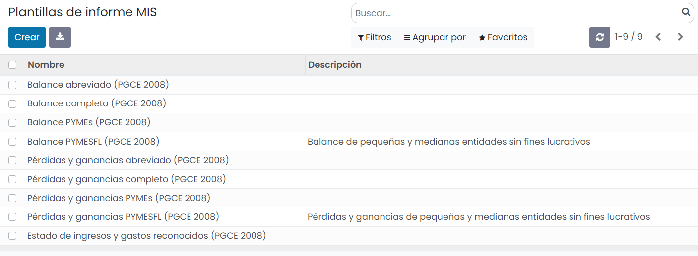

Sobre el listado, aparecen una serie de plantillas preconfiguradas y listas para usar, haciendo referencia a balances,
pérdidas y ganancias y estado de ingresos y gastos reconocidos.

Las plantillas están basadas en los modelos para el depósito de cuentas anuales del Registro Mercantil:

   - `Normal <https://www.mjusticia.gob.es/es/Ciudadano/Registros/Documents/Normal%20Castellano%20Editable%202020.PDF>`_
   - `Abreviado <https://www.mjusticia.gob.es/es/Ciudadano/Registros/Documents/Abreviado%20Castellano%20Editable%202020.PDF>`_
   - `PYMEs <https://www.mjusticia.gob.es/es/Ciudadano/Registros/Documents/PYMES%20Castellano%20Editable%202020.PDF>`_

La información general del Registro Mercantil se encuentra en el apartado `Depósito de cuentas/Anexo I <https://www.mjusticia.gob.es/es/ciudadania/registros/propiedad-mercantiles/registro-mercantil>`_

Al acceder al detalle de una plantilla, se puede observar que se compone de registros con la definición de cada una
de las líneas del informe.

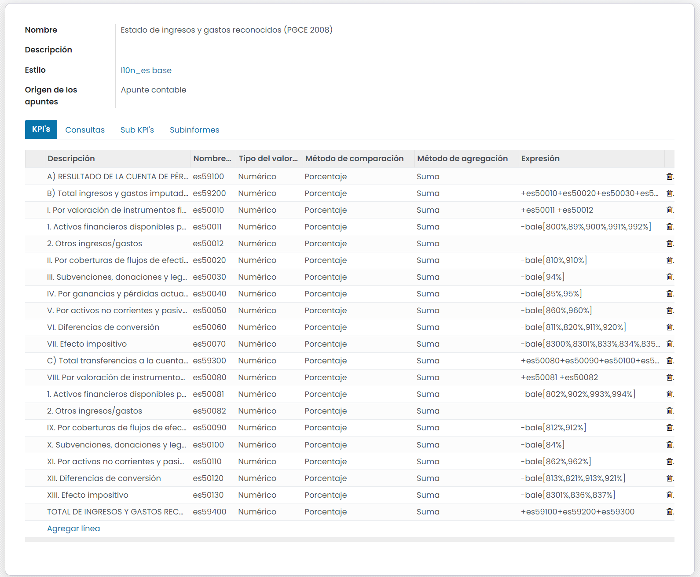

.. attention::
   Se recomienda no editar las plantillas existentes, debido a que ya están configuradas para un correcto funcionamiento del sistema.

Configuración de estilos
===========================

Las plantillas de los informes del **Plan General Contable Español (PGCE)** disponen de un estilo asociado que se
incorpora en la propia plantilla.  Mediante este estilo se incorpora un formato determinado al informe final.

Estos estilos se pueden configurar desde la pantalla :menuselection:`Contabilidad --> Configuración --> Estilos de informe MIS`.

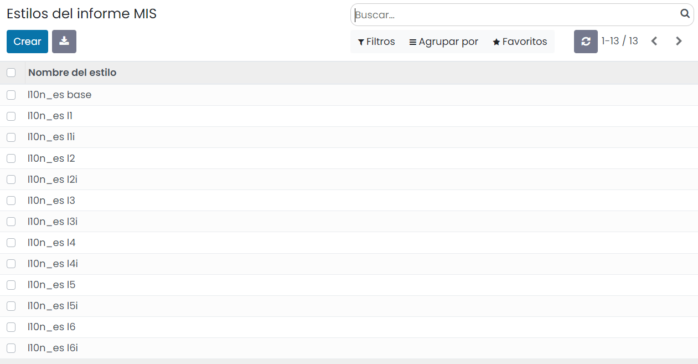

Al acceder al detalle de un estilo, el sistema muestra un formulario con varias opciones de configuración, que
permiten modificar el formato de los números, el color, la fuente, la sangría, así como la visibilidad.

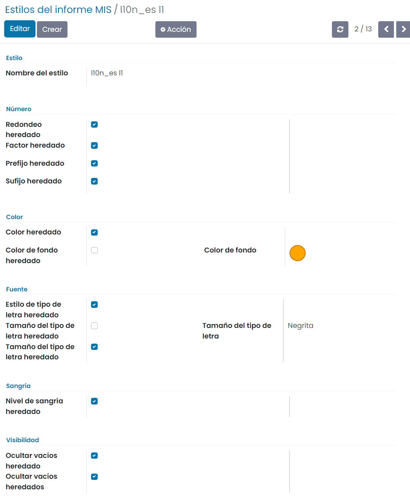

Generar un informe del Plan General Contable Español
=====================================================

Para generar un informe del **Plan General Contable Español (PGCE)** navega a
:menuselection:`Contabilidad --> Informes --> Informes MIS` y pulsa el botón **Crear**.

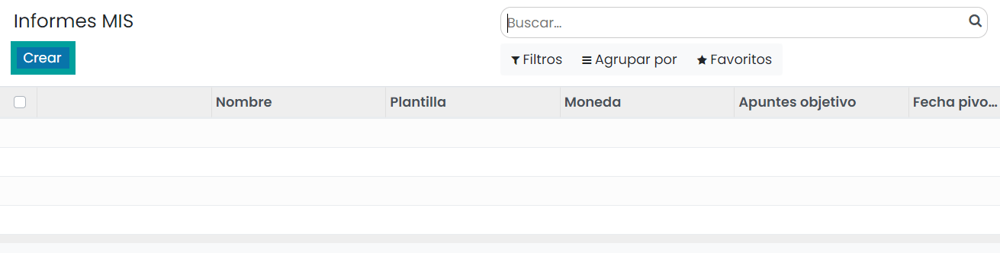

Al dar de alta un nuevo informe aparecerá un formulario donde poder editar loa siguientes campos:

   - **Nombre**: Incorporad un nombre descriptivo. Por ejemplo, Balance situación 2023, Balance situación 1er trimestre 2023 o Balance 2do semestre 2023.
   - **Plantilla**: Seleccionad una de las plantillas que se corresponden con los informes financieros del Plan General Contable Español (PGCE):

      - **Balance abreviado (PGCE 2008)**
      - **Balance completo (PGCE 2008)**
      - **Balance PYMEs (PGCE 2008)**
      - **Balance PYMESFL (PGCE 2008)**
      - **Pérdidas y ganancias abreviado (PGCE 2008)**
      - **Pérdidas y ganancias completo (PGCE 2008)**
      - **Pérdidas y ganancias PYMEs (PGCE 2008)**
      - **Pérdidas y ganancias PYMESFL (PGCE 2008)**
      - **Estado de ingresos y gastos reconocidos (PGCE 2008)**

   - **Modo de comparación**: Si se informa, se deben introducir en la pestaña Columnas tantas líneas como distintos periodos se quieran introducir. Dichos periodos se pueden definir también con fechas fijas, o con periodos relativos (por ejemplo “Tipo de periodo” = “Año”, “Desplazamiento” = “0” y “Duración” = “1” para el año N, y lo mismo, pero con “Desplazamiento” = “-1” para el año “N – 1”).
   - **Rango de fechas**: Permite crear un rango de fechas predefinido.
   - **Desde**: Fecha desde cuando contabilizará el informe.
   - **Hasta**: Fecha hasta cuando contabilizará el informe.
   - **Apuntes Objetivo**: Dispone de las siguientes opciones:

      - **Todos los asientos asentados**
      - **Todos los asientos**

   - **Cuenta analítica**: Permite seleccionar una cuenta analítica.
   - **Grupo de cuentas analíticas**: Permite seleccionar un grupo de cuentas analítica .
   - **Etiquetas analíticas**: Permite seleccionar una etiquetas analítica.

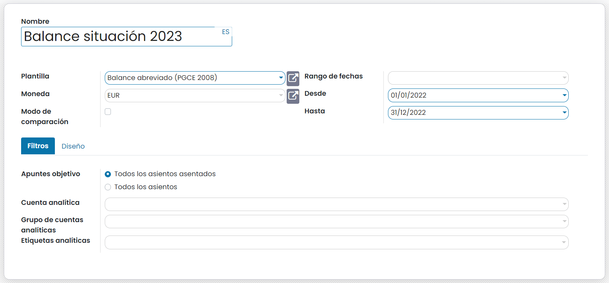

Por otro lado, desde la pestaña de Diseño, tienes disponibles los siguientes campos:

   - **PDF apaisado**: Si se marca, el fichero en formato PDF se imprimirá en horizontal.
   - **Deshabilitar expansión de detalles de la cuenta**: Informar si deseas que se oculten las cuentas contables y se muestren solamente los niveles predefinidos por el formato oficial.
   - **Descripción de las columnas de visualización**: Informar en caso de querer mostrar una descripción de las columnas en el informe.
   - **Ocultar filtros analíticos**: Informar en caso de querer ocultar los filtros analíticos.

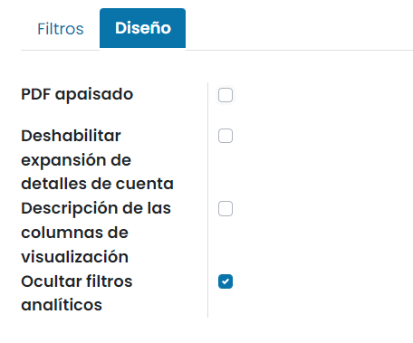

Una vez completados los campos necesarios, pulsa el botón **Guardar**.

.. note::
   El informe solamente considera las cuentas numeradas de acuerdo con el formato establecido por el Plan General Contable Español (PGCE). Cualquier cuenta personalizada que no sea subcuenta (tenga un código derivado incluido), deberá ser añadida manualmente a la plantilla.

Al guardar el informe, el sistema permite realizar una serie de acciones mediante unos botones ubicados en el
formulario.

   - **Previsualizar**: Permite visualizar el informe en el navegador.
   - **Imprimir**: Descarga el informe en pdf.
   - **Exportar**: Permite exportar el documento a Excel.
   - **Añadir al tablero**: Permite añadir el informe al table del usuario que lo genera.

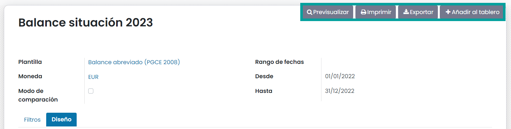

Al **Previsualizar** el informe, se genera el informe y se muestra por pantalla.

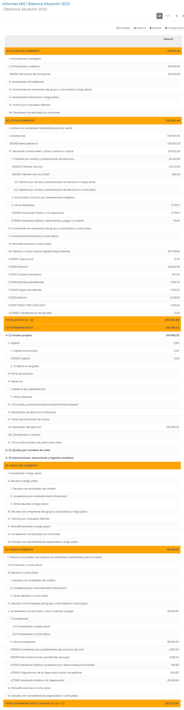

Al pulsar el botón **Imprimir**, el sistema genera un fichero en formato PDF con los datos del informe.

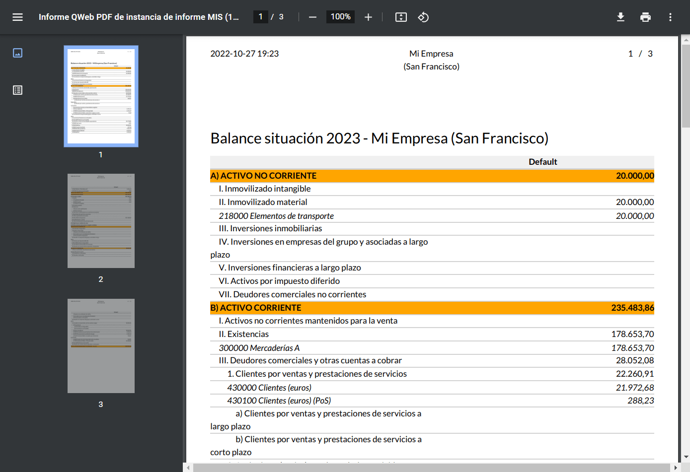

Mediante el botón **Exportar**, el informe es exportado a formato Excel.

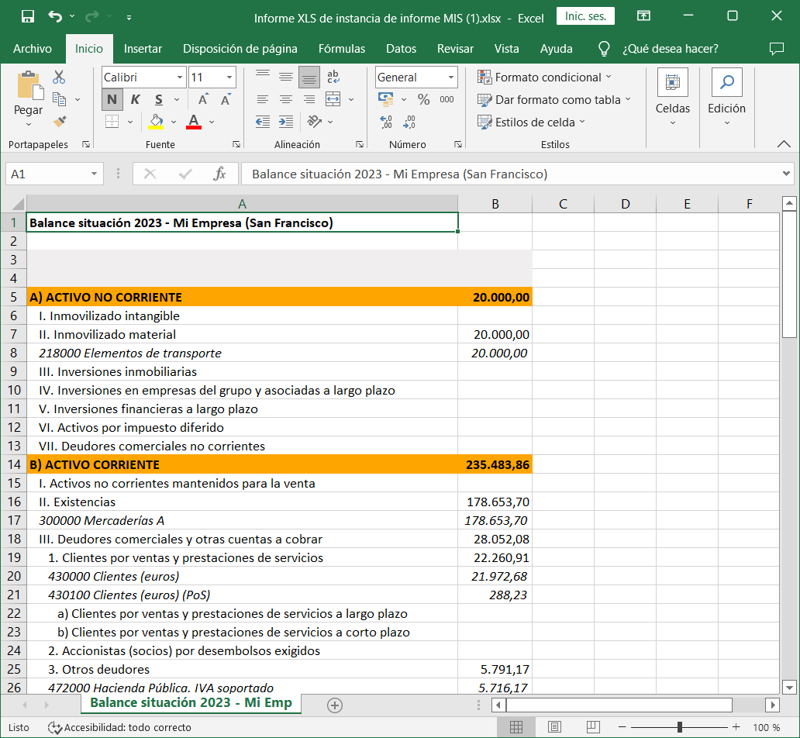

Mediante el botón **Añadir al tablero**, el informe se añade al tablero del usuario conectado.
Para ello, se debe informar un nombre y el tablero asociado.

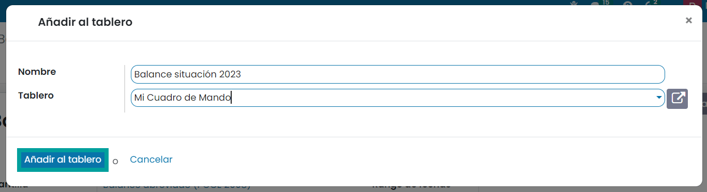

De este modo, al navegar a la pantalla :menuselection:`Tablero --> Mi Tablero`, se podrá visualizar el informe.

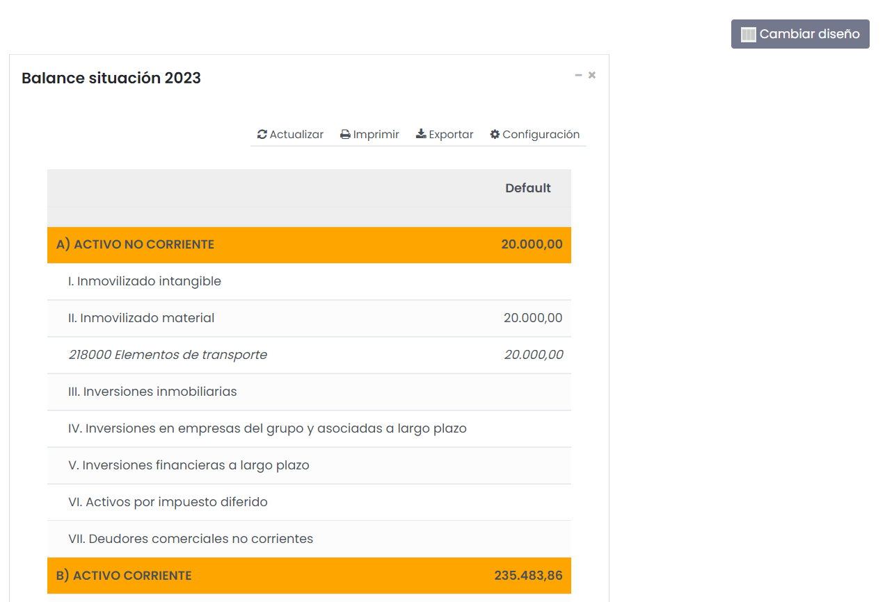

