==================================
Intrastat
==================================

Intrastat es el sistema por el cual se recogen estadísticas de tráfico de mercancías entre los países de la Unión Europea.

Las estadísticas de comercio intracomunitario son una parte esencial en la contabilidad de la Balanza comercial de un país y
son consideradas un indicador importante de los resultados de una economía.

La obligación de suministrar la información requerida por el sistema Intrastat es determinada de forma independiente por las autoridades nacionales.

En general, están obligados a suministrar información las personas físicas o jurídicas que están sujetas al IVA,
intervienen en un intercambio de bienes con otro Estado miembro y superan los umbrales de exención establecidos.

El suministro de servicios está excluido del sistema Intrastat.

.. seealso::
   `Gestiones Intrastat <https://sede.agenciatributaria.gob.es/Sede/procedimientoini/DP01.shtml>`_ .

Configuración
======================

Activar Intrastat
------------------

Para habilitar Intrastat, accede a
:menuselection:`Contabilidad / Facturación --> Configuración --> Ajustes`, y sobre el apartado
**Funcionalidades de localización española**, activa campo **Intrastat español**.

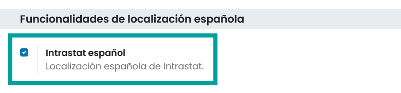

Opciones predeterminadas
--------------------------

Una vez has activado Intrastat, accede a
:menuselection:`Contabilidad / Facturación --> Configuración --> Ajustes`. Sobre el apartado
**Intrastat**, puedes informar los siguientes campos:

   - **Recepciones**: Permite indicar el tipo de Intrastat predefinido para las importaciones:

      - **Exempt** (exento)
      - **Standard** (estándar)
      - **Extended** (extendido)

   - **Envios**:Permite indicar el tipo de Intrastat predefinido para las exportaciones:

      - **Exempt** (exento)
      - **Standard** (estándar)
      - **Extended** (extendido)

   - **Modo de Transporte predeterminado**: Permite indicar el modo de transporte predeterminado que aparecerá en la factura.
   - **Transacción Intrastat predeterminada para la factura del cliente**: Permite indicar el tipo de transacción predeterminada que aparecerá en la factura del cliente.
   - **Transacción Intrastat predeterminada para Abonos a Clientes**: Permite indicar el tipo de transacción predeterminada que aparecerá en la factura rectificativa del cliente.
   - **Transacción Intrastat predeterminada para Facturas de Proveedores**: Permite indicar el tipo de transacción predeterminada que aparecerá en la factura del proveedor.
   - **Transacción Intrastat predeterminada para Abonos de Proveedor**: Permite indicar el tipo de transacción predeterminada que aparecerá en la factura rectificativa del proveedor.

Mediante el botón **Importar códigos HS de productos**, puedes incorporar los códigos HS. Estos códigos son configurables desde  :menuselection:`Contabilidad / Facturación --> Configuración --> Códigos HS`.

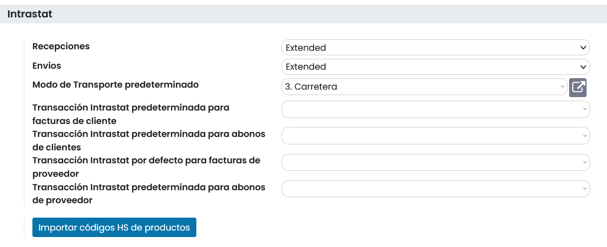

Recuerda hacer clic sobre el botón **Guardar** para que tus cambios quedén registrados.

Productos
----------
Daeris permite configurar el código HS y el país de origen de los productos. Para ello, navega a
:menuselection:`Contabilidad / Facturación --> Clientes --> Productos`
, elimina el filtro **Puede ser vendido**, y busca el producto a configurar.

Sobre el formulario de detalle del producto, puedes informar:

   - **Código HS**: Permite seleccionar el código HS
   - **País de Origen**: País de procedencia del producto.
   - **Provincia de Origen**: Provincia de procedencia del producto.

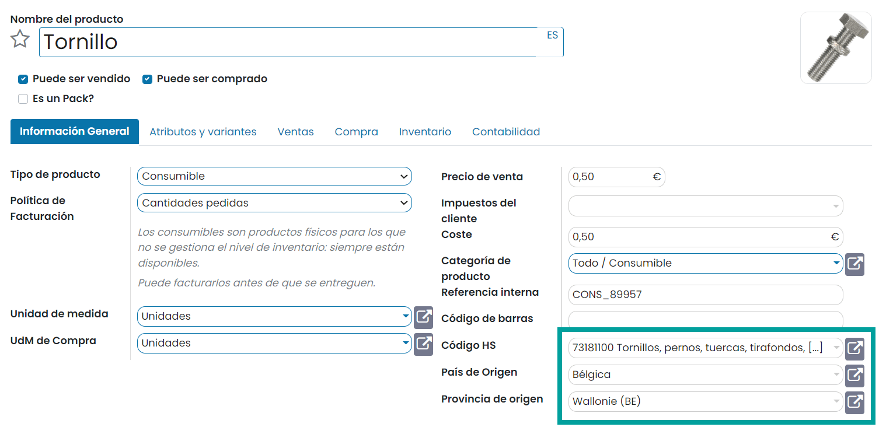

Posición fiscal Intrastat
--------------------------

Para informar sobre una posición fiscal que esta asociada al flujo de transacciones de Intrastat, navega a
:menuselection:`Contabilidad / Facturación --> Configuración --> Ajustes`.
Sobre la posición fiscal, informe el campo **Intrastat**.

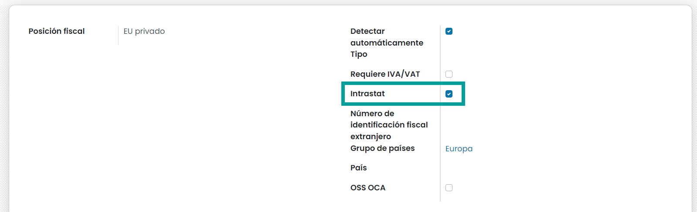

Recuerda, que puedes incorporar sobre los contactos con los que realices operaciones comerciales, una posición
fiscal predeterminada. Si lo haces, al crear una factura se incorporará por defecto esta posición.

Para ello, navega a :menuselection:`Contactos --> Contactos`, busca al contacto
y sobre la pestaña **Venta y compra**, informa la posición fiscal predeterminada.

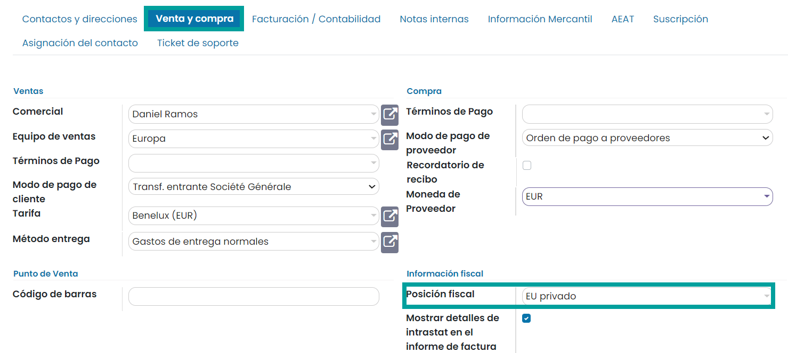

Configuración de almacenes
----------------------------

En el caso de que tu empresa disponga de **varios almacenes**, es posible definir la región Intrastat en la que
se encuentran.

Para definir una región Intrastat de almacén, navega a :menuselection:`Contabilidad / Facturación --> Configuración --> Regiones Intrastat`.
, crea un nuevo registro e informa el código, nombre,  descripción y país.

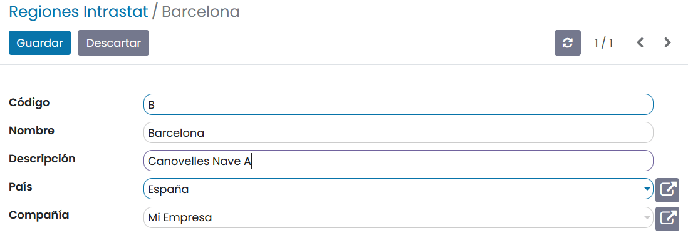

Para identificar la región Intrastat de un almacén, navega a
:menuselection:`Inventario --> Configuración --> Almacenes`
, selecciona el almacén a configurar e informa el campo **Región Intrastat**.

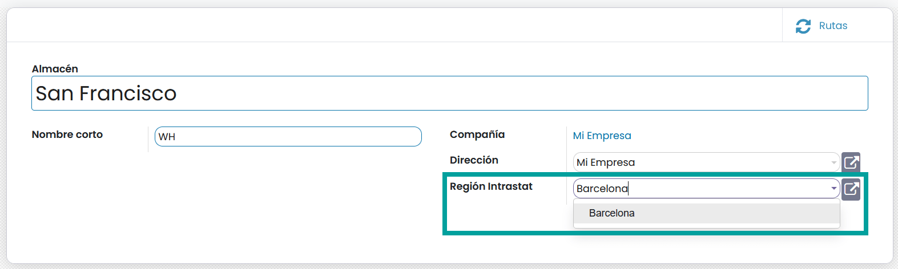

Mostrar detalles de intrastat sobre las facturas
--------------------------------------------------

Daeris, permite incorporar los detalles de los movimientos de Intrastat sobre las facturas de los clientes
y proveedores. Esta opción se configura a nivel de cliente y proveedor (Contacto).

Para ello, navega a :menuselection:`Contactos --> Contactos`, busca al contacto
y sobre la pestaña **Venta y compra**, informa el campo **Mostrar detalles de intrastat sobre las facturas**.

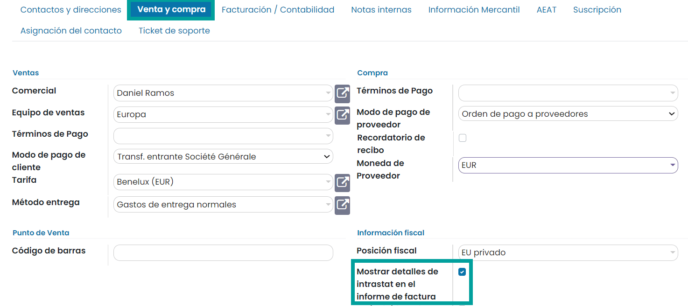

Al realizar una factura sobre un contacto que disponga de la marca **Mostrar detalles de intrastat sobre las facturas**
se incorporará sobre la factura los detalles de registro de Intrastat.

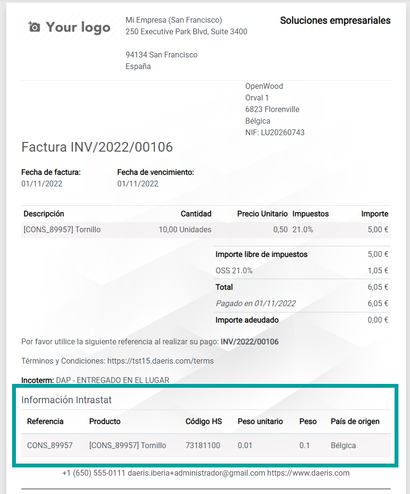

Registro de operaciones
==========================

Facturas a clientes (exportarciones)
-------------------------------------
Para registar los datos de Intrastat sobre una factura de cliente, debes posicionarte sobre la pestaña **Otra información**
de la factura e informar los campos:

   - **Tipo de transacción Intrastat**: Naturaleza de la transacción.
   - **Modo de transporte Intrastat**: A seleccionar en base al modo de envío.
   - **País de Destino**: País destino para envios. Se informa de forma automática a partir de la dirección del cliente.
   - **Incoterm**: A seleccionar de la lista de incoterms.
   - **Posición fiscal**: Selecciona la posición fiscal que debe disponer del campo **Intrastat** seleccionado.

Solo aparecerán sobre el informe de Intrastat, las facturas que hayan sido **confirmadas**.

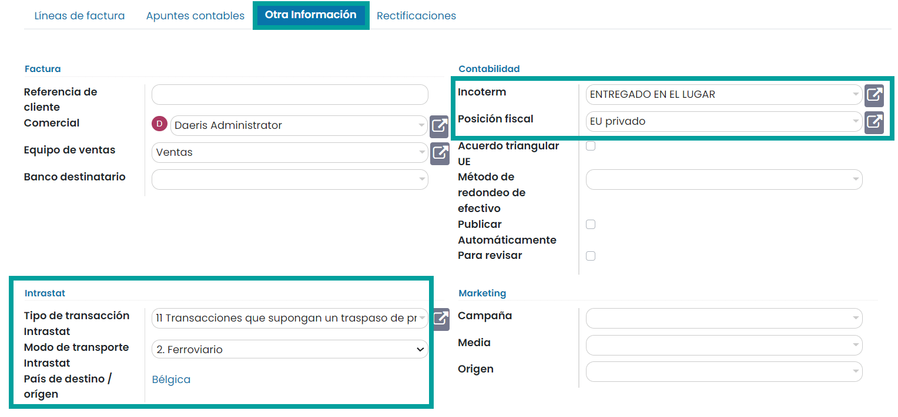

.. attention::
   Al seleccionar la posición fiscal de la factura, recuerda que debe disponer de la marca **Intrastat** informada.
   Si la marca **Intrastat** no esta informada, no aparecerá como factura a enviar a Intrastat.

   .. image:: intrastat/posicion01.png
      :align: center
      :alt: Facturas a clientes (exportarciones)

Facturas a proveedores (importaciones)
--------------------------------------

Para registar los datos de Intrastat sobre una factura de proveedor, debes posicionarte sobre la pestaña **Otra información**
de la factura e informar los campos:

   - **Tipo de transacción Intrastat**: Naturaleza de la transacción.
   - **Modo de transporte Intrastat**: A seleccionar en base al modo de envío.
   - **País de Destino**: País origen para recepciones. Se informa de forma automática a partir de la dirección del proveedor.
   - **Incoterm**: A seleccionar de la lista de incoterms.
   - **Posición fiscal**: Selecciona la posición fiscal que debe disponer del campo **Intrastat** seleccionado.

Solo aparecerán sobre el informe de Intrastat, las facturas que hayan sido **confirmadas**.

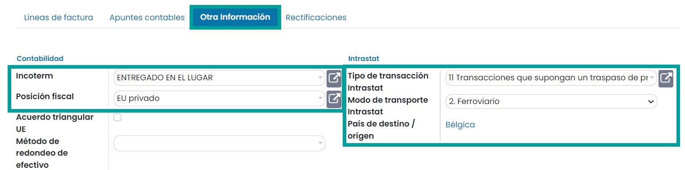

.. attention::
   Al seleccionar la posición fiscal de la factura, recuerda que debe disponer de la marca **Intrastat** informada.
   Si la marca **Intrastat** no esta informada, no aparecerá como factura a enviar a Intrastat.

   .. image:: intrastat/posicion01.png
      :align: center
      :alt: Activar Intrastat

Declaraciones de Intrastat
==========================

Crear una declaración
----------------------

Es importante recordar que los datos que aparecerán en la declaración de Intrastat se obtienen a partir de los datos que se han informado sobre las facturas de clientes y proveedores confirmadas.
Al realizar las facturas se ha de validar que los datos presentados sean correctos, asegurándose de que la información relacionada con los productos que aparecen en las líneas de las facturas este correctamente registrada.

También es importante validar los campos de la factura:
   - Tipo de transacción
   - Modo de transporte
   - Incoterm
   - Posición fiscal
   - País destino: Calculado a partir de los datos del cliente.

Para generar una nueva declaración de Intrastat, navega a
:menuselection:`Contabilidad / Facturación --> Informes --> Intrastat - Declaración de operaciones de intercambio de mercancías`,
y haz clic sobre el botón **Crear**.

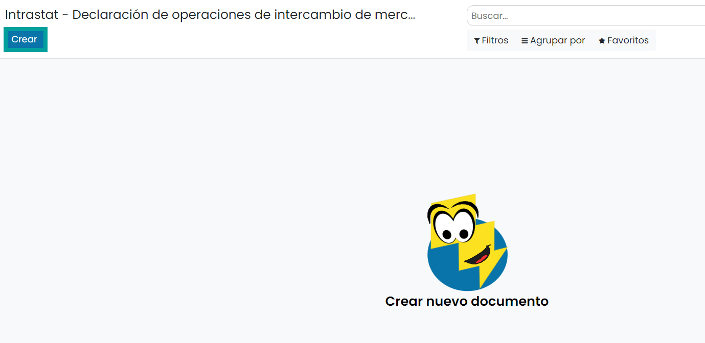

Sobre el formulario, es posible informar los siguientes campos:

   - **Año**: Año de la declaración.
   - **Mes**: Mes de la declaración.

   .. tip::
      El plazo para presentar la declaración es hasta el día 12 del mes siguiente al mes natural al que se refieren las operaciones declaradas o, si este es sábado, domingo o festivo, hasta el día hábil siguiente.

   - **Tipo**:

      - **Declaración de recepciones**: Para la declaración de despachos / expediciones
      - **Declaración de envíos**: para la declaración de Llegadas.

   - **Nivel de informe**: A seleccionar en función de la legislación:

      - **Estándar**
      - **Extendido**

   - **Acción**:
      - **Añadir**: Para presentar una nueva declaración
      - **Remplazar**: Para presentar una declaración sustitutoria que reemplace una ya presentada
      - **Nada**: Para no declarar nada, se debe seleccionar esta opción. Según la legislación ("Los obligados a presentar declaración en un determinado flujo que no realicen operaciones en un mes, deberán presentar declaración sin operaciones referidas a dicho mes.")

   - **Revisión**: Número de versión de la declaración. Puede ser de gran utilidad para distinguir entre diferentes versiones de la misma declaración (sustitutorias…).
   - **Importe fiscal total**: Importe total de la suma de todas las facturas.
   - **Número de líneas de declaración**: Suma de todas las líneas de la declaración.
   - **Compañía**: Empresa a la que hace referencia la declaración.

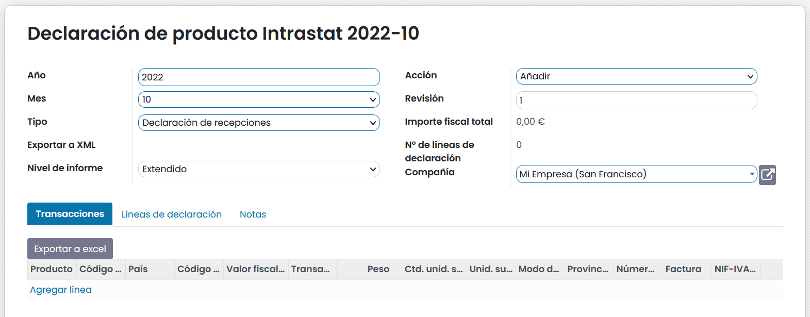

Generar Líneas desde facturas
-------------------------------

Para calcular el informe haz clic sobre el botón **Generar Líneas desde facturas**.

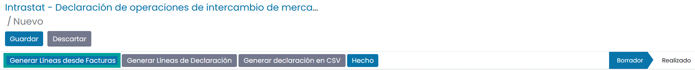

Al hacer clic sobre el botón **Generar líneas de facturas**, se revisa si se dispone en el sistema de facturas a
enviar a Intrastat para el periodo indicado.

.. note::
   En el caso de haber seleccionado la opción **Declaración de envíos** se realiza la búsqueda de facturas de clientes,
   y en el caso de haber seleccionado la opción **Declaración de recepciones** se realiza la búsqueda de facturas de proveedores.

Todas las líneas de las facturas encontradas se informarán sobre la pestaña **Transacciones**.
En el caso de que queramos realizar una revisión exhaustiva de cada línea es posible descargar la información a un fichero Excel. Para ello, haz clic sobre el botón **Exportar a Excel**.

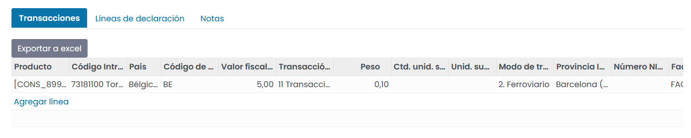

.. tip::
   Revisa la pestaña **Notas**. Si el sistema encuentra cualquier problema, dejará un comentario para su corrección sobre la pestaña **Notas**.

Generar líneas de Declaración
------------------------------

Una vez realizadas las verificaciones oportunas se debe completar la pestaña **Líneas de declaración**.
Para ello, haz clic sobre el botón **Generar líneas de Declaración**.

Esta acción informará las líneas de la declaración a presentar e informará los campos **Importe fiscal total** y **Nº de líneas de declaración**.

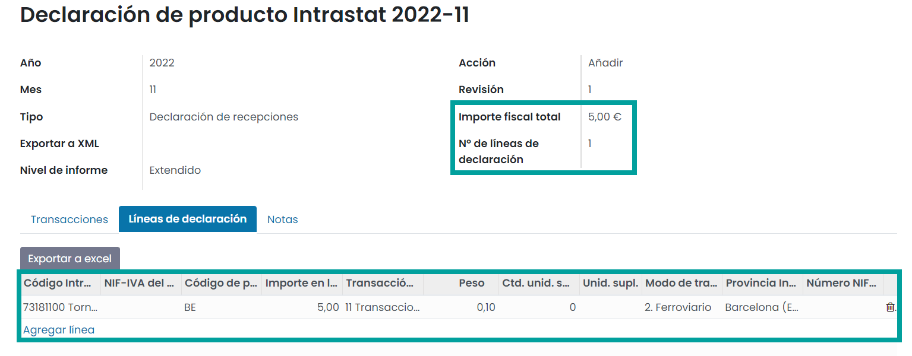

Generar declaración en CSV
---------------------------

Posteriormente, haz clic sobre el botón **Generar declaración en CSV**.

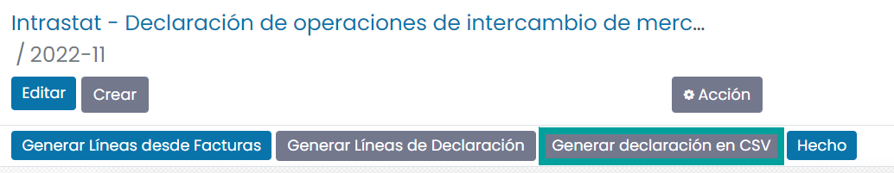

El sistema genera el fichero de declaración de intrastat e incorpora un enlace que te permite descargarlo sobre el campo **Exportar a XML**.

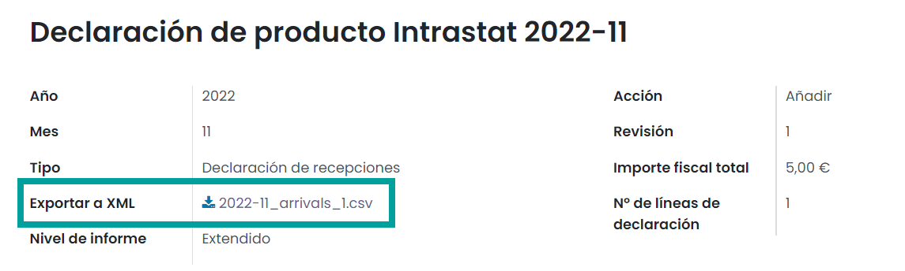

Importar fichero en Intrastat
------------------------------

Una vez dispongas del fichero de la declaración, debes importarlo sobre el formulario de la agencia tributaria. Para ello, sigue las instrucciones que puedes obtener en el siguiente
`artículo <https://sede.agenciatributaria.gob.es/Sede/ayuda/consultas-informaticas/presentacion-declaraciones-ayuda-tecnica/procedimiento-presentacion-declaraciones-intrastat.html/>`_ .

Por último, haz clic sobre el botón **Hecho**, acción que cambiará el estado de la declaración a **Realizado**, permitiéndote llevar un seguimiento de las declaraciones presentadas en Intrastat.

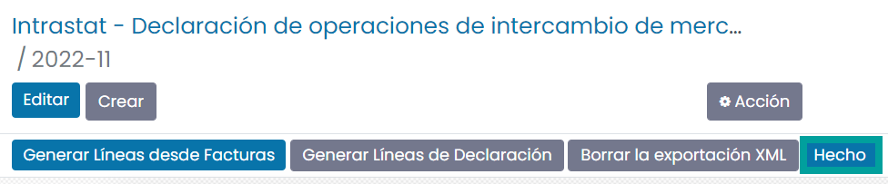

Presentar una declaración vacía
--------------------------------

En los casos en los que debemos presentar una declaración vacía por no disponer de compras / ventas en el periodo
establecido, hemos de seleccionar el valor **Nada** sobre el campo **Acción** y actualizar el estado de la
declaración a **Realizado** mediante el botón **Hecho**.

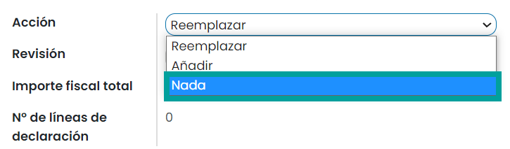

De este modo podremos llevar seguimiento de las declaraciones vacías presentadas a Intrastat.

Para presentar una declaración vacía, debes seleccionar la opción ** Formulario electrónico - Declaración sin operaciones**,
disponible
`aquí <https://sede.agenciatributaria.gob.es/Sede/ayuda/consultas-informaticas/presentacion-declaraciones-ayuda-tecnica/procedimiento-presentacion-declaraciones-intrastat.html/>`_ .

Configuración Avanzada
======================

Modos de Transporte
---------------------
El modo de transporte pertenece al grupo de datos obligatorio dentro del informe de Intrastat.
Se indicará el modo de transporte, de acuerdo con los siguientes códigos:

.. list-table:: Códigos de modo de transporte
   :widths: 25 75
   :header-rows: 1

   * - Código
     - Descripción
   * - 1
     - Transporte marítimo
   * - 2
     - Transporte ferroviario
   * - 3
     - Transporte por carretera
   * - 4
     - Transporte aéreo
   * - 5
     - Envío postal
   * - 7
     - Instalaciones fijas de transporte
   * - 8
     - Transporte por vías navegables
   * - 0
     - Otros

Para configurar los modos de transporte, navega a la pantalla :menuselection:`Contabilidad / Facturación --> Configuración --> Modos de transporte`.

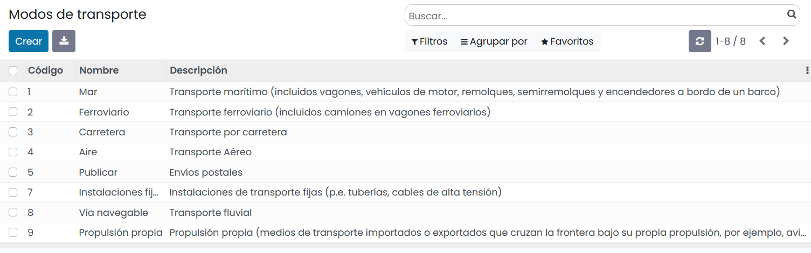

.. attention::
   Es posible crear nuevos registros y/o actualizar los existentes. Aún así, Daeris dispone de la información actualizada con lo que no se recomienda realizar actualizaciones manuales, a no ser que exista un cambio en la legislación.

.. seealso::
   `Ficha de modos de transporte <https://sede.agenciatributaria.gob.es/static_files/Sede/Tema/Aduanas/Comercio_exterior/Fich_cod.xlsx>`_ .
   `Sistema de Control de Movimientos de Impuestos Especiales <https://sede.agenciatributaria.gob.es/static_files/emcs/Sistema_de_Control_de_Movimientos_de_Impuestos_Especiales_(EMCS)/EMCS_INTERNO/Ayuda/Cumplimentar_EMCS.pdf>`_ .

Tipos de transacción (Naturaleza)
------------------------------------------

El código de naturaleza de la transacción pertenece al grupo de datos obligatorio dentro del informe de Intrastat.

Para configurar los tipos de transacciones, navega a la pantalla :menuselection:`Contabilidad / Facturación --> Configuración --> Tipos de transacción`.

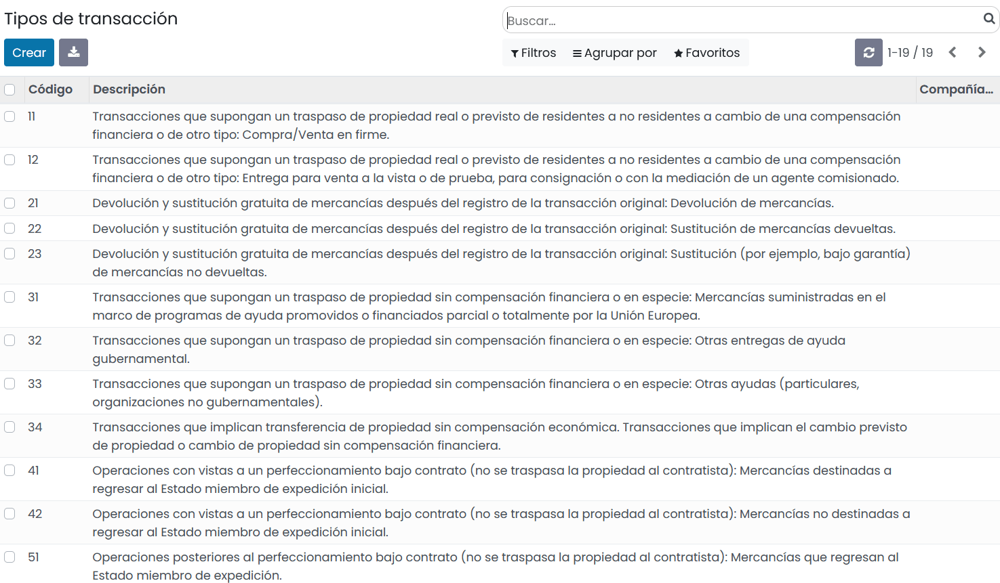

.. attention::
   Es posible crear nuevos registros y/o actualizar los existentes. Aún así, Daeris dispone de la información actualizada con lo que no se recomienda realizar actualizaciones manuales, a no ser que exista un cambio en la legislación.

.. seealso::
   `Ficha de códigos <https://sede.agenciatributaria.gob.es/Sede/aduanas/intrastat-obligaciones-estadisticas/noticias-interes/nuevos-codigos-naturaleza-transaccion-intrastat.html>`_ .

Códigos HS de productos
-------------------------

Los códigos del Sistema Armonizado (códigos H.S.), son requeridos generalmente  sobre las facturas Proforma que se adjuntan a los paquetes que se envían al extranjero.

La nomenclatura completa está disponible en la `Organización Mundial de Aduanas <http://www.wcoomd.org>`_ .

Para configurar los Códigos HS de productos, navega a la pantalla :menuselection:`Contabilidad / Facturación --> Configuración --> Códigos HS`.

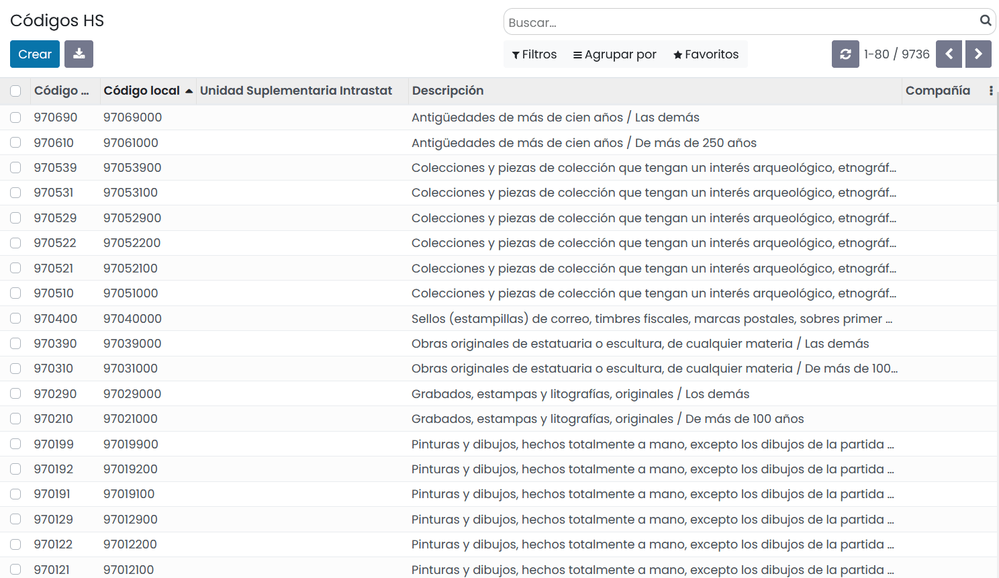

Para importar la lista de códigos completa , accede a
:menuselection:`Contabilidad / Facturación --> Configuración --> Ajustes`. Sobre el apartado
**Intrastat**, haz clic sobre el botón **Importar códigos HS de productos**.

