==================================
Libro de IVA
==================================

Daeris permite calcular el libro de IVA español, así como, visualizar e imprimir por separado:

   - Libro Registro de Facturas Emitidas
   - Libro Registro de Facturas Recibidas

Se permite exportar los registros a formato Excel (xlsx). Además, en el modo de visualización de los informes,
es posible navegar a los asientos contables relacionados con la factura.

.. seealso::
   `Libro de facturas recibidas <https://sede.agenciatributaria.gob.es/Sede/iva/facturacion-registro/libros-registro-iva/libro-registro-facturas-recibidas.html>`_ .

.. seealso::
   `Libro de facturas expedidas <https://sede.agenciatributaria.gob.es/Sede/iva/facturacion-registro/libros-registro-iva/libro-registro-facturas-expedidas.html>`_ .

Configuración
==============

Códigos de impuestos
------------------------

Para gestionar los códigos de impuestos incluidos en el Libro de IVA navega a :menuselection:`Contabilidad --> Configuración --> Mapeo AEAT libro de IVA`.

.. caution::
   Es posible editar la definición de los códigos de impuestos, aunque no se recomienda, debido a que ya están configurados con el formato exclusivo que indica la AEAT. Por lo tanto, cambiar el formato, impediría realizar la importación de los ficheros.

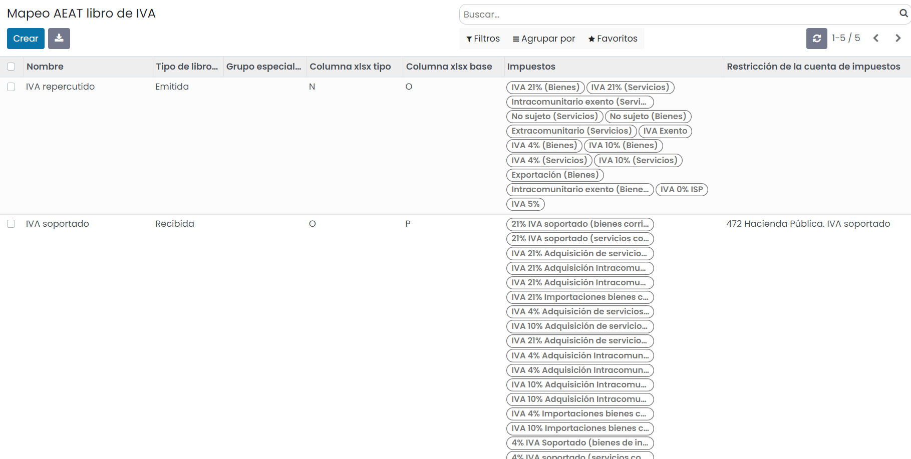

Clientes anónimos para facturas simplificadas
----------------------------------------------

En el caso de disponer de un cliente genérico / anónimo para realizar facturas simplificadas, debes informar
sobre el contacto, el campo **AEAT - Cliente anónimo** para que no se muestren advertencias por no tener NIF
informado siguiendo lo especificado en el formato BOE.

Para ello navega al formulario del contacto y sobre la pestaña **AEAT** informa el campo **AEAT - Cliente anónimo**.

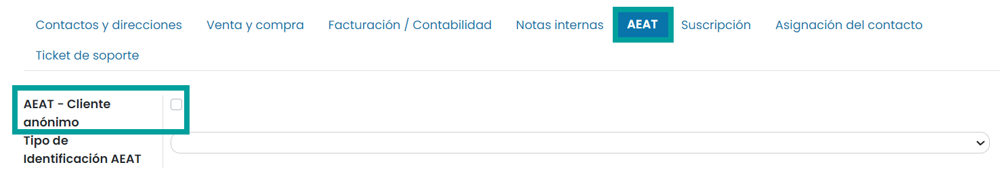

.. tip::
   En el caso de no disponer de un cliente genérico, puedes crear un nuevo contacto, añadirle el NIF **ESA00000000**, y País **España**. Informa sobre la pestaña **AEAT** el campo **AEAT - Cliente anónimo**. Puedes usar este cliente sobre los movimientos de las facturas simplificadas del Punto de venta y/o cajas registradoras.

Alta del libro de IVA
=======================

Para crear un **libro de IVA**, navega a la pantalla
:menuselection:`Contabilidad / Facturación --> Declaraciones AEAT --> Libro de IVA`
, y pulsa el botón **Crear**:

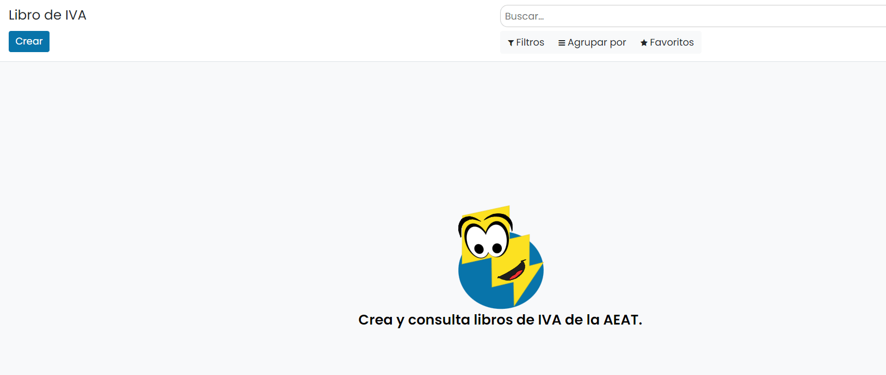

Sobre la pantalla de detalle del modelo, selecciona el **año**, el **tipo de período**
(los periodos incluidos se calculan automáticamente), el **tipo de declaración** la cuenta bancaria y
el **teléfono**.

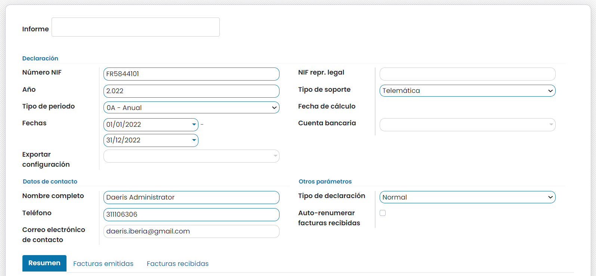

Una vez completada la información necesaria, pulsa el botón **Calcular**:

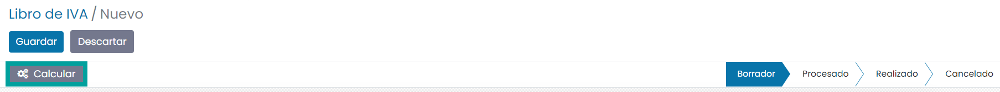

A continuación, se deben solucionar (en caso de ser necesario), todos los errores detectados. EL sistema
muestra un mensaje indicando el número de errores.

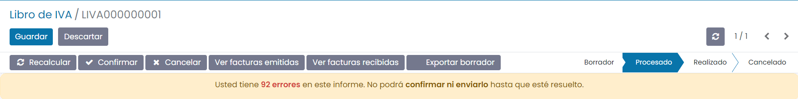

Para solucionar los errores, revisa la pestaña **Facturas emitidas** y **Facturas recibidas**. Encontrarás en color rojo,
todos los registros erróneos. El detalle del error se muestra sobre el campo **Texto de la excepción**.

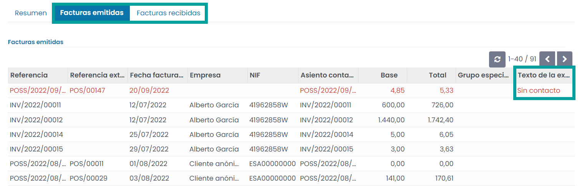

Vuelve a hacer clic sobre el botón **Recalcular**, y solventa los errores indicados pantalla hasta que no se muestre el mensaje de alerta de errores.

Una vez solventados los errores, pulsa el botón **Confirmar**.

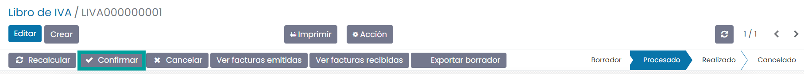

Una vez confirmado el libro, es posible exportarlo en formato xlsx. Para ello, pulsa el botón **Exportar Fichero**.

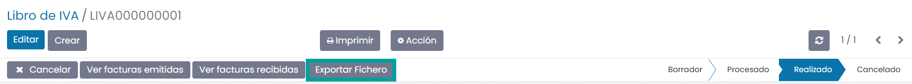

Al pulsar el botón **Exportar**, el sistema genera el fichero.

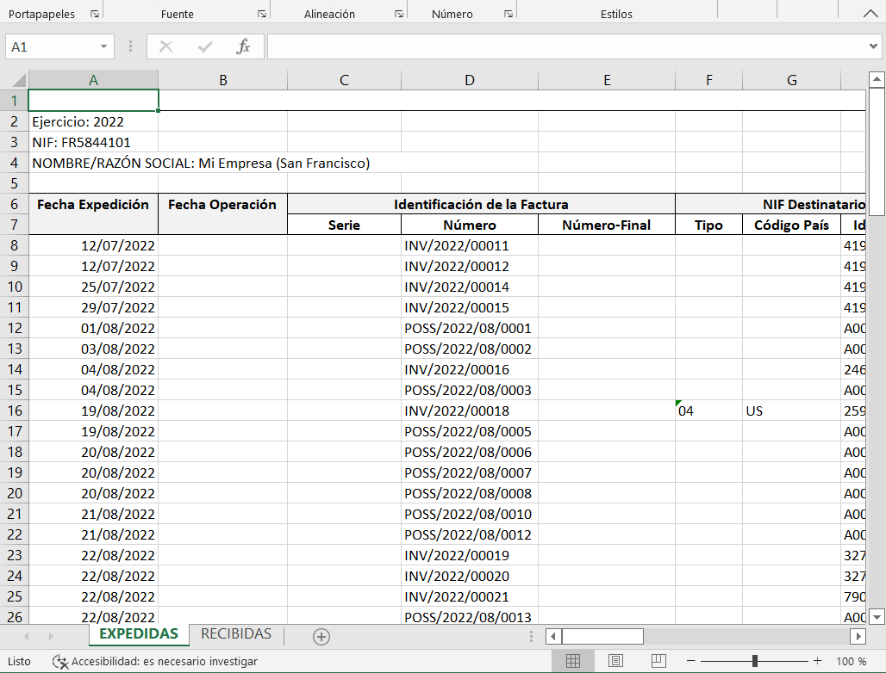

Mediante los botones **Ver facturas emitidas** y **Ver facturas recibidas** se muestra un listado con el registro
de cada una de las facturas, el cual puede ser impreso mediante el botón **Imprimir**.

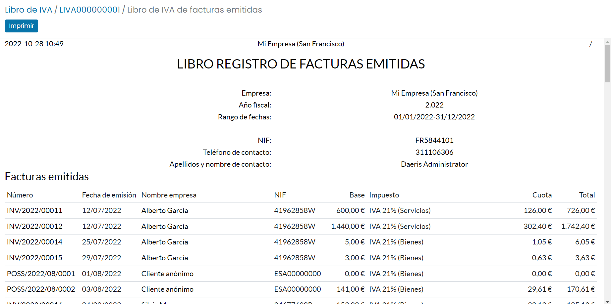

Consideraciones
================

Es importante indicar que en todas las facturas que deban aparecer en los libros deben disponer de Impuestos.
En el caso de registros no sujetos a IVA, se debe informar el tipo de IVA **No Sujeto**.

.. important::
   Para evitar que los usuarios olviden informarlo, se incorpora una validación que impide publicar una factura sin impuestos informados en alguna de sus líneas.

No están incluídas las siguientes funcionalidades del Libro Registro de IVA:

   - Criterio de caja
   - Regímenes especiales de seguros, de agencias de viaje o de bienes usados.
