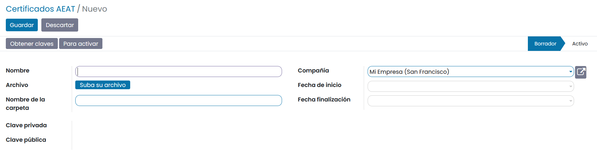

==============================================
Configuración AEAT
==============================================

Certificados AEAT
===============================================

Para importar un certificado de la AEAT, navega a la pantalla
:menuselection:`Contabilidad / Facturación --> Configuración --> Certificados AEAT` y
haz clic sobre el botón **Crear**.

Al crear o editar un certificado, el sistema navega al formulario de detalle, donde dispones de
los siguientes campos:

   - **Nombre**: Nombre del archivo.
   - **Archivo**: Permite seleccionar el fichero en formato p12.
   - **Nombre de la carpeta**: Nombre del directorio.
   - **Clave privada**: Clave privada del certificado.
   - **Clave pública**: Clave pública del certificado.
   - **Compañía**: Empresa asociada al certificado.
   - **Fecha de inicio**: Fecha en la que se inicia la validez del certificado.
   - **Fecha de finalización**: Fecha en la que expira el certificado.

Una vez informados los campos necesarios, pulsa el botón **Guardar**.

Por último, pulsa el botón **obtener claves** e introduce la contraseña del certificado.

Formato BOE de exportación de los modelos AEAT
===============================================

Los modelos de impuestos de la AEAT (Agencia Estatal de Administración Tributaria) pueden ser exportados
en formato BOE (Boletín Oficial del Estado). Los ficheros generados con este formato, deben tener
el diseño de registro aprobado por la normativa para que puedan ser importados sobre la plataforma de la
AEAT.

Para configurar la exportación de un modelo, navega a la pantalla
:menuselection:`Contabilidad / Facturación --> Configuración --> Configuración de exportación a BOE`.

Desde el listado puedes consultar las distintas configuraciones de los modelos.

.. image:: configuracion/exportacion01.png
   :align: center
   :alt: Formato BOE de exportación de los modelos AEAT

Al crear o editar una configuración, el sistema navega al formulario de detalle, donde dispones de
los siguientes campos:

   - **Nombre**: Nombre descriptivo de la configuración.
   - **Nº modelo**: Número del modelo de la AEAT.
   - **Modelo daeris**: Modelo asociado a la configuración.
   - **Fecha inicial**: Fecha de inicio de vigencia de la configuración.
   - **Fecha final**: Fecha de fin de vigencia de la configuración.
   - **Líneas de configuración**: Líneas que representan la configuración del fichero de exportación.

Una vez informados los campos necesarios, pulsa el botón **Guardar**.

.. note::
   La definición de este formato, así como la configuración del mismo, se puede editar, aunque no se
   recomienda, debido a que todos los modelos están generados con el formato exclusivo que indica la AEAT.
   Por lo tanto, cambiar el formato, impediría realizar la importación de los ficheros.

Para poder visualizar un archivo BOE, debes pulsar el botón **Comparar archivo**.

A continuación, selecciona el archivo a comparar y pulsar en **Comparar**.

Aparecerá una ventana con cada una de las líneas de exportación, la cadena correspondiente a dicha línea,
y si es un importe numérico, su cifra asociada.

Mapeo de impuestos de los modelos AEAT
========================================

Para configurar los impuestos que se ven reflejados sobre cada uno de los modelos AEAT (Agencia Estatal
de Administración Tributaria), navega a la pantalla
:menuselection:`Contabilidad / Facturación --> Configuración --> Mapeo de impuestos`.

Al acceder al detalle de un mapeo, se pueden consultar los impuestos mapeados en cada una de las
declaraciones AEAT.

.. note::
   No se recomienda editar estos datos, ya que actualmente el sistema ya está configurado para funcionar
   correctamente con los mapeos que se incorporan. Realizar cambios, podría inhabilitar estas
   funcionalidades o provocar errores.

