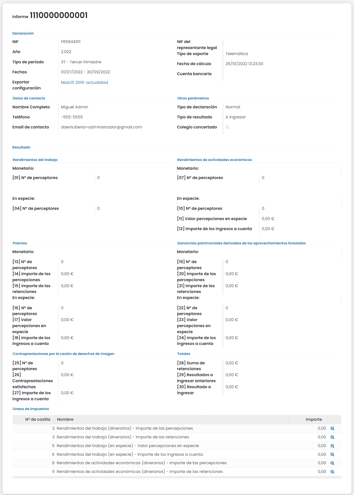
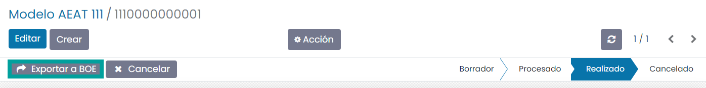

=============
Modelo 111
=============

Información del modelo 111
============================

El **modelo 111** es el modelo **trimestral** por el que las empresas y autónomos declaran e ingresan
las **retenciones que han practicado** durante el trimestre a trabajadores, a profesionales o a empresarios.

Este modelo está obligado a presentarlo todo tipo de empresario, profesional o sociedad que durante
el trimestre o mes correspondiente (será mensual para grandes empresas) hayan retenido parte de los
importes correspondientes a nóminas de empleados, a facturas de profesionales, a facturas de compra
de algunas actividades, y otros casos más infrecuentes.

El plazo de presentación del modelo 111 es dentro de los 20 días posteriores al final de cada trimestre
natural.

.. important::
   Si el día de finalización del plazo coincide con un sábado, domingo o festivo, el plazo será hasta el siguiente día hábil.

.. seealso::
   `Modelo 111 - Agencia Tributaria Española <https://sede.agenciatributaria.gob.es/Sede/procedimientoini/GH01.shtml>`_ .

.. seealso::
   `Modelo 111 - Instrucciones <https://www.agenciatributaria.es/static_files/Sede/Procedimiento_ayuda/GH01/instr_mod_111.pdf>`_ .

Alta de la declaración del modelo 111
=======================================

Para crear el **modelo 111**, navega a la pantalla
:menuselection:`Contabilidad / Facturación --> Declaraciones AEAT --> Modelo 111`
, y pulsa el botón **Crear**:

Sobre la pantalla de detalle del modelo, selecciona el **ejercicio fiscal**, el **tipo de período**
(los periodos incluidos se calculan automáticamente), el **tipo de declaración** la cuenta bancaria y el **teléfono**.

Una vez completada la información necesaria, pulsa el botón **Calcular**:

.. note::
   Para que las retenciones realizadas a los proveedores se incluyan en el modelo 111, es necesario
   indicar que los proveedores son residentes (opción por defecto). Para ello, accede al detalle del proveedor desde la pantalla
   :menuselection:`Contabilidad / Facturación --> Proveedores --> Proveedores` , y bajo la pestaña **Ventas y compras**
   asegúrate de que el campo **Posición fiscal** dispone de la Retención IRPF No residentes que le corresponda.

Completa, en el caso de que seas necesario, la información que no se calcula automáticamente como:

   - **Rendimientos del trabajo**: Dinerarios ([01], [02], [03]) y en especie ([04], [05], [06])
   - **Premios por la participación en juegos, concursos, ...**: Dinerarios ([13], [14], [15]) y en especie ([16], [17], [18])
   - **Ganancias patrimoniales derivadas de los aprovechamientos forestales ...**: Dinerarias ([19], [20], [21]) y en especie ([22], [23], [24])
   - **Contraprestaciones por la cesión de derechos de imagen ...**: Casillas [25], [26] y [27]
   - **Resultados a ingresar anteriores**: Casilla [29]

Una vez informados los campos necesarios, pulsa el botón **Confirmar**.

Una vez confirmado el modelo, es posible exportarlo en formato BOE (Boletín Oficial del Estado) para
presentarlo telemáticamente en el portal de la AEAT. Para ello, pulsa el botón **Exportar a BOE**.

A continuación, el sistema solicita confirmación para llevar a cabo la exportación.

Al pulsar el botón **Exportar**, el sistema genera el fichero, que puede ser descargado desde esta
misma pantalla, pulsando el **enlace** del nombre del fichero.

Consideraciones
================

El modelo 111 no está preparado para compañías que están acogidas al régimen de caja (criterio de caja).
