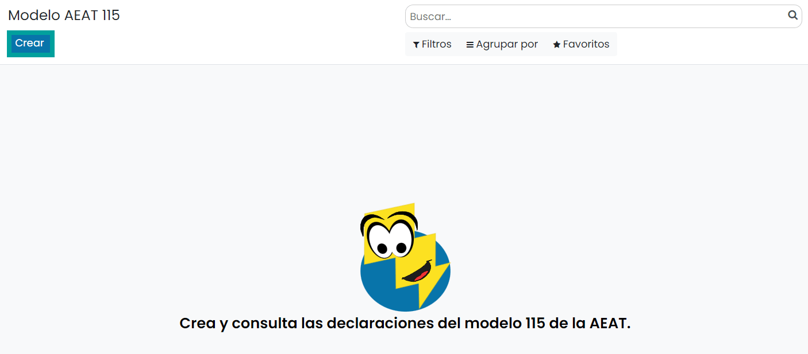
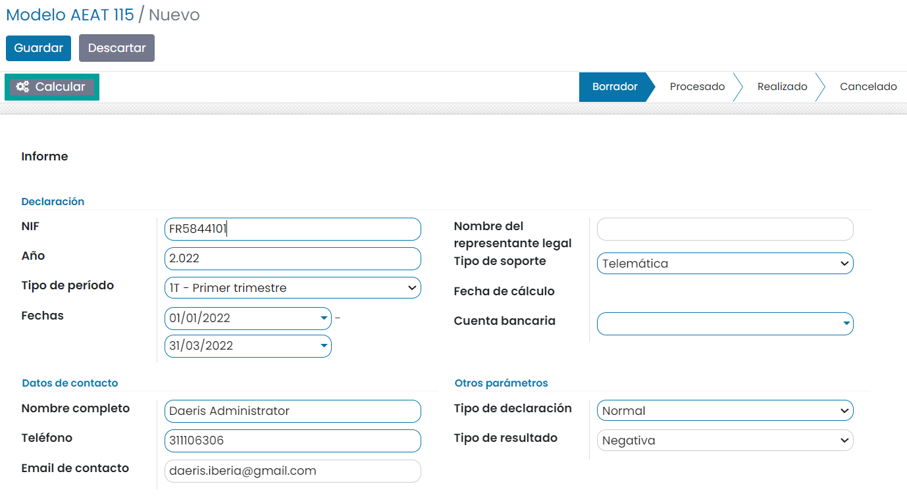
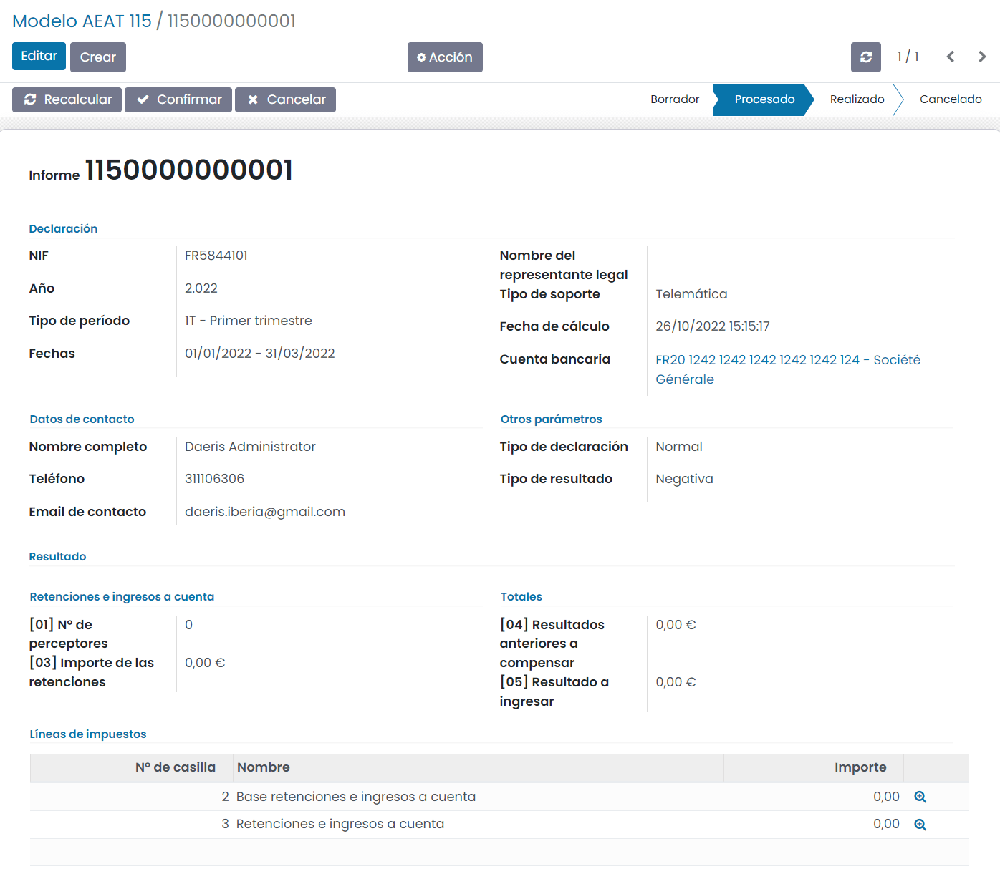
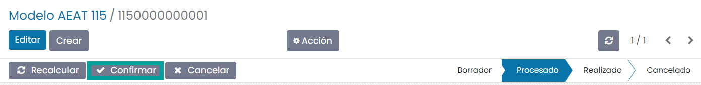
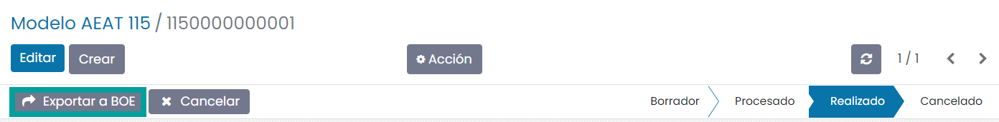
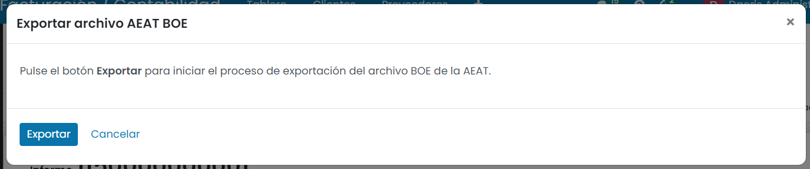
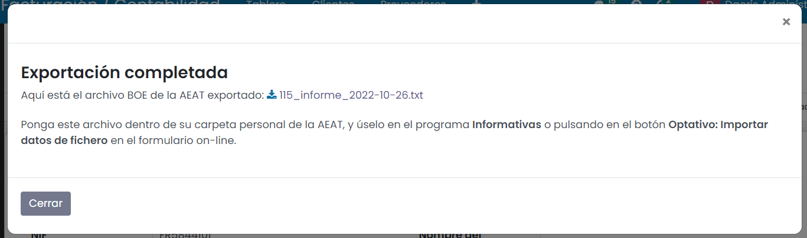

=============
Modelo 115
=============

Información del modelo 115
============================

El **modelo 115** es conocido comúnmente como la declaración **trimestral** de las **retenciones por alquileres**.

Este modelo, solo estarán obligados a presentarlo aquellos autónomos, profesionales o sociedades que
paguen alquileres por locales u oficinas, siempre que sean inmuebles urbanos.

El plazo de presentación del modelo 115 es dentro de los 20 días posteriores al final de cada trimestre
natural.

.. important::
   Si el día de finalización del plazo coincide con un sábado, domingo o festivo, el plazo será hasta el siguiente día hábil.

.. seealso::
   `Modelo 115 - Agencia Tributaria Española <https://sede.agenciatributaria.gob.es/Sede/procedimientoini/GH02.shtml>`_ .

Alta de la declaración del modelo 115
=======================================

Para crear el **modelo 115**, navega a la pantalla
:menuselection:`Contabilidad / Facturación --> Declaraciones AEAT --> Modelo 115`
, y pulsa el botón **Crear**:

Sobre la pantalla de detalle del modelo, selecciona el **ejercicio fiscal**, el **tipo de período**
(los periodos incluidos se calculan automáticamente), el **tipo de declaración** la cuenta bancaria y
el **teléfono**.

Una vez completada la información necesaria, pulsa el botón **Calcular**:

A continuación, se debe informar (en caso de ser necesario), aquellos campos que el sistema no
calcula de forma automática:

Una vez informados los campos necesarios, pulsa el botón **Confirmar**.

Una vez confirmado el modelo, es posible exportarlo en formato BOE (Boletín Oficial del Estado) para
presentarlo telemáticamente en el portal de la AEAT. Para ello, pulsa el botón **Exportar a BOE**.

A continuación, el sistema solicita confirmación para llevar a cabo la exportación.

Al pulsar el botón **Exportar**, el sistema genera el fichero, que puede ser descargado desde esta
misma pantalla, pulsando el **enlace** del nombre del fichero.

