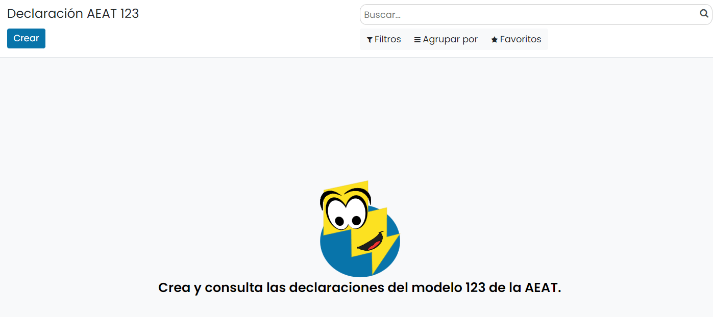
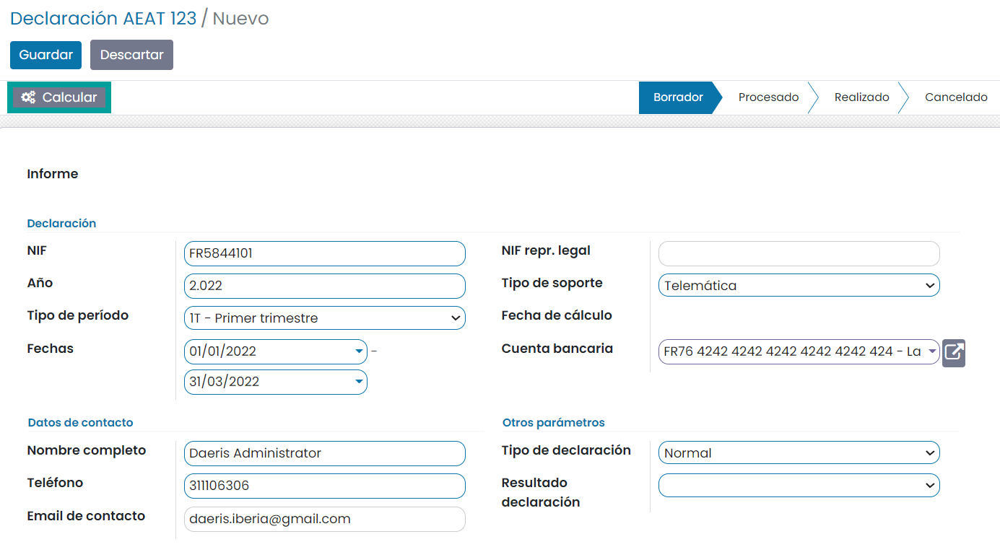
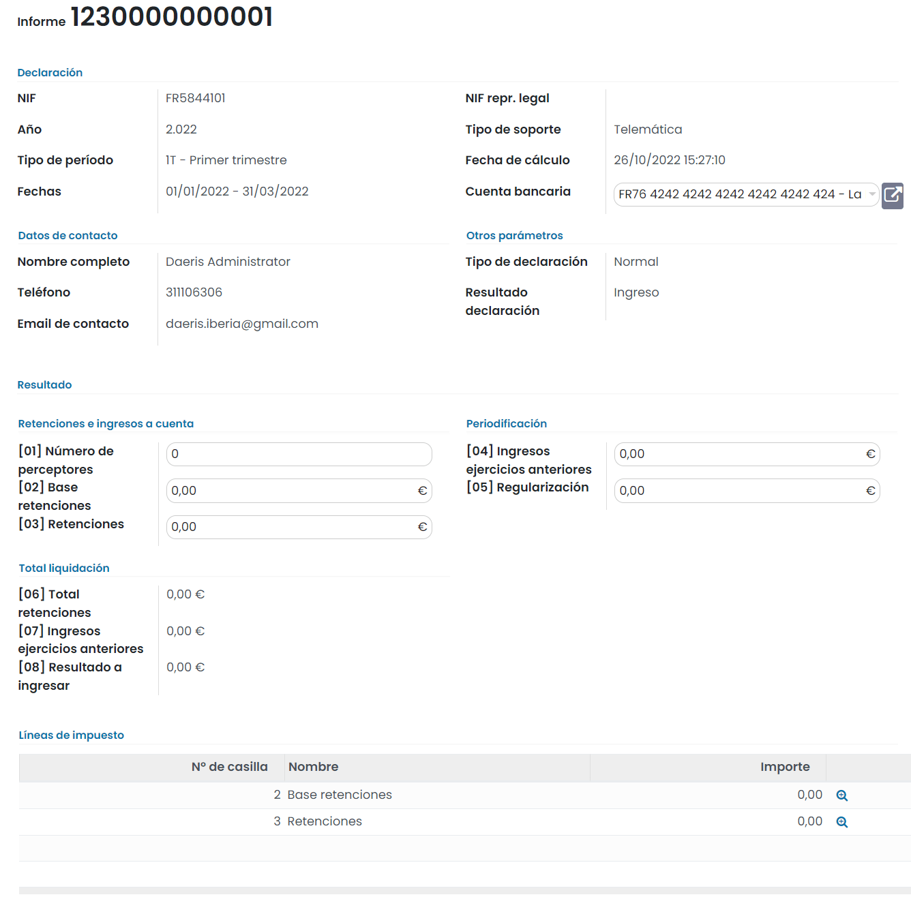
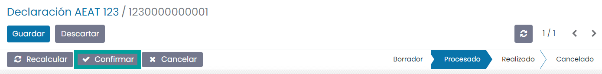
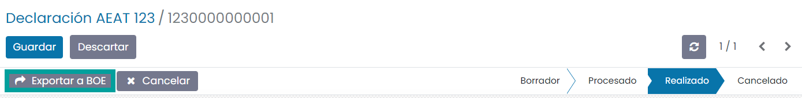
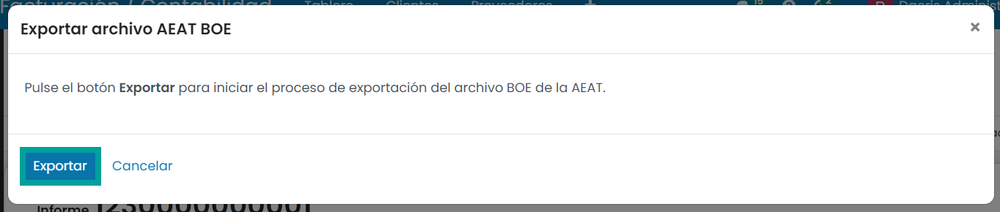
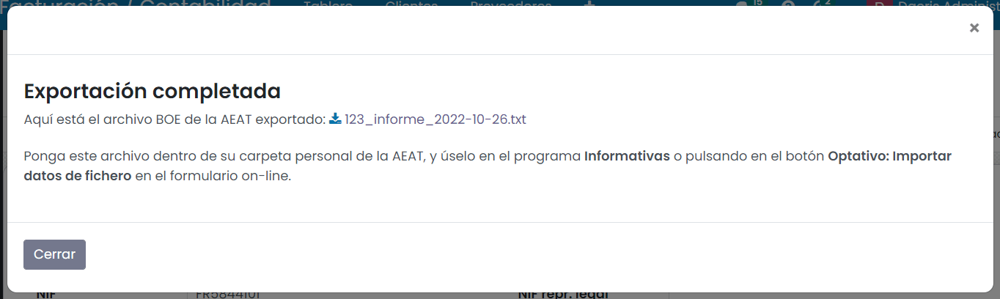

=============
Modelo 123
=============

Información del modelo 123
============================

El **modelo 123** es la declaración por la que autónomos y pymes liquidan **retenciones de ingresos** a
cuenta del IRPF, el Impuesto sobre Sociedades y el Impuesto sobre la Renta de no residentes (IRNR) de
determinados rendimientos del capital mobiliario y determinadas rentas.

Este modelo se presenta generalmente en caso de **pago de intereses de préstamos no bancarios o de
reparto de dividendos**.

Este modelo tiene su utilidad sobre todo en préstamos entre empresas o particulares, o financiaciones
recibidas por ENISA (Empresa Nacional de Innovación) o CDTI (Centro para el Desarrollo Tecnológico Industrial).

Otra utilidad que se le da es para las retenciones en los repartos de dividendos.

Tienen que presentar el modelo 123 autónomos, pymes y Comunidades de Bienes, que durante el trimestre
o mes correspondiente (será mensual para grandes empresas), se vean obligadas a retener o a ingresar
a cuenta del IRPF, del Impuesto de Sociedades y del IRNR, que satisfagan rentas del capital mobiliario.

Hablamos, por ejemplo, una sociedad que reparte dividendos o un empresario que paga los intereses de
préstamos no bancarios.

El plazo de presentación del modelo 123 es dentro de los 20 días posteriores al final de cada
trimestre natural.

.. important::
   Si el día de finalización del plazo coincide con un sábado, domingo o festivo, el plazo será hasta el siguiente día hábil.

.. seealso::
   `Modelo 123 - Agencia Tributaria Española <https://sede.agenciatributaria.gob.es/Sede/procedimientoini/GH04.shtml>`_ .

Alta de datos para el modelo
=============================

Para introducir datos válidos para el modelo:

   - Realiza una factura de proveedor de los intereses cobrados por la empresa o particular prestatario con impuesto "Retenciones 19% (préstamos)".
   - También puedes realizar una factura de proveedor del reparto de dividendos con el impuesto "Retenciones 19% (dividendos)".

Alta de la declaración del modelo 123
=======================================

Para crear el **modelo 123**, navega a la pantalla
:menuselection:`Contabilidad / Facturación --> Declaraciones AEAT --> Modelo 123`
, y pulsa el botón **Crear**:

Sobre la pantalla de detalle del modelo, selecciona el **ejercicio fiscal**, el **tipo de período**
(los periodos incluidos se calculan automáticamente), el **tipo y resultado de la declaración**, la **cuenta bancaria** y
el **teléfono**.

Una vez completada la información necesaria, pulsa el botón **Calcular**:

A continuación, se debe informar (en caso de ser necesario), aquellos campos que el sistema no
calcula de forma automática:

Una vez informados los campos necesarios, pulsa el botón **Confirmar**.

Una vez confirmado el modelo, es posible exportarlo en formato BOE (Boletín Oficial del Estado) para
presentarlo telemáticamente en el portal de la AEAT. Para ello, pulsa el botón **Exportar a BOE**.

A continuación, el sistema solicita confirmación para llevar a cabo la exportación.

Al pulsar el botón **Exportar**, el sistema genera el fichero, que puede ser descargado desde esta
misma pantalla, pulsando el **enlace** del nombre del fichero.

