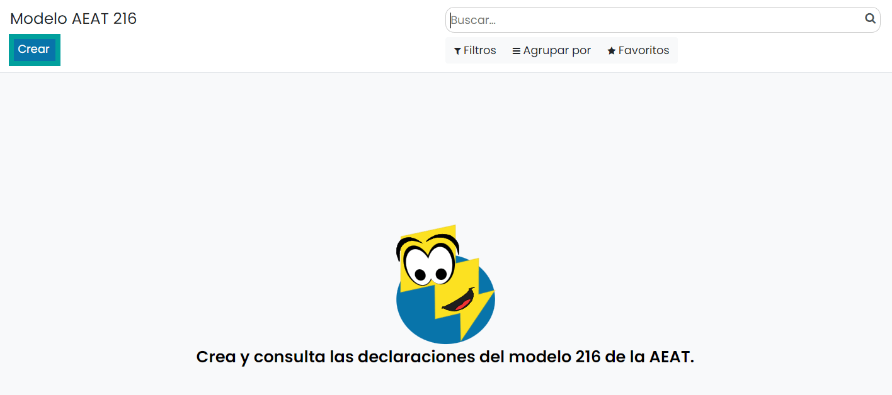
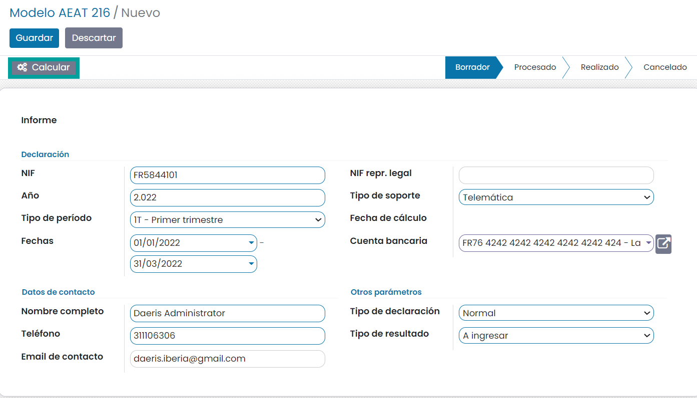
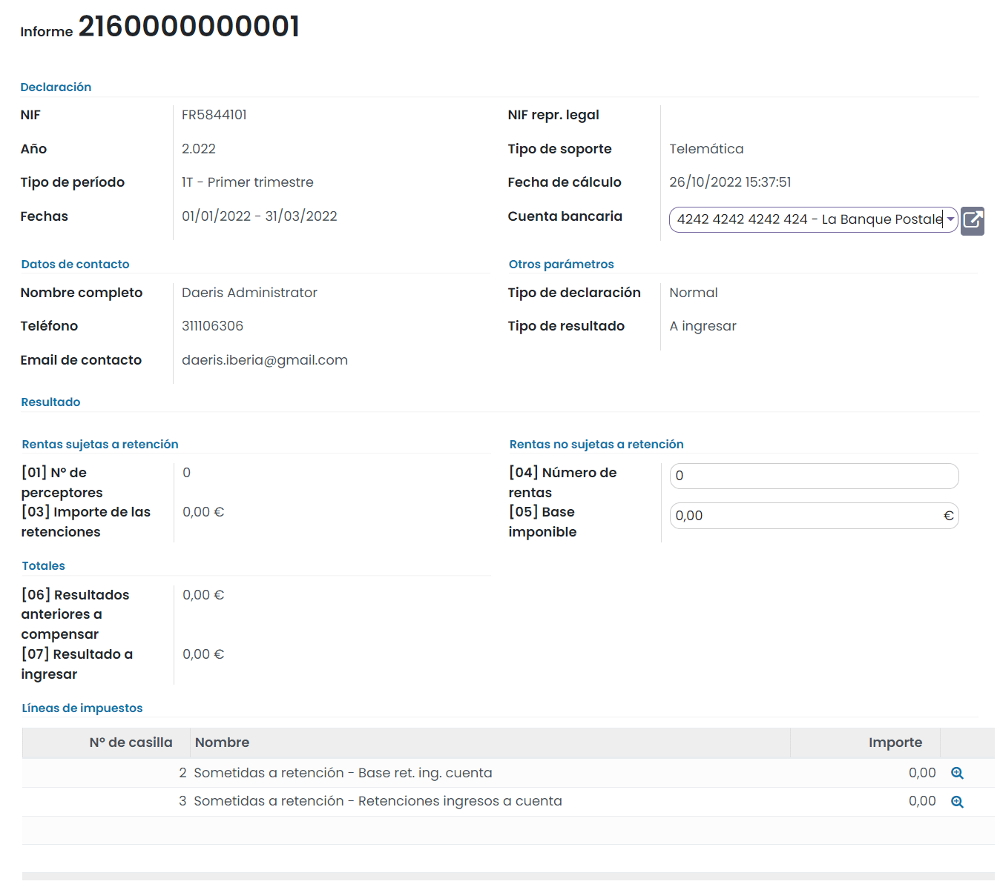
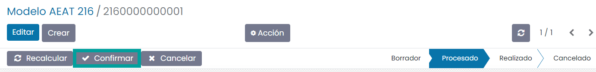
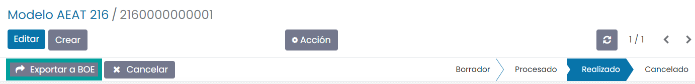
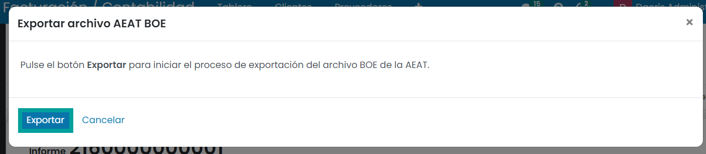
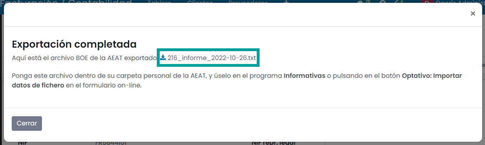

=============
Modelo 216
=============

Información del modelo 216
============================

El **modelo 216** es la declaración de los ingresos retenidos y a cuenta de rentas obtenidas por no
residentes sin establecimiento permanente en España.

El Impuesto sobre la renta de no residentes (IRNR) es el importe que deben pagar todas aquellas
personas físicas o entidades que no residan en España de manera permanente, pero reciban algún tipo
de renta obtenida en el país. Es decir, el IRNR es el IRPF para aquellos que no viven en España,
aunque obtengan algún tipo de renta, dineraria o en especie, producida aquí.

El modelo 216 es de declaración trimestral (aunque para grandes corporaciones adquiere carácter mensual)
y debe presentarse durante los primeros 20 días de los meses de abril, julio, octubre y enero.

.. important::
   Si el día de finalización del plazo coincide con un sábado, domingo o festivo, el plazo será hasta el siguiente día hábil.

.. seealso::
   `Modelo 216 - Agencia Tributaria Española <https://sede.agenciatributaria.gob.es/Sede/no-residentes/irnr-sin-establecimiento-permanente/retenciones-irnr-sin-establecimiento-permanente/modelo-216.html>`_ .

Alta de datos para el modelo
=============================

Para introducir datos válidos para el modelo es necesario indicar los proveedores que son No Eesidentes, en el formulario del proveedor.
Para ello, accede al detalle del proveedor desde la pantalla :menuselection:`Contabilidad / Facturación --> Proveedores --> Proveedores`,
y bajo la pestaña **Ventas y compras** asegúrate de que el campo **Posición fiscal** dispone de la
Retención IRPF No residentes que le corresponda.

Al crear facturas para dicho proveedor, se mapearán los impuestos necesarios siempre que la línea de
la factura tenga el producto informado con el impuesto nacional adecuado.

Alta de la declaración del modelo 216
=======================================

Para crear el **modelo 216**, navega a la pantalla
:menuselection:`Contabilidad / Facturación --> Declaraciones AEAT --> Modelo 216`
, y pulsa el botón **Crear**:

Sobre la pantalla de detalle del modelo, selecciona el **ejercicio fiscal**, el **tipo de período**
(los periodos incluidos se calculan automáticamente), el **tipo de declaración** la cuenta bancaria y
el **teléfono**.

Una vez completada la información necesaria, pulsa el botón **Calcular**:

A continuación, se debe informar (en caso de ser necesario), aquellos campos que el sistema no
calcula de forma automática:

   - **Rentas no sometidas a retención/ingreso a cuenta**: [04] Nº de rentas y [05] Base de retenciones
   - **Resultados a ingresar anteriores**: [06]

Una vez informados los campos necesarios, pulsa el botón **Confirmar**.

Una vez confirmado el modelo, es posible exportarlo en formato BOE (Boletín Oficial del Estado) para
presentarlo telemáticamente en el portal de la AEAT. Para ello, pulsa el botón **Exportar a BOE**.

A continuación, el sistema solicita confirmación para llevar a cabo la exportación.

Al pulsar el botón **Exportar**, el sistema genera el fichero, que puede ser descargado desde esta
misma pantalla, pulsando el **enlace** del nombre del fichero.

