=============
Modelo 303
=============

Información del modelo 303
============================

El **modelo 303** es el modelo de autoliquidación del Impuesto sobre el Valor Añadido (IVA).
Las empresas y autónomos repercuten IVA a sus clientes a lo largo del año y soportan IVA de sus
proveedores.

Con la presentación a la Agencia Tributaria (AEAT) del modelo 303, declaras este IVA a Hacienda.

Estarán obligados a la presentación del impuesto aquellos sujetos pasivos que realicen actividades económicas.

El modelo 303 se presenta trimestral o mensualmente, dependiendo de la facturación de la empresa.
Las grandes empresas presentarán mensualmente este impuesto. Su presentación se realiza del 1 al 20 del
siguiente mes al trimestre donde se tributa.

.. important::
   Si el día de finalización del plazo coincide con un sábado, domingo o festivo, el plazo será hasta el siguiente día hábil.

.. seealso::
   `Modelo 303 - Agencia Tributaria Española <https://sede.agenciatributaria.gob.es/Sede/iva/presentar-declaracion-iva-modelo-303.html>`_ .

Códigos de actividad del modelo 303
====================================

Para configurar los códigos de actividad del modelo 303, navega a la pantalla
:menuselection:`Contabilidad / Facturación --> Configuración --> Modelo AEAT 303 códigos de actividades`.

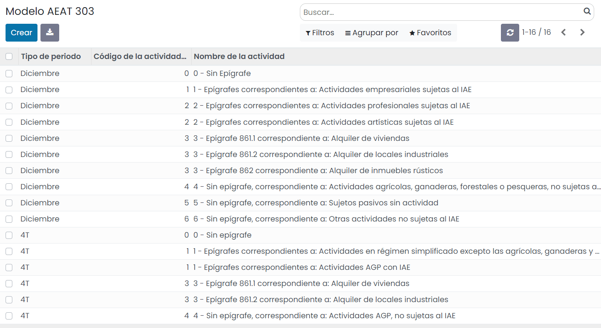

Bajo el listado de códigos de actividad se pueden incorporar nuevos códigos, aunque no se recomienda,
debido a que para el modelo 303 ya están informados todos los códigos necesarios.

Alta de la declaración del modelo 303
=======================================

Para crear el **modelo 303**, navega a la pantalla
:menuselection:`Contabilidad / Facturación --> Declaraciones AEAT --> Modelo 303`
, y pulsa el botón **Crear**:

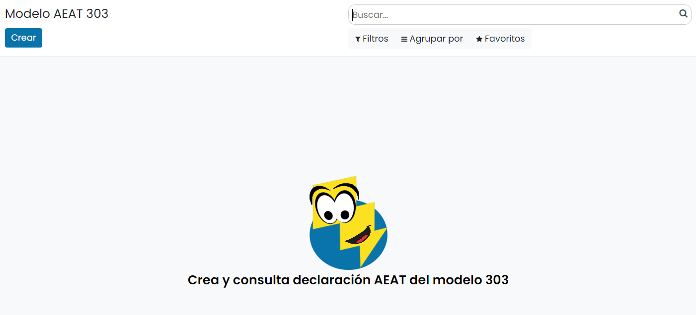

Sobre la pantalla de detalle del modelo, selecciona el **ejercicio fiscal**, el **tipo de período**
(los periodos incluidos se calculan automáticamente), el **tipo de declaración** la cuenta bancaria y
el **teléfono**.

Una vez completada la información necesaria, pulsa el botón **Calcular**:

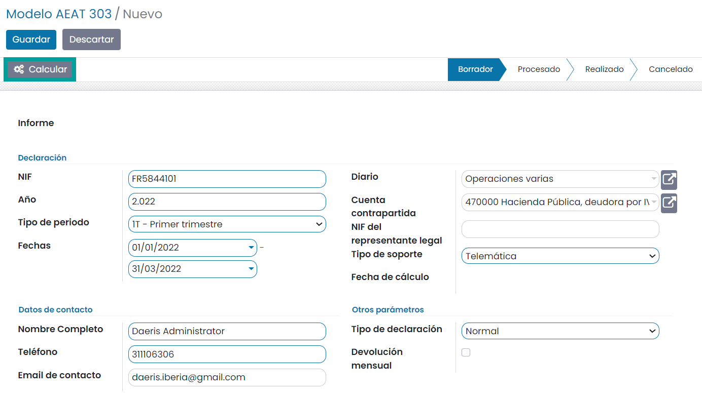

A continuación, se debe informar (en caso de ser necesario), aquellos campos que el sistema no
calcula de forma automática:

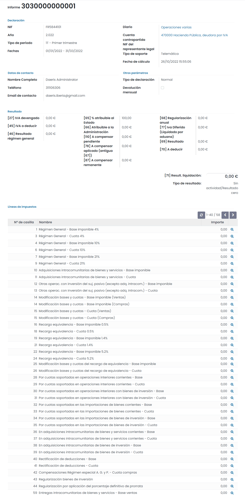

Una vez informados los campos necesarios, pulsa el botón **Confirmar**.

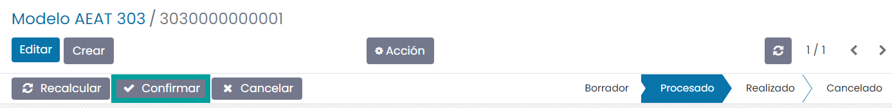

Una vez confirmado el modelo, es posible exportarlo en formato BOE (Boletín Oficial del Estado) para
presentarlo telemáticamente en el portal de la AEAT. Para ello, pulsa el botón **Exportar a BOE**.

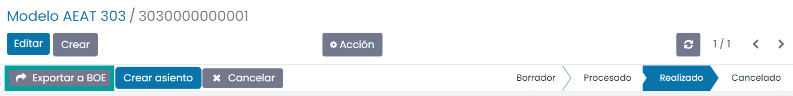

A continuación, el sistema solicita confirmación para llevar a cabo la exportación.

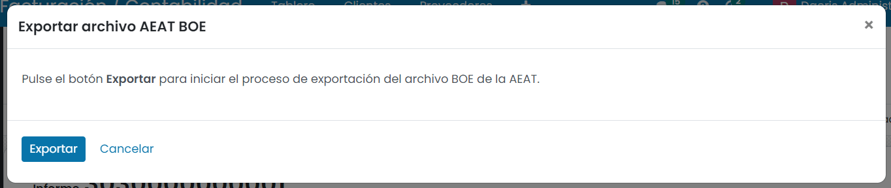

Al pulsar el botón **Exportar**, el sistema genera el fichero, que puede ser descargado desde esta
misma pantalla, pulsando el **enlace** del nombre del fichero.

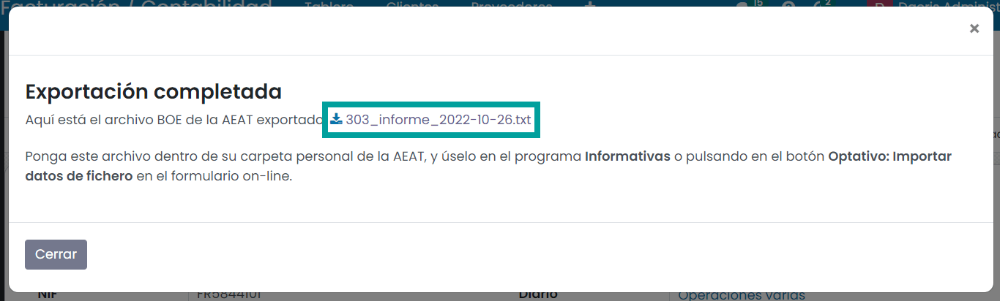

Asiento de regularización de las cuentas de impuestos
======================================================

Una vez exportado a BOE em modelo 303, puedes crear el asiento mediante el botón **Crear asiento**.

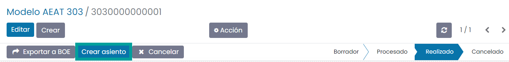

Al navegar al detalle del asiento mediante el botón **Ver asiento**, es posible publicarlo mediante el botón **Publicar**.

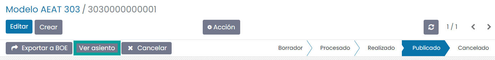

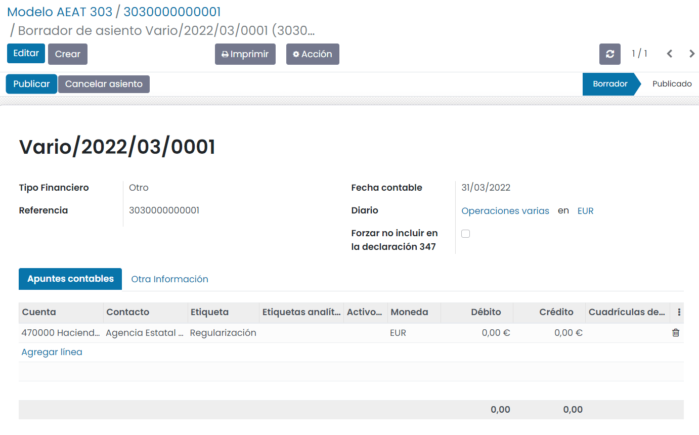

Consideraciones
================

   - No se pueden cambiar las cuentas contables genéricas de los impuestos si se quiere que el modelo recoja correctamente sus cifras.
   - Los regimenes simplificado y agrícola, ganadero y forestal no están contemplados.
   - No se permite definir que una compañía realiza tributación conjunta.
   - No se permite definir que una compañía está en concurso de acreedores.
   - No se permite definir que una compañía es de una Administración Tributaria Foral.
   - Posibilidad de marcar en el resultado el ingreso/devolución en la cuenta corriente tributaria.
   - El régimen de criterio de caja no está contemplado.
   - La prorrata del IVA no está contemplada.
   - Existen 2 casos de IVA no sujeto que van a la casilla 61 del modelo, que no están cubiertos:

      - Con reglas de localización, pero que no corresponde a Canarias, Ceuta y Melilla. Por ejemplo, un abogado de España que da servicios en Francia.
      - Articulos 7,14, Otros

   - No se han mapeado las ventas con el nuevo IVA a la electricidad del 5%.
   - Permite incluir los datos de la ventanilla única o One-Stop Shop (OSS)
