=============
Modelo 347
=============

Información del modelo 347
============================

**Declaración Anual de Operaciones con Terceros** Basado en la Orden EHA/3012/2008, de 20 de Octubre,
por el que se aprueban los diseños físicos y lógicos del 347.

De acuerdo con la normativa de la Hacienda Española, **están obligados** a presentar el modelo 347:

   - Todas aquellas personas físicas o jurídicas que no esten acogidas al régimen de módulos en el IRPF, de naturaleza pública o privada que desarrollen actividades empresariales o profesionales, siempre y cuando hayan realizado operaciones que, en su conjunto, respecto de otra persona o Entidad, cualquiera que sea su naturaleza o carácter, hayan superado la cifra de 3.005,06 € durante el año natural al que se refiere la declaración. Para el cálculo de la cifra de 3.005,06 € se computan de forma separada las entregas de biene y servicios y las adquisiciones de los mismos.
   - En el caso de Sociedades Irregulares, Sociedades Civiles y Comunidad de Bienes no acogidas el regimen de módulos en el IRPF, deben incluir las facturas sin incluir la cuantía del IRPF.
   - En el caso de facturas de proveedor con IRPF, no deben ser presentadas en este modelo. Se presentan en el modelo 190. Desactivar en la ficha del proveedor la opción de "Incluir en el informe 347".

De acuerdo con la normativa, **no están obligados** a presentar el modelo 347:

   - Quienes realicen en España actividades empresariales o profesionales sin tener en territorio español la sede de su actividad, un establecimiento permanente o su domicilio fiscal.
   - Las personas físicas y entidades en régimen de atribución de rentas en el IRPF, por las actividades que tributen en dicho impuesto por el régimen de estimación objetiva y, simultáneamente, en el IVA por los régimenes especiales simplificados o de la agricultura, ganadería y pesca o recargo de equivalencia, salvo las operaciones que estén excluidas de la aplicación de los expresados regímenes.
   - Los obligados tributarios que no hayan realizado operaciones que en su conjunto superen la cifra de 3.005,06 €.
   - Los obligados tributarios que hayan realizado exclusivamente operaciones no declarables.
   - Los obligados tributarios que deban informar sobre las operaciones incluidas en los libros registro de IVA (modelo 340) salvo que realicen operaciones que expresamente deban incluirse en el modelo 347.

.. seealso::
   `Modelo 347 - Agencia Tributaria Española <https://sede.agenciatributaria.gob.es/Sede/ayuda/consultas-informaticas/declaraciones-informativas-ayuda-tecnica/modelos-291-347/modelo-347.html>`_ .

Alta de la declaración del modelo 347
=======================================

Para crear el **modelo 347**, navega a la pantalla
:menuselection:`Contabilidad / Facturación --> Declaraciones AEAT --> Modelo 347`
, y pulsa el botón **Crear**:

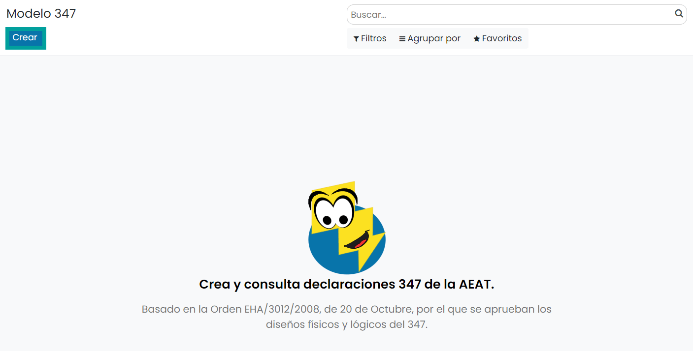

Sobre la pantalla de detalle del modelo, selecciona el **ejercicio fiscal**, el **tipo de período**
(los periodos incluidos se calculan automáticamente), el **tipo de declaración** la cuenta bancaria y
el **teléfono**.

Una vez completada la información necesaria, pulsa el botón **Calcular**:

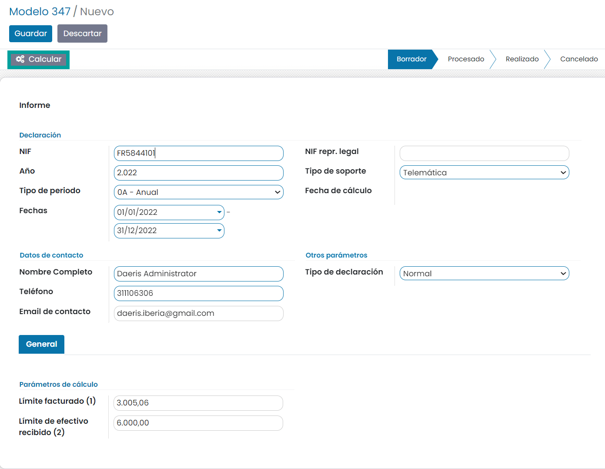

Pasados unos minutos (dependerá de la cantidad de registros que dispongas), aparecerá una nueva
pestaña "Registros de empresas", en la que se podrán revisar cada uno de los registros detectados.

Si la línea del registro aparece en rojo, significa que falta algún dato que debe ser rellenado
para poder realizar la declaración en la AEAT.

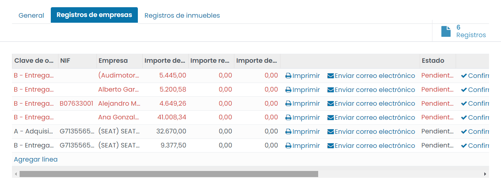

Puedes enviar masivamente los datos de todos los registros al primer contacto de facturación
que esté establecido en la empresa pulsando el botón **Enviar correos electrónicos**.

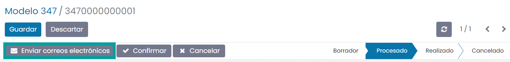

Esta acción realiza el envío masivo, dejando el mensaje enviado sobre el hilo de comunicación (chatter) de
cada registro.

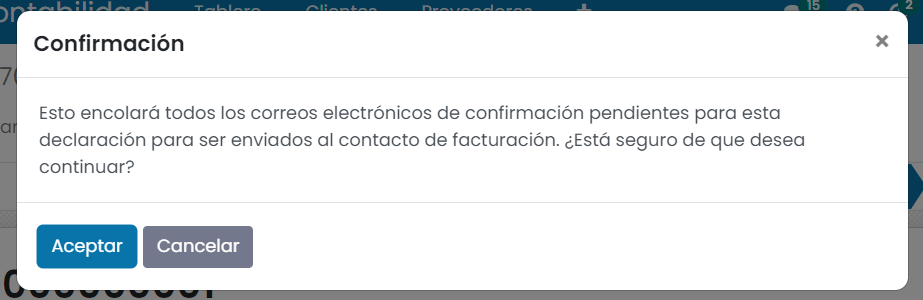

En ese momento, todos los registros pasan a estado **Enviado**.Puedes acceder a los detalles del registro y ver el hilo de comunicación pulsando sobre el
botón **Registros** que aparece en la parte superior derecha de la pestaña **Registros de empresa**.

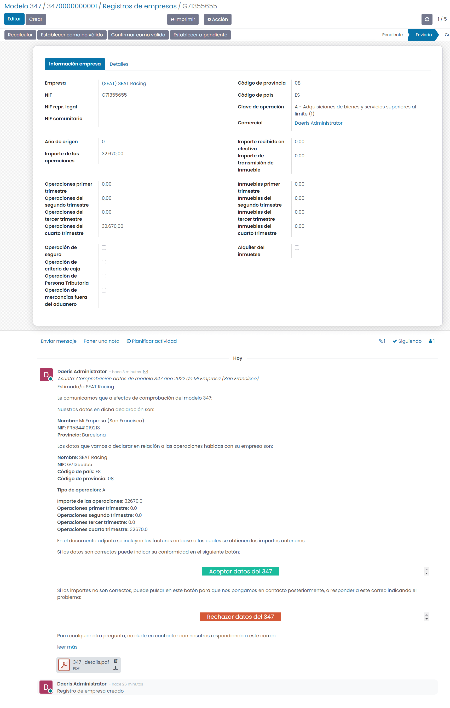

También se pueden realizar envíos aislados de cada registro si todavía no está en estado **Enviado**
(o pulsando previamente en el botón **Establecer a pendiente** de la vista de detalle), pulsando
sobre el botón **Enviar** de la vista de detalle, o en el icono del **sobre** en la vista de listado.

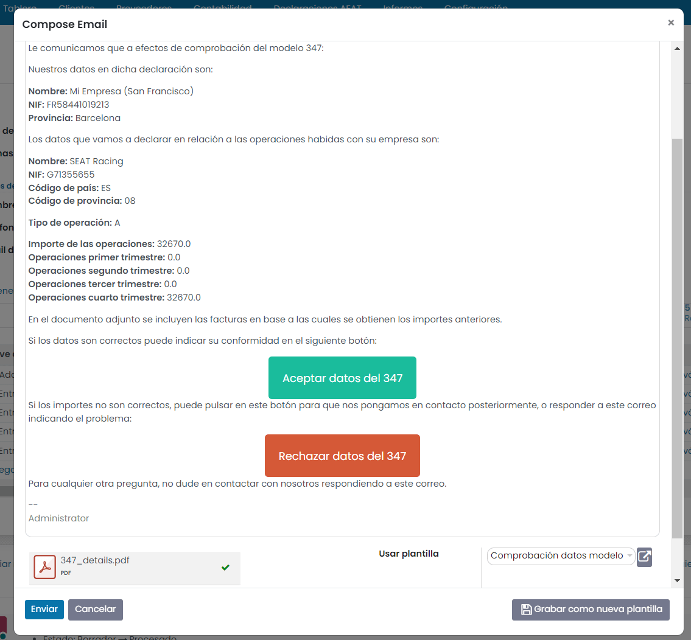

Puede registrar a mano la conformidad o disconformidad del registro pulsando sobre los botones
de **verificación** o de la **X** en la vista de listado, o bien sobre los botones **Confirmar
como válido** o **Establecer a no válido** de la vista de detalle del registro.

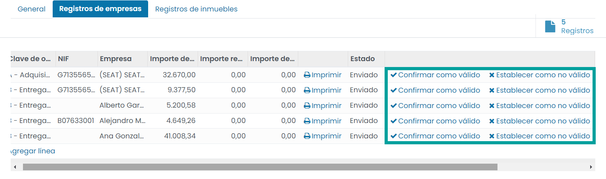

Cuando establezcas como **válido** el registro, la línea aparecerá en un gris atenuado, y si por
el contrario lo estableces como **no válido**, aparecerá en un marrón claro.

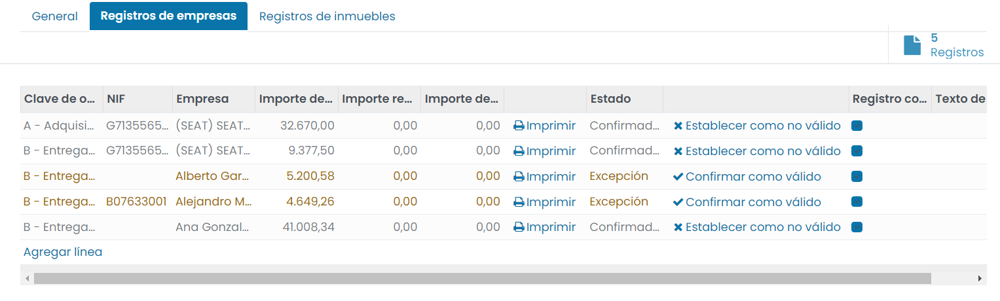

En la plantilla del correo enviado a las empresas, se incluyen 2 botones que permiten la
aceptación/rechazo automático del registro.

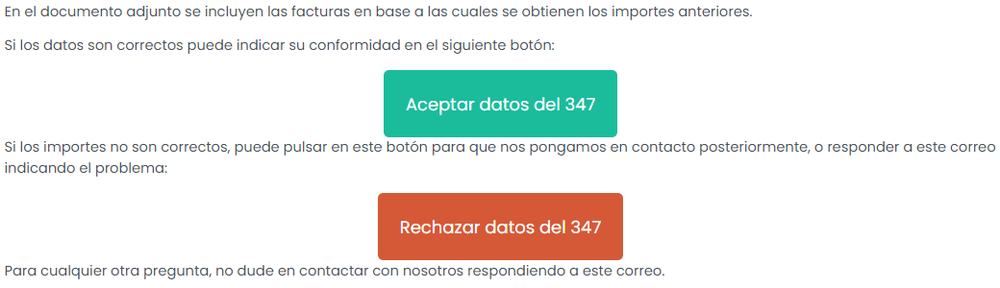

.. important::
   Para un funcionamiento correcto, Daeris debe ser accesible al exterior y tener bien configuradas las URL, redirecciones, proxy, etc. Cuando la empresa externa pulse en uno de esos botones, se realizará la validación/rechazo en el registro.

La empresa externa también puede responder al correo recibido, y entonces la respuesta se colocará
en el hilo de ese registro y notificará a los seguidores que estén del mismo. Por defecto, el único
seguidor que se añade, es el usuario que ha realizado la declaración.

.. important::
   Para un funcionamiento correcto, debes tener bien configurado todos los parámetros relativos a catchall, correo entrante, etc.

También puedes introducir manualmente los registros de inmuebles para aquellos que no estén
reflejados en el modelo 115.

Posteriormente, haz clic sobre el botón **Confirmar**.

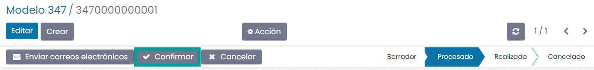

Una vez confirmado el modelo, es posible exportarlo en formato BOE (Boletín Oficial del Estado) para
presentarlo telemáticamente en el portal de la AEAT. Para ello, pulsa el botón **Exportar a BOE**.

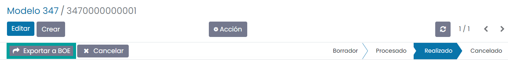

A continuación, el sistema solicita confirmación para llevar a cabo la exportación.

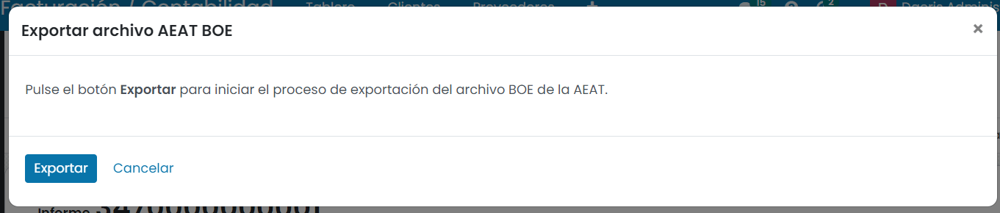

Al pulsar el botón **Exportar**, el sistema genera el fichero, que puede ser descargado desde esta
misma pantalla, pulsando el **enlace** del nombre del fichero.

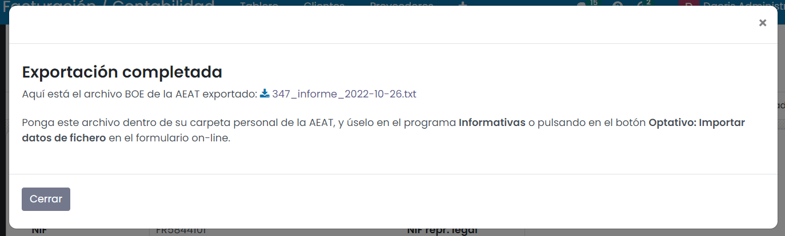

Consideraciones
================

   - No se permite que un asiento (y por tanto, una factura) puede tener una fecha específica a efectos del modelo 347, para así cuadrar la fecha del proveedor con nuestro modelo aunque a efectos de IVA se declare en el siguiente periodo.
   - No se permite indicar que una factura es de transmisión de inmuebles para tenerlo en cuenta en la suma de totales.
   - No se incluye el cálculo automático de las claves de declaración C, D, E, F y G.
   - No se permite agrupar varios contactos en un solo registro por su NIF.
   - No se permite realizar declaración solo de proveedores.
   - No se permite marcar las operaciones como de seguro (para entidades aseguradoras).
   - No se permite marcar las operaciones como de arrendamiento.
   - No se incluye la gestión del criterio de caja.
   - No se incluye la gestión de inversión de sujeto pasivo.
   - No se incluye la gestión de depósito aduanero.
   - No se rellena el año origen en caso de no coincidir con el actual para las operaciones de efectivo.
   - Las operaciones con retención o arrendamientos aparecen en el 347 por defecto al tener también IVA asociado. Si no se quiere que aparezcan, hay que marcar la empresa o la factura con la casilla de no incluir en el 347.