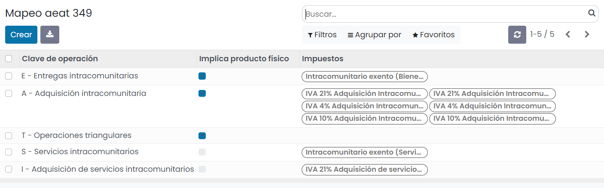
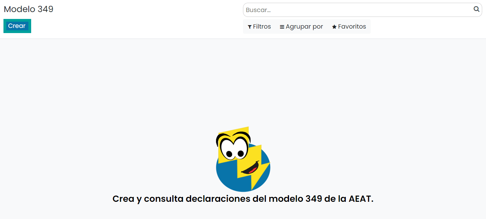
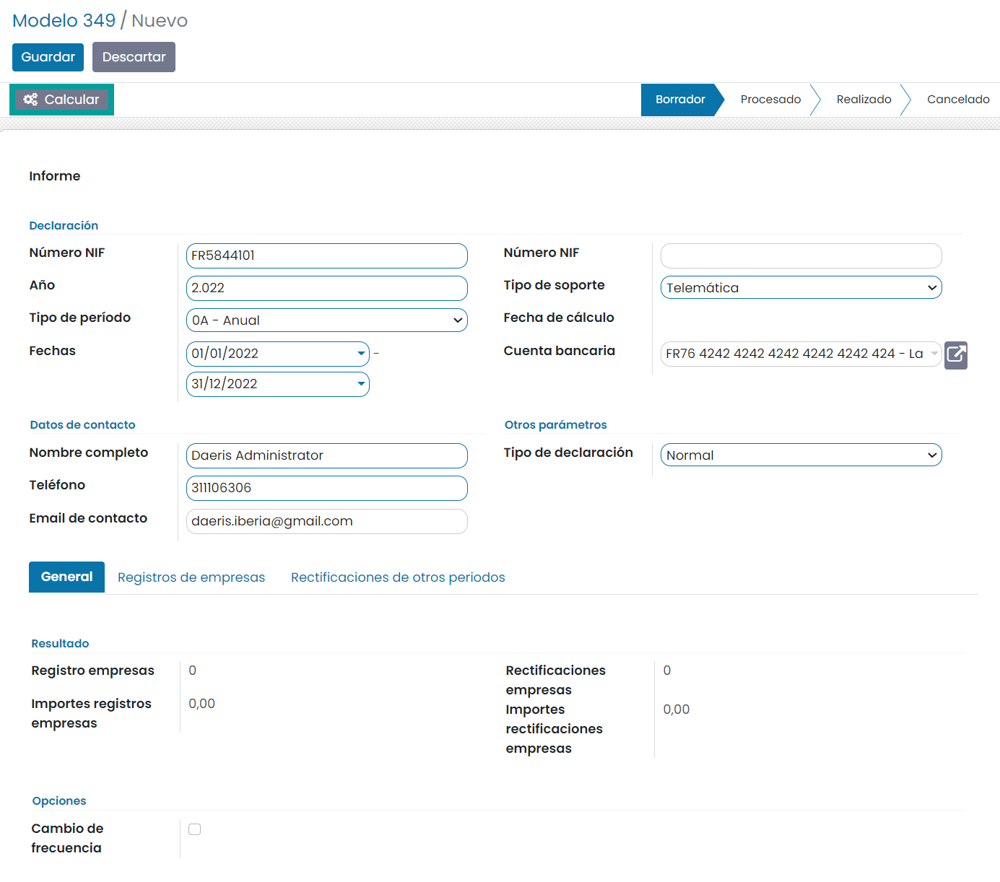
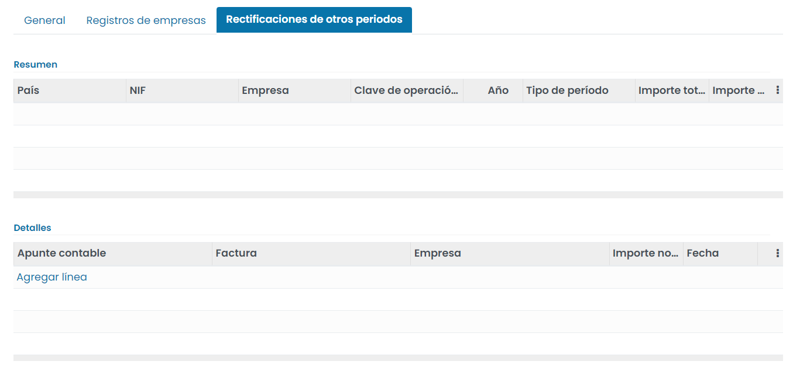
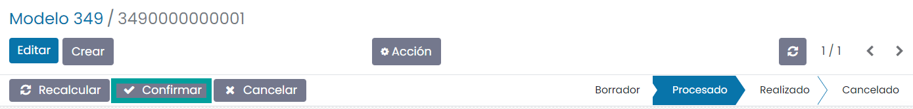
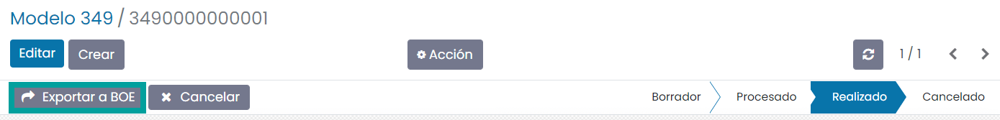
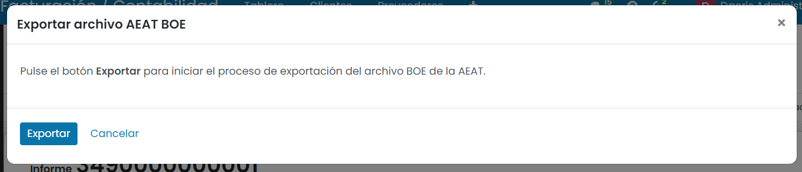
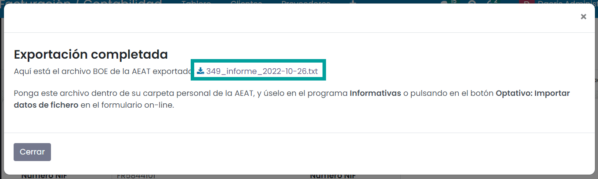

=============
Modelo 349
=============

Información del modelo 349
============================

El **modelo 349** es una declaración informativa en la que los autónomos y las empresas que realicen
operaciones intracomunitarias deben detallar dichas operaciones a la Agencia Tributaria. El nombre
oficial que le da Hacienda a este modelo es Declaración recapitulativa de Operaciones
Intracomunitarias. Una operación intracomunitaria es la compra o venta de un bien o servicio a
una empresa ubicada en otro país de la Unión Europea.

De acuerdo con la normativa de la Hacienda Española, están obligados a presentar el modelo 349:

   - Todos aquellos sujetos pasivos del Impuesto sobre el Valor Añadido que hayan realizado las operaciones previstas en el artículo 79 del Reglamento del Impuesto sobre el Valor Añadido, es decir, quienes adquieran o vendan bienes a empresas situadas en países miembros de la UE, sino también aquellos que presten servicios a miembros de la UE y cumplan con las siguientes condiciones:

      - Que conforme a las reglas de la localización aplicables a las mismas, no se entiendan prestadas en el territorio de aplicación del impuesto.
      - Que estén sometidas efectivamente a gravamen de otro Estado miembro.
      - Que su destinatario sea un empresario o profesional actuando como tal y radique en dicho Estado miembro la sede de su actividad económica, o tenga en el mismo un establecimiento permanente o, en su defecto, el lugar de su domicilio o residencia habitual, o que dicho destinatario sea una persona jurídica que no actúe como empresario o profesional pero tenga asignado un número de identificación a efectos del Impuesto suministrado por ese Estado miembro.
      - Que el sujeto pasivo sea dicho destinatario.

El período de declaración comprenderá, con carácter general las operaciones realizadas en cada mes natural,
y se presentará durante los veinte primeros días naturales del mes inmediato siguiente al correspondiente
período mensual. No obstante, la presentación podrá ser bimestral, trimestral o anual en los siguientes
supuestos:

   - **Bimestral**: Si al final del segundo mes de un trimestre natural el importe total de las entregas de bienes y prestaciones de servicios que deban consignarse en la declaración recapitulativa supera 100.000 euros (a partir de 2012, el umbral se fija en 50.000 euros).
   - **Trimestral**: Cuando ni durante el trimestre de referencia ni en cada uno de los cuatro trimestres naturales anteriores el importe total de las entregas de bienes y prestaciones de servicios que deban consignarse en la declaración recapitulativa sea superior a 100.000 euros.
   - **Anual**: En los treinta primeros días de enero del año siguiente ( la primera sería en enero de 2011) si el importe total de las entregas de bienes o prestaciones de servicios del año ( excluido IVA), no supera los 35.000 € y el importe total de las entregas de bienes a otro Estado Miembro (salvo medios de transporte nuevos) exentas de IVA no sea superior a 15.000 €.

.. seealso::
   `Modelo 349 - Agencia Tributaria Española <https://sede.agenciatributaria.gob.es/Sede/iva/iva-operaciones-comercio-exterior/identificacion-realizar-operaciones-otros-empresarios-ue/modelo-349.html>`_ .

Mapeos de impuestos del modelo 349
====================================

Para configurar los mapeos de impuestos del modelo 349, navega a la pantalla
:menuselection:`Contabilidad / Facturación --> Configuración --> Mapeo AEAT 349`.

Bajo el listado de mapeos de impuestos se pueden incorporar nuevos códigos, aunque no se recomienda,
debido a que para el modelo 349 ya están informados todos los mapeos necesarios.

Alta de la declaración del modelo 349
=======================================

Para crear el **modelo 349**, navega a la pantalla
:menuselection:`Contabilidad / Facturación --> Declaraciones AEAT --> Modelo 349`
, y pulsa el botón **Crear**:

Sobre la pantalla de detalle del modelo, selecciona el **ejercicio fiscal**, el **tipo de período**
(los periodos incluidos se calculan automáticamente), el **tipo de declaración** la cuenta bancaria y
el **teléfono**.

Para excluir ciertas operaciones de la declaración, navega a las pestañas **Registros de empresas** o
**Rectificaciones**, y elimina, desde la seccion **Detalles**, las operaciones que desees excluir de
la declaración.

Una vez completada la información necesaria, pulsa el botón **Calcular**:

A continuación, se debe informar (en caso de ser necesario), aquellos campos que el sistema no
calcula de forma automática.

.. important::
   Parara excluir ciertas operaciones de la declaración, navega a las pestañas **Registros de empresas** o
   **Rectificaciones de otros periodos**, y elimina de la sección **Detalles**, las operaciones que quieras excluir de la declaración.

Una vez informados los campos necesarios, pulsa el botón **Confirmar**.

Una vez confirmado el modelo, es posible exportarlo en formato BOE (Boletín Oficial del Estado) para
presentarlo telemáticamente en el portal de la AEAT. Para ello, pulsa el botón **Exportar a BOE**.

A continuación, el sistema solicita confirmación para llevar a cabo la exportación.

Al pulsar el botón **Exportar**, el sistema genera el fichero, que puede ser descargado desde esta
misma pantalla, pulsando el **enlace** del nombre del fichero.

Consideraciones
================

   - En caso de indicar el tipo de declaración **Suplementaria** o **Normal** se propondrán todas las operaciones que apliquen para el periodo.
   - En caso de indicar **Complementaria**, se propondrán únicamente aquellas operaciones que no hubieran sido aún presentadas en otra declaración.
   - Las facturas rectificativas que no se hayan realizado desde otra factura quedarán descolgadas y no se presentarán en el 349.
   - No es posible añadir aclaración de cuál es el error en los registros.
